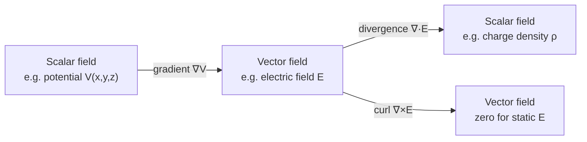
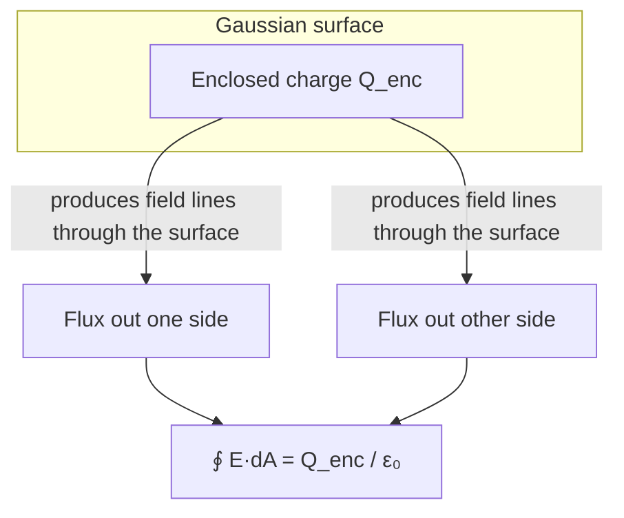

# Chapter 1: Physics and Math Foundations

## Learning Objectives

By the end of this chapter, you will be able to:

- Explain force, energy, electric field, potential (voltage), and charge in your own words, and relate each quantity to the others
- Manipulate algebraic expressions, exponents, logarithms, and trigonometric identities that recur throughout semiconductor equations
- Perform basic differentiation, integration, and partial differentiation on functions of one or more variables
- Represent oscillating and wave-like quantities using complex numbers and Euler's formula
- Compute and physically interpret the gradient, divergence, and curl of a scalar or vector field
- State Coulomb's law and Gauss's law, and use each to compute electric field, electric flux, and electric potential for simple charge distributions
- Recognize the SI base and derived units used throughout the course, and recall the numerical values of the fundamental physical constants
- Solve worked and practice problems that combine these mathematical and physical tools, as a rehearsal for the quantum-mechanical and statistical arguments in later chapters

!!! note "How to read this chapter"
    This chapter is a *toolbox*, not a survey course. If you have already taken calculus-based physics and multivariable calculus, skim the intuition paragraphs and focus on the boxed equations, the worked examples, and the practice problems — they establish the exact notation this course uses. If any topic here is genuinely new to you, slow down: every later chapter assumes fluency with this material.

## Introduction

Semiconductor physics sits at the intersection of quantum mechanics, statistical mechanics, and classical electromagnetism. None of those subjects can be developed rigorously without a shared vocabulary of physical quantities (force, energy, field, potential, charge) and a shared set of mathematical tools (algebra, trigonometry, calculus, vector calculus, complex numbers). Rather than assume this vocabulary or introduce it piecemeal whenever it is first needed, this chapter collects it in one place.

The chapter has four main parts. First, a **review of classical physics** revisits force, energy, electric fields, potential, and charge at the level of introductory physics, using circuit-friendly language. Second, **essential mathematics** reviews the algebraic and calculus tools — including complex numbers, which will represent wavefunctions in Chapter 2 — that appear in nearly every derivation later in the book. Third, **vector calculus** introduces the gradient, divergence, and curl, the differential operators that let us go from a scalar potential to a vector field and back, and that appear explicitly in Gauss's law. Fourth, **basic electromagnetics** formalizes Coulomb's law and Gauss's law, connecting the field concepts from the physics review to the vector calculus tools just introduced, and previewing the electrostatics that governs the p-n junction depletion region in Chapters 14–15.

Throughout, equations are introduced only after the underlying idea has been explained in words and, wherever possible, illustrated with a diagram. Worked examples model exactly the kind of calculation you will be asked to perform on problem sets and exams throughout the course, and the practice problems at the end of the chapter let you rehearse before moving on.

It is worth pausing on *why* a semiconductor physics course opens with a chapter like this rather than diving straight into crystal structure or quantum mechanics. Every subsequent chapter builds a physical model and then expresses that model mathematically — the Kronig-Penney model of Chapter 5 requires solving the Schrödinger equation with complex exponentials; the carrier-statistics chapters integrate distribution functions over energy; the p-n junction chapters take the gradient of a potential to find an electric field, and use Gauss's law to relate that field back to a charge density. If any one of these mathematical operations is unfamiliar in the moment it is needed, the physical insight the derivation is trying to convey gets lost in mechanical struggle with the mathematics. By front-loading the mathematics here, in a context stripped of quantum-mechanical subtlety, later chapters can move directly to the physical argument without an extended mathematical detour.

A second reason this chapter exists is more subtle: many of the physical quantities used throughout this course — force, field, potential, energy — are *already* familiar from introductory physics, but are usually taught in the context of macroscopic objects (charged balls, capacitor plates, circuit resistors) rather than the individual electrons and ions this course is ultimately about. Restating these quantities explicitly, with the same notation and unit conventions used later, closes the gap between "I have seen this before" and "I can use this fluently in a new context."

## Concepts Covered

This chapter covers the following 26 concepts from the learning graph:

1. Force
2. Mechanical Energy
3. Electric Field
4. Electric Potential
5. Electric Charge
6. Algebra
7. Trigonometry
8. Exponentials and Logarithms
9. Complex Numbers
10. Differentiation
11. Integration
12. Partial Derivatives
13. Vectors
14. Gradient
15. Divergence
16. Curl
17. Coulomb's Law
18. Electric Flux
19. Gauss's Law
20. Electrostatic Potential Energy
21. Kinetic Theory of Gases
22. Boltzmann Constant
23. Thermal Equilibrium
24. Photon Energy
25. SI Units
26. Fundamental Physical Constants

!!! note "Why this chapter's concept count grew"
    The original learning graph assigned only 8 concepts (1–8) to this chapter. While writing the chapter to the full scope requested — algebra through Gauss's Law — it became clear the graph was missing the prerequisite mathematics and electromagnetics concepts the chapter actually teaches. Those 18 concepts were added to the learning graph as IDs 201–218 (appended, so every existing concept ID from 1–200 is preserved) and are now formally assigned to this chapter alongside the original 8.

## Prerequisites

This chapter assumes only the prerequisites listed in the [course description](../../course-description.md).

## Review of Classical Physics

### Force and Energy

A **force** is a push or a pull — an interaction that, if unopposed, changes an object's velocity. Newton's second law relates the net force on an object to its mass and acceleration:

\[
\vec{F} = m\vec{a}
\]

where \(\vec{F}\) is the net force (newtons, N), \(m\) is mass (kilograms, kg), and \(\vec{a}\) is acceleration (meters per second squared, m/s²).

**Energy** is the capacity to do work, and **work** is the transfer of energy that occurs when a force acts through a displacement:

\[
W = \int \vec{F} \cdot d\vec{r}
\]

For a constant force acting over a straight-line displacement, this reduces to \(W = Fd\cos\theta\), where \(\theta\) is the angle between the force and the displacement. Two forms of mechanical energy recur throughout physics: **kinetic energy**, the energy of motion, \(KE = \tfrac{1}{2}mv^2\); and **potential energy**, energy stored by virtue of position in a force field. The two trade off continuously in an isolated system — this is the **principle of conservation of energy**, one of the few laws in physics with no known exception.

!!! tip "Why this matters for semiconductors"
    Every carrier (electron or hole) inside a semiconductor is a particle subject to forces and carrying energy. When Chapter 6 introduces the energy band diagram, the vertical axis literally *is* an electron potential energy axis; when Chapter 11 introduces drift current, the carriers are being accelerated by an electric force exactly as Newton's second law describes.

One subtlety worth flagging early: inside a crystal, an electron does not behave as if it had its free-space mass \(m_0 = 9.109\times10^{-31}\) kg. Interactions with the periodic lattice (the subject of Chapters 3–6) modify how the electron responds to an applied force, and this modification is captured by replacing \(m_0\) with an **effective mass**, \(m^*\), in Newton's second law: \(\vec{F} = m^*\vec{a}\). Effective mass can be smaller or larger than the free-electron mass, and sometimes even direction-dependent, but the underlying law — force equals mass times acceleration — never changes. Several worked examples and practice problems in this chapter use effective mass for exactly this reason: to make sure the mechanics you already know transfers cleanly once the "mass" in the equation is no longer the textbook value you might expect.

### Electric Fields

Not all forces require contact. A charged particle exerts a force on other charged particles even across a vacuum, and physicists find it useful to separate this influence into two ideas: the **source** creates a field that fills the surrounding space, and any **test charge** placed in that field experiences a force proportional to the local field strength and its own charge:

\[
\vec{F} = q\vec{E}
\]

The electric field \(\vec{E}\) at a point is therefore defined operationally as the force per unit charge a small positive test charge would feel there. Because \(\vec{E}\) is defined without reference to any particular test charge, it is a property of space itself, created by whatever source charges are present — an idea we return to formally in the Basic Electromagnetics section below.

### Potential and Voltage

Working with vector forces and vector fields is often more work than necessary. Just as potential energy simplifies force calculations in mechanics, **electric potential** — commonly called **voltage** — simplifies electric field calculations. Potential is defined as potential energy per unit charge:

\[
V = \frac{U}{q}
\]

Two properties make voltage indispensable in circuit analysis and in semiconductor physics alike. First, it is a **scalar**, so the potential created by several charges is just the ordinary sum of each individual contribution — no vector addition required. Second, only **differences** in potential are physically meaningful; a plot of voltage always has an implicit or explicit reference point (ground). The voltage difference between two points, \(V_{AB} = V_A - V_B\), determines the work done moving a unit charge from \(B\) to \(A\), and it is this difference that drives current through a resistor, lights an LED, or, later in this course, determines whether a p-n junction is forward- or reverse-biased.

### Charge

**Electric charge** is a fundamental, conserved property of matter that comes in two signs (positive and negative) and is quantized in integer multiples of the elementary charge,

\[
q = n e, \qquad e = 1.602 \times 10^{-19}\ \text{C}, \quad n \in \mathbb{Z}
\]

Electrons carry charge \(-e\); the ionized dopant atoms you will meet in Chapter 8 carry charge \(+e\) or \(-e\) depending on whether they are donors or acceptors. Charge is **conserved**: it cannot be created or destroyed, only transferred, a fact that underlies both Kirchhoff's current law in circuits and the continuity equation for carriers in Chapter 13.

The table below collects the four quantities just discussed so you can see how they relate to one another at a glance.

| Quantity | Symbol | Vector/Scalar | SI Unit | Relation |
|---|---|---|---|---|
| Force | \(\vec{F}\) | Vector | newton (N) | \(\vec{F}=m\vec{a}\), \(\vec{F} = q\vec{E}\) |
| Energy (work) | \(W\), \(U\) | Scalar | joule (J) | \(W = \int \vec{F}\cdot d\vec{r}\) |
| Electric field | \(\vec{E}\) | Vector | volt/meter (V/m) | Force per unit charge |
| Electric potential (voltage) | \(V\) | Scalar | volt (V) | Energy per unit charge |
| Charge | \(q\) | Scalar (signed) | coulomb (C) | Quantized, \(q=ne\) |

!!! question "Concept Check"
    A proton and an electron are both released from rest in the same uniform electric field. Do they experience the same force? The same acceleration? Explain.

??? question "Concept Check — click to reveal answer"
    They experience forces of equal magnitude (since \(|q|\) is the same for both, up to sign) but opposite direction, because \(\vec{F}=q\vec{E}\) and the charges have opposite sign. Their accelerations are *not* equal, because \(\vec{a} = \vec{F}/m\) and the proton is about 1836 times more massive than the electron, so the electron accelerates far more for the same force.

## Essential Mathematics

The remainder of this chapter leans on mathematics that you have most likely already met in prerequisite coursework. This section is a compact refresher, focused on the specific manipulations that reappear later in the book, notably in the carrier-statistics and diode-equation derivations of Chapters 9–15.

### Algebra Review

Three algebraic skills are used constantly: solving for a variable buried inside an equation, working with ratios and percentages (as in doping ratios or gain calculations), and manipulating exponents. A skill worth over-practicing is isolating a variable that appears inside an exponential or logarithmic term, since this is exactly the manipulation required to solve the diode equation for voltage given current (Chapter 15):

\[
I = I_0\left(e^{V/V_T} - 1\right) \quad \Longrightarrow \quad V = V_T \ln\left(\frac{I}{I_0} + 1\right)
\]

You are not expected to know what \(I_0\) or \(V_T\) mean yet — only to recognize that solving this equation for \(V\) is a mechanical algebra step (isolate the exponential, then take a logarithm of both sides) once the surrounding physics is understood.

### Trigonometry

Sines and cosines describe any periodic or oscillatory phenomenon, from AC circuit waveforms to the phase of a quantum-mechanical wavefunction. The identities used most often in this course are:

\[
\sin^2\theta + \cos^2\theta = 1, \qquad \sin(a\pm b) = \sin a\cos b \pm \cos a\sin b, \qquad \cos(a \pm b) = \cos a \cos b \mp \sin a \sin b
\]

Angles in this course are almost always expressed in **radians** rather than degrees, since radians make calculus expressions (derivatives and integrals of trigonometric functions) come out without extra conversion factors. Recall the conversion \(180^\circ = \pi\ \text{rad}\).

### Exponentials and Logarithms

The exponential function \(e^x\) and its inverse, the natural logarithm \(\ln x\), appear more often in semiconductor physics than perhaps any other pair of functions, because carrier concentrations, diode currents, and thermal-equilibrium populations all depend exponentially on energy divided by \(k_BT\). Key properties:

\[
e^{a+b} = e^a e^b, \qquad e^{-x} = \frac{1}{e^x}, \qquad \ln(ab) = \ln a + \ln b, \qquad \ln(e^x) = x, \qquad \frac{d}{dx}e^x = e^x
\]

!!! tip "The single most important number in this course"
    You will repeatedly compute \(e^{-E/k_BT}\) for some energy \(E\). Because this expression changes by an order of magnitude for every \(\sim 2.3\, k_BT\) change in \(E\), small changes in temperature or doping energy produce *enormous* changes in carrier concentration. Internalizing the shape of an exponential — and how sensitive it is to its argument — is worth more than memorizing any single formula in this course.

### Complex Numbers

A **complex number** \(z = a + bi\) has a real part \(a\) and an imaginary part \(b\), where \(i = \sqrt{-1}\). Complex numbers are indispensable for two reasons that matter directly to this course: they provide a compact way to describe oscillations and phase (used for AC steady-state circuit analysis), and they are the *native language* of quantum mechanics, where the wavefunction \(\psi\) introduced in Chapter 2 is generally complex-valued.

The single most useful identity involving complex numbers is **Euler's formula**:

\[
e^{i\theta} = \cos\theta + i\sin\theta
\]

Euler's formula lets you replace products of sines and cosines with simpler products of exponentials, and it is the reason a traveling wave is so often written as \(\psi(x,t) = Ae^{i(kx-\omega t)}\) rather than in terms of sine and cosine directly — exponentials are easier to differentiate and integrate than trigonometric functions.

A complex number can also be written in **polar form**, \(z = re^{i\theta}\), where \(r = |z| = \sqrt{a^2+b^2}\) is the magnitude and \(\theta = \arctan(b/a)\) is the phase. The **complex conjugate** of \(z = a+bi\) is \(z^* = a - bi\), and the product \(zz^* = a^2+b^2 = |z|^2\) is always real and non-negative — this is precisely the operation used in Chapter 2 to convert a complex wavefunction into a real, physically meaningful probability density, \(|\psi|^2\).

### Differentiation

The **derivative** of a function \(f(x)\) measures its instantaneous rate of change with respect to \(x\):

\[
\frac{df}{dx} = \lim_{\Delta x \to 0}\frac{f(x+\Delta x)-f(x)}{\Delta x}
\]

The derivatives used most frequently in this course are collected below.

| Function | Derivative |
|---|---|
| \(x^n\) | \(nx^{n-1}\) |
| \(e^{kx}\) | \(ke^{kx}\) |
| \(\ln x\) | \(1/x\) |
| \(\sin(kx)\) | \(k\cos(kx)\) |
| \(\cos(kx)\) | \(-k\sin(kx)\) |
| \(f(x)g(x)\) | \(f'g + fg'\) (product rule) |
| \(f(g(x))\) | \(f'(g(x))\,g'(x)\) (chain rule) |

Physically, a derivative in this course usually represents a **rate** or a **slope**: velocity is the derivative of position with respect to time, electric field is (as you will see in the Vector Calculus section) related to the derivative of potential with respect to position, and current is the derivative of charge with respect to time, \(I = dq/dt\).

### Integration

**Integration** is the inverse operation of differentiation, and it also computes the area under a curve or, physically, the accumulated total of a quantity that varies continuously. The two forms used in this course are the **indefinite integral** (an antiderivative, defined up to a constant) and the **definite integral** (a specific accumulated value between two limits):

\[
\int f(x)\,dx = F(x) + C, \qquad \text{where } F'(x) = f(x)
\qquad\qquad
\int_a^b f(x)\,dx = F(b) - F(a)
\]

Two integrals recur throughout carrier-statistics derivations later in the course: the exponential integral \(\int e^{kx}dx = \tfrac{1}{k}e^{kx}+C\), and the Gaussian-type integral \(\int_{-\infty}^{\infty} e^{-x^2}dx = \sqrt{\pi}\), which appears (in modified form) when computing average thermal quantities from the Maxwell-Boltzmann or Fermi-Dirac distributions.

### Partial Derivatives

Many physical quantities in this course — electric potential inside a semiconductor, carrier concentration in a doped region — depend on more than one variable (for example, on \(x\), \(y\), and \(z\) simultaneously, or on both position and time). A **partial derivative** measures the rate of change of a multivariable function with respect to *one* variable while holding all others fixed, denoted with a curly \(\partial\) rather than a straight \(d\):

\[
\frac{\partial f}{\partial x}\bigg|_{y,z} = \lim_{\Delta x\to 0}\frac{f(x+\Delta x, y, z) - f(x,y,z)}{\Delta x}
\]

For example, if \(V(x,y,z) = x^2y + 3z\), then \(\partial V/\partial x = 2xy\), \(\partial V/\partial y = x^2\), and \(\partial V/\partial z = 3\) — each computed by treating the other two variables as constants. Partial derivatives are the building blocks of the vector calculus operators introduced next, and they reappear explicitly when Chapter 13 introduces the (partial-differential) continuity equation for excess carriers.

!!! question "Concept Check"
    If \(f(x,y) = 3x^2y^3\), what is \(\partial f/\partial x\) and what is \(\partial f/\partial y\)?

??? question "Concept Check — click to reveal answer"
    \(\partial f/\partial x = 6xy^3\) (treat \(y\) as a constant and differentiate the \(x^2\) term). \(\partial f/\partial y = 9x^2y^2\) (treat \(x\) as a constant and differentiate the \(y^3\) term).

## Vector Calculus

### Vectors

A **vector** is a quantity with both magnitude and direction — force, velocity, and electric field are all vectors, in contrast to scalars like mass, energy, and electric potential, which have magnitude only. This course writes vectors with an arrow, \(\vec{F}\), and denotes a unit vector (magnitude exactly 1, direction only) with a caret, \(\hat{r}\). Two vector operations recur throughout electromagnetics: the **magnitude** of a vector, \(|\vec{A}| = \sqrt{A_x^2+A_y^2+A_z^2}\), and the **dot product** of two vectors, \(\vec{A}\cdot\vec{B} = A_xB_x+A_yB_y+A_zB_z = |\vec{A}||\vec{B}|\cos\theta\), which appears directly in the definitions of work (\(W=\vec{F}\cdot d\vec{r}\)) and electric flux (\(\Phi_E = \vec{E}\cdot\vec{A}\)) introduced elsewhere in this chapter.

#### MicroSim: Vector Components and Addition
<iframe src="../../sims/vector-components-addition/main.html" width="100%" height="610px" scrolling="auto"></iframe>

!!! tip "How to use this MicroSim"
    **Instructions:** Adjust the magnitude and angle sliders for vectors A (blue) and B (green) and watch the resultant R = A + B (red) update.

    **Learning objective:** Decompose a vector into its x and y components given a magnitude and angle, and add two vectors component-wise and graphically using the tip-to-tail method.

    **What to observe:** The dashed component projections show exactly how \(A_x = |\vec{A}|\cos\theta_A\) and \(A_y=|\vec{A}|\sin\theta_A\) are constructed, and the tip-to-tail placement of B at the end of A shows why \(R_x=A_x+B_x\) and \(R_y=A_y+B_y\).

[Full MicroSim documentation →](../../sims/vector-components-addition/index.md)

Electric and magnetic fields are vector quantities that vary from point to point in space. Vector calculus provides three differential operators — the gradient, divergence, and curl — that describe *how* a scalar or vector field changes from point to point, and each has a direct physical meaning in electromagnetics.

### Gradient

The **gradient** of a scalar field \(f(x,y,z)\) is a vector that points in the direction of the field's steepest increase, with magnitude equal to the rate of increase in that direction:

\[
\nabla f = \frac{\partial f}{\partial x}\hat{x} + \frac{\partial f}{\partial y}\hat{y} + \frac{\partial f}{\partial z}\hat{z}
\]

The gradient converts a scalar (potential) into a vector (field). In electrostatics, the electric field is the *negative* gradient of the electric potential:

\[
\vec{E} = -\nabla V
\]

The minus sign has a simple physical meaning: the electric field points from high potential toward low potential — "downhill" — exactly the direction a positive charge would naturally accelerate.

### Divergence

The **divergence** of a vector field \(\vec{F} = F_x\hat{x}+F_y\hat{y}+F_z\hat{z}\) is a scalar that measures the net "outflow" of the field per unit volume at a point — informally, whether the point is acting as a source (positive divergence), a sink (negative divergence), or neither (zero divergence):

\[
\nabla \cdot \vec{F} = \frac{\partial F_x}{\partial x} + \frac{\partial F_y}{\partial y} + \frac{\partial F_z}{\partial z}
\]

The divergence of the electric field is directly proportional to the local electric charge density — this is the *differential* (point-by-point) form of Gauss's law, which we state formally in the next section:

\[
\nabla \cdot \vec{E} = \frac{\rho}{\varepsilon_0}
\]

A useful mental picture for divergence is a fluid velocity field: imagine dropping a small sphere into flowing water. If more fluid flows out of the sphere's surface than flows in, the sphere is expanding (or, physically, there is a source of fluid — a small spring — inside it); the divergence at that point is positive. If more fluid flows in than out, the point behaves like a drain, and divergence is negative. For the electric field, positive charge acts as a "source" of field lines (positive divergence) and negative charge acts as a "sink" (negative divergence) — exactly what Gauss's law states quantitatively.

### Curl

The **curl** of a vector field is itself a vector that measures the field's tendency to "circulate" or rotate around a point:

\[
\nabla \times \vec{F} = \left(\frac{\partial F_z}{\partial y}-\frac{\partial F_y}{\partial z}\right)\hat{x} + \left(\frac{\partial F_x}{\partial z}-\frac{\partial F_z}{\partial x}\right)\hat{y} + \left(\frac{\partial F_y}{\partial x}-\frac{\partial F_x}{\partial y}\right)\hat{z}
\]

For the electric field produced by static (non-moving) charges, the curl is always zero, \(\nabla\times\vec{E}=0\); this is what allows electrostatic fields to be written as the gradient of a scalar potential in the first place, since a curl-free field is always expressible as a gradient. You will not need to compute a curl explicitly anywhere else in this course, but recognizing the symbol and knowing that electrostatic fields are curl-free will help you interpret field diagrams throughout the electrostatics-heavy chapters ahead (Chapters 14–16).

Continuing the fluid analogy, curl measures rotation: if you placed a tiny paddlewheel at a point in a vector field, the curl at that point (as a vector) points along the paddlewheel's axis of rotation, with a magnitude proportional to how fast the wheel would spin. A field of concentric circles, like the magnetic field around a current-carrying wire, has nonzero curl. A field of straight, radially diverging lines, like the electrostatic field of a point charge, never causes the imaginary paddlewheel to spin — consistent with \(\nabla\times\vec{E}=0\) for static charge distributions.

!!! question "Concept Check"
    Which of the three operators (gradient, divergence, curl) takes a scalar field as input? Which two take a vector field as input, and what type of output (scalar or vector) does each produce?

??? question "Concept Check — click to reveal answer"
    The gradient takes a **scalar** field as input and produces a **vector** field as output. Divergence takes a **vector** field as input and produces a **scalar** field as output. Curl takes a **vector** field as input and produces a **vector** field as output.

#### MicroSim: Gradient, Divergence, and Curl Explorer
<iframe src="../../sims/gradient-divergence-curl-explorer/main.html" width="100%" height="590px" scrolling="auto"></iframe>

!!! tip "How to use this MicroSim"
    **Instructions:** Choose an operator (Gradient, Divergence, or Curl) from the first dropdown, then choose a preset field from the second dropdown.

    **Learning objective:** Distinguish which operator takes a scalar field as input and which take a vector field, and recognize source, sink, and rotational fields from their arrows and tint color.

    **What to observe:** In Divergence mode, the "Source" field tints red (positive divergence, like positive charge) and the "Sink" field tints blue (negative divergence); in Curl mode, only the "Rotational" field produces a nonzero curl, while the "Radial" field — just like a static electric field — does not.

[Full MicroSim documentation →](../../sims/gradient-divergence-curl-explorer/index.md)

## Basic Electromagnetics

With force, field, potential, and the vector calculus operators now in hand, we can state the two foundational laws of electrostatics precisely: Coulomb's law and Gauss's law. Both describe the same underlying physics — the electric field produced by electric charge — but Gauss's law is far more powerful for charge distributions with symmetry, a fact you will use directly when computing the field inside a depletion region in Chapter 14.

### Coulomb's Law

The starting point for essentially all of solid-state electrostatics is **Coulomb's law**, which describes the force between two stationary point charges. Charge is a fundamental, quantized property of matter, and the force between two charges depends only on the magnitude of each charge and the distance separating them.

\[
F = \frac{1}{4\pi\varepsilon_0}\frac{q_1 q_2}{r^2}
\]

where \(F\) is the magnitude of the electrostatic force (newtons), \(q_1\) and \(q_2\) are the magnitudes of the two point charges (coulombs), \(r\) is the separation distance (meters), and \(\varepsilon_0 = 8.854\times10^{-12}\ \text{F/m}\) is the permittivity of free space. The force is repulsive when \(q_1\) and \(q_2\) share a sign and attractive when they differ, and always acts along the line connecting the charges.

Because Coulomb's law describes force between two *specific* charges, it is often more convenient to describe the field a single source charge creates at every point in space, independent of any test charge:

\[
\vec{E} = \frac{1}{4\pi\varepsilon_0}\frac{q}{r^2}\hat{r}
\]

#### MicroSim: Coulomb's Law Force Vectors
<iframe src="../../sims/coulomb-force-vectors/main.html" width="100%" height="470px" scrolling="auto"></iframe>

!!! tip "How to use this MicroSim"
    **Instructions:** Select a charge combination (like-positive, like-negative, or unlike charges) from the dropdown, then drag the separation slider.

    **Learning objective:** Visualize that the electrostatic force is a vector directed along the line connecting two point charges, and that its direction depends on the relative sign of the charges.

    **What to observe:** The force arrows point apart for like charges (repulsive) and together for unlike charges (attractive). As you increase the separation, the arrows shrink — a preview of the inverse-square relationship in the equation below.

[Full MicroSim documentation →](../../sims/coulomb-force-vectors/index.md)

#### MicroSim: Coulomb's Law Force and Field Explorer
<iframe src="../../sims/coulomb-force-explorer/main.html" width="100%" height="530px" scrolling="auto"></iframe>

!!! tip "How to use this MicroSim"
    **Instructions:** Drag the \(q_1\), \(q_2\), and \(r\) sliders and watch the force, field, potential, and energy readouts update in real time.

    **Learning objective:** Apply Coulomb's law and the point-charge field/potential equations by adjusting charge magnitudes and separation and observing the resulting values update numerically and graphically.

    **What to observe:** Force falls off much faster with distance (\(1/r^2\)) than potential does (\(1/r\)) — try doubling \(r\) and comparing how much each readout changes.

[Full MicroSim documentation →](../../sims/coulomb-force-explorer/index.md)

### Electric Flux

**Electric flux**, \(\Phi_E\), measures the total number of electric field lines passing through a surface. For a flat surface of area \(A\) in a uniform field, flux is the component of the field perpendicular to the surface, multiplied by the area:

\[
\Phi_E = \vec{E}\cdot\vec{A} = EA\cos\theta
\]

where \(\theta\) is the angle between the field and the surface's normal vector. For a curved surface or non-uniform field, flux generalizes to a surface integral, \(\Phi_E = \oint \vec{E}\cdot d\vec{A}\), evaluated over a closed surface.

#### MicroSim: Electric Field and Flux Explorer
<iframe src="../../sims/electric-field-flux-explorer/main.html" width="100%" height="550px" scrolling="auto"></iframe>

!!! tip "How to use this MicroSim"
    **Instructions:** Adjust the charge, its distance from a small flat test surface, and the tilt angle \(\theta\) between the field and the surface's normal vector.

    **Learning objective:** Apply \(\Phi_E = EA\cos\theta\) to compute electric flux through a flat surface, and connect the field's \(1/r^2\) dependence to the flux calculation.

    **What to observe:** Flux is at its maximum when \(\theta=0°\) (surface perpendicular to the field) and drops to exactly zero at \(\theta=90°\) (surface parallel to the field), regardless of how strong the field is.

[Full MicroSim documentation →](../../sims/electric-field-flux-explorer/index.md)

### Gauss's Law

**Gauss's law** states that the total electric flux through any closed surface is proportional to the total charge enclosed by that surface:

\[
\oint \vec{E}\cdot d\vec{A} = \frac{Q_{\text{enc}}}{\varepsilon_0}
\]

Gauss's law and Coulomb's law are not independent laws of nature — they are two mathematical statements of the same underlying physics — but Gauss's law is dramatically easier to apply whenever the charge distribution has enough symmetry (spherical, cylindrical, or planar) to allow a clever choice of "Gaussian surface" over which \(\vec{E}\) is constant and can be pulled outside the integral. This is exactly the technique Chapter 14 uses to find the electric field inside the depletion region of a p-n junction, where the ionized dopant charge is distributed over a planar region rather than concentrated at a point.

#### MicroSim: Gauss's Law Explorer
<iframe src="../../sims/gauss-law-explorer/main.html" width="100%" height="550px" scrolling="auto"></iframe>

!!! tip "How to use this MicroSim"
    **Instructions:** Drag the Gaussian surface's radius and the charge magnitude, then click "Move Charge Outside Surface" to compare enclosed vs. non-enclosed charge.

    **Learning objective:** Apply Gauss's law to compute total flux from enclosed charge alone, and verify that flux is independent of the Gaussian surface's size.

    **What to observe:** Changing the radius changes the field at the surface but never changes the flux readout — flux only changes when you change the enclosed charge, and it drops to exactly zero once the charge is moved outside the surface.

[Full MicroSim documentation →](../../sims/gauss-law-explorer/index.md)

### Electric Potential

We close the loop between the physics review and the vector calculus tools introduced above. Recall from the classical-physics review that electric potential is potential energy per unit charge; for a point charge, this can be derived directly from Coulomb's law by integrating the field:

\[
V(r) = -\int_{\infty}^{r}\vec{E}\cdot d\vec{l} = \frac{1}{4\pi\varepsilon_0}\frac{q}{r}
\]

and, as introduced in the Gradient subsection, the reverse relationship also holds: \(\vec{E}=-\nabla V\). These two directions — integrating a field to get a potential, and taking the (negative) gradient of a potential to get a field — are the two computational routes used throughout the rest of this course whenever electrostatics is involved, most notably when computing the built-in potential and electric field profile of a p-n junction in Chapter 14.

Combining this point-charge potential with the general definition \(V=U/q\) from the classical-physics review gives the **electrostatic potential energy** of a second, "test" charge placed at distance \(r\) from the source charge \(q\):

\[
U = q_{\text{test}}V(r) = \frac{1}{4\pi\varepsilon_0}\frac{q\,q_{\text{test}}}{r}
\]

Electrostatic potential energy is positive when the two charges share a sign (it takes work to push them together) and negative when they are opposite (they release energy as they approach) — the same sign convention used later to interpret the energy of an electron near an ionized dopant atom.

!!! question "Concept Check"
    A spherical Gaussian surface of radius \(r\) encloses a single point charge \(+q\) at its center. If you double the radius of the Gaussian surface (keeping the same charge enclosed), does the total electric flux through the surface change? Does the electric field at the new surface change?

??? question "Concept Check — click to reveal answer"
    The total flux does **not** change — Gauss's law says flux depends only on the enclosed charge, \(Q_{\text{enc}}\), which is unchanged. The electric field magnitude **does** change: it decreases by a factor of 4, since \(E \propto 1/r^2\) and the total flux (field times the now-larger area, which grew by a factor of 4) must stay the same.

## Thermal Energy and Photon Energy

Two remaining ideas complete this chapter's toolbox: how temperature connects to microscopic particle energy, and how light carries energy in discrete packets. Both concepts recur constantly once the course reaches carrier statistics (Chapters 9–10) and optical properties (Chapter 17).

### Kinetic Theory, the Boltzmann Constant, and Thermal Equilibrium

Even though a semiconductor crystal is a solid, the statistical reasoning used to describe how energy distributes itself among a large number of particles was first developed for gases, and it transfers directly to electrons in a solid. The **kinetic theory of gases** models a gas as a large collection of particles in constant, random motion; a central result is that the average translational kinetic energy of a particle depends only on the absolute temperature:

\[
\langle KE \rangle = \frac{3}{2}k_B T
\]

The **Boltzmann constant**, \(k_B = 1.381\times10^{-23}\ \text{J/K}\), is the bridge between the macroscopic quantity of temperature and the microscopic quantity of energy. Because semiconductor energies are usually reported in electron-volts, memorize its value at room temperature (\(T\approx 300\) K) directly in those units:

\[
k_BT \approx 0.0259\ \text{eV at } T = 300\ \text{K}
\]

A system is in **thermal equilibrium** when it has a single well-defined temperature throughout and there is no net energy flow between it and its surroundings. Much of this course begins by assuming thermal equilibrium, deriving properties under that assumption, and only afterward asking what changes when equilibrium is disturbed by an applied voltage or absorbed light.

#### MicroSim: Maxwell-Boltzmann Speed Distribution and Temperature
<iframe src="../../sims/maxwell-boltzmann-distribution/main.html" width="100%" height="560px" scrolling="auto"></iframe>

!!! tip "How to use this MicroSim"
    **Instructions:** Drag the temperature slider from 100 K to 1000 K, or click the Room Temperature / Liquid Nitrogen presets to jump directly to those values.

    **Learning objective:** Interpret how raising temperature broadens and shifts the Maxwell-Boltzmann speed distribution, and connect this shift to the increase in average kinetic energy predicted by \(\langle KE\rangle = \tfrac{3}{2}k_BT\).

    **What to observe:** As temperature rises, the curve broadens and its peak shifts to higher speed; the most-probable-speed and RMS-speed markers both move right, and the numeric average kinetic energy readout grows proportionally with \(T\).

[Full MicroSim documentation →](../../sims/maxwell-boltzmann-distribution/index.md)

### Photon Energy

Light behaves, in many experiments, as a stream of discrete energy packets called photons. The energy of a single photon is proportional to its frequency:

\[
E_{\text{photon}} = hf = \frac{hc}{\lambda}
\]

where \(h = 6.626\times10^{-34}\ \text{J·s}\) is Planck's constant, \(f\) is frequency (Hz), \(c = 2.998\times10^8\ \text{m/s}\) is the speed of light, and \(\lambda\) is wavelength (m). Photon energy resurfaces directly when Chapter 17 discusses whether a semiconductor can absorb a given wavelength of light: absorption requires the photon energy to exceed the material's band gap energy, a comparison only meaningful once both quantities are in the same units (typically eV).

#### Diagram: Photon Energy Across the Electromagnetic Spectrum
<iframe src="../../sims/photon-energy-spectrum-chart/main.html" width="100%" height="580px" scrolling="auto"></iframe>

!!! tip "How to use this MicroSim"
    **Instructions:** Hover anywhere along the curve to read the exact photon energy and wavelength at that point.

    **Learning objective:** Compare photon energies across the electromagnetic spectrum and locate where silicon's band gap (1.12 eV) falls relative to visible light.

    **What to observe:** The shaded visible-light band is a tiny sliver of the full spectrum, and the dashed 1.12 eV line crosses the curve just past red light, in the near-infrared (~1107 nm) — which is why silicon can absorb a bit beyond what the human eye can see.

[Full MicroSim documentation →](../../sims/photon-energy-spectrum-chart/index.md)

## Units and Physical Constants

### SI Units

This course uses **SI (Système International) units** throughout. The table below lists the base units most relevant to this course, plus the derived units built from them.

| Quantity | Unit Name | Symbol | In Base Units |
|---|---|---|---|
| Length | meter | m | — (base unit) |
| Mass | kilogram | kg | — (base unit) |
| Time | second | s | — (base unit) |
| Electric current | ampere | A | — (base unit) |
| Temperature | kelvin | K | — (base unit) |
| Charge | coulomb | C | A·s |
| Force | newton | N | kg·m/s² |
| Energy | joule | J | kg·m²/s² = N·m |
| Power | watt | W | J/s |
| Electric potential | volt | V | J/C |
| Electric field | volt per meter | V/m | N/C |
| Capacitance | farad | F | C/V |
| Frequency | hertz | Hz | 1/s |

A unit you will meet in nearly every chapter from here forward is the **electron-volt (eV)**, a convenient (non-SI, but SI-accepted) unit of energy defined as the kinetic energy gained by an electron accelerated through a potential difference of one volt:

\[
1\ \text{eV} = 1.602\times10^{-19}\ \text{J}
\]

### Fundamental Constants

| Constant | Symbol | Value | Units |
|---|---|---|---|
| Speed of light in vacuum | \(c\) | \(2.998\times10^{8}\) | m/s |
| Elementary charge | \(e\) | \(1.602\times10^{-19}\) | C |
| Permittivity of free space | \(\varepsilon_0\) | \(8.854\times10^{-12}\) | F/m |
| Planck's constant | \(h\) | \(6.626\times10^{-34}\) | J·s |
| Reduced Planck's constant | \(\hbar = h/2\pi\) | \(1.055\times10^{-34}\) | J·s |
| Boltzmann constant | \(k_B\) | \(1.381\times10^{-23}\) | J/K |
| Boltzmann constant (thermal voltage) | \(k_BT/e\) at 300 K | \(0.0259\) | V |
| Electron rest mass | \(m_0\) | \(9.109\times10^{-31}\) | kg |
| Avogadro's number | \(N_A\) | \(6.022\times10^{23}\) | mol\(^{-1}\) |

!!! question "Concept Check"
    Using \(1\ \text{eV} = 1.602\times10^{-19}\ \text{J}\) and \(k_B = 1.381\times10^{-23}\ \text{J/K}\), confirm that \(k_BT \approx 0.0259\ \text{eV}\) at \(T=300\) K.

??? question "Concept Check — click to reveal answer"
    \(k_BT = (1.381\times10^{-23}\ \text{J/K})(300\ \text{K}) = 4.14\times10^{-21}\ \text{J}\). Dividing by the eV conversion factor: \(4.14\times10^{-21}\ \text{J} \div 1.602\times10^{-19}\ \text{J/eV} = 0.0259\ \text{eV}\), confirming the stated value.

## Worked Examples

**Example 1 — Newton's Second Law.** A carrier of effective mass \(m^* = 0.26\,m_0\) experiences a net force of \(4.0\times10^{-14}\) N. Find its acceleration.

*Solution:* \(a = F/m^* = (4.0\times10^{-14}\ \text{N}) / (0.26 \times 9.109\times10^{-31}\ \text{kg}) = 1.68\times10^{17}\ \text{m/s}^2\).

**Example 2 — Force from a Field.** An electron sits in a uniform electric field of magnitude \(E = 1.0\times10^{5}\) V/m. Find the force on it.

*Solution:* \(F = qE = (1.602\times10^{-19}\ \text{C})(1.0\times10^5\ \text{V/m}) = 1.602\times10^{-14}\ \text{N}\), directed opposite to \(\vec{E}\) since the electron's charge is negative.

**Example 3 — Voltage from Energy.** Moving a charge of \(q=2.0\times10^{-19}\) C between two points requires \(3.2\times10^{-19}\) J of work. Find the potential difference between the points.

*Solution:* \(V = U/q = (3.2\times10^{-19}\ \text{J})/(2.0\times10^{-19}\ \text{C}) = 1.6\ \text{V}\).

**Example 4 — Exponential Algebra.** Solve \(I = I_0 e^{V/V_T}\) for \(V\) given \(I = 100\,I_0\) and \(V_T = 0.0259\) V.

*Solution:* Divide both sides by \(I_0\): \(100 = e^{V/V_T}\). Take the natural log: \(\ln(100) = V/V_T\), so \(V = V_T\ln(100) = (0.0259)(4.605) = 0.1193\ \text{V}\).

**Example 5 — Complex Numbers.** Write \(z = 3 + 4i\) in polar form.

*Solution:* \(r = \sqrt{3^2+4^2} = 5\), \(\theta = \arctan(4/3) = 53.13^\circ = 0.927\ \text{rad}\). So \(z = 5e^{i(0.927)}\).

**Example 6 — Differentiation.** Find \(d/dx\) of \(f(x) = 5e^{-2x}\).

*Solution:* Using \(d(e^{kx})/dx = ke^{kx}\) with \(k=-2\): \(f'(x) = 5(-2)e^{-2x} = -10e^{-2x}\).

**Example 7 — Integration.** Evaluate \(\int_0^\infty e^{-x/L}dx\) for a positive constant \(L\).

*Solution:* The antiderivative is \(-Le^{-x/L}\). Evaluating from 0 to \(\infty\): \([-Le^{-\infty/L}] - [-Le^{0}] = 0-(-L) = L\).

**Example 8 — Gradient.** Given \(V(x,y,z) = 2x^2 + 3y\) (volts, with \(x,y,z\) in meters), find the electric field \(\vec{E} = -\nabla V\).

*Solution:* \(\partial V/\partial x = 4x\), \(\partial V/\partial y = 3\), \(\partial V/\partial z = 0\). So \(\vec{E} = -(4x\hat{x}+3\hat{y}+0\hat{z})\ \text{V/m}\).

**Example 9 — Coulomb's Law.** Two point charges, \(q_1=+3\) nC and \(q_2=-2\) nC, are separated by \(r=2\) nm. Find the force between them.

*Solution:* \(F = \dfrac{1}{4\pi\varepsilon_0}\dfrac{q_1q_2}{r^2} = (8.99\times10^9)\dfrac{(3\times10^{-9})(2\times10^{-9})}{(2\times10^{-9})^2} = 1.35\times10^{-2}\ \text{N}\) (attractive, since the charges have opposite signs).

**Example 10 — Gauss's Law.** A spherical Gaussian surface of radius \(r = 0.5\) nm encloses a net charge of \(Q_{\text{enc}} = +e\). Find the total electric flux through the surface.

*Solution:* By Gauss's law, flux depends only on enclosed charge: \(\Phi_E = Q_{\text{enc}}/\varepsilon_0 = (1.602\times10^{-19}\ \text{C})/(8.854\times10^{-12}\ \text{F/m}) = 1.81\times10^{-8}\ \text{V·m}\).

**Example 11 — Photon Energy.** Find the energy, in eV, of a photon with wavelength \(\lambda = 650\) nm (red light).

*Solution:* \(E = hc/\lambda = (6.626\times10^{-34})(2.998\times10^{8})/(650\times10^{-9}) = 3.06\times10^{-19}\ \text{J} = 1.91\ \text{eV}\).

**Example 12 — Thermal Energy.** Estimate the average kinetic energy, in eV, of a gas particle at \(T=600\) K.

*Solution:* \(\langle KE\rangle = \tfrac{3}{2}k_BT = 1.5\times(0.0259\ \text{eV}\ \text{at 300 K}) \times (600/300) = 1.5 \times 0.0518\ \text{eV} = 0.0777\ \text{eV}\).

**Example 13 — Effective Mass.** An electron with effective mass \(m^*=1.08\,m_0\) (the density-of-states effective mass of silicon) starts from rest and is accelerated by a uniform field of \(E=2.0\times10^{4}\) V/m. Find its speed after \(1.0\) picosecond (\(1.0\times10^{-12}\) s), assuming it does not collide with the lattice during this time.

*Solution:* First find the force: \(F = qE = (1.602\times10^{-19})(2.0\times10^4) = 3.20\times10^{-15}\ \text{N}\). Then the acceleration: \(a = F/m^* = (3.20\times10^{-15})/(1.08\times9.109\times10^{-31}) = 3.26\times10^{15}\ \text{m/s}^2\). Finally, \(v = at = (3.26\times10^{15})(1.0\times10^{-12}) = 3.26\times10^{3}\ \text{m/s}\).

**Example 14 — Divergence Check.** Verify Gauss's law in differential form for the field \(\vec{E} = \dfrac{\rho_0 x}{\varepsilon_0}\hat{x}\) inside a region of uniform charge density \(\rho_0\) (a model used for the depletion region in Chapter 14).

*Solution:* Compute the divergence: \(\nabla\cdot\vec{E} = \partial E_x/\partial x = \partial(\rho_0 x/\varepsilon_0)/\partial x = \rho_0/\varepsilon_0\). This matches \(\nabla\cdot\vec{E}=\rho/\varepsilon_0\) exactly, confirming that a field growing linearly with position is exactly what a uniform charge density produces — the same profile you will derive for the depletion region in Chapter 14.

## Practice Problems

**Easy**

1. Convert \(90^\circ\) to radians.
2. State Newton's second law and identify the SI unit of each quantity in it.
3. What is the SI unit of electric potential, and what two quantities define it?
4. Write the value of the elementary charge \(e\) in coulombs.
5. Simplify \(e^{3}\cdot e^{-5}\).
6. What is the complex conjugate of \(z = 2-5i\)?
7. Differentiate \(f(x) = 7x^3\).
8. State Coulomb's law in words (no equation).

**Medium**

9. Two charges of \(+4\) nC and \(+4\) nC are separated by 3 nm. Find the electrostatic force between them.
10. A test charge of \(+1.5\times10^{-19}\) C experiences a force of \(6.0\times10^{-15}\) N in an electric field. Find the field magnitude.
11. Solve \(50 = e^{x/0.05}\) for \(x\).
12. Find \(\partial f/\partial x\) and \(\partial f/\partial y\) for \(f(x,y) = x^3y^2 + 4y\).
13. Evaluate \(\int_0^{2} 3x^2\,dx\).
14. Write \(z = -1 + i\) in polar form.
15. A Gaussian sphere of radius 1 nm encloses a charge of \(-2e\). Find the total flux through the sphere.
16. Find the photon energy, in eV, corresponding to a wavelength of 1100 nm. Is this photon energy above or below silicon's 1.12 eV band gap?

**Difficult**

17. Given \(V(x,y,z) = 5x^2y - 2z^3\) (volts), find the electric field vector \(\vec{E} = -\nabla V\) at the point \((1,2,1)\) meters.
18. Derive, starting from Coulomb's law, the expression for the electric potential \(V(r)\) of a point charge \(q\), showing the integration step explicitly.
19. A particle has average kinetic energy \(\langle KE\rangle = 0.05\) eV. Estimate the temperature in kelvin using the kinetic theory of gases result \(\langle KE\rangle = \tfrac{3}{2}k_BT\).
20. Compute the divergence of the vector field \(\vec{F} = x^2\hat{x} + y^2\hat{y} + z^2\hat{z}\) and evaluate it at the point \((1,1,1)\).
21. Using Euler's formula, show that \(\cos\theta = \dfrac{e^{i\theta}+e^{-i\theta}}{2}\).

## Solutions

1. \(90^\circ \times (\pi/180^\circ) = \pi/2\ \text{rad} \approx 1.571\ \text{rad}\).
2. \(\vec{F}=m\vec{a}\); force in newtons (N), mass in kilograms (kg), acceleration in meters per second squared (m/s²).
3. Volt (V); defined as potential energy per unit charge, \(V = U/q\).
4. \(e = 1.602\times10^{-19}\ \text{C}\).
5. \(e^{3}\cdot e^{-5} = e^{3-5} = e^{-2} \approx 0.135\).
6. \(z^{*} = 2+5i\).
7. \(f'(x) = 21x^2\).
8. The electrostatic force between two point charges is directly proportional to the product of their magnitudes and inversely proportional to the square of the distance between them, acting along the line joining them.
9. \(F = (8.99\times10^9)\dfrac{(4\times10^{-9})^2}{(3\times10^{-9})^2} = 1.60\times10^{-2}\ \text{N}\) (repulsive, both positive).
10. \(E = F/q = (6.0\times10^{-15})/(1.5\times10^{-19}) = 4.0\times10^{4}\ \text{V/m}\).
11. \(\ln(50) = x/0.05 \Rightarrow x = 0.05\times3.912 = 0.1956\).
12. \(\partial f/\partial x = 3x^2y^2\); \(\partial f/\partial y = 2x^3y+4\).
13. \(\int_0^2 3x^2\,dx = \big[x^3\big]_0^2 = 8-0 = 8\).
14. \(r=\sqrt{(-1)^2+1^2}=\sqrt2\); \(\theta = 135^\circ = 3\pi/4\ \text{rad}\) (second quadrant). So \(z=\sqrt2\,e^{i3\pi/4}\).
15. \(\Phi_E = Q_{\text{enc}}/\varepsilon_0 = (-2\times1.602\times10^{-19})/(8.854\times10^{-12}) = -3.62\times10^{-8}\ \text{V·m}\).
16. \(E = hc/\lambda = (6.626\times10^{-34})(2.998\times10^8)/(1100\times10^{-9}) = 1.81\times10^{-19}\ \text{J} = 1.13\ \text{eV}\), just **above** silicon's 1.12 eV band gap (so this photon would still be absorbed, barely).
17. \(\partial V/\partial x = 10xy\), \(\partial V/\partial y = 5x^2\), \(\partial V/\partial z=-6z^2\). At \((1,2,1)\): \(10(1)(2)=20\), \(5(1)^2=5\), \(-6(1)^2=-6\). So \(\vec{E} = -(20\hat{x}+5\hat{y}-6\hat{z})\ \text{V/m} = -20\hat{x}-5\hat{y}+6\hat{z}\ \text{V/m}\).
18. Starting from \(\vec{E} = \dfrac{1}{4\pi\varepsilon_0}\dfrac{q}{r^2}\hat{r}\), integrate along a radial path from infinity to \(r\): \(V(r) = -\int_\infty^r \vec{E}\cdot d\vec{l} = -\int_\infty^r \dfrac{q}{4\pi\varepsilon_0 r'^2}dr' = \dfrac{q}{4\pi\varepsilon_0}\left[\dfrac{1}{r'}\right]_\infty^r = \dfrac{q}{4\pi\varepsilon_0}\left(\dfrac{1}{r}-0\right) = \dfrac{1}{4\pi\varepsilon_0}\dfrac{q}{r}\), matching the boxed formula in the Electric Potential subsection.
19. \(T = \dfrac{2\langle KE\rangle}{3k_B}\). Converting \(0.05\) eV to joules: \(0.05\times1.602\times10^{-19}=8.01\times10^{-21}\ \text{J}\). \(T = \dfrac{2(8.01\times10^{-21})}{3(1.381\times10^{-23})} \approx 387\ \text{K}\).
20. \(\nabla\cdot\vec{F} = \partial(x^2)/\partial x + \partial(y^2)/\partial y + \partial(z^2)/\partial z = 2x+2y+2z\). At \((1,1,1)\): \(2+2+2=6\).
21. Euler's formula gives \(e^{i\theta}=\cos\theta+i\sin\theta\) and \(e^{-i\theta}=\cos\theta-i\sin\theta\). Adding: \(e^{i\theta}+e^{-i\theta}=2\cos\theta\), so \(\cos\theta = \dfrac{e^{i\theta}+e^{-i\theta}}{2}\), as required.

## Summary

This chapter assembled the physics and mathematics vocabulary the rest of the course depends on. From classical physics, we reviewed force, energy, electric field, potential (voltage), and charge, and the relationships that connect them (\(\vec{F}=q\vec{E}\), \(V=U/q\)). From mathematics, we reviewed algebra, trigonometry, exponentials/logarithms, complex numbers, differentiation, integration, and partial derivatives — all tools that reappear when this course derives carrier statistics and diode behavior. Vector calculus introduced the gradient (scalar → vector), divergence (vector → scalar, measuring source/sink behavior), and curl (vector → vector, measuring rotation), which together connect scalar potentials to vector fields. Basic electromagnetics formalized Coulomb's law and Gauss's law, and showed how electric potential can be derived by integrating the electric field, or the field recovered by taking the gradient of the potential. Finally, we reviewed SI units and the fundamental physical constants used throughout the book, plus the thermal and photon-energy concepts that connect classical statistical reasoning to the quantum topics of Chapter 2 onward.

## Key Equations

| Concept | Equation |
|---|---|
| Newton's second law | \(\vec{F}=m\vec{a}\) |
| Force on a charge | \(\vec{F}=q\vec{E}\) |
| Electric potential (definition) | \(V = U/q\) |
| Charge quantization | \(q=ne\) |
| Euler's formula | \(e^{i\theta}=\cos\theta+i\sin\theta\) |
| Gradient / field from potential | \(\vec{E}=-\nabla V\) |
| Divergence (differential Gauss's law) | \(\nabla\cdot\vec{E}=\rho/\varepsilon_0\) |
| Curl of electrostatic field | \(\nabla\times\vec{E}=0\) |
| Coulomb's law (force) | \(F = \dfrac{1}{4\pi\varepsilon_0}\dfrac{q_1q_2}{r^2}\) |
| Electric field of a point charge | \(\vec{E} = \dfrac{1}{4\pi\varepsilon_0}\dfrac{q}{r^2}\hat{r}\) |
| Electric flux | \(\Phi_E = \vec{E}\cdot\vec{A}\) |
| Gauss's law (integral form) | \(\oint \vec{E}\cdot d\vec{A} = Q_{\text{enc}}/\varepsilon_0\) |
| Electric potential of a point charge | \(V(r) = \dfrac{1}{4\pi\varepsilon_0}\dfrac{q}{r}\) |
| Average thermal kinetic energy | \(\langle KE\rangle = \tfrac{3}{2}k_BT\) |
| Photon energy | \(E_{\text{photon}} = hf = hc/\lambda\) |

## Glossary

**Charge** — A fundamental, conserved, quantized property of matter that gives rise to electric and magnetic forces.

**Complex number** — A number of the form \(a+bi\), with real part \(a\) and imaginary part \(b\), where \(i=\sqrt{-1}\).

**Curl** — A vector-calculus operator that measures the rotational tendency of a vector field at a point; zero for a static electric field.

**Divergence** — A vector-calculus operator that measures the net outward flow of a vector field per unit volume at a point.

**Electric field** — The force per unit charge that would be exerted on a small positive test charge at a given point in space.

**Electric flux** — A measure of the total electric field passing through a given surface.

**Electric potential (voltage)** — Potential energy per unit charge; a scalar quantity whose difference between two points drives current flow.

**Euler's formula** — The identity \(e^{i\theta} = \cos\theta + i\sin\theta\), connecting complex exponentials to trigonometric functions.

**Gauss's law** — The law stating that the total electric flux through a closed surface equals the enclosed charge divided by \(\varepsilon_0\).

**Gradient** — A vector-calculus operator that converts a scalar field into a vector field pointing in the direction of steepest increase.

**Partial derivative** — The derivative of a multivariable function with respect to one variable, holding all others fixed.

**Photon** — A discrete packet (quantum) of electromagnetic energy.

**Thermal equilibrium** — A state in which a system has a single, well-defined, time-independent temperature and no net energy exchange with its surroundings.

## Further Reading

- Halliday, Resnick, and Walker, *Fundamentals of Physics* — chapters on electrostatics, Gauss's law, and electric potential
- Griffiths, *Introduction to Electrodynamics* — a rigorous treatment of vector calculus applied to Coulomb's law and Gauss's law
- Stewart, *Calculus: Early Transcendentals* — reference for differentiation, integration, and partial derivatives
- NIST Reference on Constants, Units, and Uncertainty (physics.nist.gov/cuu) — authoritative source for the fundamental physical constant values used throughout this course
