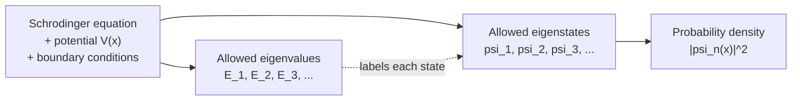
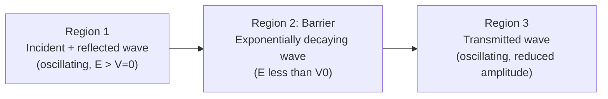

# Chapter 2: Quantum Mechanics Foundations

<strong>Chapter Overview</strong> (click to expand)

This chapter introduces the quantum-mechanical machinery that everything from Chapter 3 onward depends on: the idea that matter behaves like a wave, the fundamental limit on how precisely position and momentum can be known simultaneously, and the Schrödinger equation that predicts the allowed energies and wavefunctions of a confined particle. Two solvable systems — the particle in a box and the finite potential barrier — turn these abstract ideas into concrete, computable results.

**Key Takeaways:**

1. Light and matter both display wave-like and particle-like behavior; the de Broglie relation \(\lambda = h/p\) extends the wave picture to any particle with momentum, however massive.
2. The Heisenberg uncertainty principle, \(\Delta x\,\Delta p \geq \hbar/2\), is a fundamental limit on how precisely position and momentum can be known simultaneously — not a limitation of measurement technique.
3. The time-independent Schrödinger equation, \(-\frac{\hbar^2}{2m}\frac{d^2\psi}{dx^2} + V(x)\psi = E\psi\), is the equation of motion of quantum mechanics; solving it for a given potential \(V(x)\) yields the allowed wavefunctions and energies of a system.
4. The wavefunction \(\psi(x)\) itself is not directly observable; its squared magnitude \(|\psi(x)|^2\) is the probability density for finding the particle at position \(x\).
5. Boundary conditions imposed on \(\psi(x)\) — for example, requiring \(\psi\) to vanish at the walls of an infinite well — force only certain discrete wavefunctions (eigenstates) and energies (eigenvalues) to be valid solutions; this is the mathematical origin of energy quantization.
6. The particle-in-a-box model is the simplest solvable quantum system and previews, in miniature, the same boundary-value approach Chapter 5 uses to build the Kronig-Penney model of a periodic crystal potential.
7. Quantum tunneling gives a particle a nonzero probability of appearing on the far side of a potential barrier even when its energy is less than the barrier height — a purely quantum effect with no classical analog.
8. Every tool developed here — wavefunctions, eigenstates, quantized energies, tunneling — reappears directly when Chapter 5 solves the Schrödinger equation for an electron in a periodic crystal potential, and Chapter 6 turns the resulting eigenvalues into the energy bands that govern all subsequent semiconductor behavior.

## Learning Objectives

By the end of this chapter, you will be able to:

- Explain wave-particle duality and describe why both light and matter exhibit wave-like and particle-like behavior depending on the experiment
- Calculate the de Broglie wavelength of a particle given its mass and velocity, and compare the wave nature of microscopic and macroscopic objects
- State the Heisenberg uncertainty principle and estimate the minimum uncertainty in momentum (or velocity) for a particle confined to a given region
- Write the time-independent Schrödinger equation and identify the physical meaning of the wavefunction \(\psi(x)\)
- Interpret the probability density \(|\psi(x)|^2\) and use normalization to compute the probability of finding a particle within a given region
- Explain what eigenstates and eigenvalues are, and why boundary conditions on a wavefunction quantize the allowed energies of a bound system
- Apply the boundary conditions of the infinite square well (particle in a box) to derive its quantized wavefunctions and energy levels
- Estimate the ground-state and excited-state energies of a particle confined to a nanometer-scale box
- Describe a potential well and a potential barrier, and explain qualitatively how quantum tunneling differs from classical over-the-barrier transmission
- Estimate the transmission probability of a particle tunneling through a simple rectangular barrier using the approximate formula \(T \approx e^{-2\kappa L}\)
- Solve worked and practice problems combining these ideas, in preparation for the periodic-potential and band-theory arguments of Chapters 5–6

!!! note "How to read this chapter"
    Quantum mechanics is famously counter-intuitive, and this chapter asks you to set aside some classical intuitions about what a "particle" is. Read the intuition paragraphs carefully even if you have seen some of this material before — the notation and conventions established here (\(h\) versus \(\hbar\), the specific normalization of \(\psi_n(x)\), the exact form of the tunneling formula) are used without re-derivation in every later chapter. The boxed equations and worked examples are the material you should be able to reproduce on demand; the MicroSims let you build intuition for how each quantity behaves before you need that intuition for a derivation.

## Introduction

By the end of the nineteenth century, classical mechanics and classical electromagnetism — together with the mathematical toolbox assembled in Chapter 1 — could explain an enormous range of phenomena, from planetary orbits to the propagation of light. But a handful of experiments stubbornly resisted classical explanation: the spectrum of light emitted by a hot object, the way light ejects electrons from a metal surface, and the discrete spectral lines emitted by excited atoms. Chapter 1 already introduced one piece of the resolution — **photon energy**, \(E_{\text{photon}} = hf = hc/\lambda\) — the observation that light delivers its energy in discrete packets rather than continuously. This chapter extends that same quantum reasoning from light to matter, and develops the mathematical framework, quantum mechanics, that makes it predictive rather than merely descriptive.

The central surprising claim of this chapter is symmetric with the photon story: just as light, ordinarily described as a wave, sometimes behaves like a stream of particles, matter — electrons, atoms, even (in principle) baseballs — sometimes behaves like a wave. The de Broglie hypothesis makes this quantitative, assigning a wavelength to any particle with momentum. Chapter 1's **thermal energy** result, \(\langle KE\rangle = \tfrac{3}{2}k_BT\), helps explain why this wave nature is obvious for an electron but utterly unobservable for a thrown baseball: the relevant wavelength shrinks so quickly with increasing momentum (and hence mass) that macroscopic objects have wavelengths many orders of magnitude smaller than any measurable length. Quantum effects are not a different set of physical laws that only sometimes apply — they are always the true description, but they are only *noticeable* at the mass and energy scales of individual particles.

Once matter is granted a wave nature, a natural question follows: a wave *of what*, exactly, and what equation does it obey? The answer is the **Schrödinger equation**, and the quantity that obeys it is the **wavefunction**, \(\psi(x)\). Just as Chapter 1 related an electric field to a scalar potential through the gradient (\(\vec{E} = -\nabla V\)), the Schrödinger equation relates a particle's wavefunction to the potential energy \(V(x)\) it experiences, and its solutions — the **eigenstates** and **eigenvalues** — are the allowed wavefunctions and energies of the system. The **probability density**, \(|\psi(x)|^2\), plays a role loosely analogous to the electric field in Chapter 1: it is the physically meaningful, measurable quantity built from a more abstract underlying mathematical object. And just as Gauss's law required choosing a surface with the right symmetry, solving the Schrödinger equation requires specifying **boundary conditions** appropriate to the physical situation — conditions that, as you will see in the particle-in-a-box system, are directly responsible for quantizing the allowed energies.

This chapter closes with two solvable quantum systems that make all of this concrete: the **particle in a box**, an idealized particle trapped in an infinitely deep **potential well**, and **quantum tunneling**, in which a particle has a nonzero probability of passing through a potential barrier even without enough energy to classically surmount it. These are not merely toy problems. The particle-in-a-box boundary-value technique — solve the Schrödinger equation inside a region, then force the solution to satisfy conditions at the boundaries — is *exactly* the technique Chapter 5 uses to solve for an electron in a periodic array of atomic potentials (the Kronig-Penney model), and the discrete energy levels that result are the direct ancestor of the continuous energy *bands* that Chapter 6 uses to explain why some materials conduct electricity and others do not. Every tool built in this chapter is a tool you will use again, almost immediately.

## Concepts Covered

This chapter covers the following 12 concepts from the learning graph:

1. Wave-Particle Duality
2. de Broglie Wavelength
3. Heisenberg Uncertainty Principle
4. Schrodinger Equation
5. Wavefunction
6. Probability Density
7. Eigenstate
8. Eigenvalue
9. Particle in a Box
10. Quantum Tunneling
11. Potential Well
12. Boundary Conditions

## Prerequisites

This chapter builds directly on [Chapter 1: Physics and Math Foundations](../01-physics-math-foundations/index.md), particularly photon energy, complex numbers and Euler's formula, differentiation and partial derivatives, and the fundamental physical constants.

## Wave-Particle Duality and the de Broglie Wavelength

### Evidence That Light and Matter Are Both Wave and Particle

Chapter 1 introduced photon energy, \(E_{\text{photon}} = hf\), as the resolution to experiments (blackbody radiation, the photoelectric effect) in which light — ordinarily described as an electromagnetic *wave* — behaves instead like a stream of discrete energy packets, or **particles**. This dual character is called **wave-particle duality**: depending on the experiment performed, light exhibits interference and diffraction (wave behavior) or delivers energy in discrete, localized quanta (particle behavior). Neither description alone is complete; both are simultaneously true, and which behavior is emphasized depends on what is being measured.

The genuinely surprising extension, proposed by Louis de Broglie in 1924, is that this duality is not a special property of light. **Every** particle with momentum — an electron, a proton, an atom, even (in principle) a thrown baseball — has an associated wave character. This was confirmed experimentally within a few years by the Davisson-Germer experiment, in which a beam of electrons reflected from a nickel crystal produced a diffraction pattern indistinguishable in kind from the diffraction of X-rays off the same crystal — direct evidence that electrons, ordinarily thought of as point particles, propagate as waves.

#### Diagram: Wave-Particle Duality Explorer
<iframe src="../../sims/wave-particle-duality-explorer/main.html" width="100%" height="600px" scrolling="auto"></iframe>

!!! tip "How to use this MicroSim"
    **Instructions:** Press Start with two slits open and let particles accumulate one at a time on the screen; clear the pattern and switch to one slit to compare.

    **Learning objective:** See directly that individual particles are always detected as single, localized events, while the statistics of many detections follow a wave-interference pattern — the two halves of wave-particle duality at once.

    **What to observe:** Fringes appear only with two slits open; with one slit, only a single broad band remains, since there is no second path to interfere with.

[Full MicroSim documentation →](../../sims/wave-particle-duality-explorer/index.md)

### The de Broglie Hypothesis

De Broglie's hypothesis assigns a wavelength to any particle in terms of its momentum, using the same constant \(h\) that relates photon energy to frequency:

\[
\lambda = \frac{h}{p} = \frac{h}{mv}
\]

where \(\lambda\) is the de Broglie wavelength (meters), \(h = 6.626\times10^{-34}\ \text{J·s}\) is Planck's constant, \(p = mv\) is the particle's momentum, \(m\) is its mass (kg), and \(v\) is its speed (m/s). Because \(h\) is an extremely small number, the de Broglie wavelength of an everyday object is unimaginably small — far below any length that could ever be measured — while the de Broglie wavelength of an electron accelerated through a typical laboratory voltage is comparable to, or smaller than, atomic dimensions, which is precisely why electron diffraction can resolve crystal structure (a technique used again when Chapter 3 discusses crystal lattices).

| Particle | Typical speed | de Broglie wavelength |
|---|---|---|
| Electron accelerated through 100 V | \(5.9\times10^6\) m/s | \(\approx 0.123\) nm |
| Electron at room-temperature thermal speed | \(\approx 1\times10^5\) m/s | \(\approx 7\) nm |
| Baseball (0.145 kg) thrown at 40 m/s | 40 m/s | \(\approx 1.1\times10^{-34}\) m |

The table makes the point vividly: the electron's wavelength is comparable to the spacing between atoms in a crystal (a fraction of a nanometer), so its wave nature is directly observable in diffraction experiments; the baseball's wavelength is roughly twenty orders of magnitude smaller than a proton, utterly unobservable by any conceivable experiment. Wave-particle duality is universal, but only *noticeable* for particles with very small mass and momentum.

#### Diagram: de Broglie Wavelength Explorer
<iframe src="../../sims/debroglie-wavelength-explorer/main.html" width="100%" height="560px" scrolling="auto"></iframe>

!!! tip "How to use this MicroSim"
    **Instructions:** Choose a particle (electron, proton, or a custom mass) and drag the speed slider; observe how the computed de Broglie wavelength updates.

    **Learning objective:** Compute the de Broglie wavelength of a particle from its mass and speed, and compare how dramatically that wavelength depends on which particle is selected.

    **What to observe:** For the same speed, a heavier particle has a much shorter de Broglie wavelength than a lighter one, since \(\lambda = h/(mv)\) — increasing either \(m\) or \(v\) shrinks the wavelength proportionally.

[Full MicroSim documentation →](../../sims/debroglie-wavelength-explorer/index.md)

## The Heisenberg Uncertainty Principle

If a particle has a wave character, an immediate consequence follows: a wave that is perfectly localized in space (a single sharp spike) must be built from a broad range of wavelengths (and hence, via \(\lambda = h/p\), a broad range of momenta), while a wave with one single, precisely-defined wavelength must be spread out over all of space. This is not a peculiarity of quantum mechanics — it is a property of waves in general, familiar from Fourier analysis of any wave phenomenon — but in quantum mechanics it has a profound physical consequence known as the **Heisenberg uncertainty principle**:

\[
\Delta x \, \Delta p \geq \frac{\hbar}{2}
\]

where \(\Delta x\) is the uncertainty (standard deviation) in a particle's position, \(\Delta p\) is the uncertainty in its momentum, and \(\hbar = h/2\pi = 1.0546\times10^{-34}\ \text{J·s}\) is the reduced Planck's constant. The uncertainty principle states that the product of these two uncertainties can never be smaller than \(\hbar/2\), no matter how carefully or cleverly a measurement is designed. This is a fundamental property of nature, not a statement about the limitations of laboratory instruments: even a perfect, noise-free measuring device cannot simultaneously pin down a particle's position and momentum beyond this limit.

The uncertainty principle has an immediate, striking numerical consequence. Suppose an electron is confined to a region the size of a single atom, \(\Delta x \approx 1\times10^{-10}\) m. The minimum momentum uncertainty is then \(\Delta p \geq \hbar/(2\Delta x) \approx 5.3\times10^{-25}\ \text{kg·m/s}\), which corresponds to a velocity uncertainty of roughly \(5.8\times10^5\) m/s — comparable to the orbital speed of an electron in a hydrogen atom. In other words, confining an electron to atomic dimensions *forces* it to have a large uncertainty in its momentum, and therefore a substantial minimum kinetic energy — an effect with no classical counterpart, sometimes called "zero-point energy," and one that reappears directly in the particle-in-a-box energy levels derived later in this chapter (a smaller box always has a *higher* ground-state energy).

#### Diagram: Heisenberg Uncertainty Principle Explorer
<iframe src="../../sims/heisenberg-uncertainty-explorer/main.html" width="100%" height="540px" scrolling="auto"></iframe>

!!! tip "How to use this MicroSim"
    **Instructions:** Drag the position-uncertainty slider (\(\Delta x\)) and observe how the minimum allowed momentum uncertainty (\(\Delta p\)) updates, along with a visual representation of a wave packet becoming more or less localized.

    **Learning objective:** Relate the width of a spatial wave packet to the spread of momenta (or wavelengths) needed to construct it, and connect this trade-off numerically to \(\Delta x\, \Delta p \geq \hbar/2\).

    **What to observe:** As you narrow the position uncertainty, the wave packet becomes more sharply localized in space but the momentum-uncertainty readout grows — the two can never both shrink toward zero at the same time.

[Full MicroSim documentation →](../../sims/heisenberg-uncertainty-explorer/index.md)

!!! question "Concept Check"
    A proton is confined to a nucleus of diameter roughly \(1\times10^{-14}\) m, while an electron is confined to an atom of diameter roughly \(1\times10^{-10}\) m — a region \(10{,}000\) times larger. Which particle has the larger *minimum* momentum uncertainty, and why?

??? question "Concept Check — click to reveal answer"
    The proton, confined to the much smaller region, has the larger minimum momentum uncertainty. Since \(\Delta p \geq \hbar/(2\Delta x)\), a smaller \(\Delta x\) forces a larger minimum \(\Delta p\) — the two are inversely related. This is why nucleons confined inside a nucleus have enormous zero-point kinetic energies compared to electrons confined inside an atom.

## The Schrödinger Equation, Wavefunctions, and Probability

### The Time-Independent Schrödinger Equation

If matter has a wave character, some equation must play the role for matter waves that Maxwell's equations play for light waves — an equation of motion whose solutions are the allowed "shapes" a particle's wave can take. That equation, developed by Erwin Schrödinger in 1926, is the cornerstone of quantum mechanics. For a particle of mass \(m\) moving in one dimension under the influence of a potential energy function \(V(x)\), the **time-independent Schrödinger equation** is:

\[
-\frac{\hbar^2}{2m}\frac{d^2\psi}{dx^2} + V(x)\psi(x) = E\psi(x)
\]

Here \(\psi(x)\) is the **wavefunction** — the quantum-mechanical analog of the matter wave introduced by de Broglie — and \(E\) is the total energy of the particle. The first term plays the role of kinetic energy (it involves a second derivative of \(\psi\), analogous to how classical kinetic energy involves momentum squared), the second term is the familiar potential energy, and together they must equal \(E\psi\) at every point \(x\). Solving this equation for a particular \(V(x)\) — a task this chapter carries out explicitly for the particle in a box — determines both the allowed wavefunctions and the allowed energies simultaneously; they are not independent choices.

The wavefunction \(\psi(x)\) is, in general, a complex-valued function, exactly the kind of object Chapter 1's review of complex numbers and Euler's formula was preparing you to manipulate: a free particle's wavefunction is often written \(\psi(x) = Ae^{ikx}\), a complex exponential whose "wavevector" \(k = 2\pi/\lambda\) connects directly back to the de Broglie wavelength. But \(\psi(x)\) itself is not something you can measure in a lab — no experiment reports a "wavefunction reading." What *is* measurable is described next.

### Probability Density and Normalization

Max Born proposed the physical interpretation of the wavefunction that is now standard: the squared magnitude of the wavefunction, \(|\psi(x)|^2 = \psi^*(x)\psi(x)\), is a **probability density** — the probability *per unit length* of finding the particle near position \(x\), if a position measurement is performed. The probability of finding the particle in some small interval \(dx\) around \(x\) is \(|\psi(x)|^2\,dx\), and the probability of finding it anywhere between two points \(a\) and \(b\) is the integral of the probability density over that range:

\[
P(a \leq x \leq b) = \int_a^b |\psi(x)|^2\, dx
\]

Because the particle must be *somewhere*, integrating the probability density over all space must give exactly 1 — a condition called **normalization**:

\[
\int_{-\infty}^{\infty} |\psi(x)|^2\, dx = 1
\]

A wavefunction that satisfies this condition is said to be normalized. Given a wavefunction with an unknown overall multiplicative constant, the normalization condition is exactly what determines that constant — a calculation carried out explicitly in Worked Example 6 below, and one you will repeat for the particle-in-a-box wavefunctions in the next section.

### Eigenstates and Eigenvalues

Not every function \(\psi(x)\) satisfies the Schrödinger equation for a given potential \(V(x)\) and a given energy \(E\) — and, further, not every value of \(E\) admits *any* physically acceptable solution. The specific wavefunctions \(\psi_n(x)\) that do solve the Schrödinger equation for a particular system, together with the appropriate boundary conditions, are called **eigenstates** (or stationary states), and the corresponding allowed energies \(E_n\) are called **eigenvalues**. The subscript \(n\) — a **quantum number** — labels the different allowed eigenstates, typically ordered from lowest to highest energy.

This is the mathematical origin of energy quantization in bound quantum systems: whenever a particle is confined (bound) by a potential well, only a discrete, countable set of energies \(E_1, E_2, E_3,\ldots\) is allowed, rather than a continuum. This is dramatically different from classical mechanics, where a ball rolling in a bowl can have *any* energy above the bottom of the bowl. The reason quantization appears is directly tied to the **boundary conditions** the wavefunction must satisfy — a connection made completely explicit in the next section, where boundary conditions on a simple potential well are shown to force only certain wavelengths (and hence, via de Broglie's relation, only certain energies) to fit.

!!! question "Concept Check"
    What is the physical difference between the wavefunction \(\psi(x)\) and the probability density \(|\psi(x)|^2\)? Why can \(\psi(x)\) itself not be directly interpreted as a probability?

??? question "Concept Check — click to reveal answer"
    \(\psi(x)\) is in general a complex-valued function whose phase carries physical information (for example, momentum, encoded in how rapidly it oscillates) but which can be negative or complex-valued, so it cannot itself represent a probability — probabilities must be real numbers between 0 and 1. The probability density \(|\psi(x)|^2 = \psi^*(x)\psi(x)\) is always real and non-negative, and it integrates to exactly 1 when \(\psi\) is normalized, which is exactly the property required of a probability density. Only \(|\psi(x)|^2\), not \(\psi(x)\) itself, corresponds to something you can measure.

#### Diagram: Schrödinger Wavefunction & Eigenstates Visualizer
<iframe src="../../sims/schrodinger-wavefunction-explorer/main.html" width="100%" height="640px" scrolling="auto"></iframe>

!!! tip "How to use this MicroSim"
    **Instructions:** In Eigenstate mode, press Start and watch the probability density stay flat while the complex phase rotates; switch to Wave Packet mode to see it localize, drift, and spread instead.

    **Learning objective:** Distinguish the complex wavefunction ψ from the real, measurable probability density |ψ|², and see concretely what "stationary state" means.

    **What to observe:** The eigenstate's |ψ|² never changes shape — only Re[ψ] and Im[ψ] ripple as the phase rotates. The wave packet's |ψ|² visibly moves and widens over time.

[Full MicroSim documentation →](../../sims/schrodinger-wavefunction-explorer/index.md)

## Particle in a Box: A Solvable Quantum System

### Setting Up Boundary Conditions

The **particle in a box** (also called the infinite square well) is the simplest system for which the Schrödinger equation can be solved exactly, and it is the model this course leans on most heavily going forward. Imagine a particle of mass \(m\) confined to move freely along the \(x\)-axis between \(x=0\) and \(x=L\), trapped by walls of infinite potential energy on either side — an idealized **potential well**:

\[
V(x) = \begin{cases} 0 & 0 < x < L \\ \infty & x \leq 0 \text{ or } x \geq L \end{cases}
\]

Because the potential is infinite outside the well, the particle can never be found there, so the wavefunction must vanish at and beyond the walls. This gives the **boundary conditions** for this problem:

\[
\psi(0) = 0, \qquad \psi(L) = 0
\]

Inside the well, where \(V(x)=0\), the Schrödinger equation reduces to \(-\frac{\hbar^2}{2m}\psi'' = E\psi\), whose general solution is a combination of sines and cosines, \(\psi(x) = A\sin(kx) + B\cos(kx)\), with \(k = \sqrt{2mE}/\hbar\). Applying the first boundary condition, \(\psi(0)=0\), forces \(B=0\) (since \(\cos(0)=1\neq0\) but \(\sin(0)=0\)). Applying the second boundary condition, \(\psi(L)=0\), requires \(A\sin(kL)=0\), and since \(A=0\) would give the trivial (zero everywhere, unphysical) solution, this forces \(\sin(kL)=0\) — which is only true when \(kL\) is an integer multiple of \(\pi\):

\[
k_n L = n\pi, \qquad n = 1, 2, 3, \ldots \qquad \Longrightarrow \qquad k_n = \frac{n\pi}{L}
\]

This is the key result: the boundary conditions alone, with no additional physical assumption, force only certain discrete values of \(k\) (and hence, since \(E = \hbar^2k^2/2m\), only certain discrete energies) to be allowed. This is exactly the quantization mechanism previewed in the Eigenstates and Eigenvalues subsection above.

### Quantized Wavefunctions and Energy Levels

Substituting \(k_n = n\pi/L\) back into the general solution, and choosing the constant \(A\) so that each \(\psi_n(x)\) is normalized (\(\int_0^L|\psi_n|^2\,dx=1\)), gives the normalized particle-in-a-box **eigenstates**:

\[
\psi_n(x) = \sqrt{\frac{2}{L}}\,\sin\!\left(\frac{n\pi x}{L}\right), \qquad n = 1, 2, 3, \ldots
\]

and the corresponding **eigenvalues** (allowed energies):

\[
E_n = \frac{n^2 h^2}{8mL^2}, \qquad n = 1, 2, 3, \ldots
\]

Several features of this result are worth internalizing, since they reappear (in modified form) throughout the rest of the course. First, energies scale as \(n^2\): the gaps between successive energy levels grow wider as \(n\) increases, not narrower. Second, energies scale as \(1/L^2\): shrinking the box dramatically raises every energy level, consistent with the uncertainty-principle argument made earlier (confining a particle to a smaller region forces a larger momentum, and hence a larger kinetic energy). Third, the ground state (\(n=1\)) has a strictly positive energy, \(E_1 = h^2/(8mL^2) > 0\) — the particle can never have zero energy, another purely quantum effect (zero-point energy) with no classical analog, since a classical particle confined to a box could sit perfectly still with zero kinetic energy.

#### Diagram: Particle in a Box Explorer
<iframe src="../../sims/particle-in-a-box-explorer/main.html" width="100%" height="600px" scrolling="auto"></iframe>

!!! tip "How to use this MicroSim"
    **Instructions:** Drag the box-width slider \(L\) and the quantum-number slider \(n\), and toggle between viewing the wavefunction \(\psi_n(x)\) and the probability density \(|\psi_n(x)|^2\).

    **Learning objective:** Visualize how the number of nodes in \(\psi_n(x)\) increases with \(n\), and connect the shape of \(|\psi_n(x)|^2\) to the probability of finding the particle in different regions of the box.

    **What to observe:** Higher \(n\) states have more nodes (points where the wavefunction is exactly zero inside the box) and higher energy; shrinking \(L\) raises every energy level, with the ground state moving up fastest in relative terms.

[Full MicroSim documentation →](../../sims/particle-in-a-box-explorer/index.md)

!!! question "Concept Check"
    Why must the quantum number \(n\) in the particle-in-a-box solution start at \(n=1\) rather than \(n=0\)?

??? question "Concept Check — click to reveal answer"
    If \(n=0\), then \(k_0=0\) and \(\psi_0(x) = \sqrt{2/L}\sin(0) = 0\) everywhere inside the box — the trivial, unphysical solution corresponding to no particle at all (it cannot be normalized, since \(\int_0^L 0\,dx = 0 \neq 1\)). The smallest physically acceptable quantum number is therefore \(n=1\), which gives the strictly positive ground-state energy \(E_1 = h^2/(8mL^2)\).

## Potential Wells and Quantum Tunneling

### Finite Potential Wells and Barriers

The particle-in-a-box model idealizes its walls as infinitely tall, so the wavefunction is forced to be exactly zero outside the well. Real confining potentials — an electron held near a doped atom, a carrier confined to a thin semiconductor layer — are better modeled as a **finite potential well**, with a wall of finite height \(V_0\) rather than infinite height. Solving the Schrödinger equation for a finite well shows that the wavefunction does *not* drop to exactly zero at the walls; instead, it decays smoothly into the classically forbidden region outside the well, meaning there is a small but nonzero probability of finding the particle *outside* the well altogether — a region where, classically, it could never be found, since its kinetic energy there would have to be negative.

This same phenomenon, generalized to a *barrier* (a finite region of potential energy higher than the particle's own energy, with allowed regions on both sides) rather than a well, is the setting for **quantum tunneling**.

#### Diagram: Finite Potential Well Explorer
<iframe src="../../sims/finite-potential-well-explorer/main.html" width="100%" height="580px" scrolling="auto"></iframe>

!!! tip "How to use this MicroSim"
    **Instructions:** Drag V₀ from minimum to maximum and watch the number of bound states change; select each state and check "Compare to infinite well" to see the wavefunction penetrate the walls.

    **Learning objective:** Contrast the finite well's exponentially decaying wavefunction outside the walls against the infinite well's exact zero there.

    **What to observe:** Every finite-well curve continues smoothly past the walls instead of stopping abruptly, and the finite-well ground-state energy is always somewhat lower than the corresponding infinite-well energy.

[Full MicroSim documentation →](../../sims/finite-potential-well-explorer/index.md)

### Quantum Tunneling Through a Barrier

Consider a particle of energy \(E\) traveling toward a rectangular potential barrier of height \(V_0 > E\) and width \(L\). Classically, the particle cannot pass: it does not have enough energy to surmount the barrier, and it will simply reflect. Quantum mechanically, the Schrödinger equation gives a very different answer. Inside the barrier, the wavefunction does not oscillate (since \(E < V_0\) there); instead, it decays exponentially, and — because the wavefunction and its derivative must be continuous at each boundary — a small but nonzero part of that decaying wave emerges on the far side of the barrier as a traveling wave, corresponding to a nonzero probability that the particle is transmitted through the barrier entirely. This effect, with no classical analog whatsoever, is called **quantum tunneling**.

For an intro-level estimate, valid when the barrier is wide or tall enough that the decay is substantial (\(\kappa L \gg 1\)), the **transmission probability** — the fraction of incident particles that tunnel through — is well approximated by:

\[
T \approx e^{-2\kappa L}, \qquad \kappa = \frac{\sqrt{2m(V_0-E)}}{\hbar}
\]

Here \(\kappa\) (units of inverse length) characterizes how quickly the wavefunction decays inside the barrier, \(L\) is the barrier width, \(V_0\) is the barrier height, and \(E\) is the particle's energy. This expression is a simplified approximation to the exact transmission formula (which is more involved and not needed at this level); it captures the essential physics correctly: transmission probability falls off *exponentially* with both barrier width \(L\) and with \(\sqrt{V_0-E}\), which is why tunneling is significant only for very thin barriers or particles of very small mass (electrons tunnel far more readily than protons or heavier particles, all else equal). Quantum tunneling is not a mathematical curiosity — it is the operating principle behind the scanning tunneling microscope, and it reappears in this course when Chapter 16 discusses tunneling currents in heavily doped metal-semiconductor junctions.

#### Diagram: Quantum Tunneling Probability Explorer
<iframe src="../../sims/quantum-tunneling-explorer/main.html" width="100%" height="560px" scrolling="auto"></iframe>

!!! tip "How to use this MicroSim"
    **Instructions:** Adjust the barrier height \(V_0\), barrier width \(L\), and particle energy \(E\) sliders, and observe how the computed transmission probability \(T\) updates.

    **Learning objective:** Apply the approximate tunneling formula \(T \approx e^{-2\kappa L}\) to estimate transmission probability, and recognize its exponential sensitivity to barrier width and height.

    **What to observe:** Small changes in barrier width \(L\) produce enormous changes in transmission probability — doubling \(L\) roughly *squares* the (small) transmission probability — while transmission always increases as the particle's energy \(E\) approaches the barrier height \(V_0\).

[Full MicroSim documentation →](../../sims/quantum-tunneling-explorer/index.md)

## Worked Examples

!!! example "Example 1 — de Broglie Wavelength of an Electron"
    Find the de Broglie wavelength of an electron accelerated from rest through a potential difference of 100 V.

    **Solution:** The kinetic energy gained is \(KE = qV = (1.602\times10^{-19}\ \text{C})(100\ \text{V}) = 1.602\times10^{-17}\ \text{J}\). Solving \(KE=\tfrac12 mv^2\) for speed: \(v = \sqrt{2\,KE/m} = \sqrt{2(1.602\times10^{-17})/(9.109\times10^{-31})} = 5.93\times10^{6}\ \text{m/s}\). Momentum: \(p = mv = (9.109\times10^{-31})(5.93\times10^{6}) = 5.40\times10^{-24}\ \text{kg·m/s}\). Wavelength: \(\lambda = h/p = (6.626\times10^{-34})/(5.40\times10^{-24}) = 1.23\times10^{-10}\ \text{m} = 0.123\ \text{nm}\) — comparable to atomic spacing in a crystal.

!!! example "Example 2 — de Broglie Wavelength of a Macroscopic Object"
    Find the de Broglie wavelength of a 0.145 kg baseball thrown at 40 m/s.

    **Solution:** Momentum: \(p = mv = (0.145)(40) = 5.8\ \text{kg·m/s}\). Wavelength: \(\lambda = h/p = (6.626\times10^{-34})/(5.8) = 1.14\times10^{-34}\ \text{m}\) — about twenty orders of magnitude smaller than a proton, and utterly unobservable, which is why the baseball's wave nature never manifests in everyday experience.

!!! example "Example 3 — Kinetic Energy from a Given de Broglie Wavelength"
    An electron used for diffraction studies of a crystal lattice has a de Broglie wavelength of \(\lambda = 0.10\) nm, comparable to typical atomic spacing. Find its kinetic energy in eV.

    **Solution:** Momentum: \(p = h/\lambda = (6.626\times10^{-34})/(1.0\times10^{-10}) = 6.63\times10^{-24}\ \text{kg·m/s}\). Speed: \(v = p/m = (6.63\times10^{-24})/(9.109\times10^{-31}) = 7.27\times10^{6}\ \text{m/s}\). Kinetic energy: \(KE = \tfrac12 mv^2 = \tfrac12(9.109\times10^{-31})(7.27\times10^{6})^2 = 2.41\times10^{-17}\ \text{J} = 150\ \text{eV}\).

!!! example "Example 4 — Heisenberg Uncertainty Estimate"
    An electron is confined to a region the size of an atom, \(\Delta x = 1.0\times10^{-10}\) m. Estimate the minimum uncertainty in its velocity.

    **Solution:** Minimum momentum uncertainty: \(\Delta p \geq \hbar/(2\Delta x) = (1.0546\times10^{-34})/(2\times1.0\times10^{-10}) = 5.27\times10^{-25}\ \text{kg·m/s}\). Velocity uncertainty: \(\Delta v = \Delta p/m = (5.27\times10^{-25})/(9.109\times10^{-31}) = 5.79\times10^{5}\ \text{m/s}\) — comparable to a typical atomic orbital speed, illustrating why confined electrons necessarily carry substantial zero-point kinetic energy.

!!! example "Example 5 — Boundary Conditions and Quantization"
    Starting from the general solution \(\psi(x) = A\sin(kx)+B\cos(kx)\) inside an infinite square well of width \(L\), show that the boundary conditions \(\psi(0)=\psi(L)=0\) force \(k_n = n\pi/L\), and verify this gives the same energy as \(E_n = n^2h^2/(8mL^2)\).

    **Solution:** Applying \(\psi(0)=0\): \(A\sin(0)+B\cos(0) = B = 0\), so \(\psi(x)=A\sin(kx)\). Applying \(\psi(L)=0\): \(A\sin(kL)=0\); since \(A\neq0\) (else \(\psi\equiv0\)), this requires \(\sin(kL)=0\), so \(kL=n\pi\) and \(k_n=n\pi/L\) for \(n=1,2,3,\ldots\). Using \(E=\hbar^2k^2/(2m)\): \(E_n = \hbar^2(n\pi/L)^2/(2m) = n^2\pi^2\hbar^2/(2mL^2)\). Substituting \(\hbar=h/2\pi\), so \(\hbar^2=h^2/4\pi^2\): \(E_n = n^2\pi^2\cdot\dfrac{h^2}{4\pi^2}\Big/(2mL^2) = \dfrac{n^2h^2}{8mL^2}\), exactly matching the boxed energy formula.

!!! example "Example 6 — Normalizing a Wavefunction"
    A particle confined to \(0<x<L\) has wavefunction \(\psi(x) = A\sin(\pi x/L)\) (and \(\psi(x)=0\) outside this range). Find the normalization constant \(A\).

    **Solution:** Require \(\int_0^L |\psi(x)|^2\,dx = 1\): \(A^2\int_0^L \sin^2(\pi x/L)\,dx = 1\). Using \(\int_0^L\sin^2(\pi x/L)\,dx = L/2\): \(A^2(L/2)=1\), so \(A = \sqrt{2/L}\) — exactly the normalization constant used in the particle-in-a-box eigenstates \(\psi_n(x)\).

!!! example "Example 7 — Particle-in-a-Box Ground-State Energy"
    Find the ground-state energy (\(n=1\)) of an electron confined to a box of width \(L=1.0\) nm.

    **Solution:** \(E_1 = \dfrac{h^2}{8mL^2} = \dfrac{(6.626\times10^{-34})^2}{8(9.109\times10^{-31})(1.0\times10^{-9})^2} = \dfrac{4.39\times10^{-67}}{7.29\times10^{-48}} = 6.03\times10^{-20}\ \text{J} = 0.376\ \text{eV}\).

!!! example "Example 8 — Particle-in-a-Box Transition Energy"
    For the same electron and box as Example 7, find the energy of the \(n=2\) state and the wavelength of a photon emitted in a transition from \(n=2\) to \(n=1\).

    **Solution:** Since \(E_n = n^2 E_1\): \(E_2 = 4(0.376) = 1.504\ \text{eV}\). Transition energy: \(\Delta E = E_2-E_1 = 1.504-0.376 = 1.128\ \text{eV} = 1.81\times10^{-19}\ \text{J}\). Photon wavelength: \(\lambda = hc/\Delta E = (6.626\times10^{-34})(2.998\times10^{8})/(1.81\times10^{-19}) = 1.10\times10^{-6}\ \text{m} = 1100\ \text{nm}\) (near-infrared).

!!! example "Example 9 — Probability in the Left Half of the Box"
    For the ground state (\(n=1\)) of a particle in a box of width \(L\), find the probability of finding the particle in the left half of the box, \(0<x<L/2\).

    **Solution:** \(P = \displaystyle\int_0^{L/2}\frac{2}{L}\sin^2\!\left(\frac{\pi x}{L}\right)dx\). Using \(\sin^2\theta = \tfrac12(1-\cos2\theta)\): \(P = \dfrac{1}{L}\left[x-\dfrac{L}{2\pi}\sin\!\left(\dfrac{2\pi x}{L}\right)\right]_0^{L/2} = \dfrac{1}{L}\left[\dfrac{L}{2}-\dfrac{L}{2\pi}\sin(\pi)\right] = \dfrac{1}{L}\cdot\dfrac{L}{2} = \dfrac12\). The probability is exactly \(\tfrac12\), as required by the symmetry of \(\sin^2(\pi x/L)\) about the box's midpoint.

!!! example "Example 10 — Probability in a Narrow Window"
    For the same ground state as Example 9, estimate the probability of finding the particle in a narrow window of width \(\Delta x = 0.01L\) centered at the middle of the box, \(x=L/2\).

    **Solution:** For a narrow window, \(P \approx |\psi(L/2)|^2\,\Delta x\). Evaluating the probability density at the center: \(|\psi(L/2)|^2 = \dfrac{2}{L}\sin^2\!\left(\dfrac{\pi}{2}\right) = \dfrac{2}{L}(1)^2 = \dfrac{2}{L}\), its maximum value. So \(P \approx \dfrac{2}{L}(0.01L) = 0.02\), a 2% probability — consistent with the ground-state probability density being largest at the box's center.

!!! example "Example 11 — Tunneling Transmission Probability"
    An electron with energy \(E=0.50\) eV approaches a rectangular potential barrier of height \(V_0=1.0\) eV and width \(L=1.0\) nm. Estimate the transmission probability.

    **Solution:** \(V_0-E = 0.50\ \text{eV} = 8.01\times10^{-20}\ \text{J}\). \(\kappa = \dfrac{\sqrt{2m(V_0-E)}}{\hbar} = \dfrac{\sqrt{2(9.109\times10^{-31})(8.01\times10^{-20})}}{1.0546\times10^{-34}} = \dfrac{3.82\times10^{-25}}{1.0546\times10^{-34}} = 3.62\times10^{9}\ \text{m}^{-1}\). \(\kappa L = (3.62\times10^{9})(1.0\times10^{-9}) = 3.62\). Transmission: \(T\approx e^{-2\kappa L} = e^{-7.24} \approx 7.2\times10^{-4}\), roughly a 0.07% chance of tunneling through.

!!! example "Example 12 — Sensitivity of Tunneling to Barrier Width"
    Using the same barrier as Example 11, estimate the transmission probability if the barrier width is doubled to \(L=2.0\) nm.

    **Solution:** Since \(T\approx e^{-2\kappa L}\) and only \(L\) changes, doubling \(L\) squares the previous transmission probability: \(T_{\text{new}} = (T_{\text{old}})^2 = (7.2\times10^{-4})^2 \approx 5.2\times10^{-7}\). Doubling the barrier width reduces the tunneling probability by roughly three orders of magnitude — the hallmark exponential sensitivity that makes tunneling current in devices like the scanning tunneling microscope extraordinarily sensitive to distance.

## Summary

This chapter introduced the minimum quantum-mechanical machinery required for the rest of this course. Wave-particle duality and the de Broglie relation, \(\lambda=h/p\), established that matter — not just light — has a wave character, though one observable only at atomic and subatomic mass scales. The Heisenberg uncertainty principle, \(\Delta x\Delta p\geq\hbar/2\), placed a fundamental limit on simultaneously knowing position and momentum, with the immediate consequence that confining a particle to a small region forces a large minimum momentum (and kinetic energy). The time-independent Schrödinger equation, \(-\frac{\hbar^2}{2m}\psi''+V\psi=E\psi\), was introduced as quantum mechanics' equation of motion, with the wavefunction \(\psi(x)\) itself unobservable but its squared magnitude, the probability density \(|\psi(x)|^2\), giving the measurable probability of finding a particle at a given position once normalized. Boundary conditions imposed on a wavefunction were shown to force only discrete eigenstates and eigenvalues to be physically valid solutions — worked out explicitly for the particle in a box, whose quantized wavefunctions \(\psi_n(x)=\sqrt{2/L}\sin(n\pi x/L)\) and energies \(E_n=n^2h^2/(8mL^2)\) are a direct, computable consequence of requiring \(\psi\) to vanish at the walls of the well. Finally, potential wells and barriers led to quantum tunneling, the purely quantum phenomenon in which a particle has a nonzero probability of appearing on the far side of a barrier it classically could not surmount, with transmission probability \(T\approx e^{-2\kappa L}\) falling off exponentially with barrier width. Every one of these tools — the Schrödinger equation, boundary-value quantization, and tunneling — is used again almost immediately, when Chapter 5 solves for an electron's allowed energies in the periodic potential of a crystal lattice.

## Key Equations

| Concept | Equation |
|---|---|
| de Broglie wavelength | \(\lambda = h/p = h/(mv)\) |
| Heisenberg uncertainty principle | \(\Delta x\,\Delta p \geq \hbar/2\) |
| Time-independent Schrödinger equation | \(-\dfrac{\hbar^2}{2m}\dfrac{d^2\psi}{dx^2} + V(x)\psi = E\psi\) |
| Probability density (normalization) | \(\displaystyle\int_{-\infty}^{\infty}|\psi(x)|^2\,dx = 1\) |
| Particle-in-a-box wavefunctions | \(\psi_n(x) = \sqrt{2/L}\,\sin(n\pi x/L)\) |
| Particle-in-a-box energy levels | \(E_n = n^2h^2/(8mL^2)\) |
| Tunneling transmission probability (approximate) | \(T \approx e^{-2\kappa L}\), \(\kappa = \sqrt{2m(V_0-E)}/\hbar\) |

## Glossary

See the [Chapter 2 Glossary](glossary.md) for full definitions of every term introduced in this chapter.

## Further Reading

- Griffiths, *Introduction to Quantum Mechanics* — the standard undergraduate treatment of the Schrödinger equation, the particle in a box, and quantum tunneling
- Serway, Moses, and Moyer, *Modern Physics* — an accessible introduction to wave-particle duality, the uncertainty principle, and early quantum theory
- Neamen, *Semiconductor Physics and Devices* — connects these quantum-mechanical foundations directly to the Kronig-Penney model and band theory of Chapters 5–6
- NIST Reference on Constants, Units, and Uncertainty (physics.nist.gov/cuu) — authoritative source for the values of \(h\), \(\hbar\), and \(m_0\) used throughout this chapter

