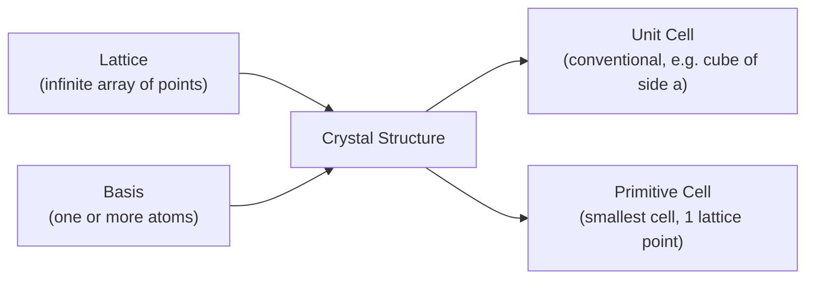

# Chapter 3: Crystal Lattices and Structures

<strong>Chapter Overview</strong> (click to expand)

This chapter introduces the geometric language used to describe crystalline solids: the infinite, repeating array of points called a crystal lattice, the unit cell and primitive cell used to describe it compactly, and the specific cubic and tetrahedral structures — simple cubic, body-centered cubic, face-centered cubic, diamond, and zincblende — that describe real semiconductor materials such as silicon, germanium, and gallium arsenide. It closes with Miller indices, the standard notation for labeling crystal planes, which underlies how silicon wafers are cut, how crystals cleave, and how devices are fabricated.

**Key Takeaways:**

1. A crystal lattice is an infinite, perfectly periodic array of points in space; a crystal structure is formed by attaching a basis (one or more atoms) to every lattice point.
2. A unit cell is a repeating volume that tiles all of space to reproduce the full lattice; a primitive cell is the smallest possible unit cell, containing exactly one lattice point.
3. The lattice constant \(a\) is the edge length of the conventional cubic unit cell and sets the fundamental length scale of a crystal — for silicon, \(a = 0.543\) nm.
4. The three cubic Bravais lattices — simple cubic (SC), body-centered cubic (BCC), and face-centered cubic (FCC) — differ in how many atoms occupy each conventional cell (1, 2, and 4 respectively) and in their coordination number and packing fraction.
5. The diamond lattice structure, formed from two interpenetrating FCC lattices offset by one quarter of the body diagonal, gives silicon and germanium their characteristic four-fold (tetrahedral) coordination, with 8 atoms per conventional cell.
6. The zincblende structure is geometrically identical to diamond but places two different atomic species on the two interpenetrating sublattices — the structure of compound semiconductors such as gallium arsenide (GaAs) — and this loss of a single atomic species also removes the inversion symmetry that pure diamond possesses.
7. Miller indices \((hkl)\) are a compact integer notation for crystal planes, found by taking the reciprocals of a plane's axis intercepts (in units of the lattice constant) and clearing fractions to the smallest integers.
8. Every structure introduced here supplies the geometric scaffold for later chapters: Chapter 4 discusses the bonding that holds these atoms in place, and Chapter 5 solves the Schrödinger equation for an electron moving through the periodic potential that this lattice geometry creates.

## Learning Objectives

By the end of this chapter, you will be able to:

- Define a crystal lattice and distinguish it from a crystal structure (lattice plus basis)
- Distinguish a unit cell from a primitive cell, and state how many lattice points each contains
- Identify the lattice constant of a cubic crystal and use it to compute interatomic distances
- Count the number of atoms per conventional unit cell for the simple cubic, body-centered cubic, and face-centered cubic structures
- State the coordination number and packing fraction of the simple cubic, body-centered cubic, and face-centered cubic structures, and derive the packing fraction of at least one from its geometric touching condition
- Describe the diamond lattice structure as two interpenetrating FCC lattices and explain why it gives four-fold (tetrahedral) coordination
- Explain how the zincblende structure differs from the diamond structure, and why that difference removes inversion symmetry
- Compute the nearest-neighbor distance in a diamond-cubic crystal from its lattice constant
- Determine the Miller indices of a crystal plane from its axis intercepts, and sketch (in words) the plane corresponding to a given set of Miller indices
- Explain why crystal planes and Miller indices matter for semiconductor device fabrication (wafer cutting, cleaving, surface orientation)
- Solve worked and practice problems combining these ideas, in preparation for the bonding and band-theory discussions of Chapters 4–6

!!! note "How to read this chapter"
    This chapter is almost entirely geometric — there is very little new physics beyond counting, symmetry, and simple trigonometry, but the *vocabulary* introduced here (lattice, basis, unit cell, primitive cell, coordination number, Miller indices) is used without re-explanation in every later chapter. Pay particular attention to the atoms-per-cell counting arguments and the packing-fraction derivations, since the same "shared atom" bookkeeping reappears whenever a new structure is introduced. The MicroSims let you rotate and inspect each structure in three dimensions — take the time to interact with them, since the mermaid flowcharts in the text intentionally do not attempt to reproduce the three-dimensional geometry.

## Introduction

Chapter 1 introduced Coulomb's law and electrostatic potential energy to describe how two charges interact, and Chapter 2 developed the Schrödinger equation to predict the allowed energies of a particle confined by a potential. Both chapters, however, worked with idealized single particles or single potential wells. Real semiconductor crystals are nothing like that: they are vast, repeating arrangements of billions of atoms, each one a nucleus surrounded by electrons, held in place by the same electrostatic forces Chapter 1 described. Before any of the quantum-mechanical machinery of Chapter 2 can be applied to a real material, the geometry of that material — exactly how its atoms are arranged in space — has to be pinned down precisely. That geometric description is the entire subject of this chapter.

A **crystal lattice** is the mathematical idealization of this repeating arrangement: an infinite, perfectly periodic array of points extending in every direction, with every point having an environment identical to every other point. A real crystal is built by attaching a **basis** — one atom, or a small group of atoms — to every point of this lattice, producing what is called a **crystal structure**. This chapter works through the specific lattices and structures most relevant to semiconductor physics: the three cubic **Bravais lattices** (simple cubic, body-centered cubic, and face-centered cubic), and the **diamond** and **zincblende** structures that describe silicon, germanium, and compound semiconductors such as gallium arsenide. Along the way, the chapter introduces the **unit cell** and **primitive cell**, the two standard ways of describing a lattice compactly, and the **lattice constant**, the single length scale that sets the size of a cubic unit cell.

Why does this geometry matter for the physics still to come? The electrostatic forces of Chapter 1 are exactly what hold these atoms in their regular, repeating positions in the first place — Chapter 4 picks up this thread directly, explaining the bonding (ionic, covalent, and metallic) that determines *why* atoms arrange themselves into these particular structures rather than some other configuration. And Chapter 5's central achievement — solving the Schrödinger equation from Chapter 2 for an electron moving through a crystal — depends entirely on the potential energy \(V(x)\) it uses being *periodic*, repeating with exactly the periodicity established by the lattice this chapter defines. Without a precise geometric description of that periodicity, the Kronig-Penney model of Chapter 5 and the energy bands of Chapter 6 would have no crystal structure to be periodic *in*. This chapter, in other words, supplies the stage on which the rest of the course's physics is performed.

The chapter closes with **Miller indices**, a compact integer notation, \((hkl)\), used to label any plane within a crystal. Miller indices are not merely bookkeeping: the plane along which a silicon wafer is cut, the direction along which a crystal cleaves, and the surface exposed during device fabrication are all specified using this notation, making it one of the most practically important tools introduced in this course.

## Concepts Covered

This chapter covers the following 11 concepts from the learning graph:

1. Crystal Lattice
2. Unit Cell
3. Primitive Cell
4. Lattice Constant
5. Simple Cubic Structure
6. Body-Centered Cubic
7. Face-Centered Cubic
8. Diamond Lattice Structure
9. Zincblende Structure
10. Miller Indices
11. Crystal Plane

## Prerequisites

This chapter builds on [Chapter 1: Physics and Math Foundations](../01-physics-math-foundations/index.md), particularly Coulomb's law and electrostatic potential energy, and on [Chapter 2: Quantum Mechanics Foundations](../02-quantum-mechanics-foundations/index.md), particularly the Schrödinger equation and the idea of a confining potential, which Chapter 5 will apply to the periodic geometry developed here.

## Crystal Lattices, Unit Cells, and the Primitive Cell

### Lattice, Basis, and Crystal Structure

A **crystal lattice** is an infinite, perfectly periodic array of points in space, defined purely by geometry: every lattice point has exactly the same surroundings as every other lattice point, and the entire array can be generated by repeatedly stepping by a small set of fixed translation vectors. A lattice by itself contains no atoms — it is a mathematical scaffold. A real crystal is produced by attaching a **basis** (one atom, for a simple element like silicon considered alone, or a small group of atoms for a compound) to every single point of the lattice. The combination is what this chapter calls a **crystal structure**:

\[
\text{Crystal Structure} = \text{Lattice} + \text{Basis}
\]

This distinction matters immediately: two crystals can share the *same* underlying lattice while looking geometrically different, simply because they attach different bases to it. The diamond and zincblende structures discussed later in this chapter are the clearest illustration — they share an identical lattice geometry but differ entirely in their basis.

### Unit Cells and the Primitive Cell

Because a lattice is infinite, it cannot be described by listing every point; instead, it is described by specifying a single repeating volume, called a **unit cell**, that tiles all of space by simple translation to reproduce the entire lattice. Many different choices of unit cell can describe the same lattice. The conventional choice for a cubic lattice is simply a cube, with edge length equal to the **lattice constant** \(a\) (discussed below) — this conventional cell is often chosen for its convenient, highly symmetric shape even when it is not the smallest possible repeating volume.

The **primitive cell** is the smallest possible unit cell: a repeating volume containing exactly **one** lattice point (counting shared points by the fraction that actually lies inside the cell), such that stacking primitive cells with no gaps and no overlaps reproduces the full lattice. For a simple cubic lattice, the conventional cell and the primitive cell happen to coincide, since a simple cubic conventional cell already contains exactly one lattice point. For body-centered and face-centered cubic lattices, however, the conventional cubic cell contains *more* than one lattice point (as the atoms-per-cell counting in the next section shows explicitly), so their true primitive cells are smaller, non-cubic shapes. This course primarily works with the conventional cubic cell, since it is far easier to visualize and count atoms within, but it is important to know that the primitive cell — by definition containing exactly one lattice point — is always the more fundamental geometric object.

### The Lattice Constant

The **lattice constant**, denoted \(a\), is the edge length of the conventional cubic unit cell — the single length scale that fixes the absolute size of a cubic crystal's repeating pattern. Lattice constants are typically a few tenths of a nanometer: silicon has \(a = 0.543\) nm, germanium has \(a = 0.566\) nm, and gallium arsenide has \(a = 0.565\) nm. Every geometric quantity discussed in this chapter — nearest-neighbor distances, packing fractions, plane spacings — is ultimately expressed as some numerical factor multiplied by \(a\).

#### Diagram: Unit Cell Repetition Explorer
<iframe src="../../sims/unit-cell-repetition-explorer/main.html" width="100%" height="760px" scrolling="auto"></iframe>

!!! tip "How to use this MicroSim"
    **Instructions:** Start at N=1 and note the single unit cell's atom pattern, then increase N to 4 and press Start to watch the block grow, cell by cell, outward from its center.

    **Learning objective:** See directly that a crystal lattice is a single unit cell repeated by translation in three dimensions.

    **What to observe:** Every cell in the block uses the identical atom pattern; only its position shifts by whole multiples of the lattice constant a.

[Full MicroSim documentation →](../../sims/unit-cell-repetition-explorer/index.md)

## Cubic Lattice Structures: SC, BCC, and FCC

### Simple Cubic (SC)

The **simple cubic structure** places one atom at each of the 8 corners of the conventional cubic cell. Because each corner atom is shared among the 8 cells that meet at that corner, only \(1/8\) of each corner atom effectively belongs to any single cell:

\[
\text{Atoms per cell (SC)} = 8 \times \frac{1}{8} = 1
\]

In the simple cubic structure, atoms touch along the cube edge, so the touching condition relates the atomic radius \(r\) directly to the lattice constant: \(2r = a\). The **coordination number** — the number of nearest neighbors surrounding any given atom — is 6 (one neighbor in each of the \(\pm x\), \(\pm y\), \(\pm z\) directions). The **packing fraction** — the fraction of the cell's volume actually occupied by atoms, treating each as a hard sphere of radius \(r\) — is derived explicitly below.

### Body-Centered Cubic (BCC)

The **body-centered cubic structure** starts from the same 8 corner atoms as the simple cubic structure, and adds one additional whole atom at the exact center of the cube (not shared with any neighboring cell):

\[
\text{Atoms per cell (BCC)} = \left(8\times\frac{1}{8}\right) + 1 = 2
\]

In BCC, the corner atoms do not touch each other along the edge; instead, the corner atoms touch the body-center atom along the cube's body diagonal, giving the touching condition \(4r = \sqrt{3}\,a\) (the body diagonal has length \(\sqrt{3}a\), and it spans four atomic radii: one radius at each end plus the full diameter of the center atom). The coordination number of BCC is 8 (each atom's nearest neighbors are the 8 atoms at the corners of the surrounding cube, or equivalently the body-center atoms of the 8 adjacent cells).

### Face-Centered Cubic (FCC)

The **face-centered cubic structure** again starts from the 8 corner atoms, and additionally places one atom at the center of each of the cube's 6 faces. Each face atom is shared between exactly 2 cells (the cell on either side of that face), contributing \(1/2\) of each face atom to a given cell:

\[
\text{Atoms per cell (FCC)} = \left(8\times\frac{1}{8}\right) + \left(6\times\frac{1}{2}\right) = 1 + 3 = 4
\]

In FCC, atoms touch along the face diagonal, giving the touching condition \(4r = \sqrt{2}\,a\) (the face diagonal has length \(\sqrt{2}a\) and spans four atomic radii, since it passes through the face-center atom). The coordination number of FCC is 12, the highest of the three cubic structures, reflecting its status as one of the two densest possible ways to pack identical spheres.

### Packing Fraction: A Worked Derivation for FCC

The **packing fraction** is the ratio of the total volume of the atoms inside a cell (treated as hard spheres) to the volume of the cell itself. For FCC, the touching condition \(4r=\sqrt2 a\) gives \(r = \sqrt2 a/4\). With 4 atoms per cell, each of volume \(\tfrac{4}{3}\pi r^3\), the packing fraction is:

\[
\text{Packing Fraction} = \frac{4\times\tfrac{4}{3}\pi r^3}{a^3} = \frac{\tfrac{16}{3}\pi\left(\dfrac{\sqrt2\,a}{4}\right)^3}{a^3} = \frac{\tfrac{16}{3}\pi\cdot\dfrac{2\sqrt2}{64}a^3}{a^3} = \frac{\pi\sqrt2}{6} \approx 0.740
\]

The same style of calculation, carried out for SC (touching condition \(2r=a\)) and BCC (touching condition \(4r=\sqrt3 a\)), gives packing fractions of approximately 0.524 and 0.680 respectively. The three results form a clear physical progression:

| Structure | Atoms/cell | Coordination number | Packing fraction |
|---|---|---|---|
| Simple Cubic (SC) | 1 | 6 | \(\pi/6 \approx 0.524\) |
| Body-Centered Cubic (BCC) | 2 | 8 | \(\sqrt3\pi/8 \approx 0.680\) |
| Face-Centered Cubic (FCC) | 4 | 12 | \(\sqrt2\pi/6 \approx 0.740\) |

Higher coordination number consistently accompanies higher packing fraction — a more densely surrounded atom fits into a more densely packed structure overall. FCC's packing fraction of about 0.740 is, along with the geometrically distinct hexagonal close-packed structure, the maximum packing fraction achievable by any arrangement of identical spheres.

#### Diagram: Crystal Structure Explorer
<iframe src="../../sims/cubic-lattice-explorer/main.html" width="100%" height="900px" scrolling="auto"></iframe>

!!! tip "How to use this MicroSim"
    **Instructions:** Select simple cubic, body-centered cubic, or face-centered cubic from the structure selector, and drag to rotate the three-dimensional view (right-drag to pan, scroll to zoom). This same tool also covers HCP, Diamond Cubic, Zinc Blende, Rock Salt, CsCl, and Wurtzite — the remaining structures introduced later in this chapter — so keep it open as you read on.

    **Learning objective:** Visualize the three cubic Bravais lattices in three dimensions, and connect the visual sharing of corner, face, and body-center atoms to the atoms-per-cell arithmetic worked out in the text.

    **What to observe:** Notice how the atoms visually "grow" in coordination as you move from SC to BCC to FCC, consistent with the increasing coordination numbers (6, 8, 12) and packing fractions (0.524, 0.680, 0.740) given in the table above.

[Full MicroSim documentation →](../../sims/cubic-lattice-explorer/index.md)

!!! question "Concept Check"
    A face-centered cubic crystal and a body-centered cubic crystal are made of atoms with the same atomic radius \(r\). Which crystal has the larger lattice constant \(a\), and why?

??? question "Concept Check — click to reveal answer"
    The FCC crystal has the larger lattice constant. From the touching conditions, \(a_{\text{BCC}} = 4r/\sqrt3 \approx 2.31r\), while \(a_{\text{FCC}} = 4r/\sqrt2 \approx 2.83r\). This may seem surprising given that FCC is the more densely packed structure, but the comparison that matters is packing efficiency, not raw cell size, since the two structures also pack different numbers of atoms into their cells. FCC has the larger conventional cell, but it packs 4 atoms into that larger cell rather than BCC's 2, giving FCC the higher overall packing fraction (0.740 versus 0.680).

## The Diamond and Zincblende Structures

### Diamond Cubic Structure

The **diamond lattice structure** is the crystal structure of silicon and germanium, and it is built from the FCC lattice already introduced, but with a two-atom basis rather than a single atom. Concretely, diamond cubic consists of **two interpenetrating FCC lattices**, with the second lattice shifted relative to the first by one quarter of the way along the cube's body diagonal, a displacement of \((1/4,\,1/4,\,1/4)a\). Counting atoms carefully (the first FCC sublattice contributes its usual 4 atoms per conventional cell, and the second, shifted FCC sublattice contributes 4 more, all fully inside the cell) gives:

\[
\text{Atoms per cell (Diamond)} = 4 + 4 = 8
\]

The defining physical feature of the diamond structure is its **coordination number of 4**: every atom sits at the center of a tetrahedron formed by its four nearest neighbors, rather than the coordination number of 12 you might expect from a close-packed FCC arrangement. This tetrahedral coordination is a direct consequence of the specific \((1/4,1/4,1/4)a\) offset between the two interpenetrating sublattices, and — as Chapter 4 explains in detail — it reflects the directional nature of the covalent bonds silicon and germanium atoms form, which strongly favor exactly four bonds arranged tetrahedrally rather than the more isotropic packing of a metallic FCC crystal.

Silicon has lattice constant \(a = 0.543\) nm. The nearest-neighbor distance in a diamond-cubic crystal — the bond length between an atom and each of its four tetrahedral neighbors — is:

\[
d = \frac{\sqrt3}{4}\,a
\]

For silicon, this gives \(d = \frac{\sqrt3}{4}(0.543\ \text{nm}) \approx 0.235\ \text{nm}\), consistent with the measured silicon-silicon bond length.

### Zincblende Structure

The **zincblende structure** is geometrically identical to diamond cubic in every respect — two interpenetrating FCC sublattices offset by \((1/4,1/4,1/4)a\), the same 8 atoms per cell, the same tetrahedral 4-fold coordination — with exactly one difference: the two sublattices are occupied by two **different** atomic species. Gallium arsenide (GaAs), for example, places gallium atoms on one FCC sublattice and arsenic atoms on the other, so that every gallium atom is tetrahedrally bonded to four arsenic neighbors and vice versa.

This single change — two species instead of one — has an important physical consequence: it destroys the **inversion symmetry** that pure diamond cubic possesses. In diamond cubic, every atom is chemically identical, so inverting the crystal through any atom (replacing every position \(\vec r\) with \(-\vec r\) relative to that atom) maps the crystal exactly onto itself. In zincblende, inverting through a gallium atom would map every neighboring arsenic atom onto a position that, in the true crystal, is occupied by gallium — the two atomic species are not interchangeable, so the symmetry operation fails. This loss of inversion symmetry is not just a mathematical curiosity: it is physically responsible for properties such as piezoelectricity that appear in compound semiconductors like GaAs but are absent in silicon and germanium.

!!! question "Concept Check"
    Silicon crystallizes in the diamond cubic structure, built from two interpenetrating FCC lattices. Why is silicon's coordination number 4 rather than the 12 you would expect from an FCC-based structure?

??? question "Concept Check — click to reveal answer"
    The coordination number of 12 applies to a single, simple FCC lattice with one atom per lattice point. Diamond cubic is not a simple FCC structure — it is two interpenetrating FCC lattices shifted by \((1/4,1/4,1/4)a\), a much larger displacement than the spacing between nearest FCC neighbors. This large offset means that each silicon atom's *nearest* neighbors are not other atoms on its own FCC sublattice (which would give coordination 12) but instead the four closest atoms on the *other*, shifted sublattice, giving the true coordination number of 4. The tetrahedral bonding preference of covalent silicon (discussed further in Chapter 4) is exactly what favors this open, lower-coordination structure over a denser close-packed alternative.

#### Diagram: Diamond and Zincblende Lattice Explorer
<iframe src="../../sims/diamond-zincblende-explorer/main.html" width="100%" height="620px" scrolling="auto"></iframe>

!!! tip "How to use this MicroSim"
    **Instructions:** Toggle between the diamond and zincblende structures, and rotate the three-dimensional view to inspect the tetrahedral bonding of a highlighted atom to its four nearest neighbors. In zincblende mode, the two atomic species are shown in different colors.

    **Learning objective:** Visualize diamond cubic as two interpenetrating FCC lattices, and see directly why each atom has exactly four nearest neighbors arranged tetrahedrally rather than the twelve neighbors of a simple FCC lattice.

    **What to observe:** In zincblende mode, notice that every atom of one color is bonded exclusively to four atoms of the other color — direct visual evidence of why zincblende, unlike diamond, has no inversion symmetry.

[Full MicroSim documentation →](../../sims/diamond-zincblende-explorer/index.md)

## Describing Crystal Planes: Miller Indices

### Finding Miller Indices from Intercepts

A **crystal plane** is any flat plane passing through a set of lattice points within a crystal — surfaces along which real crystals cleave, and along which semiconductor wafers are commonly sliced during fabrication. Because a lattice contains infinitely many parallel families of such planes, a compact, standardized notation is needed to specify exactly which family is meant. That notation is the **Miller indices**, written \((hkl)\), and found by the following procedure:

1. Find where the plane intercepts each of the three crystal axes, measured in units of the lattice constant \(a\) (for example, intercepts at \(2a\), \(1a\), and \(\infty\) along \(x\), \(y\), and \(z\) respectively — an intercept of \(\infty\) means the plane never crosses that axis, i.e., it is parallel to it).
2. Take the reciprocal of each intercept.
3. Clear any fractions by multiplying through by the smallest common integer, producing the smallest possible set of integers \(h\), \(k\), \(l\).

A Miller index of 0 in any position always signals a plane parallel to that axis, since the reciprocal of an infinite intercept is zero.

**Worked intercept example 1:** Suppose a plane intercepts the \(x\), \(y\), and \(z\) axes at \(1a\), \(1a\), and \(1a\). The reciprocals are \(1, 1, 1\) — already integers, requiring no clearing — giving Miller indices \((111)\). This is the plane that cuts diagonally across a single unit cell, touching all three axes at equal distances; in the diamond and zincblende structures, the \((111)\) planes are the planes along which those crystals most readily cleave.

**Worked intercept example 2:** Suppose a plane intercepts the \(x\) axis at \(2a\), the \(y\) axis at \(1a\), and never intercepts the \(z\) axis (it is parallel to \(z\), i.e., an intercept at \(\infty\)). The reciprocals are \(1/2,\ 1,\ 1/\infty = 0\). Clearing the fraction by multiplying through by 2 gives \(1,\ 2,\ 0\), so the Miller indices are \((120)\).

### Why Crystal Planes Matter for Devices

Miller indices are not an abstract classification exercise — they describe physically distinct surfaces with different atomic densities, different numbers of dangling (unsatisfied) bonds, and different chemical and electronic properties. Silicon wafers used in integrated-circuit fabrication are most commonly cut along the \((100)\) plane, which offers a favorable, low-defect interface for growing the silicon-dioxide layers used in transistor gates, though \((111)\)-oriented wafers are also used for certain applications. Because diamond-cubic crystals such as silicon and germanium cleave preferentially along \((111)\) planes (the planes of highest atomic density and weakest inter-plane bonding), Miller indices also predict how a crystal will fracture when cut or stressed — directly relevant to wafer dicing during chip manufacturing.

#### Diagram: Miller Indices Plane Visualizer
<iframe src="../../sims/miller-indices-explorer/main.html" width="100%" height="620px" scrolling="auto"></iframe>

!!! tip "How to use this MicroSim"
    **Instructions:** Enter or select values of \(h\), \(k\), and \(l\), and observe the corresponding plane rendered inside a cubic unit cell, along with its axis intercepts.

    **Learning objective:** Connect a set of Miller indices \((hkl)\) to the physical plane it represents, and practice converting between axis intercepts and Miller indices in both directions.

    **What to observe:** Notice that a Miller index of 0 always corresponds to a plane running parallel to that axis, and that smaller Miller indices generally correspond to planes with larger spacing and higher atomic density within the plane.

[Full MicroSim documentation →](../../sims/miller-indices-explorer/index.md)

## Summary

This chapter built the geometric vocabulary that every later chapter relies on. A crystal lattice, the infinite periodic array of points, becomes a crystal structure once a basis of one or more atoms is attached to each point, and that structure can be compactly described by a unit cell (conventionally a cube of edge length equal to the lattice constant \(a\)) or, more fundamentally, by the smallest possible primitive cell containing exactly one lattice point. The three cubic Bravais lattices — simple cubic, body-centered cubic, and face-centered cubic — were distinguished by their atoms-per-cell counts (1, 2, and 4), coordination numbers (6, 8, and 12), and packing fractions (0.524, 0.680, and 0.740), each derived from a geometric touching condition relating atomic radius to lattice constant. The diamond lattice structure, built from two interpenetrating FCC lattices offset by \((1/4,1/4,1/4)a\), explained the tetrahedral, four-fold coordination of silicon and germanium, while the zincblende structure showed that placing two different atomic species on those same two sublattices — as in gallium arsenide — preserves the geometry but removes the inversion symmetry present in pure diamond. Finally, Miller indices \((hkl)\), found by taking reciprocals of a plane's axis intercepts and clearing fractions, provided the standard notation used to specify crystal planes, directly relevant to how silicon wafers are cut and how crystals cleave during device fabrication. With this geometric foundation in place, Chapter 4 turns to the bonding forces that hold these structures together, and Chapter 5 uses the periodicity established here to solve the Schrödinger equation for an electron moving through a real crystal.

## Key Equations

| Concept | Equation |
|---|---|
| Crystal structure | Lattice + Basis |
| Atoms per cell (SC) | \(8\times\tfrac18 = 1\) |
| Atoms per cell (BCC) | \(8\times\tfrac18 + 1 = 2\) |
| Atoms per cell (FCC) | \(8\times\tfrac18 + 6\times\tfrac12 = 4\) |
| Atoms per cell (Diamond) | \(4+4=8\) |
| SC touching condition / packing fraction | \(2r=a\); \(\pi/6\approx0.524\) |
| BCC touching condition / packing fraction | \(4r=\sqrt3\,a\); \(\sqrt3\pi/8\approx0.680\) |
| FCC touching condition / packing fraction | \(4r=\sqrt2\,a\); \(\sqrt2\pi/6\approx0.740\) |
| Diamond-cubic nearest-neighbor distance | \(d = \dfrac{\sqrt3}{4}a\) |
| Miller index rule | \((hkl)\): reciprocals of axis intercepts (in units of \(a\)), cleared to smallest integers |

## Glossary

See the [Chapter 3 Glossary](glossary.md) for full definitions of every term introduced in this chapter.

## Further Reading

- Kittel, *Introduction to Solid State Physics* — the standard reference on Bravais lattices, crystal structures, and Miller indices
- Neamen, *Semiconductor Physics and Devices* — connects diamond and zincblende crystal structures directly to silicon and compound-semiconductor device physics
- Ashcroft and Mermin, *Solid State Physics* — a rigorous treatment of lattices, unit cells, and crystallographic notation
- International Union of Crystallography, *Online Dictionary of Crystallography* (dictionary.iucr.org) — an authoritative reference for Miller indices and crystallographic terminology

## Worked Examples

!!! example "Example 1 — Atoms per Cell in Simple Cubic"
    Verify that the simple cubic structure has exactly 1 atom per conventional unit cell.

    **Solution:** Simple cubic places one atom at each of the 8 corners of the cube. Each corner is shared among 8 cells that meet at that point, so each corner atom contributes \(1/8\) to any one cell: \(8\times\tfrac18 = 1\) atom per cell.

!!! example "Example 2 — Atoms per Cell in Body-Centered Cubic"
    Verify that the body-centered cubic structure has exactly 2 atoms per conventional unit cell.

    **Solution:** BCC has the same 8 corner atoms as SC, contributing \(8\times\tfrac18=1\) atom, plus one additional atom located entirely inside the cell at the body center, contributing a full atom. Total: \(1+1=2\) atoms per cell.

!!! example "Example 3 — Atoms per Cell in Face-Centered Cubic"
    Verify that the face-centered cubic structure has exactly 4 atoms per conventional unit cell.

    **Solution:** FCC has the 8 corner atoms (\(8\times\tfrac18=1\) atom) plus 6 face-center atoms, each shared between the 2 cells on either side of that face (\(6\times\tfrac12=3\) atoms). Total: \(1+3=4\) atoms per cell.

!!! example "Example 4 — Packing Fraction of Simple Cubic"
    Derive the packing fraction of the simple cubic structure.

    **Solution:** The touching condition for SC is \(2r=a\), so \(r=a/2\). With 1 atom per cell, each of volume \(\tfrac43\pi r^3\): packing fraction \(=\dfrac{1\times\tfrac43\pi r^3}{a^3} = \dfrac{\tfrac43\pi (a/2)^3}{a^3} = \dfrac{\tfrac43\pi\cdot\tfrac{1}{8}a^3}{a^3} = \dfrac{\pi}{6}\approx0.524\).

!!! example "Example 5 — Packing Fraction of Body-Centered Cubic"
    Derive the packing fraction of the body-centered cubic structure.

    **Solution:** The touching condition for BCC is \(4r=\sqrt3 a\), so \(r=\sqrt3 a/4\). With 2 atoms per cell: packing fraction \(=\dfrac{2\times\tfrac43\pi r^3}{a^3} = \dfrac{\tfrac83\pi\left(\dfrac{\sqrt3 a}{4}\right)^3}{a^3} = \dfrac{\tfrac83\pi\cdot\dfrac{3\sqrt3}{64}a^3}{a^3} = \dfrac{\sqrt3\pi}{8}\approx0.680\).

!!! example "Example 6 — Coordination Number Identification"
    A crystal structure has 8 atoms per conventional unit cell and each atom is bonded to exactly 4 nearest neighbors arranged tetrahedrally. Identify the structure.

    **Solution:** Eight atoms per cell together with four-fold tetrahedral coordination is the defining signature of the diamond lattice structure (or, if two different atomic species occupy the two sublattices, the zincblende structure) — not any of the three simple cubic Bravais lattices, all of which have coordination number 6, 8, or 12 and at most 4 atoms per cell.

!!! example "Example 7 — Silicon's Nearest-Neighbor Distance"
    Silicon has lattice constant \(a=0.543\) nm and crystallizes in the diamond cubic structure. Find the nearest-neighbor (bond) distance.

    **Solution:** \(d = \dfrac{\sqrt3}{4}a = \dfrac{1.732}{4}(0.543\ \text{nm}) = 0.433\times0.543\ \text{nm} = 0.235\ \text{nm}\).

!!! example "Example 8 — Density of Silicon from Its Crystal Structure"
    Silicon has lattice constant \(a=0.543\) nm, 8 atoms per conventional cell, and atomic mass 28.09 u. Using \(N_A=6.022\times10^{23}\ \text{mol}^{-1}\), compute silicon's mass density and compare it to the accepted value of about 2.33 g/cm\(^3\).

    **Solution:** Cell volume: \(a^3 = (0.543\times10^{-7}\ \text{cm})^3 = 1.601\times10^{-22}\ \text{cm}^3\). Mass of 8 silicon atoms: \(m = 8\times\dfrac{28.09\ \text{g/mol}}{6.022\times10^{23}\ \text{mol}^{-1}} = 8\times4.665\times10^{-23}\ \text{g} = 3.732\times10^{-22}\ \text{g}\). Density: \(\rho = m/a^3 = (3.732\times10^{-22})/(1.601\times10^{-22}) = 2.33\ \text{g/cm}^3\) — an excellent match to silicon's accepted density, confirming the diamond-cubic atom count and lattice constant.

!!! example "Example 9 — Miller Indices from Intercepts"
    A crystal plane intercepts the \(x\), \(y\), and \(z\) axes at \(1a\), \(2a\), and \(2a\) respectively. Find its Miller indices.

    **Solution:** Reciprocals: \(1/1,\ 1/2,\ 1/2\). Clearing fractions by multiplying through by 2: \(2,\ 1,\ 1\). Miller indices: \((211)\).

!!! example "Example 10 — Miller Indices for a Plane Parallel to an Axis"
    A crystal plane intercepts the \(x\) axis at \(1a\) and the \(y\) axis at \(1a\), and never intercepts the \(z\) axis. Find its Miller indices.

    **Solution:** Reciprocals: \(1/1,\ 1/1,\ 1/\infty = 0\). Already integers: Miller indices \((110)\) — a plane running parallel to the \(z\) axis.

!!! example "Example 11 — Intercepts from Miller Indices"
    A crystal plane has Miller indices \((100)\). Describe, in words, the plane it represents and its axis intercepts.

    **Solution:** Reversing the procedure, the intercepts are the reciprocals of \(h,k,l\): \(1/1=1\) along \(x\), \(1/0=\infty\) along \(y\), and \(1/0=\infty\) along \(z\). This plane crosses the \(x\) axis at exactly one lattice constant from the origin and never crosses the \(y\) or \(z\) axes — it is a plane parallel to the \(y\)-\(z\) face of the cube, the orientation commonly used for silicon wafers in device fabrication.

!!! example "Example 12 — The (111) Cleavage Plane"
    Describe the \((111)\) plane of a diamond-cubic crystal in words and explain its practical significance.

    **Solution:** The \((111)\) plane intercepts all three axes at exactly \(1a\), cutting diagonally through a unit cell so that it is equally inclined to all three crystal axes. In diamond-cubic crystals like silicon and germanium, \((111)\) planes have the highest atomic density and the weakest bonding between adjacent planes, so these are the planes along which such crystals cleave most readily — a fact used both in crystallography and during wafer dicing in semiconductor manufacturing.

!!! example "Example 13 — Comparing Packing Fractions"
    A materials engineer must choose between a BCC and an FCC arrangement of identical atoms to maximize packing density. Which should be chosen, and by what factor is the packing fraction higher?

    **Solution:** FCC has the higher packing fraction, \(\sqrt2\pi/6\approx0.740\), compared to BCC's \(\sqrt3\pi/8\approx0.680\). The ratio is \(0.740/0.680\approx1.088\), so FCC packs about 8.8% more atomic volume into the same cell volume than BCC — consistent with FCC's higher coordination number of 12 versus BCC's 8.

