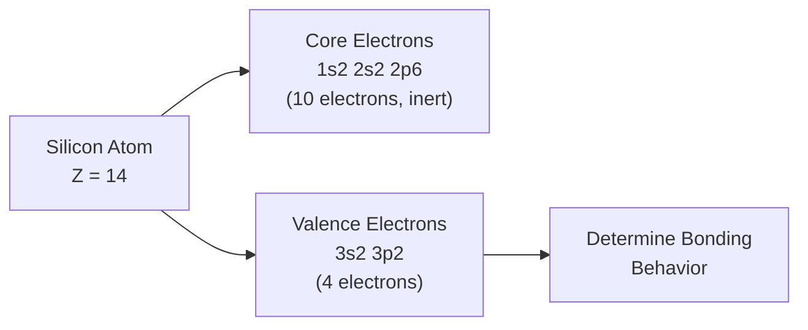
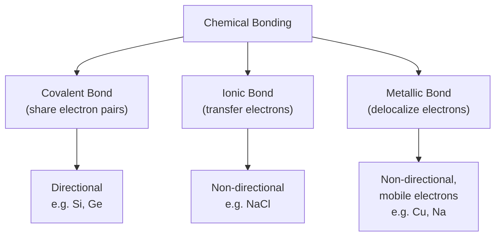
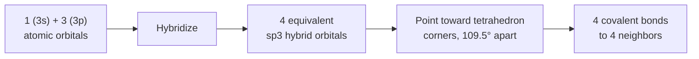
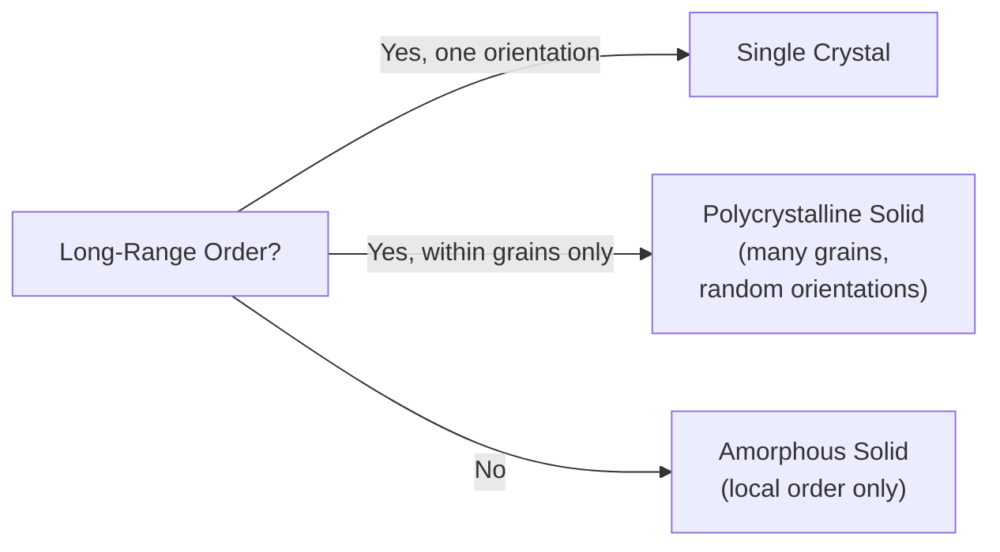

# Chapter 4: Chemical Bonding in Semiconductor Crystals

<strong>Chapter Overview</strong> (click to expand)

This chapter explains the forces that hold the crystal structures of Chapter 3 together. It starts from silicon's own electronic structure and its four valence electrons, introduces the three fundamental types of chemical bonding — covalent, ionic, and metallic — and then shows how silicon's specific bonding preference, four equivalent tetrahedral covalent bonds built from sp3 hybrid orbitals, is exactly what produces the diamond lattice structure's four-fold coordination introduced in the previous chapter. The chapter closes by acknowledging that real crystals are rarely perfect: amorphous solids have no long-range order at all, polycrystalline solids are mosaics of many small single-crystal grains, and even a single crystal contains point defects such as vacancies, interstitials, and substitutional impurities.

**Key Takeaways:**

1. Chemical bonding is the electrostatic force, ultimately governed by Coulomb's law from Chapter 1, that holds the atoms of a crystal lattice (Chapter 3) in their fixed, repeating positions.
2. Silicon (atomic number 14) has electron configuration \(1s^2\,2s^2\,2p^6\,3s^2\,3p^2\); its 10 core electrons are chemically inert, leaving exactly 4 valence electrons to participate in bonding.
3. A **covalent bond** forms when two atoms share a pair of valence electrons; it is directional and is the bond type silicon and germanium use.
4. An **ionic bond** forms when one atom transfers one or more valence electrons to another, producing oppositely charged ions held together by Coulomb attraction; it is non-directional.
5. A **metallic bond** forms when valence electrons delocalize away from their parent atoms into a shared "electron sea" surrounding fixed positive ion cores, explaining metals' electrical conductivity and malleability.
6. Silicon's 4 valence electrons undergo **sp3 hybridization**, producing 4 equivalent hybrid orbitals pointed toward the corners of a regular tetrahedron (bond angle \(109.5°\)) — this **tetrahedral bonding** is exactly what produces the diamond lattice's coordination number of 4 from Chapter 3.
7. Real crystals deviate from perfection in three distinct ways: an **amorphous solid** has no long-range periodic order at all, a **polycrystalline solid** is a mosaic of many small single-crystal grains separated by grain boundaries, and a **crystal defect** (vacancy, interstitial, or substitutional impurity) locally disrupts the periodicity of an otherwise single-crystal lattice.
8. This chapter's bonding physics answers *why* Chapter 3's structures form the way they do, and Chapter 5 depends on this chapter's single-crystal, defect-free idealization to justify solving the Schrödinger equation for a perfectly periodic potential.

## Learning Objectives

By the end of this chapter, you will be able to:

- State silicon's electron configuration and identify how many valence electrons it has available for bonding
- Distinguish covalent, ionic, and metallic bonding by their underlying electron behavior (sharing, transfer, or delocalization)
- Explain why silicon and germanium bond covalently rather than ionically or metallically, based on their valence electron count and electronegativity
- Describe the electron-sea model of metallic bonding and use it to explain electrical conductivity and malleability in metals
- Explain sp3 hybridization and use it to justify why silicon forms exactly 4 equivalent covalent bonds
- Connect tetrahedral bonding directly to the diamond lattice structure and its coordination number of 4, introduced in Chapter 3
- Distinguish an amorphous solid, a polycrystalline solid, and a single crystal by their degree of long-range order
- Identify the three basic types of point crystal defects (vacancy, interstitial, substitutional) and describe how each disrupts a perfect lattice
- Solve worked and practice problems combining these ideas, in preparation for the periodic-potential and energy-band discussions of Chapters 5–6

!!! note "How to read this chapter"
    Chapter 3 gave you the geometric vocabulary — lattice, unit cell, coordination number — to describe *where* atoms sit in a crystal. This chapter answers the question Chapter 3 deliberately left open: *why* do atoms sit exactly there, and not somewhere else? The answer is chemical bonding, and by the end of this chapter you will be able to derive Chapter 3's diamond-lattice coordination number of 4 directly from silicon's electron configuration, rather than simply accepting it as a geometric fact. Pay close attention to the sp3 hybridization discussion — it is the single idea that connects silicon's abstract quantum-mechanical electron configuration to the concrete, tangible tetrahedral shape of its crystal.

## Introduction

Chapter 3 built the entire geometric vocabulary of crystallography — lattice, basis, unit cell, coordination number — but it deliberately left one question unanswered: why do silicon atoms arrange themselves into the diamond lattice structure, with exactly 4 nearest neighbors, rather than the 12-neighbor close-packed arrangement that many other elements prefer? The geometry of Chapter 3 was simply asserted; this chapter derives it.

The answer lies in **chemical bonding**: the electrostatic forces, ultimately the same Coulomb's-law attractions and repulsions introduced in Chapter 1, by which atoms hold on to each other. Not every atom bonds the same way. Some atoms, like sodium and chlorine, form crystals by outright transferring electrons between each other, producing charged ions that attract electrostatically — this is an **ionic bond**. Some atoms, like copper and iron, release their outermost electrons into a shared, mobile "sea" that flows freely around fixed positive ion cores — this is a **metallic bond**. And some atoms, like silicon and germanium, form bonds by *sharing* pairs of electrons between specific neighboring atoms — this is a **covalent bond**. Each of these three bonding mechanisms produces crystals with different geometries and radically different physical properties: metallic bonding gives metals their conductivity and malleability, ionic bonding gives salts their brittleness and high melting points, and covalent bonding gives silicon its rigidity, its specific 4-fold coordination, and — as later chapters will show — its usefully tunable electrical conductivity.

Which bonding type a given pair of atoms chooses is set almost entirely by how many **valence electrons** — outermost-shell electrons available for bonding — each atom has, and by how strongly each atom's nucleus attracts those electrons (its electronegativity). Silicon's atomic number is 14, and working out its full electron configuration shows that exactly 4 of its 14 electrons are valence electrons available for bonding. This single number, 4, turns out to determine almost everything else in this chapter: it is why silicon bonds covalently, why each silicon atom forms exactly 4 covalent bonds, and — through a quantum-mechanical reorganization of its atomic orbitals called **sp3 hybridization** — why those 4 bonds point toward the corners of a regular tetrahedron, at the bond angle of \(109.5°\). This tetrahedral bonding preference is precisely what forces silicon into Chapter 3's diamond lattice structure, with its 4-fold coordination, rather than a denser, higher-coordination alternative.

The chapter closes by acknowledging a fact Chapter 3's idealized geometry glossed over: real crystals are rarely perfect. An **amorphous solid** has no long-range periodic order at all, even though local bonding (each atom still satisfying its preferred coordination) is largely preserved. A **polycrystalline solid** is a mosaic of many small single-crystal regions, called grains, each internally periodic but misaligned with its neighbors. And even a single, well-ordered crystal typically contains **crystal defects** — vacancies, interstitials, and substitutional impurities — that locally break the perfect periodicity Chapter 3 assumed. These imperfections matter enormously in practice: Chapter 8's discussion of doping is nothing more than the deliberate, controlled introduction of substitutional defects, and much of semiconductor device fabrication is an exercise in managing crystal defects and grain structure. Chapter 5, by contrast, will assume a perfect, defect-free single crystal, since that idealization is what makes the Schrödinger equation solvable in closed form — so it is worth being explicit, here, about exactly what that idealization leaves out.

## Concepts Covered

This chapter covers the following 9 concepts from the learning graph:

1. Covalent Bond
2. Ionic Bond
3. Metallic Bond
4. Silicon Atom Structure
5. Valence Electron
6. Tetrahedral Bonding
7. Amorphous Solid
8. Polycrystalline Solid
9. Crystal Defect

## Prerequisites

This chapter builds on [Chapter 1: Physics and Math Foundations](../01-physics-math-foundations/index.md), particularly Coulomb's law and electrostatic potential energy, which underlie every bonding mechanism discussed here, and on [Chapter 3: Crystal Lattices and Structures](../03-crystal-lattices-structures/index.md), particularly the diamond lattice structure and its coordination number of 4, which this chapter explains from first principles.

## Silicon's Electronic Structure and Valence Electrons

### Electron Configuration and the Silicon Atom

Every chemical bond ultimately involves electrons, so before discussing bonding mechanisms it helps to look closely at the electronic structure of the atom most central to this course: silicon. Silicon has atomic number 14, meaning a neutral silicon atom has 14 protons and 14 electrons. Those 14 electrons fill atomic orbitals in a specific, well-defined order, giving silicon the electron configuration:

\[
\text{Si: } 1s^2\,2s^2\,2p^6\,3s^2\,3p^2
\]

The first 10 electrons (\(1s^2\,2s^2\,2p^6\)) completely fill silicon's first and second electron shells. These **core electrons** are held tightly to the nucleus and are chemically inert — they do not participate in bonding at all. The remaining 4 electrons (\(3s^2\,3p^2\)) occupy silicon's third, outermost shell. These outermost-shell electrons are called **valence electrons**, and it is exclusively these 4 electrons that determine how silicon bonds to its neighbors.

| Atom | Atomic number | Electron configuration | Valence electrons |
|---|---|---|---|
| Sodium (Na) | 11 | \(1s^2\,2s^2\,2p^6\,3s^1\) | 1 |
| Silicon (Si) | 14 | \(1s^2\,2s^2\,2p^6\,3s^2\,3p^2\) | 4 |
| Chlorine (Cl) | 17 | \(1s^2\,2s^2\,2p^6\,3s^2\,3p^5\) | 7 |
| Copper (Cu) | 29 | \([\text{Ar}]\,3d^{10}\,4s^1\) | 1 |

Silicon's position in the periodic table — group 14 (also called group IV) — is exactly why it has 4 valence electrons: every element in a given group shares the same outermost-shell electron count, since group number in this part of the table directly tracks it. Germanium, immediately below silicon in the same group, also has exactly 4 valence electrons, which is why Chapter 3 found that germanium shares silicon's diamond lattice structure.

#### Diagram: Electron Configuration Explorer

<iframe src="../../sims/electron-configuration-explorer/main.html" width="100%" height="660px" scrolling="auto"></iframe>

!!! tip "How to use this MicroSim"
    **Instructions:** Press the "Si (Z=14)" preset button and confirm the configuration string matches \(1s^2\,2s^2\,2p^6\,3s^2\,3p^2\). Then press "Na" and "Cl" to compare their valence electron counts to silicon's.

    **Learning objective:** Determine the electron configuration of an element from its atomic number, and identify how many of its electrons are core versus valence.

    **What to observe:** The outermost ring's orange electron count is exactly the "valence electrons" number used throughout the rest of this chapter — 1 for sodium, 4 for silicon, 7 for chlorine.

[Full MicroSim documentation →](../../sims/electron-configuration-explorer/index.md)

### Why the Valence Electron Count Matters

The number of valence electrons an atom has, together with how strongly its nucleus attracts electrons (a property called electronegativity), together determine which of the three bonding mechanisms discussed in this chapter — covalent, ionic, or metallic — that atom prefers. Atoms with 1, 2, or 3 valence electrons and low electronegativity, like sodium or copper, tend to give those electrons up entirely, favoring metallic or ionic bonding. Atoms with 5, 6, or 7 valence electrons and high electronegativity, like chlorine, tend to strongly attract additional electrons, also favoring ionic bonding when paired with an electron-donating partner. Atoms with exactly 4 valence electrons, like carbon, silicon, and germanium, sit at a natural midpoint: they neither strongly attract nor strongly donate electrons, and instead satisfy their bonding requirements most efficiently by **sharing** electrons with neighboring atoms of the same or similar type — the defining behavior of a covalent bond, discussed next.

## Covalent, Ionic, and Metallic Bonding

### Covalent Bond

A **covalent bond** forms when two atoms each contribute one valence electron to a shared pair, and that shared electron pair is attracted electrostatically to both atomic nuclei simultaneously, holding the two atoms together. Unlike the bonding types discussed below, a covalent bond is inherently **directional**: it points specifically along the line connecting the two bonded nuclei, and forms only between the specific pair of atoms sharing that particular electron pair.

Silicon is the semiconductor example of central interest in this course. Each silicon atom has 4 valence electrons and needs 4 more to fill its outermost shell to a stable octet of 8. It satisfies this requirement by forming 4 separate covalent bonds, one to each of 4 neighboring silicon atoms, contributing one electron to each shared pair. Every bond therefore contains 2 shared electrons — one contributed by each of the two atoms — so that each silicon atom, counting its own 4 valence electrons plus the 4 electrons shared into its bonds from its neighbors, effectively "sees" a full octet of 8 electrons.

!!! example "Worked Example 1 — Electron Bookkeeping in Covalent Silicon"
    Verify that a silicon atom forming 4 covalent bonds satisfies the octet rule.

    **Solution:** Silicon has 4 valence electrons of its own. Each of its 4 covalent bonds is a shared electron pair, contributed one electron from silicon and one electron from its neighbor. Silicon "counts" both electrons of each of its 4 bonds toward its own octet: \(4 \text{ bonds} \times 2 \text{ electrons per bond} = 8\) electrons in silicon's local bonding environment — a filled octet, even though silicon itself only supplied 4 of those 8 electrons.

### Ionic Bond

An **ionic bond** forms when one atom transfers one or more valence electrons completely to another atom, rather than sharing them. The atom that loses an electron becomes a positively charged **cation**; the atom that gains an electron becomes a negatively charged **anion**. The resulting bond is simply the Coulomb attraction, from Chapter 1, between these two oppositely charged ions:

\[
U(r) = -\frac{e^2}{4\pi\varepsilon_0 r}
\]

where \(r\) is the separation between the ion centers. Unlike a covalent bond, an ionic bond is **non-directional** — the electrostatic attraction pulls equally in every direction around each ion, which is why ionic crystals like sodium chloride (NaCl) tend to form structures (such as the rock-salt structure) where each ion is surrounded by as many oppositely charged neighbors as geometrically possible, rather than a small, fixed number of specific bonding partners.

Sodium chloride is the standard example: sodium (1 valence electron, low electronegativity) readily gives up its single valence electron, becoming \(\text{Na}^+\), while chlorine (7 valence electrons, high electronegativity) readily accepts that electron to complete its own octet, becoming \(\text{Cl}^-\). The resulting ions attract electrostatically, forming an ionic bond.

!!! example "Worked Example 2 — Ionic Bond Formation in NaCl"
    Describe the electron transfer that produces an ionic bond between sodium and chlorine, and state the resulting charge on each ion.

    **Solution:** Sodium (\(1s^2\,2s^2\,2p^6\,3s^1\)) has 1 valence electron; transferring it away leaves a filled \(2p^6\) shell and a net charge of \(+1\), i.e. \(\text{Na}^+\). Chlorine (\(1s^2\,2s^2\,2p^6\,3s^2\,3p^5\)) has 7 valence electrons; accepting the transferred electron fills its \(3p\) subshell to \(3p^6\), giving a net charge of \(-1\), i.e. \(\text{Cl}^-\). The resulting \(\text{Na}^+\) and \(\text{Cl}^-\) ions attract via the Coulomb potential energy \(U(r) = -e^2/(4\pi\varepsilon_0 r)\).

!!! example "Worked Example 3 — Estimating an Ionic Bond Energy"
    Estimate the Coulomb potential energy, in electron-volts, between a \(\text{Na}^+\) ion and a \(\text{Cl}^-\) ion separated by \(r = 0.28\) nm (approximately their equilibrium separation in NaCl), using \(e = 1.602\times10^{-19}\) C and \(\dfrac{1}{4\pi\varepsilon_0} = 8.99\times10^9\ \text{N·m}^2/\text{C}^2\).

    **Solution:** \(U(r) = -\dfrac{(8.99\times10^9)(1.602\times10^{-19})^2}{0.28\times10^{-9}} = -8.24\times10^{-19}\ \text{J}\). Converting to electron-volts (\(1\ \text{eV} = 1.602\times10^{-19}\ \text{J}\)): \(U(r) \approx -5.1\ \text{eV}\). This large negative value — several electron-volts, much larger than typical thermal energies at room temperature (\(k_BT\approx0.026\ \text{eV}\)) — explains why ionic bonds are strong and why ionic crystals like NaCl have high melting points.

### Metallic Bond

A **metallic bond** forms when the valence electrons of every atom in a crystal delocalize away from their parent nuclei entirely, forming a shared, mobile "sea" of electrons that flows freely throughout the entire solid, surrounding a regular array of fixed, positively charged ion cores. Unlike a covalent bond's electrons, which are shared between one specific pair of atoms, or an ionic bond's electrons, which are transferred to one specific neighboring ion, the electrons in a metallic bond belong to the crystal as a whole, not to any particular atom or bond.

This **electron-sea model** directly explains two of the most characteristic properties of metals. Electrical conductivity follows because the delocalized electrons are already free to move throughout the crystal, so an applied electric field can drive them into directed motion (an electric current) with little resistance. Malleability — a metal's ability to be bent or hammered into new shapes without shattering — follows because the metallic bond has no fixed directionality: when planes of positive ion cores slide past one another under stress, the surrounding electron sea simply redistributes to maintain the bonding everywhere, rather than breaking a specific, directional bond the way a covalent or ionic crystal would.

Copper and sodium are standard examples: both have only 1 valence electron, held loosely enough (low electronegativity, small ionization energy) that it delocalizes readily into a shared electron sea across the whole crystal, rather than remaining localized in a specific covalent bond or transferring completely to a specific ionic partner.

### Comparing the Three Bonding Types

The three bonding mechanisms differ sharply in their electron behavior, directionality, and the physical properties they produce:

| Bond type | Electron behavior | Directionality | Typical properties | Example |
|---|---|---|---|---|
| Covalent | Shared between specific atom pairs | Directional | Hard, brittle, poor-to-moderate conductor (unless doped) | Si, Ge, diamond |
| Ionic | Transferred completely between atoms | Non-directional | Hard, brittle, high melting point, insulator (as a solid) | NaCl, MgO |
| Metallic | Delocalized across the entire crystal | Non-directional | Malleable, ductile, excellent conductor | Cu, Na, Fe |

!!! question "Concept Check"
    Silicon has exactly 4 valence electrons, and copper has exactly 1. Using only this valence-electron count and the ideas above, explain qualitatively why silicon bonds covalently while copper bonds metallically.

??? question "Concept Check — click to reveal answer"
    Copper's single valence electron is only loosely bound (low ionization energy), so it delocalizes easily into a shared electron sea, favoring metallic bonding, and there is no natural way for a single electron to form a *shared pair* the way a covalent bond requires. Silicon's 4 valence electrons, by contrast, are exactly the right number to form 4 shared electron-pair bonds with 4 separate neighbors, each contributing one electron per pair and together completing silicon's octet — the defining electron-sharing behavior of a covalent bond. Silicon's intermediate electronegativity (neither strongly electron-donating like sodium nor strongly electron-accepting like chlorine) further disfavors the complete electron transfer that ionic bonding would require.

## Tetrahedral Bonding and the Diamond Lattice

### sp3 Hybridization

Silicon's 4 valence electrons occupy one \(3s\) orbital (2 electrons) and two of the three \(3p\) orbitals (2 electrons), in their unbonded, isolated-atom configuration. If silicon bonded using these atomic orbitals directly, its 4 valence electrons would not be equivalent to one another, and its bonds would not point in the highly symmetric directions actually observed. Instead, when silicon forms bonds, its one \(3s\) orbital and three \(3p\) orbitals mathematically combine, or **hybridize**, into 4 new, entirely equivalent hybrid orbitals called **sp3 hybrid orbitals** (named for the one \(s\) and three \(p\) atomic orbitals that combine to produce them).

\[
1 \times (3s) + 3\times(3p) \longrightarrow 4 \times (sp^3)
\]

Each of these 4 sp3 hybrid orbitals holds exactly one of silicon's 4 valence electrons, and — critically — the 4 hybrid orbitals arrange themselves to point in the 4 directions that keep them as far apart from one another as possible, minimizing electron-electron repulsion between them. Geometrically, the arrangement that maximizes the angular separation between 4 identical directions from a common center is a **regular tetrahedron**: each sp3 orbital points toward one corner of a tetrahedron centered on the silicon nucleus, with a bond angle between any two orbitals of:

\[
\theta = \arccos\left(-\frac13\right) \approx 109.5°
\]

This is **tetrahedral bonding**: silicon's 4 valence electrons, redistributed into 4 equivalent sp3 hybrid orbitals pointing tetrahedrally, each form one covalent bond to one neighboring silicon atom, sharing an electron pair with that neighbor exactly as described in the covalent bonding section above.

### Connecting Tetrahedral Bonding to Chapter 3's Diamond Lattice

This single result — 4 equivalent sp3 orbitals pointing tetrahedrally — is exactly what Chapter 3 needed but did not explain: it is the physical, chemical reason silicon crystallizes in the diamond lattice structure with coordination number 4, rather than a close-packed metallic structure with coordination number 12. Each silicon atom's 4 tetrahedrally-arranged covalent bonds connect it to exactly 4 nearest neighbors, at exactly the bond angle and geometric arrangement that the diamond lattice structure — two interpenetrating FCC lattices offset by \((1/4,1/4,1/4)a\) — was shown in Chapter 3 to produce. Where Chapter 3 introduced this coordination number as a geometric fact to be verified by counting, this chapter derives the same number, 4, directly from silicon's electron configuration and the quantum-mechanical process of sp3 hybridization.

#### Diagram: Diamond and Zincblende Lattice Explorer

<iframe src="../../sims/diamond-zincblende-explorer/main.html" width="100%" height="620px" scrolling="auto"></iframe>

!!! tip "How to use this MicroSim"
    **Instructions:** Rotate the three-dimensional view to inspect the tetrahedral bonding of a highlighted silicon atom to its four nearest neighbors, and note the bond angle between any two of its four bonds.

    **Learning objective:** Connect this chapter's sp3-hybridization explanation of tetrahedral bonding to the diamond lattice geometry first introduced in Chapter 3, by directly visualizing the 4 tetrahedral bonds this section derives from electron configuration.

    **What to observe:** Every bond leaving a given atom makes the same \(109.5°\) angle with every other bond from that atom — direct visual confirmation of the sp3 hybridization geometry derived above.

[Full MicroSim documentation →](../../sims/diamond-zincblende-explorer/index.md)

!!! question "Concept Check"
    Explain, using sp3 hybridization, why silicon's tetrahedral bond angle is \(109.5°\) rather than the \(90°\) angle you might naively expect from three mutually perpendicular \(p\) orbitals.

??? question "Concept Check — click to reveal answer"
    If silicon bonded using its three unhybridized \(3p\) orbitals directly, those orbitals do point at roughly \(90°\) to one another, and a fourth bond from the spherical \(3s\) orbital would have no preferred direction at all. But silicon does not bond this way: its one \(3s\) and three \(3p\) orbitals mathematically combine into 4 new, entirely equivalent sp3 hybrid orbitals. Because these 4 hybrid orbitals are now identical to one another, the electron pairs in them repel each other equally in all directions, and the geometry that maximizes the angular separation between 4 identical directions from a single point is not \(90°\) at all, but the regular tetrahedron angle, \(109.5°\). The larger angle directly reduces electron-electron repulsion compared to the unhybridized \(90°\) alternative, which is why real silicon bonds are consistently observed at \(109.5°\), matching the diamond lattice geometry of Chapter 3.

!!! example "Worked Example 4 — Counting sp3 Hybrid Orbitals"
    Verify that silicon's 1 valence \(3s\) orbital and 3 valence \(3p\) orbitals produce exactly 4 sp3 hybrid orbitals, matching its coordination number of 4.

    **Solution:** Hybridization combines atomic orbitals without changing their total count: \(1\ (3s) + 3\ (3p) = 4\) orbitals in, and \(4\) equivalent sp3 hybrid orbitals out. Each hybrid orbital forms one covalent bond, so silicon forms exactly 4 bonds — matching the diamond lattice's coordination number of 4 from Chapter 3.

!!! example "Worked Example 5 — Verifying the Tetrahedral Bond Angle"
    Confirm that \(\arccos(-1/3)\) gives the tetrahedral bond angle of approximately \(109.5°\).

    **Solution:** \(\arccos(-1/3) = \arccos(-0.3333)\). Using a calculator (or the known regular-tetrahedron result), this evaluates to \(109.47°\), consistent with the commonly quoted tetrahedral bond angle of \(109.5°\) used throughout this chapter and confirmed by the MicroSim above.

!!! example "Worked Example 6 — Classifying an Unknown Bond"
    An unknown solid is malleable, conducts electricity well even without any impurities, and has no fixed, specific bonding directions between neighboring atoms. Classify its bonding type.

    **Solution:** Malleability without brittleness, good intrinsic conductivity, and non-directional bonding are the defining signatures of the electron-sea model of metallic bonding — not covalent bonding (which is directional and, for silicon, requires impurities/doping to conduct well) or ionic bonding (which is non-directional but brittle and, as a solid, insulating).

## Beyond the Perfect Crystal: Amorphous, Polycrystalline, and Defective Solids

### Amorphous Solids

Every structure discussed in Chapter 3 — simple cubic, BCC, FCC, diamond, zincblende — assumed **long-range order**: a single, perfectly repeating pattern extending, in principle, throughout the entire crystal. Real solids do not always achieve this. An **amorphous solid** is a solid in which atoms are bonded to their immediate neighbors in roughly the same local arrangement a crystal would prefer (silicon atoms in amorphous silicon are still mostly 4-fold coordinated, for instance), but with no long-range periodic order extending beyond a few atomic spacings — bond lengths and bond angles vary randomly from one local region to the next, so the pattern never repeats exactly.

Amorphous silicon (a-Si) is an important practical example: it can be deposited as a thin film far more cheaply than growing a single crystal, and is widely used in thin-film solar cells and older flat-panel displays, at some cost in electronic performance compared to single-crystal silicon, precisely because the lack of long-range order disrupts the clean, periodic potential that Chapter 5's energy-band theory will assume.

### Polycrystalline Solids

A **polycrystalline solid** occupies a middle ground between a perfect single crystal and a fully amorphous solid: it consists of many small regions, called **grains**, each of which is internally a perfect, periodic single crystal (with the structure and bonding described throughout this chapter), but each grain is oriented at a different, essentially random angle relative to its neighbors. The boundaries between adjacent grains, called **grain boundaries**, are thin regions of disorder where the periodic lattice of one grain must somehow transition into the differently-oriented periodic lattice of its neighbor.

Polycrystalline silicon ("polysilicon") is another practically important material, widely used for gate electrodes and interconnects in integrated-circuit fabrication; its many grain boundaries scatter charge carriers and generally degrade electronic performance compared to single-crystal silicon, which is exactly why the silicon wafers used for the active transistor regions of a chip are grown as large single crystals rather than polycrystalline material.

### Crystal Defects

Even a single, large, well-ordered crystal is never perfectly periodic at the atomic scale. A **crystal defect** is any local disruption of the ideal, perfectly periodic lattice structure described in Chapter 3. The simplest defects are **point defects**, which involve a single lattice site:

| Defect type | Description |
|---|---|
| Vacancy | A lattice site where an atom is simply missing |
| Interstitial | An extra atom squeezed into a space between regular lattice sites |
| Substitutional | A foreign atom occupying a regular lattice site in place of the host atom |

Crystal defects are not always undesirable. A substitutional defect, in particular, is the basis of essentially all practical semiconductor devices: Chapter 8's discussion of **doping** is nothing more than the deliberate, controlled introduction of substitutional impurity atoms (such as phosphorus or boron substituting for silicon) to precisely engineer a semiconductor's electrical conductivity — a substitutional defect turned into the single most important tool in semiconductor device engineering.

!!! question "Concept Check"
    Amorphous silicon has no long-range periodic order at all, yet it is still used commercially in thin-film solar cells. Why might a material with no long-range order still function as a usable semiconductor?

??? question "Concept Check — click to reveal answer"
    Amorphous silicon still preserves most of its *local* bonding environment — each silicon atom is still approximately 4-fold, tetrahedrally coordinated to its immediate neighbors, satisfying the same sp3-hybridization bonding preference derived earlier in this chapter, even though that local order does not repeat periodically over long distances. Since basic semiconducting behavior depends heavily on this short-range bonding environment, amorphous silicon can still absorb light and generate charge carriers reasonably well, which is sufficient for lower-cost applications like thin-film solar cells, even though the loss of long-range periodicity degrades the carrier mobility and overall efficiency compared to single-crystal silicon.

#### Diagram: Bonding and Crystal Order Explorer

<iframe src="../../sims/bonding-crystal-order-explorer/main.html" width="100%" height="640px" scrolling="auto"></iframe>

!!! tip "How to use this MicroSim"
    **Instructions:** Use the "View" dropdown to switch between "Bond Types" (covalent, ionic, metallic) and "Crystal Order" (single crystal, polycrystalline, amorphous). In Crystal Order view, toggle "Show defects" to inject vacancy, interstitial, and substitutional point defects into the single-crystal lattice.

    **Learning objective:** Visually compare the electron behavior of the three bonding types side by side, and directly compare long-range order across a single crystal, a polycrystalline mosaic of grains, and an amorphous arrangement.

    **What to observe:** Notice that grain boundaries in the polycrystalline view are exactly the regions where two differently-oriented periodic grids meet, and that even the "defect-free" single-crystal view becomes visibly disrupted the moment a vacancy, interstitial, or substitutional defect is toggled on.

[Full MicroSim documentation →](../../sims/bonding-crystal-order-explorer/index.md)

!!! example "Worked Example 7 — Classifying a Point Defect"
    A silicon crystal has one lattice site where a phosphorus atom sits in place of a silicon atom. Classify this defect.

    **Solution:** A foreign atom (phosphorus) occupying a regular lattice site normally held by the host atom (silicon) is, by definition, a **substitutional** defect — the same type of defect deliberately introduced during doping, discussed further in Chapter 8.

!!! example "Worked Example 8 — Classifying a Second Point Defect"
    A silicon crystal has one lattice site with no atom present at all, while all of its neighboring sites are correctly occupied. Classify this defect.

    **Solution:** A missing atom at an otherwise regular lattice site is, by definition, a **vacancy** defect.

!!! example "Worked Example 9 — Single Crystal vs. Polycrystalline vs. Amorphous"
    A materials engineer examines three silicon samples under a microscope. Sample A shows one continuous, uniformly oriented atomic pattern throughout. Sample B shows many small regions, each internally uniform, but oriented at different angles from one region to the next, separated by visible boundaries. Sample C shows no repeating pattern at any scale beyond a few atomic spacings. Classify each sample.

    **Solution:** Sample A is a **single crystal** (one orientation, long-range order throughout). Sample B is **polycrystalline** (many grains, each internally ordered, but randomly oriented relative to one another, separated by grain boundaries). Sample C is **amorphous** (no long-range periodic order).

## Summary

This chapter explained the chemical bonding forces that hold Chapter 3's crystal structures together. Silicon's electron configuration, \(1s^2\,2s^2\,2p^6\,3s^2\,3p^2\), gives it exactly 4 valence electrons, the single number that determines its entire bonding behavior. Of the three fundamental bonding types — covalent bonding (sharing electron pairs, directional, e.g. Si, Ge), ionic bonding (transferring electrons completely, non-directional, e.g. NaCl), and metallic bonding (delocalizing electrons into a shared sea, non-directional, e.g. Cu, Na) — silicon's 4 valence electrons and intermediate electronegativity favor covalent bonding specifically. Those 4 valence electrons undergo sp3 hybridization, combining silicon's one \(3s\) and three \(3p\) orbitals into 4 equivalent hybrid orbitals pointing tetrahedrally, at a bond angle of \(109.5°\) — this tetrahedral bonding is the chemical, first-principles explanation for the diamond lattice structure's coordination number of 4 that Chapter 3 introduced only geometrically. Finally, the chapter acknowledged that real crystals deviate from Chapter 3's perfect periodic idealization in three ways: amorphous solids lack long-range order entirely, polycrystalline solids are mosaics of misaligned single-crystal grains, and even a single crystal contains point defects (vacancies, interstitials, and substitutional impurities) — the last of which becomes, in Chapter 8, the deliberate engineering tool of doping. With bonding now explained, Chapter 5 turns to solving the Schrödinger equation for an electron moving through the periodic potential that this bonding-derived lattice geometry creates.

## Key Equations

| Concept | Equation |
|---|---|
| Silicon electron configuration | \(1s^2\,2s^2\,2p^6\,3s^2\,3p^2\) |
| Silicon valence electrons | 4 (from \(3s^2\,3p^2\)) |
| Ionic bond (Coulomb) energy | \(U(r) = -\dfrac{e^2}{4\pi\varepsilon_0 r}\) |
| sp3 hybridization | \(1\,(3s) + 3\,(3p) \rightarrow 4\,(sp^3)\) |
| Tetrahedral bond angle | \(\theta = \arccos(-\tfrac13) \approx 109.5°\) |
| Diamond-cubic nearest-neighbor distance (Ch. 3) | \(d = \dfrac{\sqrt3}{4}a\) |

## Glossary

See the [Chapter 4 Glossary](glossary.md) for full definitions of every term introduced in this chapter.

## Further Reading

- Neamen, *Semiconductor Physics and Devices* — connects silicon's bonding and electron configuration directly to its use as a semiconductor
- Kittel, *Introduction to Solid State Physics* — a rigorous treatment of covalent, ionic, and metallic bonding in crystalline solids
- Callister, *Materials Science and Engineering: An Introduction* — a thorough treatment of bonding types, hybridization, and crystal defects
- Ashcroft and Mermin, *Solid State Physics* — advanced treatment of cohesive energy and bonding in crystals

## Worked Examples

!!! example "Example 10 — Comparing Bond Strength Signatures"
    Rank covalent, ionic, and metallic bonds by which is most likely to produce a brittle solid versus a malleable one, and explain why.

    **Solution:** Covalent and ionic bonds are both directional or fixed in their electrostatic geometry; when stressed enough to shift atoms out of position, these bonds break outright rather than reforming, producing brittleness (characteristic of both silicon/diamond and NaCl). Metallic bonds have no fixed directionality — the electron sea simply redistributes as ion cores slide past one another — so metals are typically malleable rather than brittle.

!!! example "Example 11 — Predicting Bond Type from Valence Electrons"
    An element has 6 valence electrons and high electronegativity. Predict whether it is more likely to form covalent, ionic, or metallic bonds with a low-electronegativity metal partner, and explain why.

    **Solution:** With 6 valence electrons, this element needs only 2 more to complete an octet, and its high electronegativity means it strongly attracts additional electrons rather than donating its own. Paired with a low-electronegativity metal (which readily gives up electrons), the most likely outcome is an **ionic bond**, with the metal donating electrons and this element accepting them to complete its octet — the same logic that produces NaCl from sodium and chlorine.

!!! example "Example 12 — Total Shared Electrons in a Silicon Crystal Fragment"
    A small fragment of a silicon crystal contains 6 interior silicon atoms, each fully bonded to 4 neighbors within the fragment. How many covalent bonds, and how many total shared electrons, does this fragment contain? (Assume every bond is fully contained within the fragment, so no bonds are double-counted at the boundary.)

    **Solution:** Each of the 6 atoms forms 4 bonds, giving \(6\times4=24\) bond-ends; since each bond has two ends (one at each atom it connects), the number of distinct bonds is \(24/2=12\). Each bond shares 2 electrons, so the total number of shared electrons is \(12\times2=24\).

