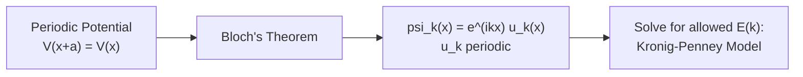
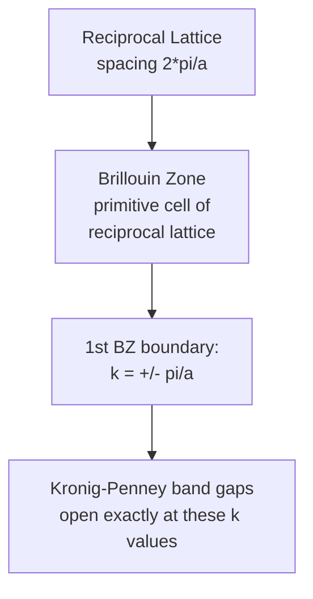

# Chapter 5: Quantum Mechanics of Periodic Crystals

<strong>Chapter Overview</strong> (click to expand)

This chapter solves the Schrödinger equation, introduced in Chapter 2, for an electron moving through the periodic potential created by the crystal lattice and chemical bonding of Chapters 3 and 4. Bloch's theorem shows that the solutions must take a specific wavelike form, and the Kronig-Penney model — a simplified but exactly solvable periodic potential — shows explicitly how this periodicity forces electron energies to split into continuous allowed bands separated by forbidden band gaps. Along the way, the chapter introduces the reciprocal lattice and Brillouin zone, the standard mathematical tools used to describe a crystal's periodicity in momentum space, and shows that band gaps open precisely at Brillouin zone boundaries.

**Key Takeaways:**

1. Chapter 4's chemical bonding produces the periodic lattice of Chapter 3; this periodicity means an electron in a crystal experiences a periodic potential energy \(V(x+a) = V(x)\), not the isolated, localized potentials of Chapter 2.
2. **Bloch's theorem** states that the Schrödinger equation's solutions in any periodic potential must take the form \(\psi_k(x) = e^{ikx}u_k(x)\), where \(u_k(x)\) has the same periodicity as the lattice — a traveling wave modulated by a periodic function.
3. The **Kronig-Penney model** — a periodic array of finite square barriers — is a simplified periodic potential that can be solved exactly, producing a transcendental equation relating energy \(E\) to a wavevector \(k\).
4. Because the Kronig-Penney transcendental equation requires \(\cos(ka)\), a quantity restricted to \([-1,1]\), certain ranges of energy \(E\) have no valid solution at all — these forbidden ranges are **band gaps**, while the ranges that do have solutions are continuous **energy bands** of **allowed energy states**.
5. The **reciprocal lattice** is a lattice in "k-space" (or momentum space) that describes a crystal's periodicity in the same natural units used by Bloch's theorem's wavevector \(k\); it is mathematically derived from, but geometrically distinct from, the real-space lattice of Chapter 3.
6. The **Brillouin zone** is the primitive cell of the reciprocal lattice; the Kronig-Penney model's band gaps open precisely at the Brillouin zone boundaries, \(k=\pm n\pi/a\), giving reciprocal-space meaning to where bands split.
7. Solving the periodic-potential problem is called **band formation**; the resulting bands are conventionally labeled by function — the highest band fully occupied by electrons at absolute zero is the **valence band**, and the next-higher, largely empty band is the **conduction band**.
8. This chapter's band-formation physics is the foundation for Chapter 6's direct treatment of band structure, effective mass, and density of states, and ultimately for Chapter 7's classification of materials as insulators, semiconductors, or conductors based on the size of the band gap between these two bands.

## Learning Objectives

By the end of this chapter, you will be able to:

- Explain why an electron in a crystal experiences a periodic potential, and why this periodicity requires new mathematics beyond Chapter 2's isolated potential wells
- State Bloch's theorem and interpret the meaning of the Bloch wavevector \(k\) and the periodic function \(u_k(x)\)
- Describe the Kronig-Penney model's periodic potential and set up its solution using the boundary conditions at each barrier
- Explain, using the Kronig-Penney transcendental equation, why certain energy ranges are allowed and others forbidden
- Define the reciprocal lattice and compute reciprocal lattice vectors from a set of real-space lattice vectors
- Define the Brillouin zone as the primitive cell of the reciprocal lattice, and identify the first Brillouin zone boundary for a 1D lattice
- Connect the location of band gaps directly to the Brillouin zone boundaries
- Distinguish an energy band, a band gap, and the allowed and forbidden energy states within them
- Distinguish the valence band from the conduction band and state which is higher in energy
- Solve worked and practice problems combining these ideas, in preparation for the effective-mass and density-of-states discussions of Chapter 6

!!! note "How to read this chapter"
    This chapter is mathematically the most demanding one so far, but its central physical idea is simple: periodicity forces energy into bands. Chapters 3 and 4 explained *where* atoms sit and *why* they bond the way they do; this chapter finally asks what that arrangement does to an electron's allowed energies. The Kronig-Penney model is worked through in enough detail to see exactly how the band structure emerges mathematically, but you are not expected to reproduce every algebraic step from memory — focus instead on the qualitative shape of the result (bands separated by gaps, gaps at zone boundaries) since that shape, not the specific transcendental equation, is what every later chapter relies on.

## Introduction

Chapter 2 solved the Schrödinger equation for isolated, idealized potentials — a single infinite well, a single finite well, a single barrier. Chapter 3 then described the precise geometric arrangement of atoms in a real crystal, and Chapter 4 explained the chemical bonding forces that hold those atoms in that arrangement. Putting these threads together, an electron moving through an actual crystal does not see an isolated potential at all: it sees the electrostatic potential energy of *every* atomic core in the lattice, repeating with exactly the periodicity Chapter 3 established. This chapter solves the Schrödinger equation for exactly this situation — a **periodic potential**, \(V(x+a)=V(x)\), where \(a\) is the lattice constant — and shows that the result is qualitatively different from anything in Chapter 2.

The key mathematical tool is **Bloch's theorem**, which shows that *any* solution to the Schrödinger equation in a periodic potential must take a specific form: a traveling wave, \(e^{ikx}\), multiplied by a function \(u_k(x)\) that repeats with the same periodicity as the lattice itself. This theorem does not, by itself, solve for the allowed energies — it only constrains the *form* the solution must take. To actually compute allowed energies, this chapter uses the **Kronig-Penney model**, a periodic potential simple enough (a repeating series of finite rectangular barriers) to solve exactly. The Kronig-Penney model's solution takes the form of a transcendental equation, and the key discovery is that this equation can only be satisfied for certain ranges of energy \(E\) — other ranges are mathematically forbidden entirely. The allowed ranges are called **energy bands**, and the forbidden ranges between them are called **band gaps**. This splitting of continuous free-particle energy into bands and gaps, called **band formation**, is the single most important result of this chapter, and the physical basis for every subsequent chapter's treatment of semiconductors.

Describing exactly *where* these bands and gaps occur requires one more set of tools: the **reciprocal lattice** and the **Brillouin zone**. Bloch's theorem describes solutions using the wavevector \(k\), which has units of inverse length — the same units used to describe a crystal's periodicity in "k-space," or momentum space. The reciprocal lattice is precisely this k-space description of a crystal's periodicity, constructed mathematically from the real-space lattice vectors of Chapter 3 but generally different in geometry from the real lattice itself. The **Brillouin zone** is the primitive cell of this reciprocal lattice — the k-space analog of Chapter 3's primitive cell — and this chapter's central geometric result is that the Kronig-Penney model's band gaps open exactly at the Brillouin zone boundaries.

Finally, the chapter introduces the terminology used to describe the resulting bands: at absolute zero temperature, electrons fill the lowest available energy bands first, so the highest band that ends up completely full is called the **valence band**, and the next band up — typically empty at absolute zero — is called the **conduction band**. Whether a material behaves as an insulator, a semiconductor, or a conductor turns out to depend almost entirely on the size of the band gap separating these two bands, and on whether any band is only partially filled — the subject of Chapter 7.

## Concepts Covered

This chapter covers the following 12 concepts from the learning graph:

1. Bloch Theorem
2. Periodic Potential
3. Kronig-Penney Model
4. Brillouin Zone
5. Reciprocal Lattice
6. Energy Band
7. Band Gap
8. Forbidden Energy Gap
9. Valence Band
10. Conduction Band
11. Allowed Energy States
12. Band Formation

## Prerequisites

This chapter builds on [Chapter 2: Quantum Mechanics Foundations](../02-quantum-mechanics-foundations/index.md), particularly the Schrödinger equation, wavefunctions, and eigenvalues, and on [Chapter 3: Crystal Lattices and Structures](../03-crystal-lattices-structures/index.md), particularly the lattice constant and the periodic geometric arrangement of atoms that gives rise to the periodic potential this chapter solves.

## The Periodic Potential and Bloch's Theorem

### Why a Crystal's Potential Is Periodic

Chapter 2's Schrödinger equation, \(-\frac{\hbar^2}{2m}\frac{d^2\psi}{dx^2}+V(x)\psi=E\psi\), was solved there for potentials \(V(x)\) describing a single isolated feature: one infinite wall, one finite well, one barrier. A real crystal is nothing like this. Chapter 3 showed that a crystal is an essentially infinite, perfectly periodic arrangement of atoms, spaced by the lattice constant \(a\); Chapter 4 showed that each of those atoms holds onto its electrons, and bonds to its neighbors, through electrostatic forces identical in kind to the ones that create any atomic potential well. An electron moving through this crystal therefore experiences the combined electrostatic potential of every atomic core in the lattice, and because the lattice itself is periodic, so is this potential energy function:

\[
V(x+a) = V(x)
\]

This single equation is the starting point for the entire chapter: whatever solves the Schrödinger equation in a crystal must do so subject to this periodicity constraint, a fundamentally different requirement from any potential solved in Chapter 2.

### Bloch's Theorem

**Bloch's theorem** states that any solution to the Schrödinger equation for a periodic potential satisfying \(V(x+a)=V(x)\) must take the form:

\[
\psi_k(x) = e^{ikx}\,u_k(x), \qquad u_k(x+a) = u_k(x)
\]

That is, the wavefunction is a plane wave \(e^{ikx}\) (a traveling wave, similar in form to the free-particle wavefunctions encountered in Chapter 2's discussion of wave packets) multiplied by a function \(u_k(x)\) that repeats with exactly the same periodicity as the lattice itself. The quantity \(k\) is called the **Bloch wavevector**, and \(\hbar k\) is often called the electron's **crystal momentum** — it behaves like momentum in many respects (it appears in group-velocity and semiclassical equations of motion used in later chapters) but, unlike true momentum, it is only meaningful modulo a reciprocal lattice vector, a subtlety this chapter returns to once the reciprocal lattice has been defined.

Bloch's theorem is powerful but incomplete on its own: it constrains the *form* of every solution, but it does not by itself say which energies \(E\) are actually achievable. To answer that question — the central question of this chapter — requires an explicit, solvable periodic potential, which is exactly what the Kronig-Penney model provides.

## The Kronig-Penney Model

### Setting Up a Solvable Periodic Potential

The **Kronig-Penney model** replaces the true, complicated periodic potential of a real crystal with the simplest periodic potential that can still be solved exactly: an infinite, repeating series of rectangular potential barriers, each of height \(V_0\) and width \(b\), separated by wells of width \(a-b\) where the electron moves freely. This is a direct periodic-potential analog of the finite potential well Chapter 2 already solved, repeated infinitely with period \(a\).

Inside each well, the electron's wavefunction is an oscillating solution (as in the free regions of Chapter 2's finite well), and inside each barrier, the wavefunction is an exponentially decaying/growing solution (as in Chapter 2's quantum tunneling discussion) — the difference here is that Bloch's theorem must additionally be imposed at the boundary between neighboring periods, linking the solution in one cell to the solution in the next via the factor \(e^{ika}\).

### The Kronig-Penney Transcendental Equation

Applying the wavefunction and derivative continuity conditions at each boundary, together with Bloch's theorem's periodicity requirement, produces the model's central result — a single transcendental equation relating the electron's energy (through a wavenumber \(\alpha=\sqrt{2mE}/\hbar\) inside the wells) to the Bloch wavevector \(k\):

\[
P\,\frac{\sin(\alpha a)}{\alpha a} + \cos(\alpha a) = \cos(ka)
\]

where \(P\) is a dimensionless constant proportional to the barrier strength (increasing with barrier height \(V_0\) and width \(b\)), often written \(P = m V_0 b a/\hbar^2\) in the idealized limit of thin, tall barriers (\(b\to0\), \(V_0\to\infty\), with \(V_0 b\) held fixed). This equation is the mathematical heart of the entire chapter, and its structure is what produces band formation, explained next.

### Why Certain Energies Are Forbidden

The right-hand side of the transcendental equation, \(\cos(ka)\), is a cosine of a real number, and therefore can only ever take values between \(-1\) and \(+1\). The left-hand side, however, is a specific function of energy \(E\) (through \(\alpha\)) that is *not* restricted to this range — for many values of \(\alpha a\), the left-hand side evaluates to something greater than \(+1\) or less than \(-1\). Whenever this happens, there is **no real value of \(k\)** that can satisfy the equation, because no real \(k\) produces a cosine outside \([-1,1]\). That range of energy is therefore physically forbidden to the electron — a **band gap**, or **forbidden energy gap**. Wherever the left-hand side does fall within \([-1,1]\), a real \(k\) exists, and — because \(k\) can vary continuously within this range — that range of energy forms a continuous **energy band** of **allowed energy states**. This alternating pattern of bands and gaps, repeating as energy increases, is what this chapter calls **band formation**.

!!! question "Concept Check"
    In the limit \(P \to 0\) (very weak or vanishing barriers), the Kronig-Penney transcendental equation reduces to \(\cos(\alpha a) = \cos(ka)\), which has a solution \(k=\alpha\) for every value of \(\alpha\). What does this limit physically represent, and are there any band gaps in it?

??? question "Concept Check — click to reveal answer"
    As \(P\to0\), the barriers vanish and the periodic potential becomes flat — the electron is simply a free particle. In this limit, every energy \(E=\hbar^2\alpha^2/2m\) is achievable for some real \(k\), so there are no forbidden gaps at all: the allowed energies form one continuous band, exactly like a free particle's continuous energy spectrum. Band gaps only appear once \(P>0\), confirming that the periodic potential itself — not some separate effect — is the direct cause of band formation.

#### Diagram: Kronig-Penney Band Formation Explorer

<iframe src="../../sims/kronig-penney-band-explorer/main.html" width="100%" height="660px" scrolling="auto"></iframe>

!!! tip "How to use this MicroSim"
    **Instructions:** Drag the barrier-strength slider \(P\) from 0 upward and watch the left-hand-side curve of the transcendental equation develop regions that exceed \(\pm1\) — these shaded regions are the forbidden band gaps. Switch to the "E-k Diagram" view to see the corresponding allowed bands and gaps plotted directly against the Bloch wavevector \(k\), with the first few Brillouin zone boundaries marked.

    **Learning objective:** Connect the algebraic restriction \(|\cos(ka)|\leq1\) directly to the physical appearance of band gaps, and see those gaps appear at the Brillouin zone boundaries \(k=\pm n\pi/a\).

    **What to observe:** At \(P=0\) there are no shaded forbidden regions at all (the free-electron limit from the Concept Check above); as \(P\) increases, the gaps widen and the allowed bands narrow, and every gap is centered exactly on a Brillouin zone boundary.

[Full MicroSim documentation →](../../sims/kronig-penney-band-explorer/index.md)

## The Reciprocal Lattice

### Definition and Construction

To describe *where* in \(k\)-space the Kronig-Penney model's bands and gaps occur, it is useful to define a lattice not in real space but in the space of wavevectors \(k\) — this is the **reciprocal lattice**. Given a set of real-space primitive lattice vectors \(\vec a_1, \vec a_2, \vec a_3\) (Chapter 3), the reciprocal lattice vectors \(\vec b_1, \vec b_2, \vec b_3\) are defined by the orthogonality condition:

\[
\vec a_i \cdot \vec b_j = 2\pi\,\delta_{ij}
\]

where \(\delta_{ij}\) is 1 if \(i=j\) and 0 otherwise. In one dimension, this reduces to a single, simple relationship: for a 1D chain with real-space lattice constant \(a\), the reciprocal lattice is itself a 1D lattice of points spaced by \(2\pi/a\). This spacing, \(2\pi/a\), is exactly the periodicity that appears throughout the Kronig-Penney analysis (for instance, in the location of the band gaps, discussed below).

The reciprocal lattice of a three-dimensional crystal is generally *not* geometrically identical to its real-space lattice. A well-known result, useful for connecting back to Chapter 3, is that the reciprocal lattice of an FCC (face-centered cubic) real-space lattice is a BCC (body-centered cubic) lattice, and vice versa — while the reciprocal lattice of a simple cubic lattice with constant \(a\) is itself simple cubic, with constant \(2\pi/a\).

| Real-space lattice (Ch. 3) | Reciprocal lattice |
|---|---|
| Simple Cubic, constant \(a\) | Simple Cubic, constant \(2\pi/a\) |
| Face-Centered Cubic (FCC) | Body-Centered Cubic (BCC) |
| Body-Centered Cubic (BCC) | Face-Centered Cubic (FCC) |

### Reciprocal Lattice Vectors and Diffraction Notation

Reciprocal lattice vectors are also exactly the vectors used to index the Miller-index planes of Chapter 3: a reciprocal lattice vector \(\vec G_{hkl} = h\vec b_1 + k\vec b_2 + l\vec b_3\) points perpendicular to the real-space \((hkl)\) crystal plane, with magnitude inversely proportional to the spacing between adjacent \((hkl)\) planes — a direct, practically important link between the real-space crystallography of Chapter 3 and the momentum-space description this chapter introduces.

!!! example "Worked Example 1 — Reciprocal Lattice Spacing"
    A 1D chain of atoms has lattice constant \(a = 0.30\) nm. Find the spacing of its reciprocal lattice.

    **Solution:** The reciprocal lattice spacing is \(2\pi/a = 2\pi/(0.30\times10^{-9}\ \text{m}) \approx 2.09\times10^{10}\ \text{m}^{-1}\).

## The Brillouin Zone

### Definition

The **Brillouin zone** is defined as the primitive cell of the reciprocal lattice — the k-space analog of Chapter 3's primitive cell, constructed by the same Wigner-Seitz procedure (the region of k-space closer to a given reciprocal lattice point than to any other). The **first Brillouin zone** is this primitive cell centered on \(k=0\); for a 1D chain of lattice constant \(a\), the first Brillouin zone is simply the interval:

\[
-\frac{\pi}{a} \leq k \leq \frac{\pi}{a}
\]

Because the reciprocal lattice has spacing \(2\pi/a\), the first Brillouin zone boundary sits at exactly half that spacing, \(\pi/a\), on either side of the origin — directly analogous to how a 1D real-space Wigner-Seitz cell extends half a lattice constant on either side of a lattice point.

### Band Gaps Open at the Brillouin Zone Boundary

The chapter's central geometric result connects the Kronig-Penney model directly to the Brillouin zone: solving the Kronig-Penney transcendental equation in detail shows that the forbidden energy gaps occur precisely at the values \(k = \pm n\pi/a\) for integer \(n\) — exactly the Brillouin zone boundaries (the first Brillouin zone boundary at \(n=1\), the second at \(n=2\), and so on). This is not a coincidence: at these special \(k\) values, the electron's wave reflects constructively off the periodic lattice (an effect closely related to the Bragg-type reflection condition for waves in a periodic medium), and this standing-wave condition is exactly what opens an energy gap. Physically, this means the reciprocal lattice and Brillouin zone are not just bookkeeping devices — they directly predict *where* in k-space a real crystal's band gaps will appear.

#### Diagram: Reciprocal Lattice and Brillouin Zone Explorer

<iframe src="../../sims/reciprocal-lattice-brillouin-zone-explorer/main.html" width="100%" height="660px" scrolling="auto"></iframe>

!!! tip "How to use this MicroSim"
    **Instructions:** Use the "View" dropdown to switch between "Real vs. Reciprocal Lattice" (compare a real-space lattice to its reciprocal lattice side by side, for SC, BCC, and FCC) and "Brillouin Zone" (see the first Brillouin zone constructed as the Wigner-Seitz cell of the 2D reciprocal lattice).

    **Learning objective:** Connect a real-space lattice (Chapter 3) to its reciprocal lattice, and see the Brillouin zone constructed directly from reciprocal lattice points using the same Wigner-Seitz procedure used for real-space primitive cells.

    **What to observe:** Note that the reciprocal lattice spacing shrinks as the real lattice constant grows (an inverse relationship), and that the first Brillouin zone boundary sits exactly halfway between the origin and the nearest reciprocal lattice point.

[Full MicroSim documentation →](../../sims/reciprocal-lattice-brillouin-zone-explorer/index.md)

!!! example "Worked Example 2 — First Brillouin Zone Boundary"
    Find the first Brillouin zone boundary, in units of m\(^{-1}\), for silicon's diamond-cubic conventional lattice constant \(a=0.543\) nm, treated as a 1D chain of the same spacing for this estimate.

    **Solution:** \(k_{\text{boundary}} = \pi/a = \pi/(0.543\times10^{-9}\ \text{m}) \approx 5.79\times10^{9}\ \text{m}^{-1}\).

## Energy Bands, Band Gaps, and Band Formation

### Naming the Bands

Once the Kronig-Penney model (or any more realistic periodic-potential calculation) has been solved, the result is a set of continuous energy bands, each spanning a range of allowed energies, separated by forbidden band gaps. At absolute zero temperature, electrons fill these bands from the lowest energy upward, obeying the Pauli exclusion principle (introduced formally through Fermi-Dirac statistics in Chapter 9), until all available electrons are placed. This filling process gives the bands their physically important names:

| Term | Meaning |
|---|---|
| Energy Band | A continuous range of allowed electron energies, arising from band formation in a periodic potential |
| Band Gap (Forbidden Energy Gap) | A range of energy with no allowed electron states, lying between two energy bands |
| Allowed Energy States | The specific, continuously-varying \((E,k)\) pairs that satisfy the periodic Schrödinger equation within a band |
| Valence Band | The highest energy band that is completely filled with electrons at absolute zero |
| Conduction Band | The next energy band above the valence band, typically empty (or nearly so) at absolute zero |

The valence and conduction bands are singled out for special attention because, as Chapter 7 will show in detail, essentially all of a semiconductor's electrical behavior — its conductivity, its response to doping, its behavior in a diode or transistor — is governed by electrons and holes in exactly these two bands and the size of the band gap separating them.

!!! question "Concept Check"
    Explain why the valence band is, by definition, always the band immediately *below* the band gap that separates it from the conduction band, rather than some lower-lying, already fully-occupied band.

??? question "Concept Check — click to reveal answer"
    "Valence band" is not simply any filled band — it is specifically the *highest-energy* filled band at absolute zero, because it is the electrons in this band (closest in energy to the gap and to the conduction band above) that participate in bonding and, more importantly, that can be thermally or optically excited across the gap into the conduction band. Lower-lying, more tightly bound bands (corresponding to core electrons, in the language of Chapter 4) are completely inert for this purpose, so the valence-band label is reserved for the outermost filled band specifically because that is the band whose electrons determine the material's electrical and chemical behavior.

!!! example "Worked Example 3 — Identifying Bands from a Filling Description"
    A hypothetical 1D crystal's Kronig-Penney solution produces three energy bands, labeled I (lowest), II (middle), and III (highest). At absolute zero, bands I and II are completely full of electrons, and band III is completely empty. Identify the valence band and the conduction band.

    **Solution:** The valence band is the highest *completely filled* band, which is band II. The conduction band is the next band up, band III.

## Summary

This chapter solved the Schrödinger equation for the periodic potential created by a real crystal lattice (Chapter 3) and its chemical bonding (Chapter 4). Bloch's theorem showed that every solution must take the form \(\psi_k(x)=e^{ikx}u_k(x)\), a traveling wave modulated by a lattice-periodic function, introducing the Bloch wavevector \(k\) and crystal momentum \(\hbar k\). The Kronig-Penney model, an exactly solvable periodic array of rectangular barriers, produced a transcendental equation, \(P\sin(\alpha a)/(\alpha a)+\cos(\alpha a)=\cos(ka)\), whose right-hand side's restriction to \([-1,1]\) directly explained band formation: energies where the equation has no real solution become forbidden band gaps, and energies where it does become continuous allowed energy bands. The reciprocal lattice and Brillouin zone provided the natural k-space language for this result, and the chapter's key geometric finding was that band gaps open precisely at the Brillouin zone boundaries \(k=\pm n\pi/a\). Finally, the highest completely-filled band at absolute zero was named the valence band, and the next band up the conduction band — terminology that Chapters 6 and 7 build on directly. With band formation now established, Chapter 6 turns to the detailed shape of these bands (direct vs. indirect gaps, effective mass, density of states) and locates the Fermi level within them.

## Key Equations

| Concept | Equation |
|---|---|
| Periodic potential | \(V(x+a) = V(x)\) |
| Bloch's theorem | \(\psi_k(x) = e^{ikx}\,u_k(x)\), with \(u_k(x+a)=u_k(x)\) |
| Kronig-Penney transcendental equation | \(P\,\dfrac{\sin(\alpha a)}{\alpha a} + \cos(\alpha a) = \cos(ka)\) |
| Reciprocal lattice vector condition | \(\vec a_i\cdot\vec b_j = 2\pi\,\delta_{ij}\) |
| 1D reciprocal lattice spacing | \(2\pi/a\) |
| First Brillouin zone (1D) | \(-\pi/a \leq k \leq \pi/a\) |
| Band gap locations (1D) | \(k = \pm n\pi/a,\ n=1,2,3,\ldots\) |

## Glossary

See the [Chapter 5 Glossary](glossary.md) for full definitions of every term introduced in this chapter.

## Further Reading

- Kittel, *Introduction to Solid State Physics* — the standard reference on Bloch's theorem, the Kronig-Penney model, and reciprocal lattices
- Ashcroft and Mermin, *Solid State Physics* — a rigorous treatment of band theory and the Brillouin zone
- Neamen, *Semiconductor Physics and Devices* — connects band formation directly to semiconductor device behavior
- Kronig and Penney, "Quantum Mechanics of Electrons in Crystal Lattices," *Proc. R. Soc. Lond. A* (1931) — the original paper introducing the model

## Worked Examples

!!! example "Worked Example 4 — Crystal Momentum vs. True Momentum"
    Explain, in one or two sentences, why \(\hbar k\) in Bloch's theorem is called "crystal momentum" rather than simply "momentum."

    **Solution:** True momentum \(p=\hbar k\) applies to a free particle with no potential at all, whereas the Bloch electron moves in a periodic potential and its wavefunction is only a plane wave *modulated* by a periodic function, not a pure plane wave. \(\hbar k\) still governs the electron's group velocity and its response to external forces in a way that resembles ordinary momentum, but it is only meaningful modulo a reciprocal lattice vector, which distinguishes it from true momentum.

!!! example "Worked Example 5 — Reciprocal Lattice of a Simple Cubic Crystal"
    A simple cubic crystal has lattice constant \(a=0.35\) nm. State the Bravais lattice type and lattice constant of its reciprocal lattice.

    **Solution:** The reciprocal lattice of a simple cubic lattice is itself simple cubic, with lattice constant \(2\pi/a = 2\pi/(0.35\times10^{-9}\ \text{m}) \approx 1.80\times10^{10}\ \text{m}^{-1}\).

!!! example "Worked Example 6 — Reciprocal Lattice of FCC"
    Silicon's diamond lattice structure (Chapter 3) is built from an FCC sublattice. What Bravais lattice describes the reciprocal lattice of an FCC crystal?

    **Solution:** The reciprocal lattice of an FCC lattice is a body-centered cubic (BCC) lattice — one of the standard results connecting the three cubic Bravais lattices to their reciprocal-space counterparts.

!!! example "Worked Example 7 — Locating the Second Brillouin Zone Boundary"
    For a 1D chain with lattice constant \(a\), state the location (in terms of \(a\)) of the boundary between the first and second Brillouin zones.

    **Solution:** Band gaps, and Brillouin zone boundaries, occur at \(k=n\pi/a\). The boundary between the first zone (\(n=1\)) and the second zone begins at \(k=\pi/a\) and the second zone extends from \(\pi/a\) to \(2\pi/a\) (and the mirror-image range on the negative side).

!!! example "Worked Example 8 — Testing the Free-Electron Limit"
    Using the Kronig-Penney equation, explain what happens to the band gaps as the barrier strength \(P\) is increased from a small positive value to a much larger value.

    **Solution:** As \(P\) increases, the barriers become more effective at reflecting the electron, and the range of \(\alpha a\) for which the left-hand side of the transcendental equation exceeds \(|1|\) grows — meaning the forbidden band gaps widen. In the opposite limit, \(P\to0\) (Concept Check above), the gaps close entirely and the spectrum becomes continuous, as in a free electron.

!!! example "Worked Example 9 — Valence and Conduction Band Filling"
    A 1D crystal's Kronig-Penney bands are labeled I, II, and III from lowest to highest energy. At absolute zero, band I is full, band II is half full, and band III is empty. Identify which band, if any, is the valence band under the standard definition used in this chapter.

    **Solution:** The standard valence/conduction terminology assumes the highest occupied band is *completely* full; here, band II is only half full, so this material does not fit the simple insulator/semiconductor picture at all — a partially-filled band like this is instead the hallmark of a metal (or conductor), a case Chapter 7 revisits when classifying materials by band filling.

!!! example "Worked Example 10 — Reciprocal Lattice Spacing and Real Lattice Constant"
    Two 1D crystals have lattice constants \(a_1 = 0.20\) nm and \(a_2 = 0.40\) nm. Which crystal has the more widely spaced reciprocal lattice, and by what factor?

    **Solution:** Reciprocal lattice spacing is \(2\pi/a\), inversely proportional to the real-space lattice constant. Crystal 1 (\(a_1=0.20\) nm) has reciprocal spacing \(2\pi/a_1\), twice as large as crystal 2's \(2\pi/a_2\) (since \(a_2=2a_1\)) — the crystal with the *smaller* real-space lattice constant has the *more widely spaced* reciprocal lattice.

!!! example "Worked Example 11 — Brillouin Zone Boundary and Bragg-like Reflection"
    Explain, qualitatively, why an electron wave with wavevector exactly at the Brillouin zone boundary \(k=\pi/a\) is especially susceptible to being reflected by the periodic lattice.

    **Solution:** At \(k=\pi/a\), the electron's wavelength is \(\lambda = 2\pi/k = 2a\), meaning successive lattice periods are separated by exactly half a wavelength. Waves reflected from successive periods interfere constructively under this condition (closely analogous to a Bragg-type reflection condition), reinforcing a standing wave rather than a freely propagating one — this standing-wave condition is exactly what opens an energy gap at the zone boundary.

