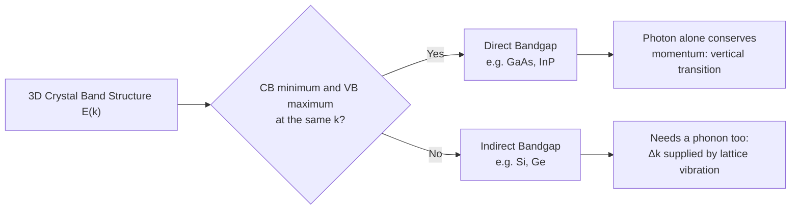
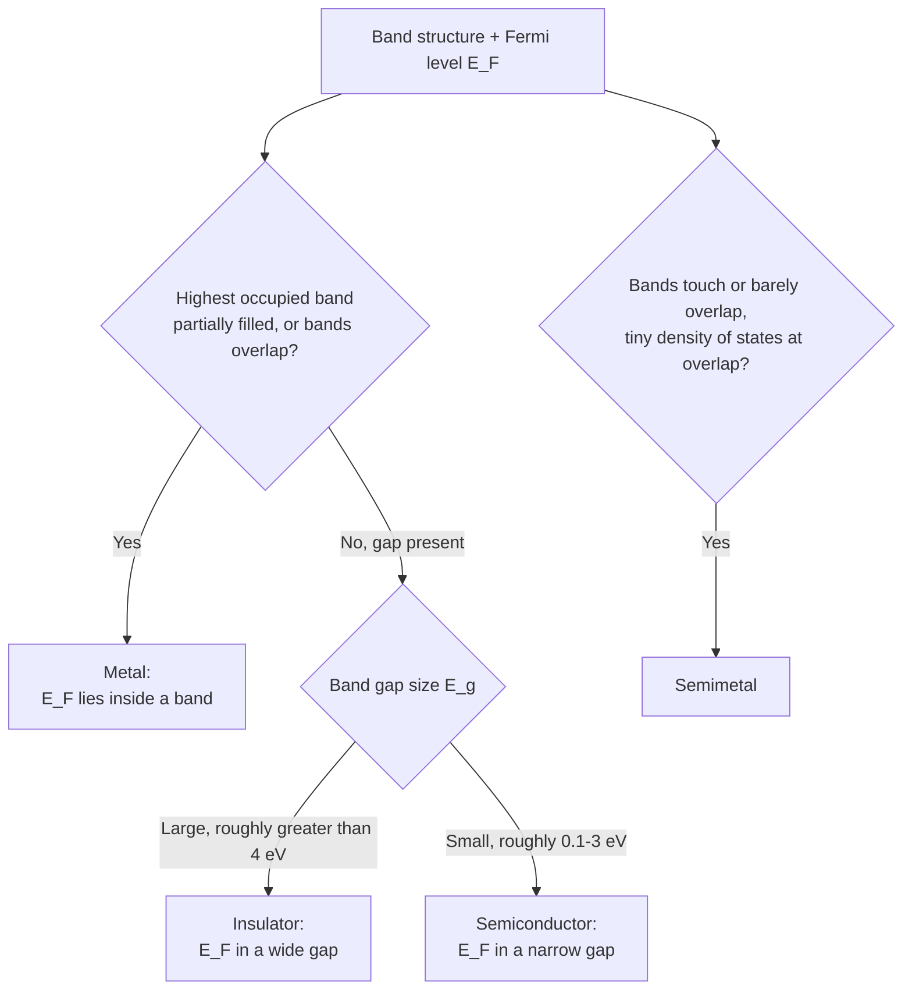

# Chapter 6: Band Structure and the Fermi Level

<strong>Chapter Overview</strong> (click to expand)

Chapter 5 showed *that* a periodic crystal potential splits a free particle's continuous energy spectrum into allowed bands separated by forbidden gaps, and named the two bands nearest that gap the valence band and the conduction band. This chapter asks three practical questions about those bands that Chapter 5 left open: What shape does a real, three-dimensional \(E(k)\) band actually have near its extrema, and does it matter whether the conduction-band minimum and valence-band maximum sit at the same crystal momentum? How many electron states actually exist at a given energy, so that carrier populations can eventually be counted? And where, energetically, do a material's electrons actually sit — a question answered by the Fermi level and Fermi energy. Together, the answers to these three questions are what let Chapter 7 classify any solid as a metal, insulator, semiconductor, or semimetal from its band structure alone.

**Key Takeaways:**

1. On a real E-k diagram, a **direct bandgap** material has its conduction-band minimum and valence-band maximum at the same crystal momentum \(k\) (e.g., GaAs); an **indirect bandgap** material has them at different \(k\) (e.g., Si, Ge) — a distinction that controls whether a photon alone can drive a band-to-band transition.
2. Near any band extremum, \(E(k)\) is well-approximated by a parabola, and its curvature there defines the **effective mass** \(m^* = \hbar^2/(d^2E/dk^2)\), the single number that lets an electron or hole near that extremum be treated as if it were a free particle of mass \(m^*\).
3. The **density of states** \(g(E)\) counts how many electron states exist per unit energy per unit volume; for a parabolic band it grows as \(\sqrt{E}\), and it is the essential bridge between "where the bands are" and "how many carriers occupy them" (the subject of Chapters 9 and 10).
4. The **Fermi-Dirac distribution** \(f(E)\) gives the probability that a state of energy \(E\) is occupied, parameterized by the **Fermi level** \(E_F\); at absolute zero this distribution becomes a sharp step, and the energy of that step — the highest occupied state — is the **Fermi energy**.
5. A material's electrical character follows directly from where \(E_F\) sits relative to its bands: a **metal** has \(E_F\) inside a partially-filled band (or overlapping bands), an **insulator** has \(E_F\) in a wide gap between a full valence band and empty conduction band, a **semiconductor** has \(E_F\) in a narrow gap, and a **semimetal** has bands that just barely touch or overlap with almost no states at the touching energy.
6. This chapter's band-structure and Fermi-level machinery is the direct foundation for Chapter 7's classification of real materials and for Chapters 9-10's quantitative carrier-concentration equations.

## Learning Objectives

By the end of this chapter, you will be able to:

- Distinguish a direct bandgap material from an indirect bandgap material using an E-k diagram, and identify real examples of each
- Explain why direct bandgap materials absorb and emit light far more efficiently near the band edge than indirect bandgap materials
- Define effective mass in terms of E-k curvature, and calculate it from a given band dispersion relation
- Explain, qualitatively and quantitatively, why the density of states of a parabolic band grows as \(\sqrt{E}\)
- State the Fermi-Dirac distribution and interpret the role of the Fermi level \(E_F\) within it
- Distinguish the Fermi level from the Fermi energy, and explain why the Fermi level can lie inside a band gap where no states exist
- Classify a material as a metal, insulator, semiconductor, or semimetal from a sketch of its band structure and Fermi level position
- Solve worked and practice problems combining band curvature, density of states, and Fermi-level reasoning, in preparation for Chapter 7's material classification and Chapters 9-10's carrier statistics

!!! note "How to read this chapter"
    Chapter 5 was almost entirely about *why* bands and gaps exist at all. This chapter takes that result as given and asks what a band actually looks like up close, and how many electrons live in it. The two central tools — effective mass (how a band curves) and density of states (how many states a band holds) — are both local properties evaluated near a single band extremum, so you do not need to re-derive a full Kronig-Penney-style band structure to use them. The Fermi level material in this chapter is intentionally kept qualitative and graphical; the full Fermi-Dirac statistics and carrier-concentration equations that make it quantitative are the subject of Chapters 9 and 10.

## Introduction

Chapter 5 solved the Schrödinger equation for a periodic crystal potential and found that electron energies split into continuous allowed bands separated by forbidden gaps, with the highest fully-occupied band at absolute zero named the valence band and the next band up named the conduction band. That analysis, built on the one-dimensional Kronig-Penney model, established *that* band gaps exist and *where* they open in k-space — precisely at the Brillouin zone boundaries. It did not, however, say much about the detailed shape of a band near its top or bottom, nor how many electron states a band actually contains at a given energy, nor where a material's electrons actually sit within that structure. Those three questions are this chapter's subject, and each has an immediate, practical payoff.

The first question — the detailed shape of \(E(k)\) near a band extremum — turns out to matter enormously for how a semiconductor interacts with light. Real crystals are three-dimensional, and a band's minimum (for the conduction band) or maximum (for the valence band) can occur at different locations in k-space for different materials. When the conduction-band minimum and valence-band maximum sit at the *same* crystal momentum, the material has a **direct bandgap**; when they sit at *different* crystal momenta, it has an **indirect bandgap**. This geometric fact, readable directly off an E-k diagram, determines whether a single photon can drive a band-to-band transition on its own — and therefore whether a material makes an efficient LED or laser (direct-gap materials like GaAs) or a comparatively inefficient light emitter despite being an excellent solar-cell absorber (indirect-gap silicon).

Very close to any band extremum, the curvature of \(E(k)\) defines a second essential quantity: the **effective mass** \(m^*\). An electron near a conduction-band minimum, or a hole near a valence-band maximum, responds to external forces (an applied electric field, for instance) exactly as a free classical particle would — but with mass \(m^*\) in place of the free-electron mass \(m_0\), and with a value set entirely by how sharply the band curves. This is what makes it possible to keep using familiar free-particle intuition (and even Chapter 1's classical mechanics) once band structure has been distilled down to a single number.

The second question — how many electron states exist at a given energy — is answered by the **density of states**, \(g(E)\), a function this chapter derives directly from the same particle-in-a-box counting argument Chapter 2 used for a single potential well, now applied to a parabolic band near its extremum. The density of states is the essential link between band structure and carrier population: it says nothing about which states are actually occupied, but it is a required ingredient for that calculation, taken up in Chapters 9 and 10.

The third question — where a material's electrons actually sit — is answered by the **Fermi level** \(E_F\), the parameter that governs the **Fermi-Dirac distribution** \(f(E)\), the probability that a state of energy \(E\) is occupied. At absolute zero, this distribution collapses to a sharp step function, and the step's location — the energy of the highest occupied state — is called the **Fermi energy**. Putting all three results together, this chapter closes by showing that a material's basic electrical character — whether it behaves as a **metal**, an **insulator**, a **semiconductor**, or a **semimetal** — follows directly from nothing more than its band structure and the position of \(E_F\) within it, setting up Chapter 7's detailed classification of real materials.

## Direct and Indirect Band Gaps

### Band Extrema in Three Dimensions

Chapter 5's Kronig-Penney model was one-dimensional, so its conduction-band minimum and valence-band maximum both necessarily occurred at the same point, \(k=0\) (the center of the Brillouin zone, conventionally labeled the \(\Gamma\) point). A real, three-dimensional crystal has no such restriction: the valence band's maximum and the conduction band's minimum can each occur at any point in the three-dimensional Brillouin zone, and for many real materials they occur at *different* points entirely. Whether they coincide or not is not a minor detail — it is one of the most technologically important facts about a semiconductor.

| Term | Definition | Example materials |
|---|---|---|
| Direct Bandgap | Conduction-band minimum and valence-band maximum occur at the same crystal momentum \(k\) | GaAs, InP, most III-V compounds |
| Indirect Bandgap | Conduction-band minimum and valence-band maximum occur at different crystal momenta \(k\) | Si, Ge, GaP |

For example, silicon's valence-band maximum sits at \(k=0\) (the \(\Gamma\) point), but its conduction-band minimum sits away from \(\Gamma\), along the \(\langle100\rangle\) direction toward the Brillouin zone's \(X\) point — making silicon an indirect-gap material. Gallium arsenide, by contrast, has both its valence-band maximum and conduction-band minimum at \(k=0\), making it a direct-gap material.

### Why the Distinction Matters: Photon Absorption and Emission

A photon of visible or near-infrared light carries very little momentum compared to a typical crystal electron's momentum: a photon's momentum is \(p_{\text{photon}}=h/\lambda\), and for a visible-light wavelength this is roughly three orders of magnitude smaller than \(\hbar\pi/a\), the momentum scale set by a typical lattice constant \(a\). As a result, when a semiconductor absorbs or emits a photon by moving an electron between the valence and conduction bands, conservation of crystal momentum requires the transition to be essentially **vertical** on the E-k diagram — \(\Delta k \approx 0\).

In a direct-gap material, the conduction-band minimum lies directly above the valence-band maximum on the E-k diagram, so a vertical transition connects the two band edges exactly — a single photon of energy \(E_g\) (the band gap) can drive the transition efficiently in either direction. In an indirect-gap material, the band edges are offset in \(k\), so a purely vertical transition between them is impossible; completing the transition requires a second particle — a **phonon**, a quantum of lattice vibration — to supply or absorb the missing crystal momentum \(\Delta k\). Because this process requires two particles (a photon and a phonon) to interact with the electron essentially simultaneously, it is intrinsically much less probable than a direct, photon-only transition.

!!! question "Concept Check"
    Silicon solar cells absorb sunlight efficiently despite silicon being an indirect-gap material, yet silicon LEDs are notoriously inefficient at emitting light. Are these two facts consistent with each other?

??? question "Concept Check — click to reveal answer"
    Yes. Photon absorption in an indirect-gap material is weaker than in a direct-gap material of the same thickness, but silicon solar cells compensate simply by being thick enough (hundreds of micrometers) that even the weaker, phonon-assisted absorption process eventually captures most incident photons over that path length. Light *emission*, however, requires an excited electron to find both an available valence-band state *and* the correctly-matched phonon within its short excited-state lifetime — a much less forgiving requirement — so indirect-gap materials like silicon emit light far less efficiently than direct-gap materials like GaAs, which is why LEDs and laser diodes are built almost exclusively from direct-gap III-V compounds.

!!! example "Worked Example 1 — Classifying a Material from Its E-k Diagram"
    A hypothetical semiconductor's E-k diagram shows its valence-band maximum at \(k=0\) and its conduction-band minimum also at \(k=0\). Classify this material, and state whether a photon alone can drive a band-edge transition.

    **Solution:** Because both extrema occur at the same crystal momentum, this is a direct-gap material. A photon alone (which carries negligible crystal momentum) can drive a vertical, momentum-conserving transition directly between the band edges.

#### Diagram: Direct vs. Indirect Bandgap E-k Explorer

<iframe src="../../sims/direct-indirect-bandgap-explorer/main.html" width="100%" height="660px" scrolling="auto"></iframe>

!!! tip "How to use this MicroSim"
    **Instructions:** Use the material dropdown to switch between a direct-gap preset (GaAs) and indirect-gap presets (Si, Ge), and observe how the conduction-band minimum shifts in \(k\) relative to the valence-band maximum. Toggle the transition dropdown to see a vertical (orange, photon-only) transition versus a diagonal path split into a photon segment and a dashed teal phonon segment. Drag the electron effective-mass slider to see how \(m_e^*\) changes the purple parabola's curvature, and compare it to the green valence band's fixed hole effective mass \(m_h^*\) in the numeric readout.

    **Learning objective:** Identify direct vs. indirect band gaps directly from an E-k diagram, connect band curvature to effective mass, and compare electron vs. hole effective mass.

    **What to observe:** In the direct-gap preset, the photon-only transition lands exactly on the conduction-band minimum and a dotted guide line confirms the CB minimum and VB maximum share the same \(k\); in the indirect-gap presets, the photon-only transition visibly misses the true conduction-band minimum, and only the path with a phonon segment reaches it. The Eg bracket alongside the CB minimum marker reads out the exact band gap for every preset.

[Full MicroSim documentation →](../../sims/direct-indirect-bandgap-explorer/index.md)

## Effective Mass

### Band Curvature Near an Extremum

Near any band extremum — a conduction-band minimum or a valence-band maximum — the E-k relationship can be closely approximated by a parabola, exactly the shape of a free particle's dispersion relation \(E=\hbar^2k^2/2m\). This is not a coincidence: it is a direct consequence of expanding any smooth function \(E(k)\) in a Taylor series about its extremum, where the first derivative vanishes by definition, leaving the second-derivative (curvature) term as the leading behavior. Measuring \(k\) from the conduction-band minimum at \(k_0\), this parabolic approximation reads:

\[
E(k) \approx E_c + \frac{\hbar^2(k-k_0)^2}{2m_e^*}
\]

where \(E_c\) is the conduction-band-edge energy and \(m_e^*\) is defined precisely so that this expression matches the true band curvature:

\[
\frac{1}{m^*} = \frac{1}{\hbar^2}\frac{d^2E}{dk^2}
\]

A sharply-curved band (large \(d^2E/dk^2\)) has a *small* effective mass, meaning electrons near that extremum accelerate easily in response to an applied force — they behave as if very light. A gently-curved, nearly flat band has a *large* effective mass, meaning electrons there are sluggish, behaving as if heavy. The valence band typically curves more gently than the conduction band, giving holes a larger effective mass than conduction electrons in most semiconductors.

| Material | Electron effective mass \(m_e^*/m_0\) | Bandgap type |
|---|---|---|
| Silicon (Si) | \(\approx 0.26\) (density-of-states value) | Indirect |
| Germanium (Ge) | \(\approx 0.12\) (density-of-states value) | Indirect |
| Gallium Arsenide (GaAs) | \(\approx 0.067\) | Direct |

### Why Effective Mass Is Useful

The entire point of defining an effective mass is that it hides all the complicated details of the true periodic-potential band structure inside a single number, letting an electron (or a hole) near a band extremum be treated with ordinary Newtonian mechanics: \(F=m^*a\), just as in Chapter 1, but with \(m_0\) replaced by \(m^*\). This is what makes it possible, in later chapters, to write drift and diffusion currents (Chapter 11) using simple classical-particle language even though the electron is, fundamentally, a quantum-mechanical Bloch wave.

!!! example "Worked Example 2 — Computing Effective Mass from Curvature"
    A conduction band near its minimum is described by \(E(k) = E_c + \alpha k^2\), with \(\alpha = 3.0\times10^{-38}\ \text{J}\cdot\text{m}^2\). Find the effective mass \(m_e^*\) in units of the free-electron mass \(m_0 = 9.11\times10^{-31}\) kg.

    **Solution:** Comparing to \(E(k)=E_c+\hbar^2k^2/(2m^*)\) gives \(\alpha = \hbar^2/(2m^*)\), so \(m^* = \hbar^2/(2\alpha)\). Using \(\hbar=1.055\times10^{-34}\ \text{J}\cdot\text{s}\):

    \[
    m^* = \frac{(1.055\times10^{-34})^2}{2(3.0\times10^{-38})} = 1.85\times10^{-31}\ \text{kg} \approx 0.20\,m_0
    \]

## Density of States

### Counting Allowed States

Knowing the shape of a band near its extremum makes it possible to answer a second essential question: how many electron states exist within a given small energy range? This quantity is the **density of states**, \(g(E)\), defined so that \(g(E)\,dE\) is the number of allowed electron states per unit volume with energy between \(E\) and \(E+dE\).

The counting argument follows the same logic Chapter 2 used to quantize energy levels in a box, extended to three dimensions. Confining electrons to a crystal of volume \(V\) with periodic boundary conditions forces the allowed \(k\)-vectors to form a uniform grid in k-space, with one allowed state (per spin) per volume \((2\pi)^3/V\) of k-space. Counting the states inside a thin spherical shell of radius \(k\) and thickness \(dk\) (with volume \(4\pi k^2\,dk\)), including the factor of 2 for electron spin, gives the number of states per unit real-space volume:

\[
g(k)\,dk = \frac{2\cdot4\pi k^2\,dk}{(2\pi)^3} = \frac{k^2}{\pi^2}\,dk
\]

Converting this from a density in \(k\) to a density in energy \(E\) requires the parabolic-band relation \(E-E_c = \hbar^2k^2/2m_e^*\), so that \(k=\sqrt{2m_e^*(E-E_c)}/\hbar\) and \(dk/dE\) follows directly from differentiating that expression. Substituting both into \(g(k)\,dk = g(E)\,dE\) and simplifying yields the standard parabolic-band density of states for the conduction band:

\[
g_c(E) = \frac{1}{2\pi^2}\left(\frac{2m_e^*}{\hbar^2}\right)^{3/2}\sqrt{E-E_c}, \qquad E \geq E_c
\]

An identical argument applied to the valence band, using the hole effective mass \(m_h^*\) and measuring energy downward from the band edge \(E_v\), gives:

\[
g_v(E) = \frac{1}{2\pi^2}\left(\frac{2m_h^*}{\hbar^2}\right)^{3/2}\sqrt{E_v-E}, \qquad E \leq E_v
\]

Both functions vanish exactly at the band edge and grow as a square root moving into the band — a direct mathematical consequence of the three-dimensional, parabolic-band counting argument, and a shape you will use repeatedly in Chapters 9 and 10 to compute carrier concentrations.

!!! example "Worked Example 3 — Order-of-Magnitude Density of States"
    Using \(m_e^*=0.26\,m_0\) for silicon, estimate \(g_c(E)\) at an energy \(0.025\) eV above the conduction-band edge (roughly \(k_BT\) at room temperature).

    **Solution:** With \(m_e^*=0.26(9.11\times10^{-31}\ \text{kg})=2.37\times10^{-31}\) kg and \(E-E_c=0.025\ \text{eV}=4.0\times10^{-21}\) J:

    \[
    g_c(E) = \frac{1}{2\pi^2}\left(\frac{2(2.37\times10^{-31})}{(1.055\times10^{-34})^2}\right)^{3/2}\sqrt{4.0\times10^{-21}} \approx 1.8\times10^{56}\ \text{J}^{-1}\text{m}^{-3}
    \]

    Converting to more convenient units (per eV per cm\(^3\)) gives roughly \(g_c \approx 1.8\times10^{18}\ \text{eV}^{-1}\text{cm}^{-3}\) — a huge number of available states, though (as Chapter 9 will show) only a small fraction are actually occupied at room temperature.

## The Fermi Level and Fermi Energy

### The Fermi-Dirac Distribution

Knowing how many states exist at each energy, \(g(E)\), is only half the picture — the other half is knowing the probability that a given state is actually occupied by an electron. That probability is given by the **Fermi-Dirac distribution**:

\[
f(E) = \frac{1}{1+\exp\!\left(\dfrac{E-E_F}{k_BT}\right)}
\]

where \(k_B\) is Boltzmann's constant, \(T\) is absolute temperature, and \(E_F\) — the **Fermi level** — is the single parameter that sets where this distribution is centered. Chapters 9 and 10 derive and use this distribution in full quantitative detail; here, only its qualitative shape and the meaning of \(E_F\) are needed.

At any finite temperature, \(f(E)\) is a smooth curve that equals exactly \(1/2\) at \(E=E_F\), approaches 1 for energies well below \(E_F\) (nearly certain occupation), and approaches 0 for energies well above \(E_F\) (nearly certain vacancy), with the transition smeared over an energy range of order \(k_BT\) around \(E_F\).

#### Diagram: Fermi-Dirac Distribution Explorer

<iframe src="../../sims/fermi-dirac-distribution-explorer/main.html" width="100%" height="640px" scrolling="auto"></iframe>

!!! tip "How to use this MicroSim"
    **Instructions:** Drag the \(E_F\) slider and watch the whole S-curve translate left and right. Independently, switch the Temperature preset between 0 K, 77 K, 300 K, and 600 K (or drag the \(T\) slider) and watch the curve's steepness change.

    **Learning objective:** Recognize that \(f(E)\) always equals exactly \(0.5\) at \(E=E_F\), and connect rising temperature to a wider, more gradual occupied-to-empty transition.

    **What to observe:** The red marker always sits on the curve at \(f(E_F)=0.5\), regardless of where \(E_F\) or \(T\) is set. At the lowest temperature preset, the purple curve nearly overlaps the faint gray step-function reference; at 600 K it visibly spreads out over a much wider energy range around \(E_F\).

[Full MicroSim documentation →](../../sims/fermi-dirac-distribution-explorer/index.md)

### The Zero-Temperature Limit: Fermi Energy

As \(T\to0\), the exponential in the Fermi-Dirac distribution becomes infinitely steep, and \(f(E)\) collapses into a sharp step function: exactly 1 for every state with \(E<E_F\), and exactly 0 for every state with \(E>E_F\). In this limit, \(E_F\) has an unambiguous physical meaning — it is the energy of the highest occupied electron state — and this special, \(T=0\) value of the Fermi level is given its own name, the **Fermi energy**.

This distinction matters because the two terms are *not* always interchangeable at finite temperature. "Fermi energy" most precisely refers to this \(T=0\), highest-occupied-state value, while "Fermi level" refers to the general parameter \(E_F\) appearing in the Fermi-Dirac distribution at *any* temperature — including situations, central to semiconductor physics, where \(E_F\) sits inside a band gap where *no states exist at all*. That is perfectly consistent: \(E_F\) is simply the energy at which the occupation probability *would* equal \(1/2\) if a state existed there, not the energy of any particular occupied electron.

| Term | Precise meaning |
|---|---|
| Fermi Level (\(E_F\)) | The general parameter in the Fermi-Dirac distribution at any temperature; can lie inside a band or inside a gap |
| Fermi Energy | The special, \(T=0\) value of the Fermi level, equal to the energy of the highest occupied electron state |

!!! question "Concept Check"
    In an intrinsic (undoped) semiconductor, the Fermi level sits roughly in the middle of the band gap, where the density of states \(g(E)\) is exactly zero. Is this a contradiction?

??? question "Concept Check — click to reveal answer"
    No. The Fermi level is defined by the Fermi-Dirac distribution's mathematical parameter \(E_F\), not by the requirement that a real occupied state sit exactly at that energy. Because \(g(E)=0\) throughout the gap, no electron actually has energy \(E_F\) in this case — but \(E_F\)'s position still correctly determines, through \(f(E)\), how far the tails of the distribution reach up into the conduction band and down into the valence band, which is exactly what sets the (small) electron and hole populations that Chapter 9 calculates.

!!! example "Worked Example 4 — Reading Occupation Probability from the Fermi Level"
    A conduction-band state sits \(0.20\) eV above the Fermi level at \(T=300\) K, where \(k_BT\approx0.0259\) eV. Estimate the probability that this state is occupied.

    **Solution:** Since \(E-E_F=0.20\ \text{eV} \gg k_BT\), the exponential dominates and \(f(E)\approx\exp(-(E-E_F)/k_BT)\):

    \[
    f(E) \approx \exp\!\left(-\frac{0.20}{0.0259}\right) = \exp(-7.72) \approx 4.4\times10^{-4}
    \]

    Only about 4 states in 10,000 at this energy are occupied — consistent with the intuition that states well above \(E_F\) are sparsely populated.

#### Diagram: Density of States and Fermi Level Explorer

<iframe src="../../sims/density-of-states-fermi-level-explorer/main.html" width="100%" height="660px" scrolling="auto"></iframe>

!!! tip "How to use this MicroSim"
    **Instructions:** Choose a preset (Metal, Insulator, Semimetal, or Intrinsic/n-type/p-type Semiconductor) from the dropdown and observe how the band diagram, the density-of-states curve \(g(E)\), and the Fermi level line \(E_F\) differ between them. Use the Temperature preset dropdown (0 K, 77 K, 300 K, 600 K) or the \(T\) (K) slider to see the Fermi-Dirac distribution's step edge smear out around \(E_F\), and read the numeric \(k_BT\), \(E_g\), and occupation-probability readout at the bottom.

    **Learning objective:** Connect the density of states, the Fermi level, and the Fermi-Dirac distribution to the classification of a material as a metal, insulator, semiconductor, or semimetal, and see how doping shifts \(E_F\) within a semiconductor's gap.

    **What to observe:** In the Metal preset, \(E_F\) sits inside a region where \(g(E)>0\); in the Insulator and semiconductor presets, \(E_F\) sits inside the gap where \(g(E)=0\), differing only in gap size; in the Semimetal preset, the bands just barely touch or overlap with very little density of states near \(E_F\). Comparing the n-type and p-type presets shows \(E_F\) shifted toward \(E_c\) and \(E_v\) respectively — a preview of Chapters 7-8.

[Full MicroSim documentation →](../../sims/density-of-states-fermi-level-explorer/index.md)

## Classifying Materials by Band Structure

### Four Categories from Band Filling and Fermi Level Position

Chapter 5 already introduced the vocabulary of valence and conduction bands; this chapter's density of states and Fermi level now make it possible to state precisely how a material's band structure determines whether it conducts electricity well, poorly, or somewhere in between. All four categories below follow from just two questions: is the highest band completely full, and if so, how large is the gap above it?

| Category | Band filling at \(T=0\) | Typical gap \(E_g\) | Example |
|---|---|---|---|
| Metal Band Structure | Highest occupied band only partially filled, or valence and conduction bands overlap in energy | None (\(E_F\) inside a band) | Copper, aluminum, sodium |
| Insulator Band Structure | Valence band completely full, conduction band completely empty | Large, roughly \(>4\) eV | Diamond (\(\approx5.5\) eV), SiO\(_2\) (\(\approx9\) eV) |
| Semiconductor Band Structure | Valence band completely full, conduction band completely empty (same as insulator) | Small, roughly \(0.1\)–\(3\) eV | Silicon (\(1.12\) eV), GaAs (\(1.42\) eV) |
| Semimetal | Valence and conduction bands touch or slightly overlap, but with very little density of states right at the overlap energy | Zero or slightly negative, with very low carrier density | Bismuth, graphite |

A **metal** conducts well because its Fermi level sits inside a band that is only partially filled (or because two bands overlap in energy so that some electrons always occupy conduction-band-like states) — there are always empty states immediately adjacent in energy to filled ones, so an applied field can easily accelerate electrons into new states. An **insulator** and a **semiconductor** share exactly the same qualitative picture — a completely full valence band separated from a completely empty conduction band — and differ only by degree: an insulator's gap is so large that essentially no electrons are thermally excited across it at any reasonable temperature, while a semiconductor's smaller gap allows a technologically significant number of thermal excitations at room temperature, the subject of Chapter 7. A **semimetal** is a distinct, intermediate case: its bands touch or slightly overlap so there is technically no gap at all, but the density of states right at the point of overlap is very small, so only a tiny number of carriers exist — far fewer than in a true metal, but the material still conducts at any temperature, unlike an insulator.

!!! example "Worked Example 5 — Classifying a Material from a Description"
    A crystal has a completely full valence band and a completely empty conduction band at \(T=0\), separated by a gap of \(5.5\) eV. Classify this material.

    **Solution:** A full valence band and empty conduction band place this in the insulator/semiconductor category; a \(5.5\) eV gap is far too large for meaningful room-temperature thermal excitation, so this material is an insulator. (This value matches diamond.)

!!! example "Worked Example 6 — Metal from Band Overlap"
    A divalent metal (two valence electrons per atom) would, by simple electron counting, be expected to completely fill one band and leave the next completely empty — behaving like an insulator. Yet magnesium, a divalent metal, conducts electricity well. Explain.

    **Solution:** In magnesium, the top of the lower band and the bottom of the next band actually overlap in energy (rather than being separated by a gap), so electrons partially populate both bands rather than exactly filling one. Because the resulting bands are each only partially filled, the Fermi level sits inside a band, not in a gap — exactly the metal band structure condition — despite the simple electron-counting argument suggesting otherwise.

## Previewing Carrier Generation

### From Band Structure to Electron-Hole Pairs

This chapter has now assembled every piece needed to answer one more question, even though answering it *quantitatively* is Chapter 7's job: where do a semiconductor's charge carriers actually come from? A semiconductor's valence band is completely full and its conduction band is completely empty only at \(T=0\); at any real operating temperature, some electrons gain enough thermal energy to cross the gap \(E_g\) from the valence band into the conduction band. Every such event is forced, by simple electron bookkeeping, to leave exactly one **hole** — a missing electron, behaving as a positive carrier — at the electron's original valence-band site. Because generation always produces one electron and one hole together, and recombination (an electron falling back into a hole) always removes one of each, an **intrinsic** (undoped) semiconductor always has equal electron and hole populations, written \(n=p=n_i\), where \(n_i\) is the **intrinsic carrier concentration**. Chapter 9 derives \(n_i\) precisely, using exactly the density-of-states and Fermi-level machinery this chapter built; here, the goal is only to see the mechanism itself.

#### Diagram: Intrinsic Carrier Excitation / Electron-Hole Pair Explorer

<iframe src="../../sims/carrier-excitation-electron-hole-pair-explorer/main.html" width="100%" height="670px" scrolling="auto"></iframe>

!!! tip "How to use this MicroSim"
    **Instructions:** Click Start and watch electrons occasionally jump from the valence band, across \(E_g\), into the conduction band, leaving a hole behind. Compare the Temperature and \(E_g\) sliders' effect on how often this happens.

    **Learning objective:** Explain why electron-hole pair generation always produces equal numbers of electrons and holes, and connect generation rate qualitatively to temperature and band gap.

    **What to observe:** The free-electron count \(n\) and hole count \(p\) in the readout are always exactly equal. Raising \(E_g\) sharply reduces the generation-activity meter and how often new pairs appear; raising Temperature does the opposite — the same qualitative trend behind Chapter 9's precise result \(n_i\propto T^{3/2}e^{-E_g/2k_BT}\).

[Full MicroSim documentation →](../../sims/carrier-excitation-electron-hole-pair-explorer/index.md)

!!! question "Concept Check"
    Chapter 7's Intrinsic Semiconductor Explorer shows thermal carrier generation as a covalent bond breaking in real space, with no mention of Ec, Ev, or Eg. This chapter's MicroSim shows the same physical process on an energy-space band diagram instead. Are these two pictures in conflict?

??? question "Concept Check — click to reveal answer"
    No — they are the same physical event described in two different, complementary spaces. Breaking a covalent bond in real space *is* exciting an electron from a valence-band state to a conduction-band state in energy space; the freed electron becomes a mobile conduction-band carrier, and the broken bond is a valence-band hole. Chapter 7 develops the real-space, bond-breaking language because it connects naturally to doping (Chapter 8's donor and acceptor atoms), while this chapter's energy-space, band-diagram language connects naturally to the density-of-states and Fermi-level tools Chapters 9 and 10 use to calculate \(n_i\) exactly.

## Summary

This chapter took Chapter 5's abstract result — that a periodic potential splits electron energy into bands and gaps — and made it concrete and quantitative. A real, three-dimensional band's extrema can occur at the same crystal momentum (a **direct bandgap**, as in GaAs) or at different crystal momenta (an **indirect bandgap**, as in Si and Ge), a distinction that governs whether a single photon can drive a band-edge transition and therefore whether a material makes an efficient light emitter. Near any band extremum, the curvature of \(E(k)\) defines the **effective mass** \(m^*=\hbar^2/(d^2E/dk^2)\), letting electrons and holes there be treated with ordinary Newtonian mechanics. Counting allowed k-states in three dimensions and converting to energy gave the **density of states**, \(g_c(E)\propto\sqrt{E-E_c}\) for a parabolic conduction band, the essential bridge to carrier-concentration calculations in Chapters 9 and 10. The **Fermi-Dirac distribution**, parameterized by the **Fermi level** \(E_F\), gives the occupation probability of a state at any temperature, and its zero-temperature limit — the energy of the highest occupied state — is the **Fermi energy**. Finally, combining band filling with the Fermi level's position classified any material as a **metal** (\(E_F\) inside a band), an **insulator** (\(E_F\) in a wide gap), a **semiconductor** (\(E_F\) in a narrow gap), or a **semimetal** (bands barely touching, with very low carrier density) — the classification scheme Chapter 7 now applies in detail to real semiconductor materials.

## Key Equations

| Concept | Equation |
|---|---|
| Parabolic band approximation (conduction) | \(E(k) \approx E_c + \dfrac{\hbar^2(k-k_0)^2}{2m_e^*}\) |
| Effective mass | \(\dfrac{1}{m^*} = \dfrac{1}{\hbar^2}\dfrac{d^2E}{dk^2}\) |
| Density of states, conduction band | \(g_c(E) = \dfrac{1}{2\pi^2}\left(\dfrac{2m_e^*}{\hbar^2}\right)^{3/2}\sqrt{E-E_c}\), \(E\geq E_c\) |
| Density of states, valence band | \(g_v(E) = \dfrac{1}{2\pi^2}\left(\dfrac{2m_h^*}{\hbar^2}\right)^{3/2}\sqrt{E_v-E}\), \(E\leq E_v\) |
| Fermi-Dirac distribution | \(f(E) = \dfrac{1}{1+\exp\!\left(\dfrac{E-E_F}{k_BT}\right)}\) |

## Glossary

See the [Chapter 6 Glossary](glossary.md) for full definitions of every term introduced in this chapter.

## Further Reading

- Neamen, *Semiconductor Physics and Devices* — direct treatment of band structure, effective mass, density of states, and the Fermi function aimed at device engineers
- Kittel, *Introduction to Solid State Physics* — rigorous derivation of effective mass and density of states from band theory
- Sze and Ng, *Physics of Semiconductor Devices* — extensive real-material band structure diagrams for Si, Ge, and III-V compounds
- Ashcroft and Mermin, *Solid State Physics* — thorough treatment of the free-electron Fermi gas and its extension to real band structures

## Worked Examples

!!! example "Worked Example 7 — Heavy vs. Light Effective Mass"
    Two conduction bands have curvatures \(d^2E/dk^2\) differing by a factor of 4, with band A's curvature four times larger than band B's. Which band has the larger effective mass, and by what factor?

    **Solution:** Since \(m^*=\hbar^2/(d^2E/dk^2)\), effective mass is inversely proportional to curvature. Band B, with the smaller curvature, has the larger effective mass — specifically four times larger than band A's, since \(m_B^*/m_A^*=(d^2E/dk^2)_A/(d^2E/dk^2)_B=4\).

!!! example "Worked Example 8 — Photon Energy for a Direct-Gap Transition"
    GaAs has a direct band gap of \(1.42\) eV. Find the maximum wavelength of light that can be absorbed by a direct, band-edge transition.

    **Solution:** The photon energy must be at least \(E_g\), so the maximum (threshold) wavelength satisfies \(E_g = hc/\lambda\):

    \[
    \lambda = \frac{hc}{E_g} = \frac{(4.136\times10^{-15}\ \text{eV}\cdot\text{s})(3.0\times10^{8}\ \text{m/s})}{1.42\ \text{eV}} \approx 8.7\times10^{-7}\ \text{m} = 870\ \text{nm}
    \]

    This near-infrared threshold wavelength is why GaAs-based LEDs and laser diodes commonly emit in this range.

!!! example "Worked Example 9 — Density of States Ratio"
    Compare the density of states at the same energy \(E-E_c\) above the band edge for two materials with electron effective masses \(m_1^*=0.067\,m_0\) (GaAs) and \(m_2^*=0.26\,m_0\) (Si).

    **Solution:** Since \(g_c(E)\propto (m^*)^{3/2}\) at fixed \(E-E_c\):

    \[
    \frac{g_{c,\text{Si}}}{g_{c,\text{GaAs}}} = \left(\frac{0.26}{0.067}\right)^{3/2} \approx (3.88)^{1.5} \approx 7.6
    \]

    Silicon's heavier conduction-band effective mass gives it roughly 7.6 times more available conduction-band states at the same energy above the band edge than GaAs.

!!! example "Worked Example 10 — Fermi Level Inside a Band (Metal) vs. Inside a Gap (Semiconductor)"
    For each case below, state whether the material is better described as a metal or a semiconductor/insulator: (a) \(E_F\) lies 2 eV above the bottom of a partially-filled band; (b) \(E_F\) lies exactly at the midpoint of a 1.1 eV gap between a full valence band and empty conduction band.

    **Solution:** (a) A Fermi level inside a band, with real occupied and empty states immediately adjacent in energy, is the defining condition for a metal. (b) A Fermi level inside a gap, with a full valence band below and empty conduction band above, is the defining condition for the semiconductor/insulator category — and with a gap this small (1.1 eV, close to silicon's), specifically a semiconductor.

!!! example "Worked Example 11 — Distinguishing Semimetal from Semiconductor"
    Material X has zero band gap — its valence and conduction bands touch at a single point in k-space, with essentially no density of states exactly at that energy, and it conducts weakly at all temperatures, including near absolute zero. Is Material X better classified as a metal, an insulator, or a semimetal?

    **Solution:** A metal would have a substantial density of states at \(E_F\) (a genuinely partially-filled band); an insulator would have a large gap and negligible conduction at low temperature. Material X's near-zero gap combined with very low density of states at the band-touching point, and its weak-but-nonzero conduction even near absolute zero, is precisely the semimetal signature.

