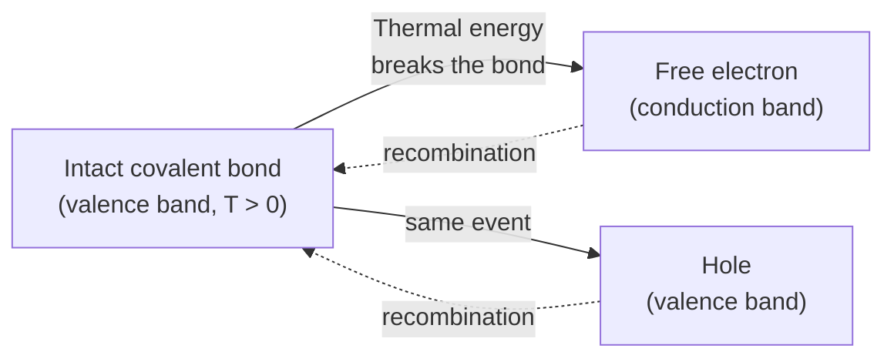

# Chapter 7: Intrinsic and Extrinsic Semiconductors

<strong>Chapter Overview</strong> (click to expand)

Chapter 6 explained how a material's band structure and Fermi level determine whether it behaves as a metal, insulator, semiconductor, or semimetal. This chapter opens the semiconductor category specifically and asks where its carriers actually come from. A perfectly pure crystal generates carriers only by chance thermal bond-breaking — an **intrinsic semiconductor**. Adding a tiny, deliberately chosen concentration of foreign atoms — **donor** or **acceptor** atoms — creates an **extrinsic semiconductor** whose carrier population is instead controlled almost entirely by the dopant, not by temperature. This chapter also surveys the specific materials used in practice — **elemental semiconductors** like silicon and germanium, and **compound semiconductors** like gallium arsenide — and the periodic-table logic that predicts which atoms make good hosts, donors, and acceptors.

**Key Takeaways:**

1. An **intrinsic semiconductor** is chemically pure; its only carriers come from rare, thermally-broken covalent bonds, each producing one free electron and one hole together.
2. An **extrinsic semiconductor** has been deliberately doped with **donor** or **acceptor** atoms, which contribute carriers without needing any thermal bond-breaking at all, typically outnumbering intrinsic carriers by five to eight orders of magnitude.
3. **Elemental semiconductors** (silicon, germanium) are built from a single atomic species; **compound semiconductors** (gallium arsenide and others) alternate two species whose average valence electron count still equals 4.
4. Column position in the periodic table predicts an atom's semiconductor role directly: Group IV supplies elemental hosts, Group III supplies acceptors, Group V supplies donors, and Group III + Group V (or Group II + Group VI) pairs supply compound semiconductors.
5. **Silicon**, **germanium**, and **gallium arsenide** each have distinct band gap, mobility, lattice constant, and thermal properties, and no single material is optimal for every application — a running theme this chapter returns to repeatedly.
6. A **donor atom** (Group V) contributes 4 electrons to normal covalent bonds and a 5th, weakly-bound electron that ionizes easily, becoming a free electron; an **acceptor atom** (Group III) completes only 3 of 4 bonds, leaving a hole that ionizes just as easily.
7. Both donor and acceptor ionization energies are well modeled by a hydrogen-atom analogy, using the semiconductor's effective mass and dielectric constant in place of the free-electron mass and vacuum permittivity — and both come out to only tens of meV, comparable to room-temperature thermal energy.
8. This chapter's donor/acceptor foundation feeds directly into Chapter 8's quantitative treatment of n-type and p-type doping, ionization fraction, and temperature regimes.

## Learning Objectives

By the end of this chapter, you will be able to:

- Explain why an intrinsic semiconductor's carriers must always be created in electron-hole pairs
- Distinguish elemental from compound semiconductors, and predict compound-semiconductor pairings from periodic table group numbers
- Recall the key structural, electronic, and thermal properties of silicon, germanium, and gallium arsenide
- Apply the Varshni equation to compute a material's band gap at a given temperature
- Explain why a donor atom contributes a free electron and an acceptor atom contributes a hole, without any covalent bond breaking
- Apply the hydrogenic model to estimate donor/acceptor ionization energy from effective mass and dielectric constant
- Compare intrinsic and extrinsic carrier concentrations, and compute a "1 dopant per N host atoms" ratio from a doping concentration
- Evaluate which semiconductor material (Si, Ge, or GaAs) best fits a given engineering application, and justify the choice
- Solve worked and practice problems combining these ideas, in preparation for Chapter 8's quantitative doping and temperature-regime analysis

!!! note "How to read this chapter"
    This chapter is deliberately hands-on: nearly every concept has an interactive MicroSim attached, and the fastest way to build intuition is to play with each one before reading the surrounding paragraph closely. The physics itself is qualitative and structural — which atoms bond with which, which electrons are free versus bound — while the precise *quantitative* carrier-concentration mathematics is deliberately deferred to Chapters 9 and 10. Treat this chapter as building the vocabulary and physical mental model that those later, more mathematical chapters will formalize.

## Introduction

Chapter 6 closed by showing that a material's band structure and the position of its Fermi level determine whether it behaves as a metal, insulator, semiconductor, or semimetal. A **semiconductor**, in that classification, is simply a material with a completely full valence band and empty conduction band at absolute zero, separated by a gap small enough (roughly 0.1 to 3 eV) that a technologically useful number of carriers appear at ordinary temperatures. This chapter asks a more practical question: where, physically, do those carriers actually come from, and which real materials are used to supply them?

There are exactly two answers. In a chemically pure crystal, the only source of carriers is thermal energy itself: at any temperature above absolute zero, a small number of covalent bonds randomly gain enough vibrational energy to break, each broken bond releasing one free electron and leaving behind one hole. A material relying entirely on this process is called an **intrinsic semiconductor** — "intrinsic" meaning the carrier population is an inherent property of the pure material itself, with no outside help. The second answer is doping: deliberately introducing a small, controlled concentration of foreign atoms — **donor atoms** that contribute free electrons, or **acceptor atoms** that contribute holes — without relying on thermal bond-breaking at all. A material doped this way is called an **extrinsic semiconductor**, and as this chapter's MicroSims make vivid, extrinsic carrier concentrations routinely exceed intrinsic ones by five to eight orders of magnitude. Nearly every semiconductor device you will study for the rest of this course — diodes, transistors, solar cells — depends on extrinsic material precisely because doping gives engineers direct, deliberate control over carrier concentration that thermal generation alone could never provide.

This chapter also surveys *which* real materials are used. Silicon and germanium are **elemental semiconductors**, built from a single atomic species repeated throughout the crystal — the same diamond-cubic structure Chapter 3 introduced. Gallium arsenide is a **compound semiconductor**, alternating two different atomic species (gallium and arsenic) on the same zincblende lattice geometry Chapter 3 also introduced. The periodic table predicts all of this directly: Group IV elements have exactly 4 valence electrons and can bond purely with themselves; Group III and Group V elements, one electron short and one electron over respectively, become acceptors and donors when substituted into a Group IV host, or combine with each other to form compound semiconductors whose average valence electron count still equals silicon's 4.

Finally, this chapter connects the abstract donor/acceptor picture to a concrete number: how weakly bound is that extra donor electron, really? The answer turns out to be a direct extension of Chapter 2's hydrogen-atom quantum mechanics, with the free-electron mass replaced by the semiconductor's effective mass and the vacuum permittivity replaced by the crystal's dielectric constant — producing ionization energies of only tens of millielectron-volts, comparable to room-temperature thermal energy itself, and explaining why essentially every dopant atom ionizes at ordinary operating temperatures.

## Concepts Covered

This chapter covers the following 9 concepts from the learning graph:

1. Intrinsic Semiconductor
2. Extrinsic Semiconductor
3. Elemental Semiconductor
4. Compound Semiconductor
5. Silicon
6. Germanium
7. Gallium Arsenide
8. Donor Atom
9. Acceptor Atom

## Prerequisites

This chapter builds on concepts from:

- [Chapter 3: Crystal Lattices and Structures](../03-crystal-lattices-structures/index.md), particularly the diamond and zincblende lattice geometries
- [Chapter 4: Chemical Bonding in Semiconductor Crystals](../04-chemical-bonding-crystals/index.md), particularly covalent bonding and valence electron counting
- [Chapter 6: Band Structure and the Fermi Level](../06-band-structure-fermi-level/index.md), particularly the semiconductor band-structure classification and direct/indirect band gaps

## Intrinsic Semiconductors

### Carriers from Thermal Bond-Breaking Alone

An **intrinsic semiconductor** is a chemically pure crystal — no foreign atoms deliberately introduced — in which the only source of free carriers is thermal energy itself. Recall from Chapter 4 that each silicon atom forms four covalent bonds with its neighbors, each bond a shared pair of valence electrons holding the lattice together. At absolute zero, every one of these bonds is intact, the valence band is completely full, and the conduction band is completely empty — exactly the semiconductor band-filling picture from Chapter 6.

At any temperature above absolute zero, however, atomic vibrations occasionally supply enough energy to break a bond. When this happens, one valence electron is freed from its bond — becoming a mobile **free electron** in the conduction band — and the bond it leaves behind is a **hole**, a missing electron that behaves, for most practical purposes, like a mobile positive charge carrier. Critically, a broken bond always creates exactly one electron and one hole together, called an **electron-hole pair**: intrinsic generation can never produce one without the other, since both simply describe the same single broken-bond event from two different perspectives (the freed electron, and the vacancy it left behind).

Because bond-breaking is a rare, random thermal event, only a tiny fraction of bonds are ever broken at any instant — and, just as importantly, broken bonds also **recombine**: a nearby free electron can fall back into a hole, re-forming the bond and annihilating both carriers. At any fixed temperature, the crystal settles into a dynamic equilibrium between generation and recombination, with a steady-state carrier population set by the balance of the two rates — a balance Chapter 13 develops into the full continuity equation.

#### Diagram: Intrinsic Semiconductor Explorer

<iframe src="../../sims/intrinsic-semiconductor-explorer/main.html" width="100%" height="660px" scrolling="auto"></iframe>

!!! tip "How to use this MicroSim"
    **Instructions:** Click Start with the temperature slider at its default 300 K, then drag the slider toward 900 K and watch the broken-bond count change.

    **Learning objective:** Observe that thermal bond-breaking always creates an electron and a hole together, and that the equilibrium number of broken bonds grows sharply — not linearly — with temperature.

    **What to observe:** At low temperature almost no bonds break; as temperature rises, the broken-bond count grows steeply, illustrating (qualitatively) the same exponential temperature sensitivity that Chapter 9 derives precisely for intrinsic carrier concentration.

[Full MicroSim documentation →](../../sims/intrinsic-semiconductor-explorer/index.md)

!!! question "Concept Check"
    Why can an intrinsic semiconductor never have more free electrons than holes, or more holes than free electrons?

??? question "Concept Check — click to reveal answer"
    Because every carrier-generating event in an intrinsic semiconductor is a single broken covalent bond, and a broken bond always produces exactly one free electron and one hole simultaneously — there is no mechanism in a pure crystal that creates one type of carrier without the other. (Doping, covered next, is precisely what breaks this equality.)

## Elemental and Compound Semiconductors

### One Species vs. Two

Not every semiconductor is built the same way at the atomic level. An **elemental semiconductor** is built from a single chemical element repeated throughout the crystal — silicon bonded only to silicon, germanium bonded only to germanium. A **compound semiconductor** alternates two (or more) different chemical species on the lattice, most commonly by pairing a Group III element with a Group V element (a **III-V compound**, such as gallium arsenide, GaAs) or a Group II element with a Group VI element (a **II-VI compound**, such as cadmium telluride, CdTe). In every case, the average number of valence electrons per atom across the compound still works out to 4 — the same count that makes silicon's pure covalent bonding possible — which is exactly why these compounds can adopt the same zincblende bonding geometry Chapter 3 introduced for GaAs.

#### Diagram: Elemental vs. Compound Semiconductor Structure Comparer

<iframe src="../../sims/elemental-compound-structure-comparer/main.html" width="100%" height="620px" scrolling="auto"></iframe>

!!! tip "How to use this MicroSim"
    **Instructions:** Toggle the dropdown between "Silicon (Elemental)" and "GaAs (Compound)".

    **Learning objective:** Distinguish elemental from compound semiconductor bonding by inspecting which atomic species occupy the lattice.

    **What to observe:** Every bond in the GaAs lattice connects a gallium atom to an arsenic atom — never two atoms of the same species — while every bond in the silicon lattice connects two identical atoms.

[Full MicroSim documentation →](../../sims/elemental-compound-structure-comparer/index.md)

### Predicting Roles from the Periodic Table

Column position in the periodic table predicts an element's semiconductor role directly, because column position sets valence electron count. Group IV elements have exactly 4 valence electrons, enough to complete 4 covalent bonds purely with themselves — the elemental-semiconductor condition. Group III elements have only 3 valence electrons, one short of what a Group IV lattice site needs; Group V elements have 5, one more than needed. Substituted into a Group IV host, these become **acceptor** and **donor** atoms respectively, the subject of the rest of this chapter. Paired directly with each other instead, a Group III and a Group V atom average exactly 4 valence electrons between them, forming a stable compound semiconductor.

| Group | Valence electrons | Role in semiconductor physics |
|---|---|---|
| II | 2 | Combines with Group VI to form II-VI compounds (e.g. CdTe, ZnSe) |
| III | 3 | Elemental-host acceptor dopant; combines with Group V to form III-V compounds |
| IV | 4 | Elemental semiconductor host (Si, Ge) |
| V | 5 | Elemental-host donor dopant; combines with Group III to form III-V compounds |
| VI | 6 | Combines with Group II to form II-VI compounds |

#### Diagram: Periodic Table of Semiconductor Elements

<iframe src="../../sims/periodic-table-semiconductor-elements/main.html" width="100%" height="620px" scrolling="auto"></iframe>

!!! tip "How to use this MicroSim"
    **Instructions:** Click any highlighted element to read its specific role in semiconductor physics.

    **Learning objective:** Predict whether an element acts as an elemental host, a donor, an acceptor, or a compound-semiconductor constituent directly from its periodic table group.

    **What to observe:** Every Group IV element you click (C, Si, Ge, Sn) is described as an elemental semiconductor or semiconductor-related; every Group III/Group V pair (like Ga and As) is described as forming a compound together.

[Full MicroSim documentation →](../../sims/periodic-table-semiconductor-elements/index.md)

!!! example "Worked Example 1 — Predicting a Compound Semiconductor's Group Pairing"
    Indium phosphide (InP) is a widely used compound semiconductor in fiber-optic communication. Using only the periodic table, explain why In and P can form a stable semiconductor compound together.

    **Solution:** Indium (In) is a Group III element (3 valence electrons); phosphorus (P) is a Group V element (5 valence electrons). Paired together, they average \((3+5)/2 = 4\) valence electrons per atom — the same count silicon uses for pure covalent bonding — allowing InP to adopt the same 4-bond zincblende bonding geometry as GaAs.

## Extrinsic Semiconductors: Doping in Perspective

### Why Doping Dominates Over Thermal Generation

An **extrinsic semiconductor** is a crystal into which donor or acceptor atoms have been deliberately introduced — doped — during or after crystal growth. Because donor and acceptor atoms contribute carriers without needing any thermal bond-breaking at all (as the next two sections show in detail), even a very small doping concentration overwhelms the intrinsic carrier population. Silicon's intrinsic carrier concentration at room temperature is only about \(n_i\approx10^{10}\ \text{cm}^{-3}\) — Chapter 9 derives this value precisely — while typical doping concentrations range from roughly \(10^{15}\) to \(10^{18}\ \text{cm}^{-3}\), five to eight orders of magnitude larger.

#### Diagram: Intrinsic vs. Extrinsic Semiconductor Comparison

<iframe src="../../sims/intrinsic-extrinsic-comparison/main.html" width="100%" height="600px" scrolling="auto"></iframe>

!!! tip "How to use this MicroSim"
    **Instructions:** Toggle between "Intrinsic (Pure)" and "Extrinsic (Doped)" and compare both the lattice diagrams and the log-scale carrier-concentration bars.

    **Learning objective:** Compare the physical source of carriers (rare thermal bond-breaking vs. deliberate doping) and the resulting orders-of-magnitude difference in carrier concentration.

    **What to observe:** The extrinsic lattice's donor atom contributes a free electron immediately, with no broken bond anywhere in sight, while the intrinsic lattice needs a rare, randomly-located broken bond to produce the same carrier.

[Full MicroSim documentation →](../../sims/intrinsic-extrinsic-comparison/index.md)

This is precisely why nearly every practical semiconductor device relies on extrinsic, not intrinsic, material: doping gives engineers direct, deliberate, and precisely controllable command over carrier concentration and carrier type (electron vs. hole) — control that thermal generation alone can never provide, since thermal generation always produces equal numbers of both carrier types and depends on temperature rather than design choice.

## Silicon, Germanium, and Gallium Arsenide in Practice

### Comparing the Three Workhorse Materials

Silicon, germanium, and gallium arsenide are the three semiconductor materials most widely used in real devices, and each has a distinct profile of properties. Silicon (Si) is an elemental, indirect-gap semiconductor with a room-temperature band gap of about 1.12 eV; it dominates digital integrated circuits because of its mature, low-cost fabrication ecosystem and its excellent native oxide (SiO\(_2\)), which enables high-quality MOSFETs at massive manufacturing scale. Germanium (Ge) is also elemental and indirect-gap, with a smaller room-temperature band gap of about 0.66 eV and higher carrier mobility than silicon; it was the material used in the first practical transistors (1947) but was largely displaced by silicon once silicon processing matured. Gallium arsenide (GaAs) is a compound, direct-gap semiconductor with a room-temperature band gap of about 1.42 eV and substantially higher electron mobility than silicon, making it the material of choice for LEDs, laser diodes, and high-frequency RF electronics.

#### Diagram: Semiconductor Material Properties Dashboard

<iframe src="../../sims/material-properties-dashboard/main.html" width="100%" height="660px" scrolling="auto"></iframe>

!!! tip "How to use this MicroSim"
    **Instructions:** Select each material in turn and drag the temperature slider to see its band gap change according to the Varshni equation.

    **Learning objective:** Recall the key structural and electronic properties of Si, Ge, and GaAs, and apply the Varshni equation to compute band gap at a given temperature.

    **What to observe:** GaAs is marked "Direct" while Si and Ge are both marked "Indirect," directly recalling Chapter 6's classification; all three band gaps shrink as temperature rises.

[Full MicroSim documentation →](../../sims/material-properties-dashboard/index.md)

### The Varshni Equation: Band Gap Shrinks with Temperature

A semiconductor's band gap is not perfectly constant — it shrinks somewhat as temperature rises, because both lattice thermal expansion and increased atomic vibration (electron-phonon interaction) act to reduce the gap. This effect is captured empirically by the **Varshni equation**:

\[
E_g(T) = E_g(0) - \frac{\alpha T^2}{T+\beta}
\]

where \(E_g(0)\) is the band gap extrapolated to absolute zero, and \(\alpha\) and \(\beta\) are material-specific fitted constants. The table below lists these constants for the three materials this chapter focuses on.

| Material | \(E_g(0)\) (eV) | \(\alpha\) (eV/K) | \(\beta\) (K) | \(E_g\) at 300 K (eV) |
|---|---|---|---|---|
| Silicon | 1.166 | \(4.73\times10^{-4}\) | 636 | 1.12 |
| Germanium | 0.7437 | \(4.77\times10^{-4}\) | 235 | 0.66 |
| GaAs | 1.519 | \(5.41\times10^{-4}\) | 204 | 1.42 |

#### Diagram: Bandgap vs. Temperature (Varshni Equation) Explorer

<iframe src="../../sims/bandgap-temperature-varshni-explorer/main.html" width="100%" height="640px" scrolling="auto"></iframe>

!!! tip "How to use this MicroSim"
    **Instructions:** Drag the temperature marker slider and read each visible material's band gap; use the checkboxes to isolate individual curves.

    **Learning objective:** Apply the Varshni equation to compare band gap across materials at any chosen temperature.

    **What to observe:** All three curves shrink with rising temperature but never cross within the 0–600 K range shown — GaAs stays the largest gap, germanium the smallest, throughout.

[Full MicroSim documentation →](../../sims/bandgap-temperature-varshni-explorer/index.md)

!!! example "Worked Example 2 — Applying the Varshni Equation"
    Using silicon's Varshni constants (\(E_g(0)=1.166\) eV, \(\alpha=4.73\times10^{-4}\) eV/K, \(\beta=636\) K), find silicon's band gap at \(T=500\) K.

    **Solution:**

    \[
    E_g(500) = 1.166 - \frac{(4.73\times10^{-4})(500)^2}{500+636} = 1.166 - \frac{118.25}{1136} = 1.166 - 0.104 = 1.062\ \text{eV}
    \]

    Silicon's band gap shrinks from 1.166 eV (extrapolated to \(T=0\)) to about 1.06 eV at 500 K — a modest but real reduction with rising temperature.

### Melting Point and Processing Trade-offs

Materials properties beyond the band gap also drive real engineering decisions. A semiconductor's melting point limits how it can be processed: silicon's high melting point (1414°C) gives it a wide thermal processing window, tolerating the high-temperature oxidation and dopant-diffusion steps standard fabrication relies on. Germanium's much lower melting point (938°C) restricts its thermal budget. GaAs, while its melting point (1238°C) is respectable, loses arsenic preferentially at high temperature and is mechanically more brittle, requiring specialized crystal-growth techniques such as liquid-encapsulated Czochralski growth.

#### Diagram: Melting Point & Thermal Processing Comparison

<iframe src="../../sims/melting-point-processing-comparison/main.html" width="100%" height="560px" scrolling="auto"></iframe>

!!! tip "How to use this MicroSim"
    **Instructions:** Click each material's thermometer to read its processing implications.

    **Learning objective:** Evaluate why melting point and mechanical stability are practical constraints on semiconductor fabrication, not just abstract material properties.

    **What to observe:** Silicon's high melting point directly explains its dominance in mainstream IC fabrication, despite germanium's higher carrier mobility.

[Full MicroSim documentation →](../../sims/melting-point-processing-comparison/index.md)

#### Diagram: Si / Ge / GaAs Property Comparison Chart

<iframe src="../../sims/material-property-comparison-chart/main.html" width="100%" height="600px" scrolling="auto"></iframe>

!!! tip "How to use this MicroSim"
    **Instructions:** Switch between band gap, electron mobility, lattice constant, and melting point and compare the three bars each time.

    **Learning objective:** Compare Si, Ge, and GaAs quantitatively across multiple properties simultaneously, and evaluate which material best fits a given constraint.

    **What to observe:** No material wins on every property — GaAs leads in mobility and band gap, silicon leads in melting point and cost/maturity, and germanium leads in neither but was historically first.

[Full MicroSim documentation →](../../sims/material-property-comparison-chart/index.md)

!!! question "Concept Check"
    Germanium has higher carrier mobility than silicon, which generally makes for faster transistors. Why, then, does silicon dominate mainstream digital electronics?

??? question "Concept Check — click to reveal answer"
    Mobility is only one factor among several. Silicon's much higher melting point gives it a wider thermal processing window for the oxidation and diffusion steps fabrication relies on, and — just as importantly — silicon forms an excellent native oxide (SiO\(_2\)) that germanium's native oxide cannot match, which is essential for building high-quality MOSFETs. Engineering material choice is always a trade-off across multiple properties, not optimization of a single number.

## Donor Atoms and N-Type Doping

### Four Bonds Plus One Loose Electron

A **donor atom** is a Group V element (5 valence electrons — phosphorus, arsenic, or antimony are the most common in silicon) substituted onto a lattice site normally occupied by a Group IV host atom. Four of the donor's five valence electrons fill the same four covalent bonds any host atom would form with its neighbors — the donor fits into the lattice geometry perfectly. The fifth electron, however, has no bond to join. It remains attached to the donor atom only by the weak electrostatic attraction of the donor's slightly excess positive nuclear charge, and at ordinary temperatures it easily gains enough thermal energy to break free entirely — a process called **donor ionization**.

Crucially, donor ionization does *not* require breaking any covalent bond. The four bonds the donor shares with its neighbors remain completely intact before, during, and after ionization; only the loosely-bound fifth electron is involved. Once ionized, the donor atom is left with one more proton than electron — a fixed, immobile, positively-charged ion locked into the lattice — while the released electron becomes a free, mobile carrier available to conduct current.

#### Diagram: Donor Atom Bonding Explorer

<iframe src="../../sims/donor-atom-bonding-explorer/main.html" width="100%" height="620px" scrolling="auto"></iframe>

!!! tip "How to use this MicroSim"
    **Instructions:** Select a dopant species, then click "Ionize Donor" to release the fifth electron.

    **Learning objective:** Explain why a donor atom contributes a free electron without breaking any covalent bond, and identify what remains at the donor site afterward.

    **What to observe:** All four covalent bonds stay intact throughout; only the loosely-bound fifth electron leaves, and the donor atom becomes a fixed positive ion.

[Full MicroSim documentation →](../../sims/donor-atom-bonding-explorer/index.md)

!!! example "Worked Example 3 — Counting a Donor's Bonding Electrons"
    Arsenic (As) has 5 valence electrons. How many of them participate in covalent bonds when As is substituted into a silicon lattice, and what happens to the rest?

    **Solution:** Exactly 4 of arsenic's 5 valence electrons fill the four covalent bonds shared with its silicon neighbors, identical to how a silicon atom itself would bond. The 5th electron does not participate in any bond; it remains weakly bound to the arsenic atom and is available to become a free carrier upon ionization.

## Acceptor Atoms and P-Type Doping

### Three Bonds Plus One Hole

An **acceptor atom** is a Group III element (3 valence electrons — boron, aluminum, gallium, or indium are the most common in silicon) substituted onto a Group IV host lattice site. With only 3 valence electrons, the acceptor atom can complete only 3 of the 4 covalent bonds a lattice site requires; the fourth bond is left incomplete — a **hole**. At ordinary temperatures, an electron from a neighboring, intact bond easily hops into this vacancy, completing the acceptor's fourth bond but leaving a new hole behind at the neighboring site — in effect, the hole has moved. As this hopping repeats, the hole propagates through the lattice as if it were an independent, mobile positive carrier, exactly like the holes created by intrinsic thermal generation.

This process, called **acceptor ionization**, also requires no pre-existing covalent bond to break elsewhere in the lattice — the incomplete bond is already there from the moment the acceptor atom is introduced. Once ionization is complete (an electron has permanently filled the acceptor's fourth bond), the acceptor atom holds one more electron than proton, becoming a fixed, immobile, negatively-charged ion — the mirror image of an ionized donor.

#### Diagram: Acceptor Atom Bonding Explorer

<iframe src="../../sims/acceptor-atom-bonding-explorer/main.html" width="100%" height="620px" scrolling="auto"></iframe>

!!! tip "How to use this MicroSim"
    **Instructions:** Select a dopant species, then click "Ionize Acceptor" to see the hole move away.

    **Learning objective:** Explain why an acceptor atom creates a hole rather than a free electron, and identify the acceptor's final charge state after ionization.

    **What to observe:** The acceptor atom always has exactly one incomplete bond (a hole), and once ionized it carries a fixed negative charge — opposite in sign to an ionized donor.

[Full MicroSim documentation →](../../sims/acceptor-atom-bonding-explorer/index.md)

!!! example "Worked Example 4 — Comparing Donor and Acceptor Ion Charge"
    After full ionization, what is the sign of the fixed charge left behind by (a) a donor atom and (b) an acceptor atom?

    **Solution:** (a) A donor atom loses its loosely-bound electron, leaving one more proton than electron — a fixed **positive** ion. (b) An acceptor atom gains an electron from a neighboring bond to complete its fourth bond, leaving one more electron than proton — a fixed **negative** ion. The two are opposite in sign, consistent with a donor releasing a negative free carrier (electron) and an acceptor releasing a positive free carrier (hole).

#### Diagram: N-Type vs. P-Type Majority Carrier Comparison

<iframe src="../../sims/ntype-ptype-majority-carrier-comparison/main.html" width="100%" height="600px" scrolling="auto"></iframe>

!!! tip "How to use this MicroSim"
    **Instructions:** Toggle "Show Ionized State" and compare the donor-doped panel to the acceptor-doped panel side by side.

    **Learning objective:** Preview the n-type/p-type naming convention (developed fully in Chapter 8) by connecting donor ionization to electron majority carriers and acceptor ionization to hole majority carriers.

    **What to observe:** The donor side always releases an electron (n-type, majority carrier negative); the acceptor side always releases a hole (p-type, majority carrier positive).

[Full MicroSim documentation →](../../sims/ntype-ptype-majority-carrier-comparison/index.md)

## The Hydrogenic Model of Dopant Ionization

### Borrowing the Hydrogen Atom

How weakly bound, exactly, is a donor's fifth electron? Remarkably, this question can be answered by directly reusing Chapter 2's hydrogen-atom quantum mechanics. A donor's fifth electron orbiting its fixed positive ion core looks, structurally, exactly like an electron orbiting a proton — the only differences are that the electron's mass should be replaced by the semiconductor's effective mass \(m^*\) (Chapter 6), and the Coulomb attraction between electron and ion should be weakened by the crystal's relative dielectric constant \(\varepsilon_r\), which screens the ion's charge far more strongly than a vacuum would. Making both substitutions in the hydrogen atom's binding-energy formula gives the **hydrogenic donor ionization energy**:

\[
E_D \approx 13.6\ \text{eV} \times \frac{m^*/m_0}{\varepsilon_r^2}
\]

The same formula, with the appropriate hole effective mass, estimates an acceptor's ionization energy. Because \(\varepsilon_r\) is squared in the denominator and semiconductors typically have \(\varepsilon_r\) in the range of 10–16, this formula predicts ionization energies roughly a thousand times smaller than hydrogen's 13.6 eV — squarely in the tens-of-meV range that real measurements confirm.

#### Diagram: Hydrogenic Donor/Acceptor Ionization Energy Calculator

<iframe src="../../sims/hydrogenic-ionization-energy-calculator/main.html" width="100%" height="630px" scrolling="auto"></iframe>

!!! tip "How to use this MicroSim"
    **Instructions:** Set \(m^*/m_0=0.26\) and \(\varepsilon_r=11.7\) (silicon's values) and compare the computed energy to the real measured value.

    **Learning objective:** Apply the hydrogenic ionization-energy formula and explain why effective mass and dielectric screening together shrink it far below hydrogen's 13.6 eV.

    **What to observe:** The computed value for silicon's parameters lands close to phosphorus's real measured ionization energy in silicon, about 45 meV.

[Full MicroSim documentation →](../../sims/hydrogenic-ionization-energy-calculator/index.md)

!!! example "Worked Example 5 — Computing a Hydrogenic Ionization Energy"
    Using silicon's density-of-states electron effective mass \(m^*=0.26\,m_0\) and relative dielectric constant \(\varepsilon_r=11.7\), estimate the donor ionization energy.

    **Solution:**

    \[
    E_D \approx 13.6\ \text{eV} \times \frac{0.26}{11.7^2} = 13.6 \times \frac{0.26}{136.9} = 13.6 \times 0.0019 \approx 0.026\ \text{eV} = 26\ \text{meV}
    \]

    This estimate is the right order of magnitude compared to phosphorus's real measured value in silicon (about 45 meV) — the hydrogenic model is a simplification (it does not capture the full anisotropic band structure), but it correctly predicts ionization energies in the tens-of-meV range rather than the eV range.

### Real Measured Values Across Common Dopants

The hydrogenic model's order-of-magnitude prediction is borne out by direct measurement across essentially every common donor and acceptor species in both silicon and germanium.

#### Diagram: Common Dopant Ionization Energy Chart

<iframe src="../../sims/dopant-ionization-energy-chart/main.html" width="100%" height="600px" scrolling="auto"></iframe>

!!! tip "How to use this MicroSim"
    **Instructions:** Compare donor and acceptor ionization energies in silicon, then switch to germanium.

    **Learning objective:** Recall typical donor/acceptor ionization energy magnitudes, and explain why they justify the "complete ionization" assumption used starting in Chapter 8.

    **What to observe:** Every measured value is comparable to or below room-temperature thermal energy (\(k_BT\approx26\) meV), which is exactly why virtually all dopant atoms are ionized at room temperature.

[Full MicroSim documentation →](../../sims/dopant-ionization-energy-chart/index.md)

## Doping Concentration in Perspective

### A Tiny Fraction of All Atoms

It is easy to lose sight of just how dilute doping actually is. Silicon's own atomic density is about \(5\times10^{22}\ \text{cm}^{-3}\); typical doping concentrations range from about \(10^{13}\ \text{cm}^{-3}\) (very lightly doped) to about \(10^{19}\ \text{cm}^{-3}\) (very heavily doped) — meaning that even "heavily doped" silicon still has dopant atoms outnumbered by host silicon atoms by a factor of thousands.

#### Diagram: Doping Concentration Scale Visualizer

<iframe src="../../sims/doping-concentration-scale-visualizer/main.html" width="100%" height="590px" scrolling="auto"></iframe>

!!! tip "How to use this MicroSim"
    **Instructions:** Drag the doping concentration slider across its full range and read the "1 dopant per N silicon atoms" card.

    **Learning objective:** Compute a dopant-to-host atom ratio from a doping concentration, and interpret why doping is best understood as a small perturbation on an otherwise pure crystal.

    **What to observe:** Even at the slider's maximum (\(10^{19}\ \text{cm}^{-3}\)), silicon atoms still outnumber dopant atoms by roughly 5,000 to 1.

[Full MicroSim documentation →](../../sims/doping-concentration-scale-visualizer/index.md)

!!! example "Worked Example 6 — Computing a Doping Ratio"
    A silicon sample is doped with phosphorus at \(N_D = 10^{16}\ \text{cm}^{-3}\). Using silicon's atomic density \(N_{Si}\approx5\times10^{22}\ \text{cm}^{-3}\), find the ratio of silicon atoms to dopant atoms.

    **Solution:**

    \[
    \frac{N_{Si}}{N_D} = \frac{5\times10^{22}}{10^{16}} = 5\times10^{6}
    \]

    There are about 5 million silicon atoms for every phosphorus atom at this doping level — doping is a genuinely small perturbation on the host crystal, even at concentrations that dramatically change the material's electrical behavior.

## Compound Semiconductor Manufacturing Challenges

### Stoichiometry Must Be Controlled Precisely

Elemental semiconductors like silicon have no stoichiometry to worry about — every atom in the crystal is the same species. Compound semiconductors like GaAs do not have this luxury: growing a crystal with gallium and arsenic in anything other than very nearly a 1:1 ratio introduces **antisite defects** — a gallium atom sitting on a site that should hold arsenic, or vice versa — which disrupt the ideal bonding pattern and degrade electronic performance. Precisely controlling this stoichiometry during crystal growth is a real engineering challenge unique to compound semiconductors.

#### Diagram: Compound Semiconductor Stoichiometry Explorer

<iframe src="../../sims/compound-semiconductor-stoichiometry-explorer/main.html" width="100%" height="600px" scrolling="auto"></iframe>

!!! tip "How to use this MicroSim"
    **Instructions:** Move the Ga-fraction slider away from 0.50 and watch antisite defects (red outlines) appear.

    **Learning objective:** Explain why compound semiconductor growth requires precise stoichiometric control that elemental semiconductor growth does not.

    **What to observe:** At exactly 0.50, the lattice is defect-free; moving in either direction introduces a growing number of antisite defects. (Real GaAs deviations are far smaller, at the parts-per-million level — this MicroSim exaggerates the effect so it is visible.)

[Full MicroSim documentation →](../../sims/compound-semiconductor-stoichiometry-explorer/index.md)

## Choosing a Semiconductor Material

### No Single Best Material

This chapter has repeatedly shown that silicon, germanium, and gallium arsenide each have a distinct profile of properties, and the right choice always depends on the application. Silicon's low cost and processing maturity dominate digital logic and mainstream solar cells; GaAs's direct band gap and high mobility dominate LEDs, laser diodes, and RF electronics; germanium, though largely displaced from mainstream digital ICs, was historically essential and remains useful in specific niches such as high-speed heterojunction devices (combined with silicon, as SiGe).

#### Diagram: Semiconductor Material Selector for Applications

<iframe src="../../sims/semiconductor-material-selector/main.html" width="100%" height="600px" scrolling="auto"></iframe>

!!! tip "How to use this MicroSim"
    **Instructions:** Click through each application and read the recommended material and its justification.

    **Learning objective:** Evaluate which semiconductor material best fits a stated engineering application, and justify the choice using band gap type, mobility, and cost trade-offs.

    **What to observe:** Silicon and GaAs each win two of the five applications shown, and germanium wins the historical one — no material dominates every category.

[Full MicroSim documentation →](../../sims/semiconductor-material-selector/index.md)

## Summary

This chapter opened the semiconductor category Chapter 6 defined and asked where carriers actually come from. An **intrinsic semiconductor**'s only carriers come from rare, thermally-broken covalent bonds, each producing exactly one electron and one hole; an **extrinsic semiconductor** is deliberately doped with **donor** or **acceptor** atoms that contribute carriers without any thermal bond-breaking, typically outnumbering intrinsic carriers by five to eight orders of magnitude. Real semiconductors split into **elemental** materials (silicon, germanium — one atomic species) and **compound** materials (gallium arsenide and others — two alternating species), with periodic-table group number directly predicting whether an element serves as an elemental host, a donor, an acceptor, or a compound constituent. Silicon, germanium, and GaAs each have distinct band gap (including its Varshni-equation temperature dependence), mobility, and thermal-processing properties, and no material dominates every application. A **donor atom** contributes 4 electrons to normal covalent bonds and a weakly-bound 5th that ionizes into a free electron, while an **acceptor atom** completes only 3 of 4 bonds, leaving a hole that ionizes just as easily — both processes well modeled by a hydrogen-atom analogy using effective mass and dielectric screening, correctly predicting ionization energies of only tens of meV, comparable to room-temperature thermal energy. Compound semiconductors additionally require precise stoichiometric control during growth, a challenge elemental semiconductors do not face. Chapter 8 now builds on this foundation to develop n-type and p-type doping, ionization fraction, and temperature-regime behavior quantitatively.

## Key Equations

| Concept | Equation |
|---|---|
| Varshni equation (band gap vs. temperature) | \(E_g(T) = E_g(0) - \dfrac{\alpha T^2}{T+\beta}\) |
| Hydrogenic donor/acceptor ionization energy | \(E_D \approx 13.6\ \text{eV}\times\dfrac{m^*/m_0}{\varepsilon_r^2}\) |
| Silicon atomic density | \(N_{Si}\approx5\times10^{22}\ \text{cm}^{-3}\) |
| Room-temperature thermal energy | \(k_BT\approx0.0259\ \text{eV at }T=300\ \text{K}\) |

## Glossary

See the [Chapter 7 Glossary](glossary.md) for full definitions of every term introduced in this chapter.

## Further Reading

- Neamen, *Semiconductor Physics and Devices* — direct treatment of intrinsic/extrinsic material, donor/acceptor doping, and the hydrogenic ionization model
- Sze and Ng, *Physics of Semiconductor Devices* — extensive real-material data for Si, Ge, GaAs, and compound semiconductors
- Kittel, *Introduction to Solid State Physics* — rigorous treatment of the hydrogenic donor model and dielectric screening
- Shockley, Bardeen, and Brattain's original 1947-48 transistor papers — historical context for germanium's early role in semiconductor devices

## Worked Examples

!!! example "Worked Example 7 — Classifying a Material as Elemental or Compound"
    Indium antimonide (InSb) is used in infrared detectors. Is it an elemental or compound semiconductor, and why?

    **Solution:** InSb combines indium (Group III) and antimony (Group V), two different atomic species — this makes it a compound semiconductor, specifically a III-V compound, structurally analogous to GaAs.

!!! example "Worked Example 8 — Varshni Equation for GaAs"
    Using GaAs's Varshni constants (\(E_g(0)=1.519\) eV, \(\alpha=5.41\times10^{-4}\) eV/K, \(\beta=204\) K), find its band gap at \(T=0\) K and at \(T=400\) K, and compare.

    **Solution:** At \(T=0\), \(E_g(0)=1.519\) eV directly (the second term vanishes). At \(T=400\) K:

    \[
    E_g(400) = 1.519 - \frac{(5.41\times10^{-4})(400)^2}{400+204} = 1.519 - \frac{86.56}{604} = 1.519-0.143 = 1.376\ \text{eV}
    \]

    GaAs's band gap shrinks by about 0.14 eV between absolute zero and 400 K — a larger absolute shrinkage than silicon's over a similar range, though GaAs still has the larger gap at any given temperature within this chapter's range.

!!! example "Worked Example 9 — Donor vs. Acceptor Valence Electron Counting"
    Gallium (Ga) and antimony (Sb) are both used as dopants in silicon. Classify each as a donor or acceptor, and state how many valence electrons each contributes to covalent bonding versus to ionization.

    **Solution:** Gallium is Group III (3 valence electrons) — an acceptor, contributing all 3 electrons to 3 covalent bonds and leaving one bond incomplete (a hole) available for ionization. Antimony is Group V (5 valence electrons) — a donor, contributing 4 electrons to 4 covalent bonds and one weakly-bound 5th electron available for ionization.

!!! example "Worked Example 10 — Ionization Energy Ratio Between Two Materials"
    Using the hydrogenic model, estimate the ratio of germanium's to silicon's donor ionization energy, given \(m^*_{Ge}/m_0\approx0.12\), \(\varepsilon_{r,Ge}\approx16.2\), \(m^*_{Si}/m_0\approx0.26\), \(\varepsilon_{r,Si}\approx11.7\).

    **Solution:**

    \[
    \frac{E_{D,Ge}}{E_{D,Si}} = \frac{(m^*_{Ge}/m_0)/\varepsilon_{r,Ge}^2}{(m^*_{Si}/m_0)/\varepsilon_{r,Si}^2} = \frac{0.12/16.2^2}{0.26/11.7^2} = \frac{0.12/262.4}{0.26/136.9} = \frac{4.57\times10^{-4}}{1.90\times10^{-3}} \approx 0.24
    \]

    Germanium's donor ionization energy is predicted to be roughly a quarter of silicon's — consistent with the measured values (tens of meV in silicon vs. roughly 10 meV in germanium), since germanium's larger dielectric constant provides much stronger screening even though its smaller effective mass alone would push the other way.

!!! example "Worked Example 11 — Interpreting a Doping Ratio at the Extremes"
    A silicon sample is very heavily doped at \(N_D=10^{19}\ \text{cm}^{-3}\). Find the silicon-to-dopant atom ratio, and comment on whether "heavily doped" silicon is still mostly silicon.

    **Solution:**

    \[
    \frac{N_{Si}}{N_D} = \frac{5\times10^{22}}{10^{19}} = 5000
    \]

    Even at this very high doping level, there are still about 5,000 silicon atoms for every dopant atom — confirming that even "heavily doped" silicon remains overwhelmingly silicon at the atomic level, even though this doping level would dramatically change its electrical conductivity.

