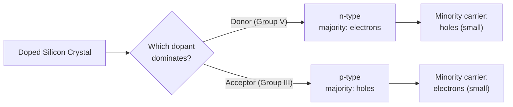

# Chapter 8: Doping, Ionization, and Temperature Regimes

<strong>Chapter Overview</strong> (click to expand)

Chapter 7 introduced donor and acceptor atoms as the source of carriers in an extrinsic semiconductor, and the hydrogenic model that predicts their ionization energies. This chapter turns that qualitative picture into a working, temperature-dependent model. Doping a crystal with donors produces **n-type** material; doping with acceptors produces **p-type** material — but dopant atoms are not always fully ionized, and how many actually are depends on temperature through the dopant's **ionization energy**. Tracking a doped sample's carrier concentration across its full temperature range reveals three distinct behaviors — the **freeze-out**, **extrinsic**, and **intrinsic** regions — and two further complications, **compensated** doping (donors and acceptors both present) and **degenerate** doping (so heavy that simple approximations break down), round out the practical picture this chapter builds.

**Key Takeaways:**

1. **N-type** material (donor-doped) has electrons as its majority carrier; **p-type** material (acceptor-doped) has holes as its majority carrier.
2. **Dopant ionization** is not automatically complete: the fraction of ionized donors or acceptors depends on temperature relative to the dopant's **ionization energy**, the same hydrogenic quantity Chapter 7 introduced.
3. **Doping concentration** (\(N_D\) or \(N_A\)) sets the majority carrier concentration only once dopants are (nearly) fully ionized — the extrinsic region.
4. A **compensated semiconductor** contains both donor and acceptor atoms simultaneously; majority carrier type and concentration follow the **net doping**, \(N_D-N_A\) or \(N_A-N_D\), not either concentration alone.
5. Three temperature regions describe a doped semiconductor's carrier concentration: the low-temperature **freeze-out regime** (dopants not yet ionized), the moderate-temperature **extrinsic temperature region** (dopants fully ionized, carrier concentration ≈ doping level), and the high-temperature **intrinsic temperature region** (thermal generation overwhelms doping entirely).
6. A **degenerate semiconductor** is doped so heavily that the Fermi level is pushed to or past the conduction (or valence) band edge, invalidating the simplified carrier-statistics approximations used in Chapters 9-10.
7. This chapter's temperature-regime and ionization framework is the direct qualitative foundation for Chapters 9-10's quantitative carrier-concentration equations.

## Learning Objectives

By the end of this chapter, you will be able to:

- Distinguish n-type from p-type doping by majority carrier sign
- Explain why dopant ionization is temperature-dependent, and estimate a dopant's characteristic ionization fraction at a given temperature
- Relate doping concentration to majority carrier concentration in the extrinsic (fully-ionized) region
- Compute net doping and majority carrier type for a compensated semiconductor
- Identify the freeze-out, extrinsic, and intrinsic temperature regions from a carrier-concentration-vs-temperature curve, and explain the physical mechanism behind each
- Explain what makes a semiconductor "degenerate," and why heavy doping invalidates simple non-degenerate approximations
- Solve worked and practice problems combining these ideas, in preparation for Chapter 9's quantitative carrier-concentration statistics

!!! note "How to read this chapter"
    This chapter is the bridge between Chapter 7's qualitative donor/acceptor picture and Chapters 9-10's exact carrier-concentration mathematics. Several formulas here (the ionization-fraction sigmoid, the degenerate-regime criterion) are deliberately simplified or previewed rather than rigorously derived — they are flagged clearly wherever this occurs. Focus on the qualitative shape of each result (why the curve looks the way it does) rather than memorizing the simplified formulas themselves; the exact versions come later.

## Introduction

Chapter 7 established that doping a semiconductor with donor or acceptor atoms creates carriers without relying on rare thermal bond-breaking, and that both donor and acceptor ionization are well described by a hydrogen-atom analogy predicting ionization energies of only tens of millielectron-volts. This chapter asks the natural next questions: what do we call the resulting doped material, how completely are those dopants actually ionized at a given temperature, and what happens to carrier concentration across a doped sample's entire operating temperature range?

The naming is straightforward: a crystal doped with donors is called **n-type** material, since its majority carriers are negatively-charged electrons; a crystal doped with acceptors is called **p-type** material, since its majority carriers are positively-charged holes. Real fabrication, however, often introduces both donor and acceptor atoms into the same region — deliberately, through sequential doping steps, or unintentionally, through contamination — producing a **compensated semiconductor** whose behavior depends on the *net* doping rather than either concentration alone.

The ionization question is more subtle. Chapter 7 showed that a donor's fifth electron (or an acceptor's hole) is only weakly bound, with an ionization energy of a few tens of meV — but "weakly bound" does not mean "always ionized." At sufficiently low temperature, thermal energy is not enough to ionize most dopant atoms at all, a condition called **freeze-out**. As temperature rises, more and more dopants ionize, until — at ordinary operating temperatures — essentially all of them are, and carrier concentration levels off at approximately the doping concentration itself, the **extrinsic temperature region**. Push temperature high enough, and thermally-generated intrinsic carriers (Chapter 7's electron-hole pairs) eventually outnumber the fixed doping concentration entirely, returning the material to intrinsic-like behavior — the **intrinsic temperature region**. Tracing carrier concentration across all three regions produces one of the most important diagnostic plots in semiconductor physics.

Finally, this chapter previews a limit on how far doping can be pushed before the simple pictures built so far break down. At very high doping concentrations, comparable to or exceeding the density of available states near a band edge, the Fermi level itself is pushed to, or past, the band edge — a **degenerate semiconductor**, where the material begins to behave somewhat like a metal and the non-degenerate approximations underlying Chapters 9-10's carrier-concentration equations no longer apply.

## Concepts Covered

This chapter covers the following 10 concepts from the learning graph:

1. N-Type Doping
2. P-Type Doping
3. Dopant Ionization
4. Ionization Energy
5. Doping Concentration
6. Compensated Semiconductor
7. Degenerate Semiconductor
8. Freeze-Out Regime
9. Extrinsic Temperature Region
10. Intrinsic Temperature Region

## Prerequisites

This chapter builds directly on [Chapter 7: Intrinsic and Extrinsic Semiconductors](../07-intrinsic-extrinsic-semiconductors/index.md), particularly donor and acceptor atoms, the hydrogenic ionization-energy model, and the intrinsic-vs-extrinsic carrier-concentration comparison.

## N-Type and P-Type Doping

### Naming Material by Majority Carrier

Chapter 7 showed that a donor atom contributes a free electron and an acceptor atom contributes a hole, each without breaking any covalent bond. The resulting doped material is named directly after which carrier dominates: **n-type** material is doped predominantly with donors, so free electrons are its **majority carrier** (with holes present only in small numbers, as **minority carriers**); **p-type** material is doped predominantly with acceptors, so holes are its majority carrier (with electrons as minority carriers).

| Doping type | Dominant dopant | Majority carrier | Minority carrier |
|---|---|---|---|
| n-type | Donor (Group V) | Free electron | Hole |
| p-type | Acceptor (Group III) | Hole | Free electron |

In the extrinsic temperature region (defined precisely later in this chapter), majority carrier concentration is set almost entirely by doping concentration: an n-type sample doped at \(N_D\) has majority electron concentration \(n_0\approx N_D\), and a p-type sample doped at \(N_A\) has majority hole concentration \(p_0\approx N_A\). Minority carrier concentration, by contrast, remains tiny — set by the much smaller intrinsic carrier concentration, a relationship Chapter 9's mass-action law makes precise.

!!! question "Concept Check"
    A silicon sample is doped only with boron. Is it n-type or p-type, and what is its majority carrier?

??? question "Concept Check — click to reveal answer"
    Boron is a Group III acceptor, so the sample is p-type, and its majority carrier is holes.

## Dopant Ionization and Ionization Energy

### Not All Dopants Are Always Ionized

**Dopant ionization** is the process by which a donor releases its weakly-bound electron (or an acceptor captures a neighboring electron, releasing a hole), covered structurally in Chapter 7. What Chapter 7 left open is *how much* ionization actually occurs at a given temperature — and the answer depends directly on the dopant's **ionization energy**, \(E_D\) (or \(E_A\) for an acceptor), the same hydrogenic quantity introduced in Chapter 7's hydrogen-atom analogy.

At very low temperature, thermal energy \(k_BT\) is far smaller than \(E_D\), and only a small fraction of dopant atoms have enough energy to ionize — most remain **frozen out**, still holding their weakly-bound electron or hole. As temperature rises, \(k_BT\) grows relative to \(E_D\), and the ionized fraction rises correspondingly, eventually approaching 1 (essentially complete ionization) once \(k_BT\) comfortably exceeds \(E_D\).

#### Diagram: Dopant Ionization Fraction vs. Temperature Explorer

<iframe src="../../sims/dopant-ionization-fraction-explorer/main.html" width="100%" height="640px" scrolling="auto"></iframe>

!!! tip "How to use this MicroSim"
    **Instructions:** Drag the temperature marker across the plotted curve, then adjust the ionization energy slider and observe how the curve shifts.

    **Learning objective:** Interpret an ionization-fraction curve, and explain how ionization energy controls the temperature at which dopants become mostly ionized.

    **What to observe:** A larger ionization energy shifts the entire curve toward higher temperature — a more tightly-bound dopant requires more thermal energy before it substantially ionizes.

[Full MicroSim documentation →](../../sims/dopant-ionization-fraction-explorer/index.md)

Recall from Chapter 7's hydrogenic ionization energy calculator and dopant ionization energy chart that measured donor/acceptor ionization energies in silicon are typically tens of meV — comparable to room-temperature thermal energy, \(k_BT\approx26\) meV at \(T=300\) K. This is precisely why "complete ionization" is such a good approximation at and above room temperature for ordinary doping levels, and precisely why it fails at cryogenic temperatures.

!!! example "Worked Example 1 — Estimating Ionization at Low Temperature"
    A phosphorus-doped silicon sample is cooled to \(T=77\) K (liquid nitrogen temperature), where \(k_BT\approx6.6\) meV. Phosphorus's ionization energy in silicon is about 45 meV. Is this sample likely to show significant freeze-out?

    **Solution:** Since \(k_BT\approx6.6\) meV is much smaller than \(E_D=45\) meV (\(E_D/k_BT\approx6.8\)), thermal energy is far from sufficient to ionize most donor atoms — this sample is deep in the freeze-out regime, with a significantly reduced free electron concentration compared to \(N_D\).

## Doping Concentration and the Extrinsic Approximation

### Setting Majority Carrier Concentration

**Doping concentration** — \(N_D\) for donors, \(N_A\) for acceptors, typically expressed in atoms per cm\(^3\) — is the single most important design parameter in a doped semiconductor, because it sets the majority carrier concentration once dopants are fully ionized. Chapter 7's doping concentration scale visualizer already showed just how dilute doping is relative to the host crystal's own atomic density; this chapter adds the temperature dimension, since \(n_0\approx N_D\) is only accurate in the extrinsic temperature region defined below, not at every temperature.

[Full MicroSim documentation → Doping Concentration Scale Visualizer](../../sims/doping-concentration-scale-visualizer/index.md) *(introduced in Chapter 7 — revisit it here to recall how doping concentration compares to host atomic density before this chapter adds temperature dependence)*

!!! example "Worked Example 2 — Majority Carrier Concentration in the Extrinsic Region"
    A silicon sample is doped with arsenic at \(N_D=2\times10^{16}\ \text{cm}^{-3}\) and operated at room temperature, well within the extrinsic region. Estimate its majority electron concentration.

    **Solution:** In the extrinsic region, dopants are essentially fully ionized, so \(n_0\approx N_D=2\times10^{16}\ \text{cm}^{-3}\).

## Compensated Semiconductors

### When Both Donors and Acceptors Are Present

A **compensated semiconductor** contains both donor and acceptor atoms in the same region of crystal — whether introduced deliberately (a common fabrication technique, where a lightly p-type region is locally converted to n-type by adding enough donors to outnumber the existing acceptors, or vice versa) or unintentionally, through contamination during growth or processing. Because a donor's free electron and an acceptor's hole can recombine with each other, only the *difference* between the two concentrations — the **net doping** — determines the majority carrier type and its concentration.

\[
N_{\text{net}} = N_D - N_A
\]

If \(N_{\text{net}}>0\) (more donors than acceptors), the material is net n-type with majority electron concentration approximately \(N_D-N_A\); if \(N_{\text{net}}<0\), the material is net p-type with majority hole concentration approximately \(N_A-N_D\). If the two concentrations are exactly equal, the donor and acceptor contributions cancel completely, and the material behaves as if intrinsic despite containing large numbers of both dopant species.

#### Diagram: Compensated Semiconductor Explorer

<iframe src="../../sims/compensated-semiconductor-explorer/main.html" width="100%" height="640px" scrolling="auto"></iframe>

!!! tip "How to use this MicroSim"
    **Instructions:** Adjust the \(N_D\) and \(N_A\) sliders independently and watch the net-doping card update.

    **Learning objective:** Compute net doping from independent donor and acceptor concentrations, and determine the resulting majority carrier type.

    **What to observe:** As \(N_D\) and \(N_A\) approach each other, the net doping shrinks toward zero, regardless of how large either individual concentration is.

[Full MicroSim documentation →](../../sims/compensated-semiconductor-explorer/index.md)

!!! example "Worked Example 3 — Net Doping in a Compensated Sample"
    A silicon region is doped with both phosphorus (\(N_D=8\times10^{15}\ \text{cm}^{-3}\)) and boron (\(N_A=5\times10^{15}\ \text{cm}^{-3}\)). Find the net doping and the resulting material type.

    **Solution:** \(N_{\text{net}}=N_D-N_A=8\times10^{15}-5\times10^{15}=3\times10^{15}\ \text{cm}^{-3}\). Since this is positive, the material is net n-type, with majority electron concentration approximately \(3\times10^{15}\ \text{cm}^{-3}\) — far less than either individual dopant concentration alone.

## Temperature Regions: Freeze-Out, Extrinsic, and Intrinsic

### Three Regimes, One Curve

Combining this chapter's ionization-fraction picture with Chapter 7's intrinsic carrier generation produces one of semiconductor physics's most important diagnostic plots: carrier concentration plotted against temperature for a fixed doping level. Three distinct regions appear, each dominated by a different physical mechanism.

| Region | Temperature range | Dominant mechanism | Carrier concentration behavior |
|---|---|---|---|
| Freeze-Out Regime | Low T | Dopants not yet thermally ionized | Rises steeply with T as ionization fraction increases |
| Extrinsic Temperature Region | Moderate T | Dopants (nearly) fully ionized | Flat plateau, \(n_0\approx N_D\) |
| Intrinsic Temperature Region | High T | Thermal (intrinsic) generation dominates | Rises steeply again as \(n_i(T)\) exceeds \(N_D\) |

At low temperature (the **freeze-out regime**), most dopant atoms are un-ionized, so carrier concentration is well below the doping level and rises quickly as temperature increases and ionization proceeds. Once temperature is high enough that essentially all dopants are ionized but not yet high enough for significant intrinsic generation, carrier concentration levels off at approximately \(N_D\) — the **extrinsic temperature region**, the regime nearly every practical device is designed to operate in, since carrier concentration here is stable and set by design (doping level) rather than by temperature. Push temperature high enough, and Chapter 7's thermally-generated intrinsic carriers — which grow exponentially with temperature — eventually exceed the fixed doping concentration entirely, returning the material to intrinsic-like behavior in the **intrinsic temperature region**.

#### Diagram: Carrier Concentration vs. Temperature (Three Regions) Explorer

<iframe src="../../sims/carrier-concentration-temperature-regions-explorer/main.html" width="100%" height="660px" scrolling="auto"></iframe>

!!! tip "How to use this MicroSim"
    **Instructions:** Trace the curve from low to high temperature, noting the shaded region colors, then adjust the \(N_D\) and \(E_D\) sliders.

    **Learning objective:** Identify all three temperature regions from a carrier-concentration curve, and explain how doping concentration and ionization energy shift each region's boundaries.

    **What to observe:** Increasing \(N_D\) raises the extrinsic plateau and pushes the intrinsic region's onset to a higher temperature (a heavier-doped sample stays extrinsic longer); increasing \(E_D\) stretches the freeze-out region to higher temperature.

[Full MicroSim documentation →](../../sims/carrier-concentration-temperature-regions-explorer/index.md)

!!! question "Concept Check"
    Why do device engineers generally design circuits to operate within the extrinsic temperature region rather than the freeze-out or intrinsic regions?

??? question "Concept Check — click to reveal answer"
    In the extrinsic region, carrier concentration is approximately constant (set by doping level, \(n_0\approx N_D\)) and essentially independent of small temperature fluctuations — predictable, stable device behavior. In the freeze-out region, carrier concentration (and therefore conductivity) changes rapidly with temperature, and in the intrinsic region, doping-based control is lost entirely as thermally-generated carriers dominate — neither is desirable for reliable circuit operation.

!!! example "Worked Example 4 — Identifying a Temperature Region"
    A doped silicon sample's carrier concentration is measured to be very close to its donor concentration \(N_D\), and does not change noticeably over a moderate temperature range around the measurement. Which temperature region is this sample in?

    **Solution:** A flat carrier concentration approximately equal to \(N_D\), insensitive to small temperature changes, is the signature of the extrinsic temperature region — dopants are essentially fully ionized, and intrinsic generation is still negligible.

## Degenerate Semiconductors

### When Doping Pushes Too Far

Everything in this chapter so far has assumed a **non-degenerate** semiconductor — one doped lightly enough that the Fermi level stays safely inside the band gap, away from either band edge, and simple statistical approximations remain valid. Push doping concentration high enough, however — comparable to or exceeding the effective density of states near the conduction (or valence) band edge — and this assumption breaks down. A **degenerate semiconductor** is doped so heavily that the Fermi level is pushed up to, or even past, the conduction band edge (for very heavy n-type doping) or down to, or past, the valence band edge (for very heavy p-type doping).

A useful preview (developed rigorously once Chapter 10 introduces the effective density of states \(N_C\)) is the relationship between doping and Fermi level position:

\[
E_C - E_F = k_BT\ln\!\left(\frac{N_C}{N_D}\right)
\]

For silicon at room temperature, \(N_C\approx2.8\times10^{19}\ \text{cm}^{-3}\). As \(N_D\) approaches this value, \(\ln(N_C/N_D)\) shrinks toward zero, and \(E_F\) rises to meet \(E_C\); push \(N_D\) past \(N_C\) and the formula predicts \(E_F\) above \(E_C\) entirely — the hallmark of degeneracy, and a regime where this formula itself is no longer strictly valid (it assumes non-degenerate, Boltzmann-like statistics in its derivation).

#### Diagram: Degenerate Semiconductor Explorer

<iframe src="../../sims/degenerate-semiconductor-explorer/main.html" width="100%" height="600px" scrolling="auto"></iframe>

!!! tip "How to use this MicroSim"
    **Instructions:** Drag the \(N_D\) slider from low to very high values and watch the computed Fermi level position and the degenerate-regime warning.

    **Learning objective:** Predict Fermi level position from doping concentration, and justify why very heavy doping invalidates the non-degenerate approximation.

    **What to observe:** The Fermi level line stays well below \(E_C\) at low doping, and rises to meet (and cross) \(E_C\) as \(N_D\) approaches and exceeds \(N_C\approx2.8\times10^{19}\ \text{cm}^{-3}\).

[Full MicroSim documentation →](../../sims/degenerate-semiconductor-explorer/index.md)

Degenerate semiconductors are not merely a theoretical curiosity — heavily-doped regions (source/drain contacts in a MOSFET, or the emitter of a bipolar transistor) are routinely doped into the degenerate regime deliberately, since very low resistivity is often more important there than the validity of simplified carrier statistics.

!!! example "Worked Example 5 — Checking for Degeneracy"
    A silicon sample is doped at \(N_D=5\times10^{19}\ \text{cm}^{-3}\). Using \(N_C\approx2.8\times10^{19}\ \text{cm}^{-3}\), is this sample degenerate?

    **Solution:** Since \(N_D=5\times10^{19}\ \text{cm}^{-3}\) exceeds \(N_C\approx2.8\times10^{19}\ \text{cm}^{-3}\), the ratio \(N_C/N_D<1\), so \(\ln(N_C/N_D)<0\) and the formula predicts \(E_F\) above \(E_C\) — this sample is degenerate.

## Summary

This chapter turned Chapter 7's qualitative donor/acceptor picture into a working model of doped-semiconductor behavior. Donor doping produces **n-type** material (majority carrier: electrons); acceptor doping produces **p-type** material (majority carrier: holes). **Dopant ionization** is temperature-dependent, governed by the dopant's **ionization energy** relative to available thermal energy, and is not automatically complete. **Doping concentration** sets majority carrier concentration only once ionization is essentially complete. A **compensated semiconductor**, containing both donor and acceptor atoms, is governed by its **net doping**, \(N_D-N_A\) or \(N_A-N_D\). Plotting carrier concentration against temperature reveals three regions: the **freeze-out regime** (low T, dopants not yet ionized), the **extrinsic temperature region** (moderate T, carrier concentration ≈ doping level — the region most devices are designed to operate in), and the **intrinsic temperature region** (high T, thermal generation dominates regardless of doping). Finally, sufficiently heavy doping produces a **degenerate semiconductor**, where the Fermi level is pushed to or past a band edge, invalidating the simplified, non-degenerate statistics this chapter (and Chapters 9-10) otherwise rely on. Chapter 9 now develops the exact carrier-concentration statistics — the Fermi-Dirac distribution and density of states integrated together — that make every relationship in this chapter quantitatively precise.

## Key Equations

| Concept | Equation |
|---|---|
| Net doping (n-type if positive) | \(N_{\text{net}} = N_D - N_A\) |
| Net doping (p-type if positive) | \(N_{\text{net}} = N_A - N_D\) |
| Majority carrier concentration (extrinsic region) | \(n_0\approx N_D\) (n-type), \(p_0\approx N_A\) (p-type) |
| Simplified dopant ionization fraction | \(f_{ion}(T) = \dfrac{1}{1+B\,e^{E_D/k_BT}}\) |
| Degenerate-regime criterion (preview) | \(E_C - E_F = k_BT\ln(N_C/N_D)\) |

## Glossary

See the [Chapter 8 Glossary](glossary.md) for full definitions of every term introduced in this chapter.

## Further Reading

- Neamen, *Semiconductor Physics and Devices* — direct treatment of n-type/p-type doping, freeze-out, and degenerate semiconductors
- Sze and Ng, *Physics of Semiconductor Devices* — extensive treatment of compensated and heavily-doped material
- Pierret, *Semiconductor Device Fundamentals* — clear derivation of the temperature-dependent ionization and carrier-freeze-out equations
- Kittel, *Introduction to Solid State Physics* — background on degenerate statistics and heavily-doped semiconductors

## Worked Examples

!!! example "Worked Example 6 — Comparing Two Dopants' Freeze-Out Behavior"
    Dopant A has ionization energy 30 meV; Dopant B has ionization energy 80 meV. At a fixed low temperature, which dopant will show a higher ionization fraction?

    **Solution:** A smaller ionization energy requires less thermal energy to ionize, so Dopant A (30 meV) will have a higher ionization fraction than Dopant B (80 meV) at the same temperature — consistent with the ionization-fraction formula's dependence on \(E_D/k_BT\).

!!! example "Worked Example 7 — Net Doping with Acceptors Dominant"
    A silicon sample has \(N_A=6\times10^{16}\ \text{cm}^{-3}\) and \(N_D=1\times10^{16}\ \text{cm}^{-3}\). Find the net doping and material type.

    **Solution:** \(N_{\text{net}}=N_A-N_D=6\times10^{16}-1\times10^{16}=5\times10^{16}\ \text{cm}^{-3}\), positive for acceptors, so the material is net p-type with majority hole concentration approximately \(5\times10^{16}\ \text{cm}^{-3}\).

!!! example "Worked Example 8 — Estimating a Region from Behavior Description"
    A doped sample's carrier concentration is observed to increase rapidly as temperature is raised from 20 K to 150 K, then remain nearly flat from 150 K to 400 K. Identify the two regions this describes.

    **Solution:** The rapid increase from 20 K to 150 K describes the freeze-out regime (dopants progressively ionizing); the flat plateau from 150 K to 400 K describes the extrinsic temperature region (dopants fully ionized, intrinsic generation still negligible).

!!! example "Worked Example 9 — Fully Compensated Sample"
    A silicon sample has \(N_D=N_A=4\times10^{16}\ \text{cm}^{-3}\) exactly. Describe its expected behavior.

    **Solution:** Net doping is exactly zero (\(N_D-N_A=0\)), so despite containing large numbers of both donor and acceptor atoms, the sample behaves electrically as if intrinsic — its carrier concentration is governed by thermal generation alone, just like Chapter 7's pure crystal.

!!! example "Worked Example 10 — Degenerate Doping in a Transistor Contact"
    A MOSFET's source/drain region is doped at \(N_D=1\times10^{20}\ \text{cm}^{-3}\), well above silicon's \(N_C\approx2.8\times10^{19}\ \text{cm}^{-3}\). Explain why this is done despite creating a degenerate semiconductor.

    **Solution:** Such heavy doping is used deliberately to minimize the contact region's resistivity (more free carriers means lower resistance), which is more important for a low-resistance ohmic contact than maintaining the validity of the simplified non-degenerate carrier-statistics approximations used elsewhere in the device.

