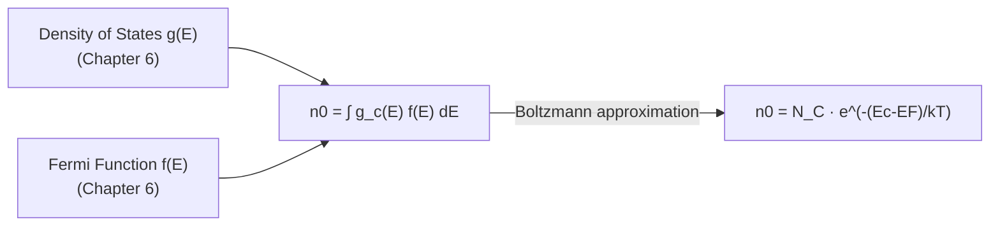
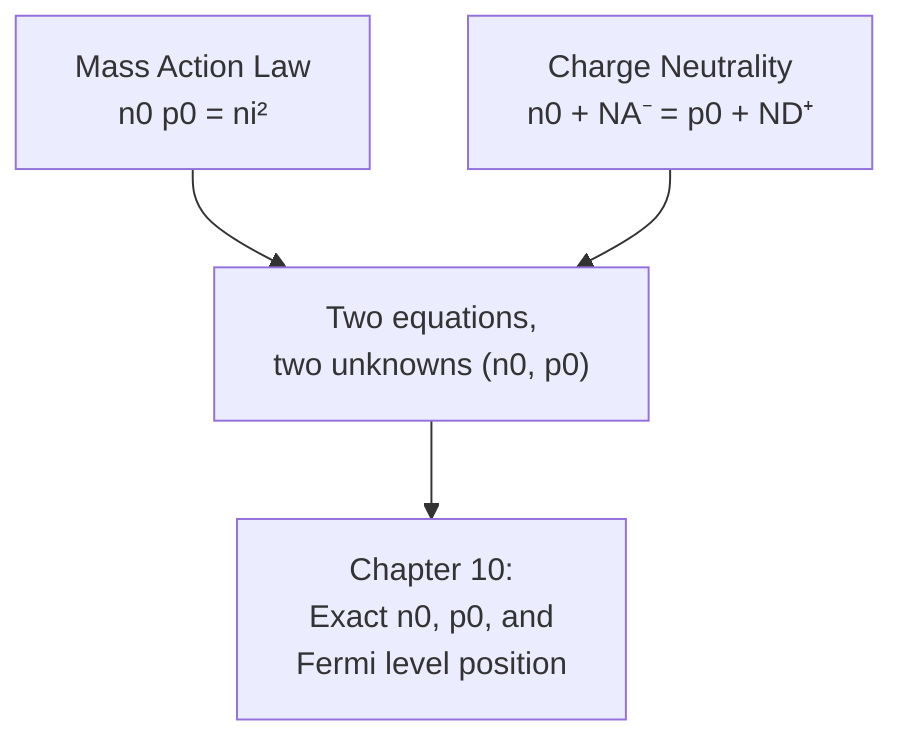

# Chapter 9: Carrier Concentration Statistics

<strong>Chapter Overview</strong> (click to expand)

Every earlier chapter has used carrier concentration numbers — silicon's \(n_i\approx10^{10}\ \text{cm}^{-3}\), a doped sample's \(n_0\approx N_D\) — without deriving them. This chapter closes that gap. Combining Chapter 6's density of states with Chapter 6's Fermi-Dirac distribution, and integrating over all conduction-band (or valence-band) states, produces an exact expression for carrier concentration that collapses, for any non-degenerate semiconductor, into a strikingly simple form: a single **effective density of states** multiplied by an exponential. From there, the **intrinsic carrier concentration**, the **mass action law**, and the **charge neutrality condition** fall out directly — the mathematical machinery every later carrier-statistics calculation in this course depends on.

**Key Takeaways:**

1. **Free electrons** and **holes** are this course's two charge carrier types; an **electron-hole pair** is the two carriers jointly created by a single intrinsic generation event (Chapter 7).
2. The **Fermi-Dirac distribution** — its specific formula often called the **Fermi function** — gives the probability that a state of energy \(E\) is occupied; combined with the **density of states function** \(g(E)\) (Chapter 6), it lets carrier concentration be computed as an integral, \(n_0=\int_{E_C}^{\infty}g_c(E)f(E)\,dE\).
3. For a non-degenerate semiconductor, the Fermi function in the conduction band is well approximated by the Boltzmann approximation, and the integral evaluates in closed form to \(n_0=N_Ce^{-(E_C-E_F)/k_BT}\), where \(N_C\), the **effective density of states**, absorbs the entire integral into one number.
4. Multiplying the electron and hole concentration formulas together, the Fermi level cancels completely, producing the **mass action law**, \(n_0p_0=n_i^2\) — true at thermal equilibrium regardless of doping — where \(n_i\), the **intrinsic carrier concentration**, is \(\sqrt{N_CN_V}\,e^{-E_g/2k_BT}\).
5. The **charge neutrality condition**, \(n_0+N_A^-=p_0+N_D^+\), is the final equation needed (together with the mass action law) to solve exactly for \(n_0\) and \(p_0\) at any doping level — the subject Chapter 10 completes.
6. This chapter's equations make quantitatively precise every carrier-concentration relationship Chapters 7 and 8 previewed qualitatively.

## Learning Objectives

By the end of this chapter, you will be able to:

- Define free electrons and holes as charge carriers, and describe how an electron-hole pair is created together
- State the Fermi-Dirac distribution (Fermi function) and explain the role of the density of states function in computing carrier concentration
- Derive the effective density of states \(N_C\) (and \(N_V\)) from the density-of-states integral under the Boltzmann approximation
- Compute non-degenerate electron and hole concentrations, \(n_0=N_Ce^{-(E_C-E_F)/k_BT}\) and \(p_0=N_Ve^{-(E_F-E_V)/k_BT}\)
- Derive and apply the intrinsic carrier concentration formula, \(n_i=\sqrt{N_CN_V}\,e^{-E_g/2k_BT}\)
- State and apply the mass action law, \(n_0p_0=n_i^2\), and explain why it holds regardless of doping
- State the charge neutrality condition and explain its role (together with the mass action law) in solving for exact carrier concentrations
- Solve worked and practice problems combining these ideas, in preparation for Chapter 10's exact carrier-concentration and Fermi-level-position equations

!!! note "How to read this chapter"
    This is the most mathematically dense chapter so far, but nearly every result follows from one idea applied twice: multiply a density of states by an occupation probability and integrate. The Boltzmann approximation (introduced in Chapter 8 and explored quantitatively here) is what makes the integral solvable in closed form, and every subsequent result — \(N_C\), \(n_i\), the mass action law — is a direct consequence of that one substitution. If you understand *why* the Boltzmann approximation lets the integral collapse into \(N_Ce^{-(E_C-E_F)/k_BT}\), the rest of the chapter follows almost automatically.

## Introduction

Every chapter since Chapter 6 has used numerical carrier concentrations — silicon's intrinsic carrier concentration \(n_i\approx10^{10}\ \text{cm}^{-3}\) (Chapter 7), a doped sample's majority carrier concentration \(n_0\approx N_D\) (Chapter 8) — without showing where these numbers actually come from. This chapter derives them from first principles, using tools already in hand: Chapter 6's density of states function \(g(E)\), which counts available electron states at each energy, and Chapter 6's Fermi-Dirac distribution \(f(E)\), which gives the probability that a state at a given energy is occupied.

The core idea is straightforward: the number of electrons per unit volume in the conduction band is the number of *available* states at each energy, weighted by the *probability* that each state is actually filled, summed (integrated) over every conduction-band energy:

\[
n_0 = \int_{E_C}^{\infty} g_c(E)\,f(E)\,dE
\]

This integral looks intimidating, but Chapter 8 already introduced the key simplification that makes it solvable: for a non-degenerate semiconductor, where the Fermi level sits comfortably inside the band gap, every conduction-band state satisfies \(E-E_F\gg k_BT\), and the Fermi function is extremely well approximated by the much simpler Boltzmann approximation, \(f(E)\approx e^{-(E-E_F)/k_BT}\). Substituting this approximation transforms the integral into a standard, closed-form result, collapsing the entire density-of-states integral into a single number called the **effective density of states**, \(N_C\).

Once \(n_0\) and the analogous hole concentration \(p_0\) are in hand, two of this course's most important relationships follow almost immediately. Multiplying \(n_0\) and \(p_0\) together, the Fermi level — which appears in both formulas — cancels out completely, leaving a product that depends only on temperature and material properties: the **mass action law**, \(n_0p_0=n_i^2\), where \(n_i\) is the **intrinsic carrier concentration** this chapter also derives explicitly. This single equation, true at thermal equilibrium in *any* non-degenerate semiconductor regardless of doping level, is the mathematical foundation for essentially every carrier-concentration calculation in the rest of this course, including the p-n junction chapters ahead.

Finally, this chapter states (without yet solving) the **charge neutrality condition** — the statement that a doped semiconductor, taken as a whole, must remain electrically neutral. Combined with the mass action law, charge neutrality provides exactly the two equations needed to solve for \(n_0\) and \(p_0\) at any doping level and temperature, closing the loop on Chapter 8's freeze-out, extrinsic, and intrinsic temperature regions with exact mathematics. Solving that combined system explicitly is Chapter 10's task.

## Concepts Covered

This chapter covers the following 10 concepts from the learning graph:

1. Free Electron
2. Hole
3. Electron-Hole Pair
4. Fermi-Dirac Distribution
5. Fermi Function
6. Density of States Function
7. Effective Density of States
8. Intrinsic Carrier Concentration
9. Mass Action Law
10. Charge Neutrality Condition

## Prerequisites

This chapter builds on [Chapter 1: Physics and Math Foundations](../01-physics-math-foundations/index.md) (integration), [Chapter 5: Quantum Mechanics of Periodic Crystals](../05-quantum-mechanics-periodic-crystals/index.md) and [Chapter 6: Band Structure and the Fermi Level](../06-band-structure-fermi-level/index.md) (the density of states function and Fermi-Dirac distribution), and [Chapter 7: Intrinsic and Extrinsic Semiconductors](../07-intrinsic-extrinsic-semiconductors/index.md) and [Chapter 8: Doping, Ionization, and Temperature Regimes](../08-doping-ionization-temperature/index.md) (intrinsic/extrinsic carrier concentrations and the Boltzmann approximation).

## Free Electrons, Holes, and Electron-Hole Pairs

### The Two Charge Carriers, Formally

A **free electron** is a conduction-band electron free to move through the crystal and contribute to current — the same carrier Chapters 6 through 8 have used throughout, now given a name of its own. A **hole** is the corresponding vacancy left behind in the valence band, which behaves, for essentially every practical purpose, as a mobile positive charge carrier with its own effective mass (Chapter 6). Semiconductor physics is unusual among branches of solid-state physics precisely because it must track *two* carrier types simultaneously, rather than one.

An **electron-hole pair** is the pairing of exactly these two carriers created together by a single generation event — a thermally-broken covalent bond (Chapter 7), or, as Chapter 17 will show, an absorbed photon with energy exceeding the band gap. Every concept this chapter builds — the density of states, the Fermi function, the effective density of states — applies essentially identically to electrons in the conduction band and holes in the valence band, simply substituting the appropriate effective mass and band edge.

## The Fermi-Dirac Distribution and the Fermi Function

### From Occupation Probability to an Integral

Chapter 6 introduced the **Fermi-Dirac distribution**, the statistical law governing how identical fermions (electrons obey the Pauli exclusion principle) distribute themselves among available energy states in thermal equilibrium. Its specific mathematical formula — often called simply the **Fermi function** when used computationally rather than discussed as a general statistical law — is:

\[
f(E) = \frac{1}{1+e^{(E-E_F)/k_BT}}
\]

To compute carrier concentration, this probability must be combined with the **density of states function**, \(g(E)\) (Chapter 6), which counts how many states exist at each energy. The product \(g(E)f(E)\) is therefore the density of *occupied* states at energy \(E\), and integrating this product over all conduction-band energies gives the total electron concentration:

\[
n_0 = \int_{E_C}^{\infty} g_c(E)\,f(E)\,dE
\]

with the exactly analogous integral, using \(1-f(E)\) (the probability a state is *empty*, i.e., holds a hole) and the valence-band density of states \(g_v(E)\), giving the hole concentration \(p_0\) below \(E_V\).

#### Diagram: Fermi Function and Boltzmann Approximation Explorer

<iframe src="../../sims/fermi-function-boltzmann-approximation-explorer/main.html" width="100%" height="640px" scrolling="auto"></iframe>

!!! tip "How to use this MicroSim"
    **Instructions:** Compare the exact Fermi function curve to its Boltzmann approximation, and note the shaded region where they agree closely.

    **Learning objective:** Identify the energy range where the Boltzmann approximation is valid, and connect this directly to the non-degenerate assumption from Chapter 8.

    **What to observe:** For \(E-E_F\) more than a few times \(k_BT\), the two curves are nearly indistinguishable — exactly the condition satisfied by every conduction-band state in a non-degenerate semiconductor.

[Full MicroSim documentation →](../../sims/fermi-function-boltzmann-approximation-explorer/index.md)

!!! question "Concept Check"
    Why can the density of states integral for \(n_0\) be simplified so dramatically for a non-degenerate semiconductor, but not for a degenerate one (Chapter 8)?

??? question "Concept Check — click to reveal answer"
    In a non-degenerate semiconductor, the Fermi level sits well inside the gap, so every conduction-band state satisfies \(E-E_F\gg k_BT\), letting the Fermi function be replaced by the much simpler Boltzmann approximation and the integral solved in closed form. In a degenerate semiconductor, the Fermi level sits inside (or above) the conduction band itself, so many states have \(E-E_F\) comparable to or less than \(k_BT\), where the Boltzmann approximation fails and the full Fermi-Dirac integral must be evaluated numerically instead.

## The Effective Density of States

### Collapsing an Integral into One Number

Substituting the Boltzmann approximation, \(f(E)\approx e^{-(E-E_F)/k_BT}\), into the electron concentration integral and using the parabolic-band density of states from Chapter 6, \(g_c(E)=\frac{1}{2\pi^2}(2m_e^*/\hbar^2)^{3/2}\sqrt{E-E_C}\), the integral becomes a standard Gamma-function integral that evaluates in closed form. The result is remarkably compact:

\[
n_0 = N_Ce^{-(E_C-E_F)/k_BT}, \qquad N_C = 2\left(\frac{2\pi m_e^*k_BT}{h^2}\right)^{3/2}
\]

The constant \(N_C\) — the **effective density of states** for the conduction band — has absorbed the entire integral (the density-of-states shape, the effective mass, the temperature dependence) into a single number, with units of concentration (cm\(^{-3}\)). It can be interpreted as if all the conduction band's states were collapsed into a single effective energy level sitting exactly at \(E_C\), with an equivalent "degeneracy" of \(N_C\) states. The exactly analogous result holds for holes:

\[
p_0 = N_Ve^{-(E_F-E_V)/k_BT}, \qquad N_V = 2\left(\frac{2\pi m_h^*k_BT}{h^2}\right)^{3/2}
\]

For silicon at \(T=300\) K, using density-of-states effective masses \(m_e^*=1.08\,m_0\) and \(m_h^*=0.56\,m_0\) (which already include the valley-degeneracy correction flagged in Chapter 7), these formulas give \(N_C\approx2.8\times10^{19}\ \text{cm}^{-3}\) and \(N_V\approx1.04\times10^{19}\ \text{cm}^{-3}\) — precisely the values Chapter 8 used when previewing the degenerate-semiconductor criterion.

#### Diagram: Effective Density of States and Intrinsic Carrier Concentration Calculator

<iframe src="../../sims/effective-density-of-states-calculator/main.html" width="100%" height="600px" scrolling="auto"></iframe>

!!! tip "How to use this MicroSim"
    **Instructions:** Select each material and drag the temperature slider, watching \(N_C\), \(N_V\), and \(n_i\) update live.

    **Learning objective:** Apply the effective-density-of-states formula, and observe how strongly \(n_i\) depends on both material (via band gap and effective mass) and temperature.

    **What to observe:** GaAs's tiny electron effective mass (0.067 \(m_0\)) gives it a much smaller \(N_C\) than silicon's, since \(N_C\propto(m^*)^{3/2}\).

[Full MicroSim documentation →](../../sims/effective-density-of-states-calculator/index.md)

!!! example "Worked Example 1 — Computing n₀ from N_C"
    A silicon sample at \(T=300\) K has its Fermi level \(0.20\) eV below \(E_C\). Using \(N_C\approx2.8\times10^{19}\ \text{cm}^{-3}\) and \(k_BT\approx0.0259\) eV, find \(n_0\).

    **Solution:**

    \[
    n_0 = N_Ce^{-(E_C-E_F)/k_BT} = (2.8\times10^{19})e^{-0.20/0.0259} = (2.8\times10^{19})e^{-7.72} \approx (2.8\times10^{19})(4.43\times10^{-4}) \approx 1.24\times10^{16}\ \text{cm}^{-3}
    \]

## Intrinsic Carrier Concentration

### A Single Number That Anchors Every Calculation

Multiplying \(n_0\) and \(p_0\) together and simplifying \(E_C-E_F+E_F-E_V=E_C-E_V=E_g\) gives:

\[
n_0p_0 = N_CN_Ve^{-E_g/k_BT}
\]

In a pure (intrinsic) semiconductor, \(n_0=p_0\) by charge neutrality (every thermally-generated electron is paired with a hole, Chapter 7), and both equal the **intrinsic carrier concentration**, \(n_i\). Setting \(n_0=p_0=n_i\) in the equation above and taking a square root gives the standard result:

\[
n_i = \sqrt{N_CN_V}\;e^{-E_g/2k_BT}
\]

This single number — combining band gap, both effective masses, and temperature into one exponentially-sensitive quantity — is the anchor for essentially every carrier-concentration calculation in this and later chapters.

!!! example "Worked Example 2 — Computing n_i for Silicon"
    Using \(N_C\approx2.8\times10^{19}\ \text{cm}^{-3}\), \(N_V\approx1.04\times10^{19}\ \text{cm}^{-3}\), \(E_g=1.12\) eV, and \(k_BT\approx0.0259\) eV, estimate silicon's intrinsic carrier concentration at 300 K.

    **Solution:**

    \[
    n_i = \sqrt{(2.8\times10^{19})(1.04\times10^{19})}\;e^{-1.12/(2\times0.0259)} = \sqrt{2.91\times10^{38}}\;e^{-21.6}
    \]

    \[
    n_i \approx (1.71\times10^{19})(3.9\times10^{-10}) \approx 6.6\times10^{9}\ \text{cm}^{-3}
    \]

    This lands close to (though not exactly at) the commonly-quoted value \(n_i\approx9.65\times10^{9}\ \text{cm}^{-3}\) used elsewhere in this book — the small difference comes entirely from rounding \(E_g\) and the effective masses to three significant figures. Because \(n_i\) depends on \(E_g\) through \(e^{-E_g/2k_BT}\), even a \(0.01\) eV change in \(E_g\) changes the result by over 20% — the same exponential sensitivity flagged all the way back in Chapter 1.

## The Mass Action Law

### Why the Fermi Level Cancels Out

Rewriting the \(n_0p_0\) product from the previous section in terms of \(n_i\) gives one of this course's most important and most frequently used relationships, the **mass action law**:

\[
n_0p_0 = n_i^2
\]

The remarkable feature of this equation is what is *missing* from it: the Fermi level \(E_F\), which appears explicitly in both the \(n_0\) and \(p_0\) formulas, cancels out completely when the two are multiplied. This means the mass action law holds at thermal equilibrium in *any* non-degenerate semiconductor — intrinsic or doped n-type or doped p-type — regardless of the doping level. Doping shifts \(E_F\) (as Chapter 10 makes precise) and therefore shifts \(n_0\) and \(p_0\) individually, but their *product* is fixed by temperature and material alone.

#### Diagram: Mass Action Law Explorer

<iframe src="../../sims/mass-action-law-explorer/main.html" width="100%" height="600px" scrolling="auto"></iframe>

!!! tip "How to use this MicroSim"
    **Instructions:** Drag the \(n_0\) slider across its range and watch \(p_0\) adjust automatically to keep \(n_0p_0=n_i^2\).

    **Learning objective:** Apply the mass action law to compute minority carrier concentration from majority carrier concentration, and explain why the Fermi level cancels from the product.

    **What to observe:** As \(n_0\) rises far above \(n_i\) (heavy n-type doping), \(p_0\) falls correspondingly far below \(n_i\) — doping does not just add majority carriers, it actively suppresses the minority carrier population.

[Full MicroSim documentation →](../../sims/mass-action-law-explorer/index.md)

!!! example "Worked Example 3 — Minority Carrier Concentration via Mass Action"
    A silicon sample is doped n-type with \(n_0=10^{16}\ \text{cm}^{-3}\) at \(T=300\) K, where \(n_i\approx9.65\times10^{9}\ \text{cm}^{-3}\). Find the minority hole concentration.

    **Solution:**

    \[
    p_0 = \frac{n_i^2}{n_0} = \frac{(9.65\times10^{9})^2}{10^{16}} = \frac{9.31\times10^{19}}{10^{16}} \approx 9310\ \text{cm}^{-3}
    \]

    The minority hole concentration is minuscule compared to both the majority electron concentration and even the intrinsic concentration itself — a direct quantitative confirmation of Chapter 7 and 8's qualitative claim that doping dramatically suppresses the minority carrier.

## The Charge Neutrality Condition

### Setting Up (But Not Yet Solving) the Full Problem

The mass action law is one equation relating \(n_0\) and \(p_0\); a second, independent equation is needed to solve for both individually at a given doping level. That second equation is the **charge neutrality condition**: since the semiconductor crystal as a whole carries no net charge, the total positive charge (holes, plus ionized donor atoms, each a fixed \(+1\) ion) must exactly balance the total negative charge (free electrons, plus ionized acceptor atoms, each a fixed \(-1\) ion):

\[
n_0 + N_A^- = p_0 + N_D^+
\]

where \(N_D^+\) and \(N_A^-\) are the concentrations of *ionized* donors and acceptors respectively (Chapter 8's ionization fraction determines how close these are to the total \(N_D\) and \(N_A\)). Together, the mass action law and the charge neutrality condition form a system of two equations in two unknowns (\(n_0\) and \(p_0\)), solvable exactly for any combination of doping and temperature.

This chapter deliberately stops short of solving this system explicitly — doing so, and extracting the resulting Fermi level position, is Chapter 10's task. What this chapter has established is *why* these two particular equations are exactly the right ones: the mass action law comes directly from the effective-density-of-states derivation above, and the charge neutrality condition is simply a statement that the crystal has no net charge, true regardless of doping level or temperature.

!!! question "Concept Check"
    In the extrinsic temperature region (Chapter 8), with complete ionization (\(N_D^+\approx N_D\), \(N_A^-\approx N_A\), and \(N_A=0\) for a purely n-type sample), show that the charge neutrality condition reduces to the familiar approximation \(n_0\approx N_D\).

??? question "Concept Check — click to reveal answer"
    With \(N_A=0\), charge neutrality reads \(n_0=p_0+N_D\). Since \(p_0\) is tiny (minority carrier, suppressed by the mass action law, as in Worked Example 3) compared to \(N_D\) at ordinary doping levels, this simplifies to \(n_0\approx N_D\) — exactly the extrinsic-region approximation Chapter 8 used throughout.

## Summary

This chapter derived, from first principles, the carrier-concentration numbers every earlier chapter used without proof. **Free electrons** and **holes**, created together as **electron-hole pairs**, populate their respective bands according to the **Fermi-Dirac distribution** (the **Fermi function**) combined with the **density of states function**, giving carrier concentration as an integral. Under the non-degenerate (Boltzmann) approximation, this integral collapses into \(n_0=N_Ce^{-(E_C-E_F)/k_BT}\), where \(N_C\), the **effective density of states**, absorbs the entire integral into one number (and analogously \(p_0=N_Ve^{-(E_F-E_V)/k_BT}\)). Multiplying these together, the Fermi level cancels, producing the **mass action law**, \(n_0p_0=n_i^2\), where \(n_i=\sqrt{N_CN_V}\,e^{-E_g/2k_BT}\) is the **intrinsic carrier concentration**. Finally, the **charge neutrality condition**, \(n_0+N_A^-=p_0+N_D^+\), together with the mass action law, provides exactly the two equations needed to solve for \(n_0\) and \(p_0\) at any doping level — the system Chapter 10 now solves explicitly, along with the resulting Fermi level position.

## Key Equations

| Concept | Equation |
|---|---|
| Fermi function | \(f(E) = \dfrac{1}{1+e^{(E-E_F)/k_BT}}\) |
| Electron concentration (integral form) | \(n_0 = \displaystyle\int_{E_C}^{\infty} g_c(E)\,f(E)\,dE\) |
| Electron concentration (non-degenerate) | \(n_0 = N_Ce^{-(E_C-E_F)/k_BT}\) |
| Hole concentration (non-degenerate) | \(p_0 = N_Ve^{-(E_F-E_V)/k_BT}\) |
| Effective density of states (conduction band) | \(N_C = 2\left(\dfrac{2\pi m_e^*k_BT}{h^2}\right)^{3/2}\) |
| Intrinsic carrier concentration | \(n_i = \sqrt{N_CN_V}\;e^{-E_g/2k_BT}\) |
| Mass action law | \(n_0p_0 = n_i^2\) |
| Charge neutrality condition | \(n_0 + N_A^- = p_0 + N_D^+\) |

## Glossary

See the [Chapter 9 Glossary](glossary.md) for full definitions of every term introduced in this chapter.

## Further Reading

- Neamen, *Semiconductor Physics and Devices* — the standard derivation of the effective density of states and mass action law
- Sze and Ng, *Physics of Semiconductor Devices* — extensive tables of \(N_C\), \(N_V\), and \(n_i\) for real materials
- Pierret, *Semiconductor Device Fundamentals* — a careful, step-by-step derivation of the carrier-concentration integral
- Ashcroft and Mermin, *Solid State Physics* — rigorous background on Fermi-Dirac statistics applied to solids

## Worked Examples

!!! example "Worked Example 4 — Hole Concentration Near the Valence Band"
    A silicon sample at \(T=300\) K has its Fermi level \(0.35\) eV above \(E_V\). Using \(N_V\approx1.04\times10^{19}\ \text{cm}^{-3}\), find \(p_0\).

    **Solution:**

    \[
    p_0 = N_Ve^{-(E_F-E_V)/k_BT} = (1.04\times10^{19})e^{-0.35/0.0259} \approx (1.04\times10^{19})(7.85\times10^{-6}) \approx 8.2\times10^{13}\ \text{cm}^{-3}
    \]

!!! example "Worked Example 5 — Verifying the Mass Action Law Numerically"
    Using the results of Worked Example 1 (\(n_0\approx1.24\times10^{16}\ \text{cm}^{-3}\)) and Worked Example 4 (\(p_0\approx8.2\times10^{13}\ \text{cm}^{-3}\)), check whether \(n_0p_0\approx n_i^2\) for silicon at 300 K.

    **Solution:** \(n_0p_0\approx(1.24\times10^{16})(8.2\times10^{13})\approx1.02\times10^{30}\ \text{cm}^{-6}\). Comparing to \(n_i^2\approx(9.65\times10^9)^2\approx9.3\times10^{19}\ \text{cm}^{-6}\) — these do **not** match, which makes sense: Worked Examples 1 and 4 used two independently-chosen Fermi level positions (\(0.20\) eV below \(E_C\) and \(0.35\) eV above \(E_V\)) that do not correspond to the *same* physical sample. The mass action law only holds when \(n_0\) and \(p_0\) are computed from the *same* self-consistent Fermi level in the *same* sample — a caution worth remembering before combining numbers from different problems.

!!! example "Worked Example 6 — GaAs Intrinsic Carrier Concentration"
    Using GaAs's \(N_C\approx4.35\times10^{17}\ \text{cm}^{-3}\), \(N_V\approx8.3\times10^{18}\ \text{cm}^{-3}\), and \(E_g=1.42\) eV at 300 K, estimate \(n_i\).

    **Solution:**

    \[
    n_i = \sqrt{(4.35\times10^{17})(8.3\times10^{18})}\;e^{-1.42/(2\times0.0259)} = \sqrt{3.61\times10^{36}}\;e^{-27.4}
    \]

    \[
    n_i \approx (1.90\times10^{18})(1.26\times10^{-12}) \approx 2.4\times10^{6}\ \text{cm}^{-3}
    \]

    GaAs's much larger band gap gives it an intrinsic carrier concentration roughly four orders of magnitude smaller than silicon's — one reason GaAs devices can operate with far less intrinsic leakage current at a given temperature.

!!! example "Worked Example 7 — Minority Carriers in p-type Material"
    A silicon sample is doped p-type with \(p_0=5\times10^{15}\ \text{cm}^{-3}\) at 300 K. Find the minority electron concentration.

    **Solution:**

    \[
    n_0 = \frac{n_i^2}{p_0} = \frac{(9.65\times10^{9})^2}{5\times10^{15}} \approx \frac{9.3\times10^{19}}{5\times10^{15}} \approx 1.9\times10^{4}\ \text{cm}^{-3}
    \]

!!! example "Worked Example 8 — Charge Neutrality with Both Dopants Present"
    A compensated silicon sample (Chapter 8) has fully-ionized \(N_D=3\times10^{16}\ \text{cm}^{-3}\) and \(N_A=1\times10^{16}\ \text{cm}^{-3}\), with \(p_0\) negligible compared to these. Use charge neutrality to estimate \(n_0\).

    **Solution:** With \(p_0\) negligible, charge neutrality reduces to \(n_0\approx N_D-N_A=3\times10^{16}-1\times10^{16}=2\times10^{16}\ \text{cm}^{-3}\) — matching Chapter 8's net-doping result directly, now justified from the full charge neutrality equation rather than asserted qualitatively.

!!! example "Worked Example 9 — Temperature Dependence of N_C"
    By what factor does silicon's \(N_C\) change between \(T=300\) K and \(T=600\) K, given \(N_C\propto T^{3/2}\)?

    **Solution:**

    \[
    \frac{N_C(600)}{N_C(300)} = \left(\frac{600}{300}\right)^{3/2} = 2^{1.5} \approx 2.83
    \]

    \(N_C\) roughly triples — a modest change compared to the many-orders-of-magnitude change in \(n_i\) over the same temperature range, since \(n_i\)'s exponential dependence on \(E_g/2k_BT\) dominates completely over \(N_C\) and \(N_V\)'s much weaker power-law temperature dependence.

!!! example "Worked Example 10 — Comparing Two Materials' Mass Action Products"
    At the same temperature, will silicon or germanium have the larger \(n_0p_0\) product in a non-degenerate sample?

    **Solution:** Since \(n_0p_0=n_i^2\) and germanium's smaller band gap (0.66 eV vs. silicon's 1.12 eV) gives it a much larger \(n_i\) at any given temperature (as Chapter 7 and this chapter's calculator both show), germanium has the larger \(n_0p_0\) product — regardless of how either material is doped.

