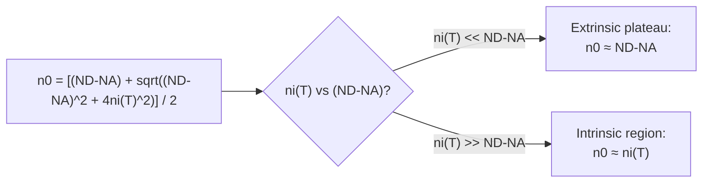

# Chapter 10: Fermi Level Position and Carrier Equations

<strong>Chapter Overview</strong> (click to expand)

Chapter 9 derived two equations — the mass action law and the charge neutrality condition — and deliberately stopped short of solving them together. This chapter finishes the job. Solving that system exactly, for any doping level and temperature, produces one closed-form **electron concentration** equation (and its **hole concentration** counterpart) that smoothly reproduces every limiting case Chapters 7-9 treated separately: the intrinsic limit, the extrinsic (fully-ionized) approximation, and everything in between. From there, the exact **Fermi level position** follows directly, the **intrinsic Fermi level** \(E_i\) emerges as a natural reference point near midgap, and the whole chapter culminates in the single most-used equation pair in the rest of this course: \(n_0=n_ie^{(E_F-E_i)/k_BT}\) and \(p_0=n_ie^{(E_i-E_F)/k_BT}\).

**Key Takeaways:**

1. The **Boltzmann approximation** and the resulting **nondegenerate semiconductor** assumption (Chapters 8-9) are the foundation this entire chapter's algebra rests on.
2. Solving the mass action law and charge neutrality condition together gives the exact **electron concentration equation**, \(n_0=\big[(N_D-N_A)+\sqrt{(N_D-N_A)^2+4n_i^2}\big]/2\), and the analogous **hole concentration** result — one formula valid at *any* doping level.
3. This exact formula directly explains **carrier temperature dependence**: as temperature rises and \(n_i(T)\) grows, the same equation smoothly sweeps from the extrinsic plateau (\(n_0\approx N_D-N_A\)) into the intrinsic region (\(n_0\to n_i\)), unifying Chapter 8's separate regimes.
4. Once \(n_0\) is known, the **Fermi level position** follows directly from \(E_C-E_F=k_BT\ln(N_C/n_0)\); doping shifts \(E_F\) toward whichever band edge corresponds to the majority carrier.
5. The **intrinsic Fermi level**, \(E_i\), is the special \(E_F\) value where \(n_0=p_0=n_i\); it sits close to — but not exactly at — the middle of the band gap, offset by a small term depending on \(N_C\) and \(N_V\).
6. Rewriting \(n_0\) and \(p_0\) relative to \(E_i\) instead of the band edges gives the **carrier concentration equations** \(n_0=n_ie^{(E_F-E_i)/k_BT}\) and \(p_0=n_ie^{(E_i-E_F)/k_BT}\) — the standard, most-frequently-used form of these equations for the rest of this course, especially the p-n junction chapters ahead.

## Learning Objectives

By the end of this chapter, you will be able to:

- State the Boltzmann approximation and the nondegenerate semiconductor assumption it depends on
- Derive the exact electron and hole concentration equations by solving the mass action law and charge neutrality condition together
- Explain carrier temperature dependence as a single smooth curve produced by the exact concentration equation, unifying the freeze-out, extrinsic, and intrinsic regions
- Compute Fermi level position from a known doping level and temperature
- Define the intrinsic Fermi level and compute its offset from exact midgap
- State and apply the general carrier concentration equations, \(n_0=n_ie^{(E_F-E_i)/k_BT}\) and \(p_0=n_ie^{(E_i-E_F)/k_BT}\)
- Solve worked and practice problems combining these ideas, in preparation for the transport and junction physics of Chapters 11-15

!!! note "How to read this chapter"
    This chapter is largely algebra applied to results Chapter 9 already derived — the physics does not change, only the bookkeeping. The single most important result is the exact electron concentration equation in the first section; nearly everything else in this chapter (Fermi level position, the intrinsic Fermi level, the final \(n_0=n_ie^{(E_F-E_i)/k_BT}\) form) is a direct algebraic consequence of that one equation. If you can explain why that equation correctly reduces to both the intrinsic and extrinsic limits, you understand this chapter's core idea.

## Introduction

Chapter 9 assembled two equations describing any non-degenerate semiconductor at thermal equilibrium: the mass action law, \(n_0p_0=n_i^2\), and the charge neutrality condition, \(n_0+N_A^-=p_0+N_D^+\). Two equations in two unknowns (\(n_0\) and \(p_0\)) can, in principle, always be solved — Chapter 9 deliberately stopped before doing so. This chapter completes that algebra.

Assuming complete ionization (Chapter 8's extrinsic-region assumption, \(N_D^+\approx N_D\), \(N_A^-\approx N_A\)), substituting \(p_0=n_i^2/n_0\) from the mass action law into the charge neutrality condition produces a single quadratic equation in \(n_0\) alone. Solving that quadratic gives a closed-form result that looks, at first glance, more complicated than anything Chapters 7-9 used — but it is exactly the equation that quietly justifies every approximation those chapters made. When doping dominates (\(N_D-N_A\gg n_i\)), it reduces to the familiar \(n_0\approx N_D-N_A\); when doping vanishes entirely, it reduces to \(n_0=n_i\), the purely intrinsic case. Chapters 7-9 always described these as two separate cases; this chapter shows they are the same formula, evaluated at different doping levels.

With \(n_0\) known exactly, the Fermi level's position follows immediately from the effective-density-of-states relationship Chapter 9 already derived, \(n_0=N_Ce^{-(E_C-E_F)/k_BT}\), solved for \(E_F\). This lets this chapter answer, precisely, a question every earlier chapter asked only qualitatively: exactly how far does doping push the Fermi level, and toward which band edge? A special case of this same result — the Fermi level's position when the material is purely intrinsic — defines the **intrinsic Fermi level**, \(E_i\), a reference energy that turns out to sit almost exactly at the middle of the band gap, with a small, calculable correction.

Finally, this chapter reframes the electron and hole concentration equations one more time, replacing the band-edge references \(E_C\) and \(E_V\) with the intrinsic Fermi level \(E_i\) instead. This produces the **carrier concentration equations** in the specific form used constantly throughout the rest of this course — the p-n junction chapters ahead compute built-in potential, depletion width, and diode current almost entirely in terms of how far \(E_F\) sits from \(E_i\) on the n-type and p-type sides of a junction.

## Concepts Covered

This chapter covers the following 8 concepts from the learning graph:

1. Boltzmann Approximation
2. Nondegenerate Semiconductor
3. Electron Concentration
4. Hole Concentration
5. Carrier Temperature Dependence
6. Fermi Level Position
7. Intrinsic Fermi Level
8. Carrier Concentration Equation

## Prerequisites

This chapter builds directly on [Chapter 6: Band Structure and the Fermi Level](../06-band-structure-fermi-level/index.md) (the Fermi-Dirac distribution and band diagram), [Chapter 8: Doping, Ionization, and Temperature Regimes](../08-doping-ionization-temperature/index.md) (complete ionization and temperature regions), and [Chapter 9: Carrier Concentration Statistics](../09-carrier-concentration-statistics/index.md) (the mass action law and charge neutrality condition, solved explicitly in this chapter).

## The Boltzmann Approximation and Nondegenerate Semiconductors

### The Assumption Everything Else Rests On

Every result in this chapter depends on one assumption, already introduced in Chapters 8 and 9: the **Boltzmann approximation**, \(f(E)\approx e^{-(E-E_F)/k_BT}\), valid whenever \(E-E_F\gg k_BT\) for every conduction-band state under consideration. A semiconductor satisfying this condition throughout its band of interest is called a **nondegenerate semiconductor** — the Fermi level sits safely inside the band gap, away from either band edge. Chapter 8's degenerate-semiconductor discussion showed what happens when this assumption fails (very heavy doping); this entire chapter, like Chapter 9, assumes it holds.

It is worth restating why this matters so much: without the Boltzmann approximation, the carrier-concentration integral from Chapter 9 has no simple closed form at all, and every equation this chapter derives — the exact \(n_0\), the Fermi level position formula, the intrinsic Fermi level — would require numerical integration instead of algebra. The nondegenerate assumption is what turns semiconductor carrier statistics from a numerical problem into an algebraic one.

## Electron and Hole Concentration: The Exact Equations

### Solving Two Equations Together

Starting from the mass action law, \(p_0=n_i^2/n_0\), and substituting into the charge neutrality condition, \(n_0+N_A=p_0+N_D\) (assuming complete ionization, so \(N_A^-\approx N_A\) and \(N_D^+\approx N_D\)):

\[
n_0 + N_A = \frac{n_i^2}{n_0} + N_D
\]

Multiplying through by \(n_0\) and rearranging gives a quadratic equation in \(n_0\):

\[
n_0^2 - (N_D-N_A)n_0 - n_i^2 = 0
\]

Applying the quadratic formula (keeping only the physically meaningful positive root, since concentration cannot be negative) gives the exact **electron concentration** equation:

\[
n_0 = \frac{(N_D-N_A) + \sqrt{(N_D-N_A)^2 + 4n_i^2}}{2}
\]

with the exactly analogous **hole concentration** result obtained either directly (solving for \(p_0\) instead) or simply via \(p_0=n_i^2/n_0\):

\[
p_0 = \frac{(N_A-N_D) + \sqrt{(N_A-N_D)^2 + 4n_i^2}}{2}
\]

#### Diagram: Exact Carrier Concentration Calculator

<iframe src="../../sims/exact-carrier-concentration-calculator/main.html" width="100%" height="660px" scrolling="auto"></iframe>

!!! tip "How to use this MicroSim"
    **Instructions:** Set \(N_D\) and \(N_A\) equal (both at their minimum) and confirm \(n_0\approx n_i\); then raise \(N_D\) far above \(N_A\) and confirm \(n_0\) approaches \(N_D-N_A\).

    **Learning objective:** Apply the exact carrier concentration equation, and verify that both the intrinsic and extrinsic approximations are limiting cases of the same formula.

    **What to observe:** The self-consistency check, \(n_0p_0\), always equals \(n_i^2\) exactly — by construction, since the formula was derived directly from the mass action law.

[Full MicroSim documentation →](../../sims/exact-carrier-concentration-calculator/index.md)

!!! example "Worked Example 1 — Verifying the Extrinsic Limit"
    A silicon sample has \(N_D=10^{16}\ \text{cm}^{-3}\), \(N_A=0\), and \(n_i\approx9.65\times10^9\ \text{cm}^{-3}\) at 300 K. Use the exact formula to confirm \(n_0\approx N_D\).

    **Solution:**

    \[
    n_0 = \frac{10^{16}+\sqrt{(10^{16})^2+4(9.65\times10^9)^2}}{2} = \frac{10^{16}+\sqrt{10^{32}+3.73\times10^{20}}}{2}
    \]

    Since \(10^{32}\gg3.73\times10^{20}\), the square root is extremely close to \(10^{16}\) itself, giving \(n_0\approx(10^{16}+10^{16})/2=10^{16}\ \text{cm}^{-3}\) — confirming the extrinsic approximation Chapter 8 used throughout, now derived rather than assumed.

!!! question "Concept Check"
    What does the exact electron concentration equation give for \(n_0\) when \(N_D=N_A\) exactly (a perfectly compensated sample, Chapter 8)?

??? question "Concept Check — click to reveal answer"
    With \(N_D-N_A=0\), the equation reduces to \(n_0=\sqrt{4n_i^2}/2=n_i\) — a perfectly compensated sample behaves exactly as if intrinsic, confirming Chapter 8's qualitative claim with an exact formula.

## Carrier Temperature Dependence

### One Formula, Three Regions

Chapter 8 described three separate temperature regions — freeze-out, extrinsic, and intrinsic — using qualitative reasoning and an illustrative model. The exact electron concentration equation from the previous section, evaluated as a function of temperature (through \(n_i(T)\), which grows exponentially per Chapter 9), reproduces the extrinsic and intrinsic regions as two limiting cases of a single smooth curve:

- **At low-to-moderate temperature**, \(n_i(T)\ll N_D-N_A\), and the equation reduces to \(n_0\approx N_D-N_A\) — the extrinsic plateau.
- **At high temperature**, \(n_i(T)\gg N_D-N_A\), and the equation reduces to \(n_0\approx n_i(T)\) — the intrinsic region, since the square root term dominates completely.
- **The transition between these two limits** is smooth and continuous, governed entirely by how \(n_i(T)\) compares to the fixed net doping \(N_D-N_A\).

This chapter's exact formula does *not*, however, capture the freeze-out region from Chapter 8, since it assumes complete ionization (\(N_D^+\approx N_D\)) throughout — an assumption Chapter 8 showed fails at low temperature. Capturing freeze-out rigorously requires combining this chapter's charge neutrality algebra with Chapter 8's temperature-dependent ionization fraction, a more advanced calculation beyond this course's scope.

!!! example "Worked Example 2 — Confirming the Intrinsic Limit at High Temperature"
    A silicon sample has \(N_D-N_A=10^{15}\ \text{cm}^{-3}\). At some high temperature, \(n_i(T)=5\times10^{16}\ \text{cm}^{-3}\) (far exceeding the doping). Estimate \(n_0\).

    **Solution:** Since \(n_i\gg N_D-N_A\), the square root term dominates: \(n_0\approx\big[10^{15}+\sqrt{(10^{15})^2+4(5\times10^{16})^2}\big]/2\approx\big[10^{15}+2(5\times10^{16})\big]/2\approx5\times10^{16}\ \text{cm}^{-3}\approx n_i\) — the sample has entered the intrinsic temperature region, exactly as the exact formula predicts.

## Fermi Level Position

### Locating E_F Exactly

Chapter 9 derived \(n_0=N_Ce^{-(E_C-E_F)/k_BT}\); solving this for \(E_F\) gives the exact **Fermi level position** once \(n_0\) is known from the previous section:

\[
E_C - E_F = k_BT\ln\!\left(\frac{N_C}{n_0}\right)
\]

This is precisely the formula Chapter 8 previewed when discussing degenerate semiconductors, now fully justified: \(n_0\) is no longer an assumed value but the *exact* result from the electron concentration equation above. As doping increases \(n_0\) toward (and potentially past) \(N_C\), \(E_C-E_F\) shrinks toward zero (and, in the degenerate limit, would formally go negative — the signal, as Chapter 8 explained, that the whole non-degenerate framework has broken down).

!!! example "Worked Example 3 — Computing Fermi Level Position"
    Using the result of Worked Example 1 (\(n_0\approx10^{16}\ \text{cm}^{-3}\)) and silicon's \(N_C\approx2.8\times10^{19}\ \text{cm}^{-3}\) at 300 K (\(k_BT\approx0.0259\) eV), find \(E_C-E_F\).

    **Solution:**

    \[
    E_C-E_F = (0.0259)\ln\!\left(\frac{2.8\times10^{19}}{10^{16}}\right) = (0.0259)\ln(2800) \approx (0.0259)(7.94) \approx 0.206\ \text{eV}
    \]

## The Intrinsic Fermi Level

### A Natural Reference Point Near Midgap

The **intrinsic Fermi level**, \(E_i\), is defined as the special value of \(E_F\) that results when the material is purely intrinsic — that is, when \(n_0=p_0=n_i\). Substituting \(n_0=n_i\) into the Fermi level position formula, and using \(n_i=\sqrt{N_CN_V}\,e^{-E_g/2k_BT}\) from Chapter 9, gives (after algebraic simplification):

\[
E_i = \frac{E_C+E_V}{2} + \frac{k_BT}{2}\ln\!\left(\frac{N_V}{N_C}\right)
\]

The first term, \((E_C+E_V)/2\), is exactly the middle of the band gap ("midgap"). The second term is a small correction, typically only tens of meV, arising because \(N_C\) and \(N_V\) are generally unequal (different effective masses for electrons and holes). For silicon, where \(N_C>N_V\) (electrons have more available conduction-band states than holes have valence-band states), this correction is negative, meaning \(E_i\) sits slightly *below* exact midgap.

#### Diagram: Fermi Level Position vs. Doping Explorer

<iframe src="../../sims/fermi-level-position-explorer/main.html" width="100%" height="660px" scrolling="auto"></iframe>

!!! tip "How to use this MicroSim"
    **Instructions:** With \(N_D=N_A\) (intrinsic limit), confirm \(E_F\) sits exactly on the dashed \(E_i\) line; then increase \(N_D\) or \(N_A\) independently and watch \(E_F\) move away from \(E_i\).

    **Learning objective:** Predict how doping shifts \(E_F\) relative to \(E_i\), and explain why \(E_i\) is not exactly at midgap.

    **What to observe:** The \(E_i\) reference line's offset from exact midgap is small (tens of meV) and depends on material, through \(N_C\) and \(N_V\)'s dependence on effective mass.

[Full MicroSim documentation →](../../sims/fermi-level-position-explorer/index.md)

!!! example "Worked Example 4 — Computing E_i's Offset from Midgap"
    Using silicon's \(N_C\approx2.8\times10^{19}\ \text{cm}^{-3}\), \(N_V\approx1.04\times10^{19}\ \text{cm}^{-3}\), and \(k_BT\approx0.0259\) eV at 300 K, find \(E_i\)'s offset from exact midgap.

    **Solution:**

    \[
    \Delta E_i = \frac{k_BT}{2}\ln\!\left(\frac{N_V}{N_C}\right) = \frac{0.0259}{2}\ln\!\left(\frac{1.04\times10^{19}}{2.8\times10^{19}}\right) = (0.01295)\ln(0.371)
    \]

    \[
    \Delta E_i = (0.01295)(-0.991) \approx -0.0128\ \text{eV} = -12.8\ \text{meV}
    \]

    Silicon's intrinsic Fermi level sits about 13 meV below exact midgap — a small but nonzero correction, consistent with the common textbook shorthand that \(E_i\) is "very close to, but not exactly at, midgap."

!!! question "Concept Check"
    A hypothetical semiconductor has \(N_V>N_C\) (holes have more available valence-band states than electrons have conduction-band states). Would you expect its \(E_i\) to sit above or below exact midgap?

??? question "Concept Check — click to reveal answer"
    Above midgap. Since \(\Delta E_i=(k_BT/2)\ln(N_V/N_C)\), having \(N_V>N_C\) makes \(\ln(N_V/N_C)\) positive, pushing \(E_i\) above exact midgap — the opposite correction from silicon's case.

## The General Carrier Concentration Equations

### Rewriting n₀ and p₀ Relative to E_i

With the intrinsic Fermi level defined, \(n_0\) and \(p_0\) can be rewritten one more time, replacing the band-edge references \(E_C\) and \(E_V\) with \(E_i\) instead. Starting from \(n_0=N_Ce^{-(E_C-E_F)/k_BT}\) and \(n_i=N_Ce^{-(E_C-E_i)/k_BT}\), dividing the first by the second cancels \(N_C\) and \(E_C\) completely:

\[
\frac{n_0}{n_i} = e^{-(E_C-E_F)/k_BT+(E_C-E_i)/k_BT} = e^{(E_F-E_i)/k_BT}
\]

giving the **carrier concentration equations** in their final, most-used form:

\[
n_0 = n_ie^{(E_F-E_i)/k_BT}, \qquad p_0 = n_ie^{(E_i-E_F)/k_BT}
\]

These equations are, in a real sense, this course's payoff for everything built up since Chapter 6: they require knowing only \(n_i\) (Chapter 9) and how far \(E_F\) sits from \(E_i\) (this chapter) — no explicit reference to \(N_C\), \(N_V\), or the band edges is needed at all. This is exactly the form the p-n junction chapters ahead (14-15) use to compute built-in potential and carrier concentrations on each side of a junction, since a junction is fundamentally a difference in \(E_F-E_i\) between its n-type and p-type sides.

!!! example "Worked Example 5 — Applying the Final Carrier Concentration Equation"
    A silicon sample at 300 K has \(E_F-E_i=0.30\) eV. Using \(n_i\approx9.65\times10^9\ \text{cm}^{-3}\) and \(k_BT\approx0.0259\) eV, find \(n_0\).

    **Solution:**

    \[
    n_0 = n_ie^{(E_F-E_i)/k_BT} = (9.65\times10^9)e^{0.30/0.0259} = (9.65\times10^9)e^{11.6}
    \]

    \[
    n_0 \approx (9.65\times10^9)(1.09\times10^5) \approx 1.05\times10^{15}\ \text{cm}^{-3}
    \]

## Summary

This chapter solved the mass action law and charge neutrality condition (Chapter 9) together exactly, resting entirely on the **Boltzmann approximation** and the resulting **nondegenerate semiconductor** assumption from Chapters 8-9. The result is the exact **electron concentration** equation, \(n_0=\big[(N_D-N_A)+\sqrt{(N_D-N_A)^2+4n_i^2}\big]/2\) (and the analogous **hole concentration** result), which explains **carrier temperature dependence** as one smooth curve unifying Chapter 8's extrinsic and intrinsic regions. From \(n_0\), the exact **Fermi level position** follows from \(E_C-E_F=k_BT\ln(N_C/n_0)\), and the special case where the material is intrinsic defines the **intrinsic Fermi level** \(E_i\), sitting close to but not exactly at midgap. Finally, rewriting the carrier concentrations relative to \(E_i\) gives the **carrier concentration equations**, \(n_0=n_ie^{(E_F-E_i)/k_BT}\) and \(p_0=n_ie^{(E_i-E_F)/k_BT}\) — the standard form used throughout the transport and junction physics chapters ahead.

## Key Equations

| Concept | Equation |
|---|---|
| Boltzmann approximation | \(f(E)\approx e^{-(E-E_F)/k_BT}\), valid for \(E-E_F\gg k_BT\) |
| Exact electron concentration | \(n_0 = \dfrac{(N_D-N_A)+\sqrt{(N_D-N_A)^2+4n_i^2}}{2}\) |
| Exact hole concentration | \(p_0 = \dfrac{(N_A-N_D)+\sqrt{(N_A-N_D)^2+4n_i^2}}{2}\) |
| Fermi level position | \(E_C-E_F = k_BT\ln(N_C/n_0)\) |
| Intrinsic Fermi level | \(E_i = \dfrac{E_C+E_V}{2}+\dfrac{k_BT}{2}\ln\!\left(\dfrac{N_V}{N_C}\right)\) |
| Carrier concentration equations | \(n_0=n_ie^{(E_F-E_i)/k_BT}\), \(p_0=n_ie^{(E_i-E_F)/k_BT}\) |

## Glossary

See the [Chapter 10 Glossary](glossary.md) for full definitions of every term introduced in this chapter.

## Further Reading

- Neamen, *Semiconductor Physics and Devices* — the standard derivation of the exact carrier concentration equations and intrinsic Fermi level
- Sze and Ng, *Physics of Semiconductor Devices* — extensive worked device examples using the \(n_0=n_ie^{(E_F-E_i)/k_BT}\) form
- Pierret, *Semiconductor Device Fundamentals* — a careful step-by-step derivation of the quadratic solution for \(n_0\)
- Streetman and Banerjee, *Solid State Electronic Devices* — clear treatment of Fermi level position as a function of doping

## Worked Examples

!!! example "Worked Example 6 — p-type Exact Concentration"
    A silicon sample has \(N_A=5\times10^{15}\ \text{cm}^{-3}\), \(N_D=0\), at 300 K (\(n_i\approx9.65\times10^9\ \text{cm}^{-3}\)). Find \(p_0\) using the exact formula, and verify it matches the extrinsic approximation.

    **Solution:**

    \[
    p_0 = \frac{5\times10^{15}+\sqrt{(5\times10^{15})^2+4(9.65\times10^9)^2}}{2} \approx \frac{5\times10^{15}+5\times10^{15}}{2} = 5\times10^{15}\ \text{cm}^{-3}
    \]

    This matches \(p_0\approx N_A\), confirming the extrinsic approximation for this heavily-doped-relative-to-\(n_i\) sample.

!!! example "Worked Example 7 — Fermi Level Position for p-type Material"
    A silicon sample has \(p_0=5\times10^{15}\ \text{cm}^{-3}\) at 300 K, with \(N_V\approx1.04\times10^{19}\ \text{cm}^{-3}\). Find \(E_F-E_V\).

    **Solution:** Using the hole analog of the Fermi level position formula, \(E_F-E_V=k_BT\ln(N_V/p_0)\):

    \[
    E_F-E_V = (0.0259)\ln\!\left(\frac{1.04\times10^{19}}{5\times10^{15}}\right) = (0.0259)\ln(2080) \approx (0.0259)(7.64) \approx 0.198\ \text{eV}
    \]

!!! example "Worked Example 8 — Near-Intrinsic Sample"
    A silicon sample has \(N_D-N_A=2\times10^{10}\ \text{cm}^{-3}\), comparable to \(n_i\approx9.65\times10^9\ \text{cm}^{-3}\) at 300 K. Estimate \(n_0\), and comment on whether the simple approximation \(n_0\approx N_D-N_A\) would be accurate here.

    **Solution:**

    \[
    n_0 = \frac{2\times10^{10}+\sqrt{(2\times10^{10})^2+4(9.65\times10^9)^2}}{2} = \frac{2\times10^{10}+\sqrt{4\times10^{20}+3.73\times10^{20}}}{2}
    \]

    \[
    n_0 = \frac{2\times10^{10}+2.78\times10^{10}}{2} \approx 2.39\times10^{10}\ \text{cm}^{-3}
    \]

    The simple approximation would give \(n_0\approx2\times10^{10}\ \text{cm}^{-3}\) — off by about 16% from the exact result, since the doping here is only about twice \(n_i\), not the many-orders-of-magnitude excess needed for the extrinsic approximation to be highly accurate. This is exactly the near-intrinsic regime where the exact formula matters most.

!!! example "Worked Example 9 — Temperature at Which a Sample Becomes Intrinsic-Dominated"
    A silicon sample has \(N_D-N_A=10^{14}\ \text{cm}^{-3}\). Roughly, using the effective-density-of-states calculator's trend from Chapter 9, at what order of magnitude of temperature would you expect \(n_i(T)\) to first become comparable to this doping level, given \(n_i(300\text{ K})\approx9.65\times10^9\ \text{cm}^{-3}\) and \(n_i\) growing roughly by an order of magnitude every 20-25 K increase near room temperature?

    **Solution:** \(n_i\) must grow from about \(10^{10}\) to about \(10^{14}\), roughly 4 orders of magnitude, requiring an increase of very roughly \(4\times(20\text{ to }25\text{ K})\approx80\text{-}100\) K above 300 K — placing the transition to intrinsic-dominated behavior somewhere around 400 K for this lightly-doped sample. (This is only a rough estimate; the effective density of states calculator from Chapter 9 gives the precise value.)

!!! example "Worked Example 10 — Symmetric Doping Check"
    Using the carrier concentration equations, show that if \(E_F=E_i\) exactly, then \(n_0=p_0=n_i\).

    **Solution:** Substituting \(E_F=E_i\) into \(n_0=n_ie^{(E_F-E_i)/k_BT}\) gives \(n_0=n_ie^{0}=n_i\). Substituting into \(p_0=n_ie^{(E_i-E_F)/k_BT}\) gives \(p_0=n_ie^{0}=n_i\) as well — confirming that \(E_F=E_i\) is precisely the intrinsic condition, consistent with how \(E_i\) was defined earlier in this chapter.

