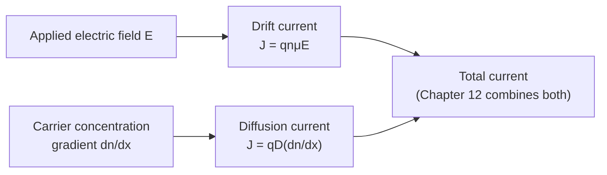

# Chapter 11: Drift Current and Carrier Mobility

<strong>Chapter Overview</strong> (click to expand)

Chapters 6 through 10 described semiconductors sitting quietly in thermal equilibrium, with no current flowing at all. This chapter sets carriers in motion. Applying an electric field superimposes a small, steady **drift velocity** on top of each carrier's much larger random thermal motion, producing **drift current** — this course's first genuinely device-relevant transport quantity. The ratio of drift velocity to field strength defines **carrier mobility**, a single number that hides all the messy detail of **scattering mechanisms** — collisions with vibrating lattice atoms (**lattice scattering**) and with ionized dopant atoms (**impurity scattering**) — that limit how fast carriers can actually drift. From mobility, this chapter derives **conductivity**, **resistivity**, and **sheet resistance**, the practical quantities used to characterize any doped semiconductor sample or IC resistor. A brief introduction to **diffusion current** — driven by a concentration gradient rather than a field — completes the chapter, setting up Chapter 12's deeper treatment.

**Key Takeaways:**

1. **Drift current** is the current produced when an applied electric field superimposes a net **drift velocity**, \(v_d=\mu E\), on top of each carrier's random thermal motion.
2. **Carrier mobility**, \(\mu\), is the proportionality constant between drift velocity and field strength, and is limited by **scattering mechanisms** — collisions that randomize a carrier's direction of motion.
3. **Lattice scattering** (off thermally-vibrating lattice atoms) grows worse with temperature, \(\mu_L\propto T^{-3/2}\); **impurity scattering** (off ionized dopant atoms) grows worse at low temperature and high doping, \(\mu_I\propto T^{3/2}/N\).
4. **Matthiessen's rule**, \(1/\mu=1/\mu_L+1/\mu_I\), combines independently-acting scattering mechanisms, with the weaker individual mobility dominating the total.
5. **Conductivity**, \(\sigma=q(n\mu_n+p\mu_p)\), and its reciprocal **resistivity**, \(\rho=1/\sigma\), summarize how easily a doped sample conducts current, combining Chapter 10's carrier concentrations with this chapter's mobility.
6. **Sheet resistance**, \(R_s=\rho/t\), lets a thin film's resistance be computed as \(R=R_s\times(L/W)\) — the number of "squares" the film forms — independent of its absolute size, the standard IC resistor design tool.
7. **Diffusion current**, introduced here and developed fully in Chapter 12, is the second fundamental current mechanism: current driven by a concentration gradient rather than an electric field.

## Learning Objectives

By the end of this chapter, you will be able to:

- Define drift velocity and drift current, and relate them through carrier mobility
- Explain, qualitatively, what diffusion current is and how it differs from drift current
- Explain how lattice scattering and impurity scattering each limit carrier mobility, and in what temperature/doping regimes each dominates
- Apply Matthiessen's rule to combine multiple scattering mechanisms into a single mobility
- Compute conductivity and resistivity from carrier concentration and mobility
- Apply the sheet-resistance "number of squares" method to compute a thin-film resistor's resistance
- Solve worked and practice problems combining these ideas, in preparation for Chapter 12's diffusion current, the Einstein relation, and the Hall effect

!!! note "How to read this chapter"
    This chapter is more concrete and device-oriented than Chapters 6-10: nearly every quantity here (mobility, conductivity, resistivity, sheet resistance) is something you could look up on a datasheet or measure directly in a lab. The underlying physics — carriers randomly scattering, biased slightly by an applied field — is simpler than the statistical mechanics of Chapters 9-10, so use this chapter to build physical intuition through the MicroSims before leaning on the equations.

## Introduction

Every chapter since Chapter 6 described a semiconductor in thermal equilibrium — no applied voltage, no net current, just carriers distributed according to Chapter 10's exact equations. This chapter breaks that equilibrium the simplest possible way: apply a uniform electric field and ask what happens.

The answer builds directly on a picture already familiar from Chapter 9's carrier statistics: even in equilibrium, every free carrier is in constant, random thermal motion, colliding — scattering — off lattice vibrations and impurity atoms many times per second, with no preferred direction. An applied electric field does not stop this chaotic motion; it simply superimposes a small, steady bias on top of it, called the **drift velocity**. Averaged over many carriers and many collisions, this tiny bias adds up to a net, measurable current: **drift current**, the first of two fundamental current mechanisms this course studies (the second, **diffusion current**, driven by a concentration gradient rather than a field, is introduced briefly here and developed fully in Chapter 12).

The proportionality constant relating drift velocity to field strength — how efficiently an applied field converts into net carrier motion — is **carrier mobility**, \(\mu\). Mobility is not a fundamental constant of nature; it is set entirely by how frequently a carrier scatters, and off of what. This chapter examines the two dominant **scattering mechanisms** in a doped semiconductor: **lattice scattering**, collisions with the thermally-vibrating crystal lattice itself, and **impurity scattering**, collisions with the ionized donor or acceptor atoms Chapters 7-8 introduced. These two mechanisms respond to temperature in opposite ways — lattice scattering worsens as temperature rises, impurity scattering worsens as temperature falls — and **Matthiessen's rule** shows how to combine them into a single, overall mobility.

With mobility in hand, this chapter derives the practical transport quantities used throughout device engineering: **conductivity**, combining Chapter 10's carrier concentration with mobility into a single number describing how well a sample conducts; **resistivity**, conductivity's reciprocal; and **sheet resistance**, the thin-film version of resistivity used to design IC resistors using nothing more than a simple "number of squares" rule.

## Concepts Covered

This chapter covers the following 10 concepts from the learning graph:

1. Drift Current
2. Diffusion Current
3. Carrier Mobility
4. Drift Velocity
5. Scattering Mechanism
6. Lattice Scattering
7. Impurity Scattering
8. Conductivity
9. Resistivity
10. Sheet Resistance

## Prerequisites

This chapter builds on [Chapter 1: Physics and Math Foundations](../01-physics-math-foundations/index.md) (force and electric field), and [Chapter 8: Doping, Ionization, and Temperature Regimes](../08-doping-ionization-temperature/index.md), [Chapter 9: Carrier Concentration Statistics](../09-carrier-concentration-statistics/index.md), and [Chapter 10: Fermi Level Position and Carrier Equations](../10-fermi-level-carrier-equations/index.md) (equilibrium carrier concentration, which this chapter's conductivity formula depends on directly).

## Drift Velocity, Scattering, and Carrier Mobility

### Random Motion Biased by a Field

Even with no applied field, a free carrier in a semiconductor is never truly at rest: thermal energy keeps it in constant, random motion, its direction randomized by frequent collisions — **scattering events** — with the crystal lattice and any impurity atoms present. Averaged over time and over many carriers, this random motion produces no net displacement at all, exactly as Chapter 9's statistical treatment assumed.

Applying a uniform electric field \(\vec{E}\) changes this picture only slightly: between collisions, the field accelerates the carrier (Chapter 1's \(\vec{F}=q\vec{E}\), using the carrier's effective mass from Chapter 6), giving it a small additional velocity component in the field direction before the next collision randomizes its direction again. Averaged over many collisions, this produces a small, steady net velocity — the **drift velocity**, \(v_d\) — superimposed on the much larger random thermal motion. For most practical field strengths, drift velocity is directly proportional to field strength:

\[
v_d = \mu E
\]

where \(\mu\), the **carrier mobility**, is the proportionality constant — with units of \(\text{cm}^2/(\text{V}\cdot\text{s})\) — capturing how efficiently an applied field converts into net drift, given the carrier's scattering environment.

#### Diagram: Drift Velocity and Carrier Scattering Explorer

<iframe src="../../sims/drift-velocity-scattering-explorer/main.html" width="100%" height="640px" scrolling="auto"></iframe>

!!! tip "How to use this MicroSim"
    **Instructions:** With the field at zero, click Start and watch the electron's random path; then raise the field and observe the path develop a rightward bias.

    **Learning objective:** Explain drift velocity as a small net bias superimposed on much larger random thermal motion, and connect the drift velocity/field ratio to mobility.

    **What to observe:** The zig-zag scattering pattern never disappears, even at high field — it is always present. The field only adds a small, steady rightward component to otherwise-random motion.

[Full MicroSim documentation →](../../sims/drift-velocity-scattering-explorer/index.md)

### Drift Current

Once drift velocity is known, computing the resulting current density is a matter of counting: each carrier of charge \(q\), moving at velocity \(v_d\), through a concentration \(n\) of carriers per unit volume, produces a current density \(J=qnv_d\). Combining this with \(v_d=\mu E\) gives the **drift current** density directly in terms of field:

\[
J_{n,\text{drift}} = qn\mu_nE, \qquad J_{p,\text{drift}} = qp\mu_pE
\]

Since electrons and holes drift in *opposite* directions in the same field (opposite charge) but this also reverses the current direction, both contributions to total current add rather than cancel:

\[
J_{\text{drift}} = q(n\mu_n+p\mu_p)E
\]

!!! question "Concept Check"
    An electron and a hole sit in the same applied electric field. Do they drift in the same direction or opposite directions? Do their contributions to current add or cancel?

??? question "Concept Check — click to reveal answer"
    They drift in *opposite* directions (the field pushes positive charge one way and negative charge the other), but because current direction is defined by the direction of *positive* charge flow, both contributions to current point the same way and add together — exactly as \(J_{\text{drift}}=q(n\mu_n+p\mu_p)E\) shows.

!!! example "Worked Example 1 — Computing Drift Current Density"
    A silicon sample has \(n_0=10^{16}\ \text{cm}^{-3}\), electron mobility \(\mu_n=1200\ \text{cm}^2/\text{V·s}\), and is placed in a field \(E=100\) V/cm. Estimate the electron drift current density (neglecting the hole contribution, since \(p_0\) is tiny by the mass action law).

    **Solution:**

    \[
    J_{n,\text{drift}} = qn\mu_nE = (1.602\times10^{-19})(10^{16})(1200)(100) \approx 192\ \text{A/cm}^2
    \]

## Diffusion Current: A Brief Introduction

### The Second Fundamental Current Mechanism

Drift current requires an electric field. There is a second, entirely independent way to produce current: **diffusion current**, driven not by a field but by a *concentration gradient* — a carrier concentration that varies with position. Just as a drop of ink spreads out from a region of high concentration to low concentration in still water, carriers in a semiconductor tend to spread from regions of high concentration toward regions of low concentration, even with no applied field at all, simply due to their random thermal motion combined with the concentration imbalance.

Diffusion current density is proportional to how steeply concentration varies with position (its spatial gradient):

\[
J_{n,\text{diff}} = qD_n\frac{dn}{dx}, \qquad J_{p,\text{diff}} = -qD_p\frac{dp}{dx}
\]

where \(D_n\) and \(D_p\) are the electron and hole **diffusion coefficients**. This chapter introduces diffusion current only at this qualitative level; Chapter 12 develops it fully, including the **Einstein relation** connecting \(D\) to mobility \(\mu\) — the same scattering physics this chapter studies for drift turns out to set the diffusion coefficient as well, since both describe how easily a carrier moves through the same scattering environment.

## Scattering Mechanisms: Lattice and Impurity Scattering

### Two Mechanisms, Opposite Temperature Trends

Mobility is not a single fixed number for a given material — it depends on temperature and doping level, because it is entirely set by how frequently and how strongly carriers scatter. Two mechanisms dominate in a typical doped semiconductor.

**Lattice scattering** (also called phonon scattering) is collision with the thermally-vibrating atoms of the crystal lattice itself. Higher temperature means more vigorous lattice vibrations, and therefore more frequent, more effective scattering — so lattice-limited mobility *decreases* with temperature, following approximately:

\[
\mu_L \propto T^{-3/2}
\]

**Impurity scattering** is collision with the Coulomb field of ionized donor or acceptor atoms (Chapter 7-8). A fast-moving carrier is deflected only slightly by passing near a charged impurity, but a slow-moving carrier spends more time near the impurity and is deflected more strongly — so impurity scattering is *worse* at low temperature (where carriers move more slowly) and worse at higher doping concentration \(N\) (more impurities to scatter off of):

\[
\mu_I \propto \frac{T^{3/2}}{N}
\]

These two mechanisms act independently and simultaneously, and **Matthiessen's rule** combines their scattering *rates* (not the mobilities directly) by adding reciprocals — exactly like resistors in parallel:

\[
\frac{1}{\mu} = \frac{1}{\mu_L} + \frac{1}{\mu_I}
\]

The consequence of adding reciprocals is that the *smaller* individual mobility — the more effective scattering mechanism — dominates the combined result.

#### Diagram: Mobility vs. Temperature and Doping (Matthiessen's Rule) Explorer

<iframe src="../../sims/mobility-temperature-doping-explorer/main.html" width="100%" height="640px" scrolling="auto"></iframe>

!!! tip "How to use this MicroSim"
    **Instructions:** Compare the three curves at low doping, then raise the doping slider and observe how the impurity-scattering curve pulls down the total mobility curve, especially at low temperature.

    **Learning objective:** Apply Matthiessen's rule to combine lattice and impurity scattering, and identify which mechanism dominates in a given temperature/doping regime.

    **What to observe:** At low doping, the total mobility curve nearly tracks the lattice-scattering curve at all temperatures shown; at heavy doping, impurity scattering visibly pulls the total curve down, especially at low temperature where impurity scattering is strongest.

[Full MicroSim documentation →](../../sims/mobility-temperature-doping-explorer/index.md)

!!! example "Worked Example 2 — Applying Matthiessen's Rule"
    A sample has lattice-limited mobility \(\mu_L=1350\ \text{cm}^2/\text{V·s}\) and impurity-limited mobility \(\mu_I=450\ \text{cm}^2/\text{V·s}\). Find the combined mobility.

    **Solution:**

    \[
    \frac{1}{\mu} = \frac{1}{1350}+\frac{1}{450} = 7.41\times10^{-4}+2.22\times10^{-3} = 2.96\times10^{-3}
    \]

    \[
    \mu = \frac{1}{2.96\times10^{-3}} \approx 338\ \text{cm}^2/\text{V·s}
    \]

    Note that the combined mobility (338) is smaller than *either* individual mobility, and closer to the smaller value (450) — exactly the behavior expected from adding reciprocals.

!!! question "Concept Check"
    At very low temperature and heavy doping, which scattering mechanism would you expect to dominate mobility, and why?

??? question "Concept Check — click to reveal answer"
    Impurity scattering. Low temperature means slow-moving carriers, which are more strongly deflected by charged impurities, and heavy doping means many impurities to scatter off of — both factors make impurity scattering severe, while lattice scattering is actually at its weakest at low temperature (fewer, gentler lattice vibrations).

## Conductivity, Resistivity, and Sheet Resistance

### From Mobility to Practical Transport Quantities

Combining Chapter 10's equilibrium carrier concentrations with this chapter's mobility gives **conductivity**, \(\sigma\), the single number summarizing how easily a doped sample conducts current:

\[
\sigma = q(n\mu_n+p\mu_p)
\]

**Resistivity**, \(\rho\), is simply conductivity's reciprocal, \(\rho=1/\sigma\), with units of \(\Omega\cdot\text{cm}\) — the quantity most often reported on a doped-wafer datasheet, since it can be measured directly (via a four-point probe) without separately knowing carrier concentration or mobility.

For a thin film — the geometry of an actual IC resistor, or a doped semiconductor layer of thickness \(t\) — resistivity converts into **sheet resistance**:

\[
R_s = \frac{\rho}{t}
\]

with units of \(\Omega/\square\) ("ohms per square"), a slightly unusual but extremely practical unit: for a rectangular film of length \(L\) and width \(W\), the total resistance is simply

\[
R = R_s\times\frac{L}{W}
\]

where \(L/W\) is literally the number of unit squares the film can be divided into end-to-end — independent of the film's absolute size, only its aspect ratio. This is why IC designers routinely lay out resistors purely by counting squares, without needing to recompute resistivity or thickness for every new resistor shape.

#### Diagram: Conductivity, Resistivity, and Sheet Resistance Calculator

<iframe src="../../sims/conductivity-resistivity-sheet-resistance-calculator/main.html" width="100%" height="660px" scrolling="auto"></iframe>

!!! tip "How to use this MicroSim"
    **Instructions:** Adjust doping and observe resistivity fall; then adjust the number-of-squares slider and watch resistance scale directly with it.

    **Learning objective:** Compute conductivity and resistivity from doping and mobility, and apply the sheet-resistance "number of squares" method.

    **What to observe:** Resistance depends only on the number of squares (L/W), not on the film's absolute length or width — doubling both L and W leaves resistance unchanged.

[Full MicroSim documentation →](../../sims/conductivity-resistivity-sheet-resistance-calculator/index.md)

!!! example "Worked Example 3 — Computing Sheet Resistance and Resistor Value"
    A doped silicon film has resistivity \(\rho=0.02\ \Omega\cdot\text{cm}\) and thickness \(t=1\ \mu\text{m}=10^{-4}\) cm. Find its sheet resistance, and the resistance of a resistor with \(L=50\ \mu\text{m}\), \(W=10\ \mu\text{m}\).

    **Solution:**

    \[
    R_s = \frac{\rho}{t} = \frac{0.02}{10^{-4}} = 200\ \Omega/\square
    \]

    \[
    R = R_s\times\frac{L}{W} = 200\times\frac{50}{10} = 200\times5 = 1000\ \Omega
    \]

## Summary

This chapter set carriers in motion for the first time in this course. An applied electric field superimposes a small **drift velocity**, \(v_d=\mu E\), on each carrier's random thermal motion, producing **drift current**, \(J=q(n\mu_n+p\mu_p)E\). **Carrier mobility** is limited by **scattering mechanisms** — **lattice scattering** (worse at high temperature, \(\mu_L\propto T^{-3/2}\)) and **impurity scattering** (worse at low temperature and high doping, \(\mu_I\propto T^{3/2}/N\)) — combined via **Matthiessen's rule**, \(1/\mu=1/\mu_L+1/\mu_I\). Combining Chapter 10's carrier concentrations with mobility gives **conductivity**, \(\sigma=q(n\mu_n+p\mu_p)\), and **resistivity**, \(\rho=1/\sigma\); for thin films, **sheet resistance**, \(R_s=\rho/t\), lets resistance be computed by simply counting unit squares, \(R=R_s\times(L/W)\). A brief introduction to **diffusion current**, driven by a concentration gradient rather than a field, sets up Chapter 12's full treatment, including the Einstein relation connecting diffusion to this chapter's mobility.

## Key Equations

| Concept | Equation |
|---|---|
| Drift velocity | \(v_d = \mu E\) |
| Drift current density | \(J_{\text{drift}} = q(n\mu_n+p\mu_p)E\) |
| Diffusion current density (preview) | \(J_{n,\text{diff}} = qD_n\dfrac{dn}{dx}\) |
| Lattice-limited mobility (temperature trend) | \(\mu_L \propto T^{-3/2}\) |
| Impurity-limited mobility (temperature/doping trend) | \(\mu_I \propto T^{3/2}/N\) |
| Matthiessen's rule | \(\dfrac{1}{\mu} = \dfrac{1}{\mu_L}+\dfrac{1}{\mu_I}\) |
| Conductivity | \(\sigma = q(n\mu_n+p\mu_p)\) |
| Resistivity | \(\rho = 1/\sigma\) |
| Sheet resistance | \(R_s = \rho/t\), \(R = R_s\times(L/W)\) |

## Glossary

See the [Chapter 11 Glossary](glossary.md) for full definitions of every term introduced in this chapter.

## Further Reading

- Neamen, *Semiconductor Physics and Devices* — the standard derivation of drift current, mobility, and Matthiessen's rule
- Sze and Ng, *Physics of Semiconductor Devices* — extensive mobility and resistivity data for real materials
- Pierret, *Semiconductor Device Fundamentals* — careful treatment of scattering mechanisms and sheet resistance
- Streetman and Banerjee, *Solid State Electronic Devices* — clear introduction to diffusion current as a preview for transport chapters

## Worked Examples

!!! example "Worked Example 4 — Drift Velocity from Mobility"
    An electron with mobility \(\mu_n=1350\ \text{cm}^2/\text{V·s}\) is placed in a field \(E=500\) V/cm. Find its drift velocity.

    **Solution:** \(v_d=\mu_nE=(1350)(500)=6.75\times10^5\ \text{cm/s}\).

!!! example "Worked Example 5 — Comparing Lattice and Impurity Scattering"
    At \(T=100\) K, a sample's lattice-limited mobility is \(\mu_L=8000\ \text{cm}^2/\text{V·s}\) and impurity-limited mobility is \(\mu_I=600\ \text{cm}^2/\text{V·s}\). Which mechanism dominates, and what is the combined mobility?

    **Solution:** Since \(\mu_I\ll\mu_L\), impurity scattering dominates. Combined: \(1/\mu=1/8000+1/600\approx1.25\times10^{-4}+1.67\times10^{-3}=1.79\times10^{-3}\), so \(\mu\approx559\ \text{cm}^2/\text{V·s}\) — close to \(\mu_I\) alone, confirming impurity scattering dominates.

!!! example "Worked Example 6 — Total Conductivity with Both Carriers"
    A silicon sample has \(n_0=2\times10^{15}\ \text{cm}^{-3}\), \(p_0=4.7\times10^4\ \text{cm}^{-3}\) (from the mass action law), \(\mu_n=1350\ \text{cm}^2/\text{V·s}\), \(\mu_p=480\ \text{cm}^2/\text{V·s}\). Find the conductivity, and comment on the hole contribution.

    **Solution:**

    \[
    \sigma = q(n\mu_n+p\mu_p) = (1.602\times10^{-19})\big[(2\times10^{15})(1350)+(4.7\times10^{4})(480)\big]
    \]

    The electron term, \(2.7\times10^{18}\), completely dominates the hole term, \(2.26\times10^{7}\) — over 10 orders of magnitude smaller. \(\sigma\approx(1.602\times10^{-19})(2.7\times10^{18})\approx0.433\ \text{S/cm}\). In an extrinsic sample, the minority carrier's contribution to conductivity is always negligible.

!!! example "Worked Example 7 — Resistivity from Conductivity"
    Using the conductivity from Worked Example 6 (\(\sigma\approx0.433\) S/cm), find the resistivity.

    **Solution:** \(\rho=1/\sigma=1/0.433\approx2.31\ \Omega\cdot\text{cm}\).

!!! example "Worked Example 8 — Sheet Resistance from a Different Thickness"
    Using the same resistivity as Worked Example 3 (\(\rho=0.02\ \Omega\cdot\text{cm}\)), but a thinner film, \(t=0.2\ \mu\text{m}\), find the new sheet resistance.

    **Solution:** \(R_s=\rho/t=0.02/(0.2\times10^{-4})=0.02/(2\times10^{-5})=1000\ \Omega/\square\) — five times larger than Worked Example 3's result, since the film is five times thinner.

!!! example "Worked Example 9 — Number of Squares for a Long, Narrow Resistor"
    A resistor is laid out as a long, narrow strip: \(L=200\ \mu\text{m}\), \(W=5\ \mu\text{m}\), on a film with \(R_s=150\ \Omega/\square\). Find its resistance.

    **Solution:** Number of squares \(=L/W=200/5=40\). \(R=R_s\times40=150\times40=6000\ \Omega=6\ \text{k}\Omega\).

!!! example "Worked Example 10 — Effect of Doping on Mobility and Resistivity Together"
    Two silicon samples at 300 K have donor concentrations \(N_{D,1}=10^{15}\ \text{cm}^{-3}\) (giving \(\mu_{n,1}\approx1350\ \text{cm}^2/\text{V·s}\)) and \(N_{D,2}=10^{18}\ \text{cm}^{-3}\) (giving \(\mu_{n,2}\approx250\ \text{cm}^2/\text{V·s}\), reduced by impurity scattering). Compare their conductivities and explain the trend.

    **Solution:** \(\sigma_1=q\,n_1\mu_{n,1}\approx(1.602\times10^{-19})(10^{15})(1350)\approx0.216\ \text{S/cm}\). \(\sigma_2\approx(1.602\times10^{-19})(10^{18})(250)\approx40.1\ \text{S/cm}\) — nearly 200 times larger, even though mobility dropped by a factor of about 5.4. The 1000-fold increase in carrier concentration overwhelms the mobility reduction, confirming that heavier doping always increases conductivity in this regime, despite impurity scattering working against it.

