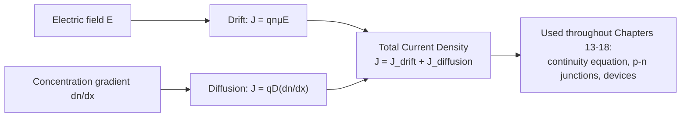

# Chapter 12: Diffusion and Advanced Transport Phenomena

<strong>Chapter Overview</strong> (click to expand)

Chapter 11 introduced drift current and previewed diffusion current only briefly. This chapter completes the transport picture, following carrier motion from a single random step to a macroscopic, measurable current. **Fick's law** formalizes diffusion current as proportional to the **concentration gradient**, and the **diffusion coefficient** \(D\) that appears in it turns out to be directly tied to Chapter 11's mobility through the elegant **Einstein relation**, \(D=\mu k_BT/q\) — the same scattering physics governs both. Adding drift and diffusion together gives the **total current density**, the master equation underlying every semiconductor device studied from here forward. This chapter also introduces the **Hall effect**, a magnetic-field experiment that directly measures carrier type and concentration through the **Hall coefficient** and **Hall voltage** — one of the few ways to *directly* verify whether a material is n-type or p-type. Finally, two refinements to Chapter 11's simple drift picture are introduced: **velocity saturation** at high field, and a closer look at **mobility temperature dependence**.

**Key Takeaways:**

1. The **diffusion coefficient** \(D\) is tied to mobility \(\mu\) by the **Einstein relation**, \(D=\mu k_BT/q\) — both describe the same scattering environment, just probed by a field (drift) or a concentration gradient (diffusion).
2. **Fick's law** states that diffusion current is proportional to the **concentration gradient**: \(J_{n,\text{diff}}=qD_n(dn/dx)\).
3. The **total current density** at any point is simply drift plus diffusion, \(J=J_{\text{drift}}+J_{\text{diffusion}}\) — the fundamental transport equation used throughout the device chapters ahead.
4. The **Hall effect** deflects moving carriers sideways in a magnetic field via the Lorentz force, building up a **Hall voltage**, \(V_H=R_HIB/t\), whose sign (through the **Hall coefficient** \(R_H\)) directly reveals whether the majority carrier is a hole or an electron.
5. At high electric field, drift velocity stops growing linearly and approaches a **velocity saturation** limit, \(v_{sat}\), as increased carrier energy triggers more effective scattering.
6. **Mobility temperature dependence**, formalized in Chapter 11 via Matthiessen's rule, is revisited here as the bridge connecting drift, diffusion, and the practical operating range of real devices.

## Learning Objectives

By the end of this chapter, you will be able to:

- State Fick's law and compute diffusion current from a concentration gradient
- Apply the Einstein relation to compute diffusion coefficient from mobility
- Combine drift and diffusion into a total current density expression
- Explain the Hall effect and compute Hall voltage from current, field, carrier concentration, and thickness
- Use Hall voltage sign to identify majority carrier type
- Explain velocity saturation and identify the field range where the linear drift-velocity approximation breaks down
- Solve worked and practice problems combining these ideas, in preparation for the non-equilibrium carrier and p-n junction chapters ahead

!!! note "How to read this chapter"
    This chapter builds the diffusion and drift-diffusion picture first, directly and essentially extending Chapter 11: the Einstein relation, Fick's law, and total current density form one continuous argument, and the total current density equation in particular is used, largely without further comment, in every remaining chapter of this course. About two-thirds through, the chapter turns to the **Hall effect** — a self-contained experimental technique, useful on its own and not strictly required for what follows — before closing with two refinements to Chapter 11's drift picture: velocity saturation and mobility temperature dependence.

## Introduction

Chapter 11 gave drift current — current from an applied field — a full quantitative treatment, and introduced diffusion current — current from a concentration gradient — only qualitatively, as a preview. This chapter completes that picture.

The **diffusion coefficient** \(D\) — appearing in Fick's law, discussed next — is not an independent material parameter. The **Einstein relation**, \(D=\mu k_BT/q\), shows it is directly tied to Chapter 11's mobility \(\mu\), since both drift and diffusion are ultimately governed by the same carrier-scattering environment. **Fick's law** then states this precisely: diffusion current is proportional to the **concentration gradient**, the spatial rate of change of carrier concentration. Adding drift and diffusion current together at any point in a semiconductor gives the **total current density**, \(J=J_{\text{drift}}+J_{\text{diffusion}}\) — arguably the single most-used equation in the remainder of this course, since every device (resistor, diode, transistor) is, at its core, a region where drift and diffusion combine in some specific, geometry-dependent way.

This chapter also introduces a genuinely new experimental tool: the **Hall effect**. It uses a magnetic field, applied perpendicular to a current-carrying semiconductor bar, to deflect moving carriers sideways via the Lorentz force. Charge builds up on one edge of the bar until the resulting transverse electric field exactly balances the magnetic deflection, producing a steady, measurable **Hall voltage**. What makes this measurement so valuable is that the **Hall coefficient** relating Hall voltage to current and field has a sign that depends directly on the sign of the majority carrier's charge — making the Hall effect one of the only *direct* experimental probes of whether a sample is n-type or p-type, and of its carrier concentration, independent of any assumptions about doping.

Finally, this chapter revisits and refines Chapter 11's drift-velocity picture in two ways. First, **velocity saturation**: the simple relation \(v_d=\mu E\) only holds at low-to-moderate field; at high field, drift velocity levels off near a material-dependent saturation velocity instead of growing without bound. Second, a closer look at **mobility temperature dependence**, building on Chapter 11's Matthiessen's rule, as the bridge connecting everything in this chapter to the real operating conditions of actual devices.

## Concepts Covered

This chapter covers the following 10 concepts from the learning graph:

1. Diffusion Coefficient
2. Einstein Relation
3. Fick's Law
4. Concentration Gradient
5. Total Current Density
6. Hall Effect
7. Hall Coefficient
8. Hall Voltage
9. Velocity Saturation
10. Mobility Temperature Dependence

## Prerequisites

This chapter builds on [Chapter 1: Physics and Math Foundations](../01-physics-math-foundations/index.md) (the Lorentz force and vector cross products) and directly on [Chapter 11: Drift Current and Carrier Mobility](../11-drift-current-mobility/index.md) (drift current, mobility, and Matthiessen's rule, all extended here).

## Diffusion Coefficient and the Einstein Relation

### Connecting Diffusion to Mobility

Chapter 11 introduced diffusion current only qualitatively; this chapter derives its key quantitative relationship. The **diffusion coefficient** \(D\) — appearing in Fick's law, discussed next — is not an independent material parameter. The **Einstein relation** shows it is directly proportional to mobility:

\[
D = \frac{\mu k_BT}{q}
\]

This result follows from a deep physical fact: at thermal equilibrium, drift and diffusion must exactly balance (otherwise carriers would pile up somewhere with no applied field, violating equilibrium), and working out the condition for this balance — using the Boltzmann carrier-concentration formulas from Chapter 10 — produces the Einstein relation directly. Physically, both drift and diffusion are limited by exactly the same scattering environment (Chapter 11's lattice and impurity scattering): a carrier that scatters less both drifts faster in a field *and* diffuses faster down a concentration gradient, so the two transport coefficients must be linked.

A useful numerical shortcut: since \(k_BT/q\) has units of volts and is numerically equal to \(k_BT\) expressed in eV, \(D=\mu\times(k_BT\text{ in eV})\) directly, with \(D\) in the same units as \(\mu\) times \(\text{cm}^2/(\text{V}\cdot\text{s})\times\text{V}=\text{cm}^2/\text{s}\). At room temperature (\(T=300\) K), \(k_BT/q\approx0.0259\) V — a reference value worth memorizing, since it recurs throughout semiconductor device equations.

#### Diagram: Einstein Relation and Diffusion Coefficient Calculator

<iframe src="../../sims/einstein-relation-diffusion-coefficient-calculator/main.html" width="100%" height="640px" scrolling="auto"></iframe>

!!! tip "How to use this MicroSim"
    **Instructions:** Compare the computed diffusion coefficient at room temperature to silicon's commonly-cited values, then vary temperature and doping, or enable "Compare electrons vs. holes." Check your live \(k_BT/q\) reading against the fixed 300 K reference chip (\(\approx0.0259\) V) when the temperature slider is at 300 K.

    **Learning objective:** Apply the Einstein relation to compute diffusion coefficient from mobility, and explain why both are governed by the same scattering physics.

    **What to observe:** D grows with both increasing mobility and increasing temperature — both act to increase how far a carrier's random thermal motion carries it before scattering. In comparison mode, \(D_n\) sits consistently above \(D_p\), directly tracking Chapter 11's electron/hole mobility gap. The dashed 300 K marker on the D-vs-T curve lines up with the \(\approx0.0259\) V reference chip.

[Full MicroSim documentation →](../../sims/einstein-relation-diffusion-coefficient-calculator/index.md)

!!! example "Worked Example 1 — Applying the Einstein Relation"
    A material has \(\mu_n=1000\ \text{cm}^2/\text{V·s}\) at \(T=300\) K, where \(k_BT\approx0.0259\) eV. Find \(D_n\).

    **Solution:** \(D_n = \mu_n\times(k_BT\text{ in eV}) = (1000)(0.0259) = 25.9\ \text{cm}^2/\text{s}\).

## Fick's Law and the Concentration Gradient

### Diffusion Current, Precisely

The **concentration gradient**, \(dn/dx\) (or \(dp/dx\) for holes), measures how steeply carrier concentration varies with position. **Fick's law** states that diffusion current density is directly proportional to this gradient:

\[
J_{n,\text{diff}} = qD_n\frac{dn}{dx}, \qquad J_{p,\text{diff}} = -qD_p\frac{dp}{dx}
\]

The physical picture is exactly the same intuition Chapter 11 introduced: carriers spread from high concentration toward low concentration, and a steeper gradient (concentration changing more rapidly with position) drives more diffusion current, exactly as a steeper hill drives water to flow downhill faster. The opposite sign convention between electrons and holes in Fick's law (note the minus sign for holes) exists so that both formulas correctly predict current flowing from high concentration toward low concentration, regardless of the carrier's charge sign.

#### Diagram: Fick's Law and Total Current Density Explorer

<iframe src="../../sims/ficks-law-total-current-density-explorer/main.html" width="100%" height="900px" scrolling="auto"></iframe>

!!! tip "How to use this MicroSim"
    **Instructions:** Choose electrons or holes, then drag the position marker along the concentration curve and compare the tangent line's steepness to the diffusion current readout. Adjust the electric field and watch \(J_{\text{drift}}\), \(J_{\text{diffusion}}\), and \(J_{\text{total}}\) plotted together — then try the cancellation control to find the exact field where they cancel at the marker.

    **Learning objective:** Apply Fick's law to compute diffusion current from a concentration gradient, combine it with drift current into a total current density, and recognize that both the diffusion coefficient and the sign convention depend on carrier type.

    **What to observe:** Diffusion current is largest where the curve is steepest, not where concentration itself is highest — confirming that Fick's law depends on the *gradient*, not the concentration value. Switching between electrons and holes flips the sign relationship between the gradient and the diffusion current, even though the underlying physical picture (carriers spreading from high to low concentration) never changes. Raising temperature changes \(J_{\text{diffusion}}\) even at a fixed gradient, since \(D\) itself is temperature-dependent through the Einstein relation above.

[Full MicroSim documentation →](../../sims/ficks-law-total-current-density-explorer/index.md)

!!! example "Worked Example 2 — Computing Diffusion Current from a Gradient"
    A hole concentration profile has a local gradient \(dp/dx=-5\times10^{19}\ \text{cm}^{-4}\) at some position, with \(D_p=12\ \text{cm}^2/\text{s}\). Find the diffusion current density.

    **Solution:**

    \[
    J_{p,\text{diff}} = -qD_p\frac{dp}{dx} = -(1.602\times10^{-19})(12)(-5\times10^{19}) \approx 96.1\ \text{A/cm}^2
    \]

## Total Current Density

### Drift and Diffusion Together

At any point in a semiconductor, both drift and diffusion current may be present simultaneously — a region can have both an electric field *and* a concentration gradient at once. Because current densities simply add, the **total current density** is:

\[
J = J_{\text{drift}} + J_{\text{diffusion}} = q(n\mu_nE+p\mu_pE) + \left(qD_n\frac{dn}{dx}-qD_p\frac{dp}{dx}\right)
\]

or, written separately for each carrier type:

\[
J_n = qn\mu_nE + qD_n\frac{dn}{dx}, \qquad J_p = qp\mu_pE - qD_p\frac{dp}{dx}
\]

This equation — often called the **drift-diffusion equation** — is the single master transport relationship used throughout the remaining chapters of this course. In a p-n junction's depletion region (Chapter 14), for example, drift and diffusion currents are equal and opposite at equilibrium, exactly canceling; understanding *why* they cancel there, and what happens when an applied bias upsets that balance and produces a net current (Chapter 15), depends entirely on the total current density concept introduced here. The Fick's Law and Total Current Density Explorer above includes a cancellation control for exactly this reason: dialing the electric field until drift and diffusion exactly cancel at the marker previews the equilibrium condition you will meet again, in a p-n junction's depletion region, in Chapter 14.

For a microscopic, particle-level view of drift motion under a field — complementing this chapter's macroscopic current-density plots — see Chapter 11's [Drift Velocity and Scattering Explorer](../../sims/drift-velocity-scattering-explorer/index.md).

!!! question "Concept Check"
    In a region of a semiconductor with no applied electric field but a nonzero concentration gradient, is the total current density necessarily zero?

??? question "Concept Check — click to reveal answer"
    No. With \(E=0\), the drift term vanishes, but the diffusion term \(qD(dn/dx)\) remains — as long as a concentration gradient exists, diffusion current flows even with no applied field at all. Total current is zero only if drift and diffusion happen to exactly cancel, as they do at equilibrium inside a p-n junction's depletion region (Chapter 14).

## The Hall Effect

### Deflecting Carriers with a Magnetic Field

Consider a current-carrying semiconductor bar placed in a magnetic field \(\vec{B}\) perpendicular to the current direction. Each moving carrier experiences a **Lorentz force**, \(\vec{F}=q\vec{v}\times\vec{B}\), pushing it sideways, toward one edge of the bar. As carriers accumulate on that edge (and leave a depleted, oppositely-charged region on the other edge), a transverse electric field builds up — and this field grows until it exerts a force exactly canceling the magnetic deflection, at which point a steady transverse voltage, the **Hall voltage** \(V_H\), exists across the bar with no further net sideways carrier flow. This entire phenomenon is called the **Hall effect**.

The key relationship, derived by balancing the magnetic and electric forces, is:

\[
V_H = \frac{R_HIB}{t}
\]

where \(I\) is the current, \(B\) the magnetic field, \(t\) the bar's thickness, and \(R_H\), the **Hall coefficient**, is:

\[
R_H = \frac{1}{qp} \ (\text{p-type, holes}), \qquad R_H = -\frac{1}{qn} \ (\text{n-type, electrons})
\]

The sign difference is the entire point of the measurement: for the *same* current and field direction, a p-type sample produces a Hall voltage of one sign, and an n-type sample produces the opposite sign — a direct, unambiguous experimental determination of majority carrier type, something none of the equilibrium equations in Chapters 9-10 alone can provide (they describe carrier *concentration*, but say nothing that could be measured to confirm carrier *sign* without an experiment like this one). Hall measurements remain the standard laboratory technique for verifying carrier type and concentration in fabricated wafers, a step referenced again in Chapter 19's fabrication process discussion.

#### Diagram: Hall Effect Explorer

<iframe src="../../sims/hall-effect-explorer/main.html" width="100%" height="660px" scrolling="auto"></iframe>

!!! tip "How to use this MicroSim"
    **Instructions:** Compare the computed Hall voltage's sign for p-type vs. n-type carriers with the same current and field, or start from one of the sensor presets. Watch the Lorentz-force arrow (\(F\)) on the moving carrier, the Hall field arrow (\(E_H\)) that builds up between the two edges, and the numeric \(R_H\) readout.

    **Learning objective:** Explain how the Lorentz force produces a Hall voltage, interpret its sign to identify majority carrier type, and explain why lightly-doped samples give a larger Hall signal.

    **What to observe:** Switching carrier type flips the Hall voltage's sign even though nothing about the current or field direction changes — confirming that the sign is set entirely by the carrier's charge. The Lorentz-force arrow and the resulting edge accumulation flip together, and the Hall field arrow always points to oppose the force that created it. Comparing the "Heavily doped" and "Lightly doped" presets shows the Hall voltage magnitude, and \(|R_H|\), shrinking as doping increases.

[Full MicroSim documentation →](../../sims/hall-effect-explorer/index.md)

!!! question "Concept Check"
    A sample of unknown doping type is placed in a Hall effect setup with known current and field directions, and the measured Hall voltage is positive. Using the sign convention \(R_H=1/(qp)>0\) for holes, what type is the sample?

??? question "Concept Check — click to reveal answer"
    p-type. A positive Hall voltage, under this sign convention, corresponds to a positive Hall coefficient, which only occurs for hole (p-type) conduction; electron (n-type) conduction always gives a negative Hall coefficient and Hall voltage under the same convention.

!!! example "Worked Example 3 — Computing Hall Voltage"
    A p-type silicon sample has \(p=2\times10^{15}\ \text{cm}^{-3}=2\times10^{21}\ \text{m}^{-3}\), thickness \(t=200\ \mu\text{m}=2\times10^{-4}\) m, carries \(I=2\) mA, in a field \(B=0.3\) T. Find the Hall voltage.

    **Solution:**

    \[
    R_H = \frac{1}{qp} = \frac{1}{(1.602\times10^{-19})(2\times10^{21})} \approx 3.12\times10^{-3}\ \text{m}^3/\text{C}
    \]

    \[
    V_H = \frac{R_HIB}{t} = \frac{(3.12\times10^{-3})(2\times10^{-3})(0.3)}{2\times10^{-4}} \approx 9.4\times10^{-3}\ \text{V} = 9.4\ \text{mV}
    \]

## Velocity Saturation

### When the Linear Approximation Breaks Down

Chapter 11's drift velocity relation, \(v_d=\mu E\), assumes mobility \(\mu\) is a constant independent of field strength. This is an excellent approximation at low-to-moderate field, but it cannot hold at arbitrarily high field: carriers would gain unlimited velocity, contradicting the fact that scattering becomes far more frequent and effective once carriers gain significant kinetic energy between collisions. Instead, real drift velocity levels off at high field, approaching a material-dependent **saturation velocity**, \(v_{sat}\) (typically around \(10^7\) cm/s for electrons in silicon), following approximately:

\[
v_d(E) = \frac{\mu E}{\sqrt{1+(\mu E/v_{sat})^2}}
\]

which correctly reduces to \(v_d\approx\mu E\) at low field (where \(\mu E\ll v_{sat}\)) and approaches \(v_d\to v_{sat}\) at high field.

#### Diagram: Velocity Saturation Explorer

<iframe src="../../sims/velocity-saturation-explorer/main.html" width="100%" height="640px" scrolling="auto"></iframe>

!!! tip "How to use this MicroSim"
    **Instructions:** Compare the actual (saturating) curve to the naive linear line at both low and high field, using the Low/Moderate/High presets or the field slider directly. Note the three labeled zones — low-field, transition, and saturation — and how the low-field/transition boundary shifts as you change the error-tolerance selector.

    **Learning objective:** Identify the field range where the linear drift-velocity approximation remains accurate, quantify exactly where it fails for a chosen tolerance, and explain the physical cause of saturation.

    **What to observe:** The two curves overlap closely at low field but diverge sharply at high field, where the actual curve flattens toward v_sat while the linear line keeps climbing unrealistically. The three zone labels make explicit what "low field," "transition," and "saturation" mean quantitatively, not just qualitatively — directly extending Worked Example 4's "only about 1% below" observation into a general rule.

[Full MicroSim documentation →](../../sims/velocity-saturation-explorer/index.md)

Velocity saturation matters directly for real devices: in a short-channel transistor, the electric field inside the channel can be high enough that carriers spend much of their transit time in the saturated-velocity regime, fundamentally limiting how fast the device can switch — a major consideration in modern IC design.

!!! example "Worked Example 4 — Checking Whether Saturation Matters"
    An electron with low-field mobility \(\mu_n=1350\ \text{cm}^2/\text{V·s}\) and \(v_{sat}=1\times10^7\) cm/s is in a field \(E=1000\) V/cm. Compute the naive linear prediction and the saturating-formula prediction, and compare.

    **Solution:** Linear: \(v_d=\mu E=(1350)(1000)=1.35\times10^6\) cm/s. Saturating formula: \(v_d=\dfrac{1.35\times10^6}{\sqrt{1+(1.35\times10^6/1\times10^7)^2}}=\dfrac{1.35\times10^6}{\sqrt{1.0182}}\approx1.34\times10^6\) cm/s — only about 1% below the linear prediction, confirming that at this field, saturation effects are still minor.

## Mobility Temperature Dependence Revisited

### The Bridge to Real Operating Conditions

Chapter 11 already introduced **mobility temperature dependence** in detail through Matthiessen's rule, combining lattice scattering (\(\mu_L\propto T^{-3/2}\)) and impurity scattering (\(\mu_I\propto T^{3/2}/N\)). This chapter has used that same model repeatedly — in the diffusion coefficient calculator, in the velocity saturation explorer — as the foundation for computing every temperature-dependent transport quantity introduced here. For a dedicated visual exploration of \(\mu(T)\) via Matthiessen's rule, including the lattice- and impurity-scattering curves separately, see Chapter 11's [Mobility vs. Temperature and Doping Explorer](../../sims/mobility-temperature-doping-explorer/index.md) — that sim is not duplicated here. The key takeaway to carry forward is that mobility, diffusion coefficient, and (at low field) drift velocity are all ultimately governed by the *same* underlying scattering physics, varying together in predictable ways as temperature and doping change.

!!! example "Worked Example 5 — Diffusion Coefficient at an Elevated Temperature"
    Using \(\mu_n=1350\ \text{cm}^2/\text{V·s}\) at 300 K (\(k_BT\approx0.0259\) eV) and assuming (for this estimate) mobility unchanged, find \(D_n\) at 300 K and comment on how it would change at 400 K where \(k_BT\approx0.0345\) eV, if mobility actually drops somewhat due to increased lattice scattering.

    **Solution:** At 300 K: \(D_n=(1350)(0.0259)\approx35.0\ \text{cm}^2/\text{s}\). At 400 K, \(k_BT\) alone would suggest \(D_n\approx(1350)(0.0345)\approx46.6\ \text{cm}^2/\text{s}\) if mobility stayed fixed — but since lattice scattering (Chapter 11) increases with temperature, real mobility at 400 K is somewhat lower than 1350, partially offsetting the \(k_BT\) increase and making the true \(D_n(400\text{ K})\) somewhat below this naive estimate.

## Summary

This chapter completed the transport picture Chapter 11 began. **Fick's law**, \(J_{\text{diff}}=qD(dn/dx)\), formalizes diffusion current as proportional to the **concentration gradient**, and the **Einstein relation**, \(D=\mu k_BT/q\), ties the **diffusion coefficient** directly to Chapter 11's mobility. Adding drift and diffusion together gives the **total current density**, \(J=J_{\text{drift}}+J_{\text{diffusion}}\), the master transport equation used throughout the rest of this course. The **Hall effect** deflects carriers sideways in a magnetic field, producing a **Hall voltage**, \(V_H=R_HIB/t\), whose sign (via the **Hall coefficient** \(R_H\)) directly identifies majority carrier type. Finally, **velocity saturation** refined the simple \(v_d=\mu E\) relation for high field, and **mobility temperature dependence** was revisited as the common thread connecting every quantity in this chapter. Chapter 13 now uses total current density, combined with carrier generation and recombination, to build the continuity equation governing non-equilibrium carrier behavior — including the diffusion length \(L=\sqrt{D\tau}\), explored interactively in Chapter 13's [Diffusion Length and Lifetime Explorer](../../sims/continuity-equation-diffusion-length-explorer/index.md) rather than duplicated here.

## Key Equations

| Concept | Equation |
|---|---|
| Einstein relation | \(D = \mu k_BT/q\) |
| Fick's law (electrons / holes) | \(J_{n,\text{diff}}=qD_n(dn/dx)\), \(J_{p,\text{diff}}=-qD_p(dp/dx)\) |
| Total current density (electrons) | \(J_n = qn\mu_nE + qD_n(dn/dx)\) |
| Hall voltage | \(V_H = R_HIB/t\) |
| Hall coefficient (p-type / n-type) | \(R_H = 1/(qp)\) or \(R_H=-1/(qn)\) |
| Velocity saturation | \(v_d(E) = \dfrac{\mu E}{\sqrt{1+(\mu E/v_{sat})^2}}\) |

## Glossary

See the [Chapter 12 Glossary](glossary.md) for full definitions of every term introduced in this chapter.

## Further Reading

- Neamen, *Semiconductor Physics and Devices* — the standard derivation of the Hall effect, Einstein relation, and total current density
- Sze and Ng, *Physics of Semiconductor Devices* — extensive treatment of velocity saturation in real devices
- Pierret, *Semiconductor Device Fundamentals* — careful derivation of the drift-diffusion equation
- Streetman and Banerjee, *Solid State Electronic Devices* — clear introduction to Hall effect measurement technique

## Worked Examples

!!! example "Worked Example 6 — Hall Coefficient from Measured Data"
    A Hall measurement gives \(V_H=15\) mV for \(I=1\) mA, \(B=0.4\) T, \(t=150\ \mu\text{m}\). Find \(R_H\).

    **Solution:** \(R_H = V_Ht/(IB) = (0.015)(1.5\times10^{-4})/[(1\times10^{-3})(0.4)] = (2.25\times10^{-6})/(4\times10^{-4}) \approx 5.63\times10^{-3}\ \text{m}^3/\text{C}\).

!!! example "Worked Example 7 — Carrier Concentration from Hall Coefficient"
    Using \(R_H\approx5.63\times10^{-3}\ \text{m}^3/\text{C}\) from Worked Example 6, and assuming p-type material, find the hole concentration.

    **Solution:** Since \(R_H=1/(qp)\), \(p=1/(qR_H)=1/[(1.602\times10^{-19})(5.63\times10^{-3})]\approx1.11\times10^{21}\ \text{m}^{-3}=1.11\times10^{15}\ \text{cm}^{-3}\).

!!! example "Worked Example 8 — Combining Drift and Diffusion"
    At some position, \(J_{n,\text{drift}}=50\ \text{A/cm}^2\) and \(J_{n,\text{diff}}=-20\ \text{A/cm}^2\) (diffusion opposing drift). Find the total electron current density.

    **Solution:** \(J_n = J_{\text{drift}}+J_{\text{diff}} = 50+(-20) = 30\ \text{A/cm}^2\).

!!! example "Worked Example 9 — Diffusion Coefficient Comparison Between Materials"
    Silicon has \(\mu_n\approx1350\ \text{cm}^2/\text{V·s}\); GaAs has \(\mu_n\approx8500\ \text{cm}^2/\text{V·s}\), both at 300 K. Compare their electron diffusion coefficients.

    **Solution:** \(D_{n,Si}=(1350)(0.0259)\approx35.0\ \text{cm}^2/\text{s}\). \(D_{n,GaAs}=(8500)(0.0259)\approx220\ \text{cm}^2/\text{s}\) — over six times larger, directly tracking GaAs's much higher mobility via the Einstein relation.

!!! example "Worked Example 10 — Estimating Saturation Field"
    Using \(\mu_n=1350\ \text{cm}^2/\text{V·s}\) and \(v_{sat}=1\times10^7\) cm/s, estimate the field at which the linear prediction \(v_d=\mu E\) would equal \(v_{sat}\) (a rough marker for where saturation becomes significant).

    **Solution:** Setting \(\mu E=v_{sat}\): \(E=v_{sat}/\mu=(1\times10^7)/(1350)\approx7.4\times10^{3}\ \text{V/cm}\). Fields well below this value are safely in the linear regime; fields approaching or exceeding it require the full saturating formula.

