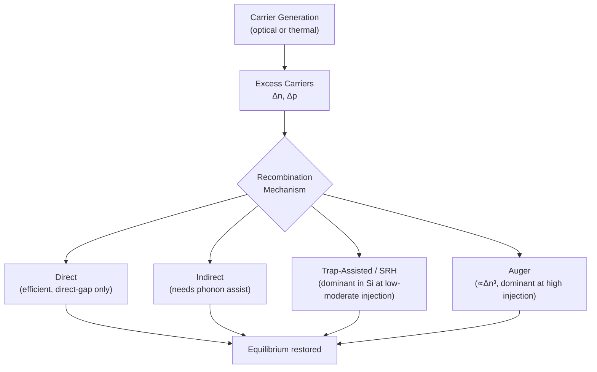

# Chapter 13: Non-Equilibrium Carriers and Recombination

<strong>Chapter Overview</strong> (click to expand)

Every chapter so far has described semiconductors at, or drifting/diffusing gently around, thermal equilibrium. This chapter breaks that assumption deliberately. Shining light on a semiconductor, or forward-biasing a p-n junction (Chapter 15), pushes carrier concentrations away from their equilibrium values, creating **excess carriers**. These excess carriers do not persist — **carrier recombination**, through several distinct physical mechanisms, works to restore equilibrium, and the *rate* at which it does so, set by the **minority carrier lifetime**, turns out to be one of the single most important numbers characterizing a real semiconductor sample or device. This chapter builds the full framework: how excess carriers are created (**carrier generation**, optical or thermal), how they disappear (**direct**, **indirect**, **trap-assisted (Shockley-Read-Hall)**, and **Auger recombination**), how to classify the disturbance (**low-level** vs. **high-level injection**), how to track excess carriers in space and time (the **continuity equation**, **diffusion length**, **steady-state carrier profile**), and how to describe carrier statistics once equilibrium no longer applies (**quasi-Fermi levels**). Every device chapter from here forward — the p-n junction, the transistor, the solar cell — is fundamentally a story about non-equilibrium carriers finding their way back to equilibrium.

**Key Takeaways:**

1. **Excess carriers**, \(\Delta n\) and \(\Delta p\), are carrier concentrations above their equilibrium values, created by **carrier generation** — either **optical generation** (photon absorption) or **thermal generation** (background thermal fluctuations).
2. **Carrier recombination** returns excess carriers to equilibrium through several mechanisms: **direct recombination** (efficient in direct-gap materials), **indirect recombination** (requiring a momentum-conserving assist in indirect-gap materials), **trap-assisted recombination** via defect levels, formalized as **Shockley-Read-Hall (SRH) recombination**, and **Auger recombination**, which scales as \(\Delta n^3\) and only matters at very high injection.
3. The **minority carrier lifetime** \(\tau\) sets the exponential decay timescale of excess carriers, and the **recombination rate** at any instant is simply \(R=\Delta n/\tau\) for a single dominant mechanism.
4. **Low-level injection** (\(\Delta n\ll N\)) leaves the majority carrier concentration essentially unperturbed; **high-level injection** (\(\Delta n\) comparable to or exceeding \(N\)) perturbs both carrier populations significantly — both are forms of **carrier injection**.
5. The **continuity equation** governs how excess carrier concentration evolves in space and time; its steady-state solution for carriers diffusing from an injection point is a decaying exponential characterized by the **diffusion length** \(L=\sqrt{D\tau}\), producing the **steady-state carrier profile** used throughout the device chapters ahead.
6. Under non-equilibrium conditions, a single Fermi level can no longer describe both carrier populations; instead, separate **quasi-Fermi levels** \(E_{Fn}\) and \(E_{Fp}\) describe electron and hole occupation statistics independently, splitting apart by an amount that grows with injection level.

## Learning Objectives

By the end of this chapter, you will be able to:

- Define excess carriers and distinguish optical from thermal generation
- Compare direct, indirect, trap-assisted (SRH), and Auger recombination mechanisms and identify which dominates in a given material and injection regime
- Compute recombination rate from excess carrier concentration and minority carrier lifetime
- Classify a given injection scenario as low-level or high-level
- State and apply the continuity equation's steady-state solution to compute a diffusion length and carrier profile
- Compute quasi-Fermi level splitting under carrier injection
- Solve worked and practice problems combining these ideas, in preparation for the p-n junction chapters ahead

!!! note "How to read this chapter"
    This is the longest concept list of any chapter so far (19 concepts), but the ideas build in a single, linear chain: carriers are created (generation) → carriers disappear (recombination, several mechanisms) → the rate of disappearance is characterized (lifetime, recombination rate) → the disturbance is classified (injection level) → the disturbance is tracked in space (continuity equation, diffusion length, steady-state profile) → and finally, the disturbed carrier statistics are described (quasi-Fermi levels). Read it in order; each section leans on the one before it.

## Introduction

Every previous chapter analyzed a semiconductor either exactly at thermal equilibrium (Chapters 9-10) or in a steady drift/diffusion state that still assumed equilibrium carrier statistics locally (Chapters 11-12). Real devices are rarely so calm. Shine light on a solar cell, forward-bias a diode, or simply let a semiconductor sit under room lighting, and carrier concentrations depart from their equilibrium values \(n_0\) and \(p_0\). The departure, \(\Delta n = n - n_0\) and \(\Delta p = p - p_0\), defines the **excess carriers** this chapter is about.

Excess carriers are created by **carrier generation** — a photon with energy exceeding the band gap can be absorbed, promoting an electron across the gap (**optical generation**), or thermal fluctuations alone can occasionally do the same (**thermal generation**, already responsible for the equilibrium \(n_0\), \(p_0\) computed in Chapters 9-10). Left alone, excess carriers do not persist indefinitely: **carrier recombination** removes them, restoring equilibrium. This chapter surveys the physical mechanisms behind recombination — **direct**, **indirect**, **trap-assisted**, and **Auger** — before introducing the single number that most compactly summarizes how fast a given sample recombines: the **minority carrier lifetime** \(\tau\).

With generation, recombination, and lifetime established, this chapter classifies *how large* a disturbance is (**low-level** vs. **high-level injection**), introduces the **continuity equation** that tracks excess carriers in space and time, solves it for the common case of carriers injected at a boundary (yielding the **diffusion length** and an exponential **steady-state carrier profile**), and closes with **quasi-Fermi levels** — the proper way to describe carrier occupation statistics once a single equilibrium Fermi level no longer applies. Every concept here is a direct prerequisite for the p-n junction chapters (14-15) that follow.

## Concepts Covered

This chapter covers the following 19 concepts from the learning graph:

1. Excess Carriers
2. Carrier Generation
3. Carrier Recombination
4. Optical Generation
5. Thermal Generation
6. Direct Recombination
7. Indirect Recombination
8. Trap-Assisted Recombination
9. Shockley-Read-Hall Recombination
10. Auger Recombination
11. Minority Carrier Lifetime
12. Recombination Rate
13. Low-Level Injection
14. High-Level Injection
15. Continuity Equation
16. Diffusion Length
17. Quasi-Fermi Level
18. Steady-State Carrier Profile
19. Carrier Injection

## Prerequisites

This chapter builds on [Chapter 1: Physics and Math Foundations](../01-physics-math-foundations/index.md), [Chapter 4: Chemical Bonding in Semiconductor Crystals](../04-chemical-bonding-crystals/index.md), [Chapter 6: Band Structure and the Fermi Level](../06-band-structure-fermi-level/index.md), [Chapter 9: Carrier Concentration Statistics](../09-carrier-concentration-statistics/index.md), [Chapter 10: Fermi Level Position and Carrier Equations](../10-fermi-level-carrier-equations/index.md), and [Chapter 12: Diffusion and Advanced Transport Phenomena](../12-diffusion-transport-phenomena/index.md).

## Excess Carriers and Generation

### Departing from Equilibrium

At thermal equilibrium, carrier concentrations \(n_0\) and \(p_0\) satisfy the mass action law and charge neutrality condition worked out in Chapters 9-10. **Excess carriers** are the *additional* concentration above these equilibrium values:

\[
\Delta n = n - n_0, \qquad \Delta p = p - p_0
\]

Excess electrons and excess holes are always created in equal numbers (each generation event promotes one electron across the gap, leaving behind one hole), so \(\Delta n = \Delta p\) whenever generation is the sole disturbance — a fact used repeatedly throughout this chapter.

**Carrier generation** creates these excess carriers. Two physical processes contribute:

- **Optical generation**: a photon with energy \(h\nu \geq E_g\) is absorbed, exciting an electron from the valence band to the conduction band and leaving a hole behind. This is the mechanism behind solar cells and photodetectors.
- **Thermal generation**: random thermal energy alone occasionally promotes an electron across the gap, exactly the process already responsible for equilibrium \(n_0\), \(p_0\) — but under illumination or bias, optical or electrical generation typically dwarfs the thermal contribution, driving concentrations well above equilibrium.

!!! question "Concept Check"
    If a beam of light generates electron-hole pairs uniformly through a sample, is the resulting excess electron concentration always equal to the excess hole concentration?

??? question "Concept Check — click to reveal answer"
    Yes. Each absorbed photon creates exactly one electron-hole pair, so generation alone always produces \(\Delta n=\Delta p\), regardless of the sample's doping type or concentration.

## Recombination Mechanisms

### Direct and Indirect Recombination

**Carrier recombination** is the reverse process: an electron in the conduction band drops back into a hole in the valence band, releasing energy (as a photon, for radiative recombination, or as heat/lattice vibrations otherwise). The efficiency of this process depends critically on band structure, as introduced in Chapter 6.

**Direct recombination** occurs when the conduction band minimum and valence band maximum sit at the same crystal momentum \(k\) (a direct-gap material like GaAs, Chapter 6). An electron can drop straight down in energy without needing a momentum change, making direct recombination fast and efficient — the basis of LEDs and laser diodes.

**Indirect recombination** occurs in indirect-gap materials like silicon, where the conduction band minimum and valence band maximum sit at *different* \(k\) values. Recombination requires a simultaneous momentum-conserving event (typically a phonon, a lattice vibration quantum), making the process inherently much less probable — silicon is a famously poor light emitter for exactly this reason.

### Trap-Assisted and Shockley-Read-Hall Recombination

Because band-to-band recombination is so inefficient in indirect-gap materials, another pathway usually dominates in practice: **trap-assisted recombination**, mediated by defect or impurity energy levels ("traps") located within the forbidden gap. A trap can capture an electron from the conduction band, then later capture a hole from the valence band, completing recombination in two smaller steps instead of one large direct jump.

The quantitative theory of trap-assisted recombination is **Shockley-Read-Hall (SRH) recombination**, which shows that traps located near midgap are by far the most effective recombination centers (traps near the band edges tend to re-emit a captured carrier before capturing the opposite type, rather than completing recombination). SRH theory is the standard model for recombination in silicon devices, and its rate is well-approximated at low injection by the simple form used throughout this chapter, \(R_{SRH}\approx\Delta n/\tau_{SRH}\).

### Auger Recombination

**Auger recombination** is a three-carrier process: an electron and hole recombine, but instead of releasing a photon or phonon, the released energy is transferred to a third carrier (another electron or hole), which is excited to a higher energy state and then relaxes by giving up that energy as heat. Because it requires three carriers to interact simultaneously, its rate scales as \(\Delta n^3\) (compared to SRH's linear \(\Delta n\) dependence), making Auger recombination negligible at low injection but dominant at very high injection — a key limiting factor in high-intensity solar cells and high-current laser diodes.

#### Diagram: Recombination Mechanism Comparison Explorer

<iframe src="../../sims/recombination-mechanism-comparison-explorer/main.html" width="100%" height="850px" scrolling="auto"></iframe>

!!! tip "How to use this MicroSim"
    **Instructions:** Drag the Δn marker along the three recombination-rate curves, then switch material from silicon to GaAs.

    **Learning objective:** Compare SRH, Auger, and direct recombination rates across injection levels and materials, and justify why direct recombination matters far more in direct-gap materials.

    **What to observe:** SRH dominates across most of the silicon range; the Auger curve (slope 3) only overtakes the others at the highest injection levels; switching to GaAs shifts the direct-recombination curve up by many orders of magnitude.

[Full MicroSim documentation →](../../sims/recombination-mechanism-comparison-explorer/index.md)

## Minority Carrier Lifetime and Recombination Rate

### Characterizing How Fast Equilibrium Is Restored

For a single dominant recombination mechanism at low-to-moderate injection, the excess carrier concentration decays exponentially once generation stops, with time constant \(\tau\), the **minority carrier lifetime**:

\[
\Delta n(t) = \Delta n(0)\,e^{-t/\tau}
\]

The instantaneous **recombination rate** — the number of carriers recombining per unit volume per unit time — is directly proportional to the excess concentration present:

\[
R = \frac{\Delta n}{\tau}
\]

This single equation is deceptively powerful: at steady state (constant generation rate \(G\)), generation and recombination balance, \(G=R=\Delta n_{ss}/\tau\), immediately giving the steady-state excess concentration \(\Delta n_{ss}=G\tau\) — the relationship that governs, for example, the photoconductivity of an illuminated semiconductor.

#### Diagram: Excess Carrier Generation and Recombination Explorer

<iframe src="../../sims/excess-carrier-generation-recombination-explorer/main.html" width="100%" height="820px" scrolling="auto"></iframe>

!!! tip "How to use this MicroSim"
    **Instructions:** With generation ON, scrub the time marker to watch Δn approach steady state; then click "Turn Generation OFF" and scrub again to watch the exponential decay, with one lifetime τ marked directly on the curve.

    **Learning objective:** Explain how excess carriers rise under generation and decay under recombination, and compute recombination rate from excess concentration and minority carrier lifetime.

    **What to observe:** A longer lifetime τ makes both phases slower and more gradual, since τ sets the natural timescale for both buildup and decay; Δp(t) (dashed) tracks Δn(t) exactly, showing charge neutrality.

[Full MicroSim documentation →](../../sims/excess-carrier-generation-recombination-explorer/index.md)

!!! example "Worked Example 1 — Steady-State Excess Concentration"
    A silicon sample is illuminated with a generation rate \(G=1\times10^{20}\ \text{cm}^{-3}\text{s}^{-1}\) and has minority carrier lifetime \(\tau=2\ \mu\text{s}\). Find the steady-state excess carrier concentration.

    **Solution:**

    \[
    \Delta n_{ss} = G\tau = (1\times10^{20})(2\times10^{-6}) = 2\times10^{14}\ \text{cm}^{-3}
    \]

!!! example "Worked Example 2 — Decay After Generation Stops"
    Using the steady-state value from Worked Example 1 (\(\Delta n_{ss}=2\times10^{14}\ \text{cm}^{-3}\), \(\tau=2\ \mu\text{s}\)), find the excess concentration \(3\ \mu\text{s}\) after the light is switched off.

    **Solution:**

    \[
    \Delta n(3\ \mu\text{s}) = \Delta n_{ss}\,e^{-t/\tau} = (2\times10^{14})e^{-3/2} \approx 4.46\times10^{13}\ \text{cm}^{-3}
    \]

## Low-Level and High-Level Injection

### Classifying the Size of the Disturbance

Not every disturbance is the same size relative to the sample's doping. **Carrier injection** is the general term for adding excess carriers to a semiconductor (by light, by an applied bias, or otherwise); the two regimes commonly distinguished are:

- **Low-level injection**: \(\Delta n \ll N\) (excess carriers are small compared to the majority carrier/doping concentration). Here the majority carrier concentration is essentially unchanged, while the minority carrier population — starting from a much smaller base — is significantly perturbed. Nearly all of the simple device equations used in later chapters assume low-level injection.
- **High-level injection**: \(\Delta n\) comparable to or exceeding \(N\). Both carrier populations are now significantly perturbed, and the simplifying assumptions of low-level injection (like using \(\tau\) as a fixed constant) can break down — high-level injection requires more careful treatment, relevant in heavily-illuminated solar cells or high-current devices.

These are not two switch positions but the two ends of a continuous spectrum in \(\Delta n/N\); the **transition** region in between (roughly \(0.1 \lesssim \Delta n/N \lesssim 1\)) is where neither the low-level shortcut (majority \(\approx N\)) nor the high-level shortcut (\(\Delta n\approx\Delta p\)) is safely accurate.

#### Diagram: Injection Level Classifier

<iframe src="../../sims/injection-level-classifier/main.html" width="100%" height="700px" scrolling="auto"></iframe>

!!! tip "How to use this MicroSim"
    **Instructions:** Raise Δn relative to a fixed doping level N and watch the needle sweep continuously across low-level, transition, and high-level injection.

    **Learning objective:** Classify a given injection scenario as low-level, transition, or high-level, and explain which carrier population is perturbed — and which assumptions are safe — in each regime.

    **What to observe:** Raising doping N pushes the needle back toward low-level injection for the same Δn, since the ratio Δn/N shrinks; the explanation box updates its wording in each zone.

[Full MicroSim documentation →](../../sims/injection-level-classifier/index.md)

!!! question "Concept Check"
    A silicon sample doped at \(N_D=1\times10^{16}\ \text{cm}^{-3}\) is illuminated, producing \(\Delta n=5\times10^{14}\ \text{cm}^{-3}\). Is this low-level or high-level injection?

??? question "Concept Check — click to reveal answer"
    Low-level injection. The ratio \(\Delta n/N_D=5\times10^{14}/1\times10^{16}=0.05\), well below the roughly 0.1 (10%) threshold commonly used to distinguish the two regimes, so the majority electron concentration is essentially unperturbed.

## The Continuity Equation, Diffusion Length, and Steady-State Carrier Profile

### Tracking Excess Carriers in Space and Time

The **continuity equation** is the master equation governing how excess carrier concentration evolves in space and time, combining everything from Chapters 12-13: diffusion (Fick's law), drift, generation, and recombination. For excess holes in one dimension:

\[
\frac{\partial \Delta p}{\partial t} = D_p\frac{\partial^2 \Delta p}{\partial x^2} - \mu_p E\frac{\partial \Delta p}{\partial x} + G - \frac{\Delta p}{\tau_p}
\]

The first term on the right is diffusion spreading carriers out, the second is drift sweeping them along a field, and the last two are generation and recombination. This equation looks intimidating, but its most important special case is simple and used constantly: a long, field-free region with a constant supply of carriers injected at one boundary (\(x=0\)), and no time dependence (steady state, \(\partial \Delta p/\partial t = 0\)). With \(E=0\) and \(G=0\) away from the injection point, the continuity equation reduces to:

\[
D_p\frac{d^2\Delta p}{dx^2} = \frac{\Delta p}{\tau_p}
\]

whose solution is a decaying exponential:

\[
\Delta p(x) = \Delta p(0)\,e^{-x/L_p}, \qquad L_p = \sqrt{D_p\tau_p}
\]

This is the **steady-state carrier profile**, and \(L_p\), the **diffusion length**, is the characteristic distance a minority carrier diffuses, on average, before recombining (the analogous electron form uses \(D_n\), \(\tau_n\), and \(L_n=\sqrt{D_n\tau_n}\), for holes injected into n-type material versus electrons injected into p-type material). Diffusion length is one of the most-quoted numbers in device design: it sets, for example, how thick a solar cell's absorber layer needs to be to collect most photogenerated carriers before they recombine.

#### Diagram: Continuity Equation and Diffusion Length Explorer

<iframe src="../../sims/continuity-equation-diffusion-length-explorer/main.html" width="100%" height="950px" scrolling="auto"></iframe>

!!! tip "How to use this MicroSim"
    **Instructions:** Drag the position marker along the curve and vary Δp(0), Dp, and τp to see how the profile and diffusion length change, then click "Show continuity-equation terms" to see the diffusion and recombination terms balance.

    **Learning objective:** Apply the continuity equation's steady-state solution to compute a diffusion length and interpret the resulting carrier profile.

    **What to observe:** The dashed Lp line always sits where the curve has fallen to about 37% (1/e) of its peak value, regardless of the specific Dp and τp chosen; Δp(0) changes the curve's height but not its shape or Lp.

[Full MicroSim documentation →](../../sims/continuity-equation-diffusion-length-explorer/index.md)

!!! example "Worked Example 3 — Computing Diffusion Length"
    A hole has \(D_p=12\ \text{cm}^2/\text{s}\) and \(\tau_p=4\ \mu\text{s}\). Find the diffusion length.

    **Solution:**

    \[
    L_p = \sqrt{D_p\tau_p} = \sqrt{(12)(4\times10^{-6})} = \sqrt{4.8\times10^{-5}} \approx 6.93\times10^{-3}\ \text{cm} = 69.3\ \mu\text{m}
    \]

!!! example "Worked Example 4 — Carrier Profile at a Given Depth"
    Using \(L_p=69.3\ \mu\text{m}\) from Worked Example 3 and \(\Delta p(0)=1\times10^{15}\ \text{cm}^{-3}\), find \(\Delta p\) at \(x=100\ \mu\text{m}\).

    **Solution:**

    \[
    \Delta p(100\ \mu\text{m}) = (1\times10^{15})e^{-100/69.3} \approx (1\times10^{15})(0.236) \approx 2.36\times10^{14}\ \text{cm}^{-3}
    \]

## Quasi-Fermi Levels

### Describing Carrier Statistics Away from Equilibrium

Every occupation-statistics formula in Chapters 9-10 relies on a single Fermi level \(E_F\) describing both electrons and holes simultaneously — a fact that is only true at thermal equilibrium. Under carrier injection, electrons and holes are no longer in mutual equilibrium with each other (though each carrier type individually is usually still well-described by Fermi-Dirac-like statistics, just referenced to a different level). The fix is to introduce two separate **quasi-Fermi levels**, \(E_{Fn}\) for electrons and \(E_{Fp}\) for holes:

\[
n = n_i\,e^{(E_{Fn}-E_i)/k_BT}, \qquad p = n_i\,e^{(E_i-E_{Fp})/k_BT}
\]

At equilibrium (\(\Delta n=0\)), both reduce to the same single \(E_F\). As injection increases, \(E_{Fn}\) rises toward the conduction band and \(E_{Fp}\) drops toward the valence band, splitting apart — and the size of that split, \(E_{Fn}-E_{Fp}\), turns out to be exactly the quantity that sets the open-circuit voltage of an illuminated solar cell, previewing a direct application in the device chapters ahead.

#### Diagram: Quasi-Fermi Level Explorer

<iframe src="../../sims/quasi-fermi-level-explorer/main.html" width="100%" height="660px" scrolling="auto"></iframe>

!!! tip "How to use this MicroSim"
    **Instructions:** Start at Δn = 0 to confirm both quasi-Fermi levels coincide, then raise Δn and compare how much each level moves.

    **Learning objective:** Interpret quasi-Fermi level splitting as a signature of non-equilibrium carrier injection, and justify why the minority carrier's quasi-Fermi level moves more than the majority carrier's.

    **What to observe:** In n-type material, E_Fn barely moves (n is already large) while E_Fp swings dramatically toward midgap, since p is the minority carrier and is most strongly perturbed by injection.

[Full MicroSim documentation →](../../sims/quasi-fermi-level-explorer/index.md)

!!! question "Concept Check"
    Why does a single equilibrium Fermi level fail to describe carrier concentrations once a semiconductor is illuminated?

??? question "Concept Check — click to reveal answer"
    Because illumination pushes electron and hole concentrations away from their mutual equilibrium relationship (the mass action law \(np=n_i^2\) no longer holds), so no single energy level can correctly reproduce both the electron and hole populations simultaneously — separate quasi-Fermi levels are needed instead.

## Summary

This chapter moved beyond equilibrium to describe **excess carriers**, created by **carrier generation** (**optical** or **thermal**) and removed by **carrier recombination** through several mechanisms: **direct recombination** (efficient in direct-gap materials), **indirect recombination** (requiring a phonon assist in indirect-gap materials), **trap-assisted** / **Shockley-Read-Hall recombination** (dominant in silicon at low-to-moderate injection), and **Auger recombination** (scaling as \(\Delta n^3\), dominant only at very high injection). The **minority carrier lifetime** \(\tau\) sets the exponential decay timescale, with **recombination rate** \(R=\Delta n/\tau\). Disturbances were classified as **low-level** or **high-level injection** depending on \(\Delta n\) relative to doping, both instances of **carrier injection**. The **continuity equation** tracks excess carriers in space and time, with its steady-state solution giving an exponential **steady-state carrier profile** characterized by the **diffusion length** \(L=\sqrt{D\tau}\). Finally, **quasi-Fermi levels** \(E_{Fn}\) and \(E_{Fp}\) replaced the single equilibrium Fermi level, splitting apart under injection. Chapter 14's equilibrium p-n junction depends qualitatively on this generation-recombination balance, but it is Chapter 15's biased junction that directly reuses the continuity equation and diffusion length — solving for injected minority carriers in the long-base and short-base diode limits — while quasi-Fermi level splitting reappears explicitly in Chapter 18's solar-cell open-circuit-voltage discussion.

## Key Equations

| Concept | Equation |
|---|---|
| Excess carriers | \(\Delta n = n - n_0\), \(\Delta p = p - p_0\) |
| Recombination rate (single mechanism) | \(R = \Delta n/\tau\) |
| Auger recombination rate | \(R_{Auger} = C\Delta n^3\) |
| Steady-state excess concentration | \(\Delta n_{ss} = G\tau\) |
| Excess carrier decay | \(\Delta n(t) = \Delta n(0)e^{-t/\tau}\) |
| Diffusion length | \(L_p = \sqrt{D_p\tau_p}\) |
| Steady-state carrier profile | \(\Delta p(x) = \Delta p(0)e^{-x/L_p}\) |
| Quasi-Fermi levels | \(n=n_ie^{(E_{Fn}-E_i)/k_BT}\), \(p=n_ie^{(E_i-E_{Fp})/k_BT}\) |

## Glossary

See the [Chapter 13 Glossary](glossary.md) for full definitions of every term introduced in this chapter.

## Further Reading

- Sze and Ng, *Physics of Semiconductor Devices* — the standard reference on recombination mechanisms and the continuity equation
- Neamen, *Semiconductor Physics and Devices* — clear derivation of quasi-Fermi levels and diffusion length
- Shockley and Read, "Statistics of the Recombinations of Holes and Electrons," *Physical Review* (1952) — the original SRH paper
- Pierret, *Semiconductor Device Fundamentals* — careful treatment of low- vs. high-level injection

## Worked Examples

!!! example "Worked Example 5 — Comparing SRH and Auger at a Given Injection Level"
    In silicon at \(\Delta n=1\times10^{17}\ \text{cm}^{-3}\), with \(\tau_{SRH}=1\ \mu\text{s}\) and Auger coefficient \(C=2.8\times10^{-31}\ \text{cm}^6/\text{s}\), compare \(R_{SRH}\) and \(R_{Auger}\).

    **Solution:** \(R_{SRH}=\Delta n/\tau_{SRH}=(1\times10^{17})/(1\times10^{-6})=1\times10^{23}\ \text{cm}^{-3}\text{s}^{-1}\). \(R_{Auger}=C\Delta n^3=(2.8\times10^{-31})(1\times10^{17})^3=2.8\times10^{20}\ \text{cm}^{-3}\text{s}^{-1}\). SRH still dominates by roughly three orders of magnitude at this injection level.

!!! example "Worked Example 6 — Finding the Injection Level Where Auger Takes Over"
    Using the same \(\tau_{SRH}\) and \(C\) as Worked Example 5, estimate the excess concentration at which \(R_{SRH}\approx R_{Auger}\).

    **Solution:** Setting \(\Delta n/\tau_{SRH}=C\Delta n^3\) gives \(\Delta n^2 = 1/(C\tau_{SRH}) = 1/[(2.8\times10^{-31})(1\times10^{-6})] \approx 3.57\times10^{36}\), so \(\Delta n\approx1.89\times10^{18}\ \text{cm}^{-3}\) — Auger only overtakes SRH at very high injection, consistent with its cubic dependence.

!!! example "Worked Example 7 — Steady-State Profile Near the Injection Point"
    Using \(\Delta p(0)=5\times10^{14}\ \text{cm}^{-3}\) and \(L_p=50\ \mu\text{m}\), find \(\Delta p\) at \(x=L_p\) and at \(x=2L_p\).

    **Solution:** At \(x=L_p\): \(\Delta p=\Delta p(0)e^{-1}\approx(5\times10^{14})(0.368)\approx1.84\times10^{14}\ \text{cm}^{-3}\). At \(x=2L_p\): \(\Delta p=\Delta p(0)e^{-2}\approx(5\times10^{14})(0.135)\approx6.77\times10^{13}\ \text{cm}^{-3}\).

!!! example "Worked Example 8 — Quasi-Fermi Level Splitting"
    An n-type silicon sample (\(n_0=1\times10^{16}\ \text{cm}^{-3}\), \(n_i=1.5\times10^{10}\ \text{cm}^{-3}\), \(k_BT=0.0259\) eV) is illuminated with \(\Delta n=1\times10^{15}\ \text{cm}^{-3}\). Find \(E_{Fn}-E_{Fp}\).

    **Solution:** \(n=n_0+\Delta n=1.1\times10^{16}\), \(p_0=n_i^2/n_0=(1.5\times10^{10})^2/(1\times10^{16})=2.25\times10^4\), \(p=p_0+\Delta n\approx1\times10^{15}\) (since \(\Delta n\gg p_0\)). \(E_{Fn}-E_i=k_BT\ln(n/n_i)=(0.0259)\ln(1.1\times10^{16}/1.5\times10^{10})\approx(0.0259)(13.5)\approx0.350\) eV. \(E_i-E_{Fp}=(0.0259)\ln(1\times10^{15}/1.5\times10^{10})\approx(0.0259)(11.1)\approx0.288\) eV. Splitting: \(E_{Fn}-E_{Fp}\approx0.350+0.288=0.638\) eV.

!!! example "Worked Example 9 — Low- vs. High-Level Injection Check"
    A sample doped at \(N_A=5\times10^{15}\ \text{cm}^{-3}\) is injected with \(\Delta n=8\times10^{15}\ \text{cm}^{-3}\). Classify the injection level.

    **Solution:** \(\Delta n/N_A = 8\times10^{15}/5\times10^{15}=1.6\), far above the 0.1 threshold — this is high-level injection, since the excess concentration actually exceeds the doping concentration.

## Interactive Chapter Walkthrough

Use the MicroSim below as a capstone review: an 8-step guided tour, navigated with Prev/Next buttons, that retraces this entire chapter's storyline in order — from equilibrium to non-equilibrium, through generation, all four recombination mechanisms, lifetime and recombination rate, injection level, the continuity equation and diffusion length, and quasi-Fermi levels — ending with a summary chain diagram connecting every concept to the p-n junction ahead.

#### Diagram: Non-Equilibrium Carriers Interactive Walkthrough

<iframe src="../../sims/non-equilibrium-carriers-interactive-walkthrough/main.html" width="100%" height="670px" scrolling="auto"></iframe>

!!! tip "How to use this MicroSim"
    **Instructions:** Click "Next ▶" through all 8 steps in order, then use the step dots to jump back to any concept before the chapter quiz.

    **Learning objective:** Recall and summarize the full chain of concepts connecting carrier generation to quasi-Fermi levels.

    **What to observe:** Each step's small illustration mirrors a MicroSim you already used earlier in the chapter, tying the whole narrative together in one place.

[Full MicroSim documentation →](../../sims/non-equilibrium-carriers-interactive-walkthrough/index.md)

