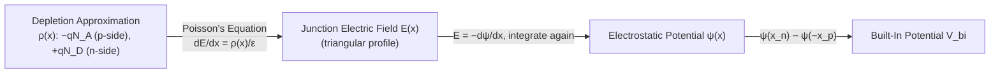

# Chapter 14: The P-N Junction at Equilibrium

<strong>Chapter Overview</strong> (click to expand)

Chapter 13 closed by describing every device to come as fundamentally a story about non-equilibrium carriers finding their way back to equilibrium. This chapter builds the structure where that story plays out for the first time: the p-n junction, formed by physically joining a p-type and an n-type region of the same crystal. Remarkably, most of what makes a p-n junction interesting is already visible *before* any bias is applied, purely from the electrostatics of two differently-doped regions settling into a self-consistent equilibrium. This chapter derives that equilibrium picture from first principles — starting from the physical act of joining the two materials, through the diffusion that creates a **depletion region**, to the quantitative electrostatics (**Poisson's equation**, **depletion charge density**, **junction electric field**) that pin down the **built-in potential**, **depletion width**, and **junction capacitance**. Chapter 15 then disturbs this equilibrium with an applied bias, turning static electrostatics into the dynamic story of diode current.

**Key Takeaways:**

1. A **metallurgical junction** is the physical plane where p-type and n-type doping meet; together the two regions form a **p-n junction**, the foundational building block of nearly every semiconductor device covered in later chapters.
2. Diffusion of carriers across the junction, followed by recombination, sweeps mobile carriers out of a thin region on either side of the junction, creating the **depletion region**; the **depletion approximation** idealizes this region as fully depleted with abrupt boundaries and fully neutral everywhere outside it.
3. The **built-in potential** \(V_{bi}\) is the equilibrium electrostatic potential difference across the junction, set entirely by doping concentrations and the intrinsic carrier concentration — it exists with zero applied bias and zero net current.
4. Applying **Poisson's equation** to the depletion approximation's **depletion charge density** \(\rho(x)\) gives the **junction electric field** \(E(x)\), a triangular profile that peaks at the metallurgical junction and vanishes at the depletion edges.
5. Charge neutrality across the junction (\(N_Ax_p = N_Dx_n\)), combined with the built-in potential, fixes the **depletion width** \(W=x_n+x_p\) and how that width splits between the two sides.
6. The depletion region behaves electrically like a parallel-plate capacitor with plate separation \(W\), giving the **junction capacitance** \(C_j=\varepsilon A/W\) — a quantity that changes with applied bias, previewed here and used directly in Chapter 15 and in varactor diode applications.

## Learning Objectives

By the end of this chapter, you will be able to:

- Explain how joining p-type and n-type material forms a metallurgical junction and initiates carrier diffusion across it
- Describe how diffusion, recombination, and exposed ionized dopants create the depletion region, and state the assumptions of the depletion approximation
- Derive and calculate the built-in potential from doping concentrations and the intrinsic carrier concentration
- Apply Poisson's equation to the depletion approximation to obtain the depletion charge density and the junction electric field profile
- Calculate the depletion widths \(x_n\), \(x_p\), and total depletion width \(W\) from doping concentrations and built-in potential
- Compute junction capacitance from depletion width and junction area, and explain qualitatively how it depends on doping and bias
- Solve worked and practice problems combining these ideas, in preparation for the biased-junction analysis in Chapter 15

## Introduction

Every previous chapter analyzed a single, uniformly-doped block of semiconductor. Real devices are built by joining *differently* doped regions together, and the simplest and most important such structure is the **p-n junction**: a p-type region (majority carriers holes, fixed ionized acceptors \(N_A\)) and an n-type region (majority carriers electrons, fixed ionized donors \(N_D\)) formed within a single continuous crystal. The plane where the doping type switches from p to n is the **metallurgical junction**.

Left alone at thermal equilibrium, this structure does not stay uniform. Holes on the p-side and electrons on the n-side face a steep concentration gradient across the junction and diffuse toward each other, exactly as diffusion current (Chapter 12) predicts. As they diffuse across and recombine near the interface, they leave behind a thin region stripped of mobile carriers but still containing the fixed, ionized dopant atoms that were left behind — the **depletion region**. The exposed dopant charge creates an internal electric field that opposes further diffusion, and the junction settles into equilibrium once drift current exactly balances diffusion current everywhere.

This chapter derives, quantitatively, everything about that equilibrium depletion region: how much voltage it sustains (the built-in potential), how strong its internal field is and how wide it is (via Poisson's equation and the depletion approximation), and how it behaves electrically as a voltage-dependent capacitor (junction capacitance). Every result here is a direct prerequisite for Chapter 15, where an applied bias disturbs this equilibrium and drives real diode current.

## Concepts Covered

This chapter covers the following 10 concepts from the learning graph:

1. P-N Junction
2. Metallurgical Junction
3. Poisson's Equation
4. Depletion Region
5. Depletion Approximation
6. Built-In Potential
7. Depletion Charge Density
8. Junction Electric Field
9. Depletion Width
10. Junction Capacitance

## Prerequisites

This chapter builds on concepts from:

- [Chapter 1: Physics and Math Foundations](../01-physics-math-foundations/index.md)
- [Chapter 8: Doping, Ionization, and Temperature Regimes](../08-doping-ionization-temperature/index.md)
- [Chapter 9: Carrier Concentration Statistics](../09-carrier-concentration-statistics/index.md)
- [Chapter 10: Fermi Level Position and Carrier Equations](../10-fermi-level-carrier-equations/index.md)

---

## The Metallurgical Junction and the P-N Junction

### Joining Two Doped Regions

A **p-n junction** is formed when a p-type region and an n-type region exist within the same single crystal, joined at a common interface. In a real device, this is achieved by selectively doping different regions of the same silicon wafer (for example, diffusing or implanting donor atoms into a region that is already uniformly doped p-type) rather than gluing two separate crystals together — a physical seam between two different crystals would introduce enormous densities of interface defect states and would not behave as the idealized junctions this chapter analyzes.

The **metallurgical junction** is the geometric plane, conventionally placed at \(x=0\), where the net doping concentration switches sign — that is, where \(N_D - N_A\) changes from negative (p-type) to positive (n-type). Away from this plane, each side looks exactly like the uniformly-doped semiconductors analyzed in Chapters 7-10: on the p-side, holes are the majority carrier with equilibrium concentration \(p_{p0}\approx N_A\); on the n-side, electrons are the majority carrier with equilibrium concentration \(n_{n0}\approx N_D\).

Before the two regions are joined, each side individually sits at its own equilibrium Fermi level, set by its own doping (Chapter 10). The p-side's Fermi level sits close to the valence band; the n-side's sits close to the conduction band. The instant the two regions are brought into contact, the system is no longer at equilibrium — a single junction cannot have two different Fermi levels — and the redistribution of charge that follows is the subject of the rest of this chapter.

```mermaid
flowchart TD
    A["p-type region<br/>(holes majority, ionized acceptors N_A)"] --> C["Metallurgical Junction<br/>(x = 0)"]
    B["n-type region<br/>(electrons majority, ionized donors N_D)"] --> C
    C --> D["Carrier diffusion across the junction<br/>(driven by the concentration gradient)"]
    D --> E["Recombination near the interface"]
    E --> F["Depletion Region<br/>(mobile carriers swept out)"]
    F --> G["Exposed fixed ionized dopant charge<br/>(−N_A on p-side, +N_D on n-side)"]
    G --> H["Built-in electric field<br/>(opposes further diffusion)"]
    H --> I["Equilibrium reached:<br/>drift current = diffusion current"]
```

## Diffusion, the Depletion Region, and the Depletion Approximation

### Why the Junction Depletes Rather Than Accumulates

At the instant of contact, holes see a huge concentration gradient — abundant on the p-side, scarce on the n-side — and diffuse across the junction into the n-side. Symmetrically, electrons diffuse from the n-side into the p-side. Once a hole crosses into the n-side, it is a minority carrier surrounded by a sea of electrons and recombines almost immediately; the same happens to electrons that cross into the p-side. The net effect near the junction is a thin layer, on both sides of \(x=0\), that has been swept nearly clean of *mobile* carriers — this is the **depletion region** (also called the space-charge region).

Crucially, the *fixed* ionized dopant atoms do not move — only the mobile electrons and holes that originally neutralized them are gone. On the p-side of the depletion region, the exposed ionized acceptors (\(N_A^-\)) leave a net *negative* charge; on the n-side, the exposed ionized donors (\(N_D^+\)) leave a net *positive* charge. This exposed, uncompensated charge is precisely what creates the electric field that eventually halts further diffusion.

The following idealization, the **depletion approximation**, makes the electrostatics of this region tractable and is used throughout this chapter and the next:

- The depletion region has sharp, well-defined edges at \(x=-x_p\) (p-side) and \(x=x_n\) (n-side); outside these edges, the semiconductor is assumed perfectly charge-neutral, exactly as in Chapters 9-10.
- Inside the depletion region, the mobile carrier concentration is assumed to be *exactly* zero, so the only charge present is the fixed, fully-ionized dopant charge: \(-qN_A\) on the p-side and \(+qN_D\) on the n-side.
- The transition between "fully depleted" and "fully neutral" is treated as abrupt rather than gradual.

Real depletion regions have a smooth, continuous transition rather than a knife-edge boundary, but the depletion approximation reproduces the built-in potential, depletion width, and capacitance to good accuracy for the doping levels used in most devices, which is why it remains the standard first-order model taught alongside the more exact numerical solution.

#### Diagram: Metallurgical Junction and Depletion Formation Explorer

<iframe src="../../sims/metallurgical-junction-depletion-formation-explorer/main.html" width="100%" height="700px" scrolling="auto"></iframe>

!!! tip "How to use this MicroSim"
    **Instructions:** Step through all eight stages with the Next button: separate p-type and n-type blocks, contact, majority-carrier diffusion, recombination, uncovered fixed ions, the depletion region and its boundaries \(-x_p\), \(x_n\), the built-in electric field, and finally equilibrium.

    **Learning objective:** Explain how joining p-type and n-type material initiates diffusion, and describe how diffusion and recombination create the depletion region.

    **What to observe:** At every stage, the fixed dopant ions (drawn as stationary + and − symbols) never move — only the mobile carrier dots (electrons and holes) disappear from the depletion region as the stages advance.

[Full MicroSim documentation →](../../sims/metallurgical-junction-depletion-formation-explorer/index.md)

!!! question "Concept Check"
    Why is the region near the junction called the *depletion* region rather than an *accumulation* region — why doesn't diffusing charge simply pile up at the interface?

??? question "Concept Check — click to reveal answer"
    Diffusing holes that cross into the n-side, and diffusing electrons that cross into the p-side, are minority carriers surrounded by an abundance of the opposite carrier type, so they recombine almost immediately rather than accumulating. What is left behind near the junction is not extra mobile charge but a *shortage* of mobile carriers — the fixed ionized dopant ions that those carriers used to neutralize are now exposed, uncompensated, which is why the region is depleted rather than enriched.

How good is the abrupt-edge idealization above, really? The next MicroSim answers that directly, by plotting the real, smoothly-varying carrier concentration alongside the depletion approximation's idealized step — letting you see, rather than just assert, that the approximation is a genuinely good one for realistic doping levels.

#### Diagram: Depletion Approximation Explorer

<iframe src="../../sims/depletion-approximation-explorer/main.html" width="100%" height="950px" scrolling="auto"></iframe>

!!! tip "How to use this MicroSim"
    **Instructions:** Compare the solid (real) and dashed (idealized) curves for \(n(x)\) and \(p(x)\) across the junction, and raise or lower \(N_A\), \(N_D\) to see the depletion edges \(-x_p\), \(x_n\) move.

    **Learning objective:** Compare the real carrier-concentration transition to the depletion approximation's idealized abrupt edges, and justify why the approximation is a good one.

    **What to observe:** The solid and dashed curves nearly coincide outside a thin transition zone that is narrow compared to the depletion width \(W\) — and gets relatively narrower as doping increases, which is exactly why the approximation improves at higher doping.

[Full MicroSim documentation →](../../sims/depletion-approximation-explorer/index.md)

## The Built-In Potential

### The Equilibrium Voltage Across the Junction

Because the p-side and n-side individually have different Fermi level positions before contact (Chapter 10), bringing them together and forcing a single, flat equilibrium Fermi level across the whole structure requires the energy bands to bend near the junction. That band bending corresponds to an internal electrostatic potential difference between the neutral p-side and the neutral n-side — the **built-in potential** \(V_{bi}\).

\(V_{bi}\) can be derived directly from the requirement that electron (and hole) concentrations be consistent with a single Fermi level at equilibrium. Far from the junction, the neutral n-side has \(n_{n0}\approx N_D\) and the neutral p-side has \(n_{p0}\approx n_i^2/N_A\) (Chapter 9's mass action law). The potential difference between the two sides needed to reconcile these two very different electron concentrations, at the same temperature, is:

\[
V_{bi} = \frac{kT}{q}\ln\!\left(\frac{n_{n0}}{n_{p0}}\right) = \frac{kT}{q}\ln\!\left(\frac{N_AN_D}{n_i^2}\right)
\]

where:

- \(V_{bi}\) is the built-in potential, in volts
- \(k\) is Boltzmann's constant and \(T\) is absolute temperature, with \(kT/q=0.0259\ \text{V}\) at 300 K
- \(N_A\), \(N_D\) are the acceptor and donor doping concentrations (\(\text{cm}^{-3}\)) on the p-side and n-side, assumed fully ionized (Chapter 8)
- \(n_i\) is the intrinsic carrier concentration of the semiconductor at temperature \(T\) (Chapter 7)

This single equation captures the essential physics: heavier doping on either side, or a smaller intrinsic carrier concentration (a wider band gap, Chapter 6), increases \(V_{bi}\). Note also that \(V_{bi}\) depends *only* on material properties and doping concentrations — not on the physical size, shape, or cross-sectional area of the device, a fact worth confirming in the concept check below.

#### Diagram: Built-In Potential Calculator

<iframe src="../../sims/built-in-potential-calculator/main.html" width="100%" height="820px" scrolling="auto"></iframe>

!!! tip "How to use this MicroSim"
    **Instructions:** Adjust the \(N_A\) and \(N_D\) sliders (log scale, \(10^{14}\) to \(10^{19}\ \text{cm}^{-3}\)) and the material dropdown (Si, Ge, GaAs) and read off \(V_{bi}\), computed live alongside the equilibrium band diagram. Click the toggle button to compare the separate pre-contact Fermi levels to the single post-contact equilibrium Fermi level.

    **Learning objective:** Calculate the built-in potential from doping concentrations and intrinsic carrier concentration, and compare how it changes across materials.

    **What to observe:** \(V_{bi}\) grows only logarithmically with doping — raising either \(N_A\) or \(N_D\) by a factor of 1000 adds a fixed increment, not a factor of 1000, to \(V_{bi}\); switching to GaAs (much smaller \(n_i\)) raises \(V_{bi}\) noticeably for the same doping levels.

[Full MicroSim documentation →](../../sims/built-in-potential-calculator/index.md)

!!! example "Worked Example 1 — Built-In Potential of a Silicon Junction"
    A silicon p-n junction has \(N_A=1\times10^{17}\ \text{cm}^{-3}\) and \(N_D=1\times10^{16}\ \text{cm}^{-3}\), with \(n_i=1.5\times10^{10}\ \text{cm}^{-3}\) and \(kT/q=0.0259\ \text{V}\) at 300 K. Find \(V_{bi}\).

    **Solution:**

    \[
    V_{bi} = 0.0259\ln\!\left(\frac{(1\times10^{17})(1\times10^{16})}{(1.5\times10^{10})^2}\right) = 0.0259\ln(4.44\times10^{12}) \approx 0.0259(29.12) \approx 0.754\ \text{V}
    \]

!!! question "Concept Check"
    Two silicon p-n junctions have identical doping concentrations \(N_A\) and \(N_D\), but junction A has a cross-sectional area of \(1\times10^{-4}\ \text{cm}^2\) and junction B has an area of \(1\times10^{-2}\ \text{cm}^2\) — 100 times larger. How do their built-in potentials compare?

??? question "Concept Check — click to reveal answer"
    They are identical. \(V_{bi}\) depends only on \(N_A\), \(N_D\), \(n_i\), and \(T\) — all intensive, per-volume material properties — with no dependence on device area or geometry. (Junction *capacitance*, covered later in this chapter, *does* depend on area — but the built-in potential does not.)

## Poisson's Equation, Depletion Charge Density, and the Junction Electric Field

### From Charge to Field

The link between charge density and electric field in electrostatics is **Poisson's equation**, which in one dimension reads:

\[
\frac{dE}{dx} = \frac{\rho(x)}{\varepsilon}
\]

where:

- \(E(x)\) is the electric field as a function of position
- \(\rho(x)\) is the net charge density (\(\text{C/cm}^3\)) at position \(x\)
- \(\varepsilon = \varepsilon_r\varepsilon_0\) is the permittivity of the semiconductor (for silicon, \(\varepsilon_r=11.7\), \(\varepsilon_0=8.85\times10^{-14}\ \text{F/cm}\))

Within the depletion approximation, the **depletion charge density** \(\rho(x)\) is a simple two-level step function — zero outside the depletion region, and the fixed ionized dopant charge inside it:

\[
\rho(x) = \begin{cases} 0 & x<-x_p \\ -qN_A & -x_p\le x<0 \\ +qN_D & 0<x\le x_n \\ 0 & x>x_n \end{cases}
\]

where \(x_p\) and \(x_n\) are the depletion widths extending into the p-side and n-side, respectively. Because the total negative charge exposed on the p-side must exactly balance the total positive charge exposed on the n-side (the depletion region as a whole must remain overall charge-neutral, or field lines would extend into the bulk neutral regions), integrating \(\rho(x)\) across the full depletion width gives the **charge neutrality** condition:

\[
qN_Ax_p = qN_Dx_n \quad\Longrightarrow\quad N_Ax_p = N_Dx_n
\]

This single relation is the reason a more heavily doped side has a *narrower* depletion region than a more lightly doped side — a fixed amount of exposed charge requires less width to accumulate on the heavily doped side.

Integrating Poisson's equation once, using \(E=0\) at both depletion edges (the field must vanish outside the depletion region, where the neutral bulk carries no net charge), gives the **junction electric field**:

\[
E(x) = \begin{cases} -\dfrac{qN_A}{\varepsilon}(x+x_p) & -x_p\le x\le 0 \\[4pt] \dfrac{qN_D}{\varepsilon}(x-x_n) & 0\le x\le x_n \end{cases}
\]

This describes a **triangular field profile**: \(E(x)\) rises linearly in magnitude from zero at \(x=-x_p\) to a peak at the metallurgical junction \(x=0\), then falls linearly back to zero at \(x=x_n\). Because \(\rho(x)\) is continuous in magnitude terms across \(x=0\) only through the charge-neutrality condition, the field is continuous there too, with peak magnitude:

\[
E_{max} = \frac{qN_Ax_p}{\varepsilon} = \frac{qN_Dx_n}{\varepsilon}
\]

The field points from the n-side toward the p-side (in the \(-x\) direction, by the sign convention above) — exactly the direction needed to push holes back toward the p-side and electrons back toward the n-side, opposing the diffusion that created the depletion region in the first place. This is the microscopic origin of the drift current that exactly balances diffusion current at equilibrium.

!!! example "Worked Example 2 — Peak Junction Electric Field"
    For the junction in Worked Example 1 (\(N_A=1\times10^{17}\ \text{cm}^{-3}\), \(N_D=1\times10^{16}\ \text{cm}^{-3}\), silicon, \(\varepsilon=11.7\times8.85\times10^{-14}=1.035\times10^{-12}\ \text{F/cm}\)), the depletion widths turn out to be \(x_p=29.8\ \text{nm}\) and \(x_n=297.9\ \text{nm}\) (derived in the next section). Find the peak electric field.

    **Solution:**

    \[
    E_{max} = \frac{qN_Ax_p}{\varepsilon} = \frac{(1.6\times10^{-19})(1\times10^{17})(2.98\times10^{-6}\ \text{cm})}{1.035\times10^{-12}} \approx 4.61\times10^{4}\ \text{V/cm}
    \]

## Depletion Width

### Solving for How Wide the Depletion Region Is

Integrating the electric field once more gives the electrostatic potential \(\psi(x)\), and the total potential drop across the depletion region — from the neutral p-side to the neutral n-side — is exactly the built-in potential derived earlier from Fermi-level equalization. Geometrically, the built-in potential equals the *area under the* \(E(x)\) *triangle*:

\[
V_{bi} = \frac{1}{2}E_{max}W, \qquad W = x_n + x_p
\]

Combining this with the charge-neutrality condition \(N_Ax_p=N_Dx_n\) and the peak-field expression from the previous section lets every depletion-region quantity be solved purely in terms of doping and \(V_{bi}\). The result, after eliminating \(x_n\) and \(x_p\) in favor of \(W\), is the standard **depletion width** formula:

\[
W = \sqrt{\frac{2\varepsilon V_{bi}}{q}\left(\frac{1}{N_A}+\frac{1}{N_D}\right)}
\]

and the depletion width splits between the two sides in inverse proportion to their doping, exactly as charge neutrality requires:

\[
x_n = W\,\frac{N_A}{N_A+N_D}, \qquad x_p = W\,\frac{N_D}{N_A+N_D}
\]

A useful sanity check on these formulas: the more lightly doped side always gets the *larger* share of the depletion width. This makes physical sense — fewer fixed dopant charges per unit volume on that side means a wider region is needed to expose enough total charge to balance the more heavily doped side.

#### Diagram: Junction Electric Field and Depletion Width Explorer

<iframe src="../../sims/junction-field-and-depletion-width-explorer/main.html" width="100%" height="990px" scrolling="auto"></iframe>

!!! tip "How to use this MicroSim"
    **Instructions:** Set \(N_A\) and \(N_D\) with the sliders and watch three stacked, aligned plots update together: charge density \(\rho(x)\), electric field \(E(x)\), and potential \(\psi(x)\), with \(x_p\), \(x_n\), \(W\), \(E_{max}\), and \(V_{bi}\) marked directly on the charts. Drag the position marker across the full range (including outside the depletion region) to read exact values at any point.

    **Learning objective:** Apply Poisson's equation to the depletion approximation to compute the depletion charge density and junction electric field, and calculate depletion widths \(x_n\), \(x_p\), and \(W\) from doping concentrations.

    **What to observe:** The area under the \(\rho(x)\) rectangle on each side is always equal and opposite (charge neutrality); the area under the \(E(x)\) triangle always equals the same \(V_{bi}\) shown on the potential plot, no matter how \(N_A\) and \(N_D\) are set; making \(N_A\gg N_D\) pushes almost all of \(W\) onto the lightly-doped n-side.

[Full MicroSim documentation →](../../sims/junction-field-and-depletion-width-explorer/index.md)

!!! example "Worked Example 3 — Depletion Width and Its Split"
    Using the same junction as Worked Examples 1-2 (\(N_A=1\times10^{17}\ \text{cm}^{-3}\), \(N_D=1\times10^{16}\ \text{cm}^{-3}\), \(V_{bi}=0.754\ \text{V}\), \(\varepsilon=1.035\times10^{-12}\ \text{F/cm}\)), find \(W\), \(x_n\), and \(x_p\).

    **Solution:**

    \[
    W = \sqrt{\frac{2(1.035\times10^{-12})(0.754)}{1.6\times10^{-19}}\left(\frac{1}{1\times10^{17}}+\frac{1}{1\times10^{16}}\right)} \approx \sqrt{1.074\times10^{-9}} \approx 3.28\times10^{-5}\ \text{cm} = 327.7\ \text{nm}
    \]

    \[
    x_n = W\frac{N_A}{N_A+N_D} \approx 297.9\ \text{nm}, \qquad x_p = W\frac{N_D}{N_A+N_D} \approx 29.8\ \text{nm}
    \]

    As expected, the depletion region extends about ten times farther into the more lightly doped n-side than into the more heavily doped p-side.

!!! question "Concept Check"
    A junction is doped with \(N_A=1\times10^{19}\ \text{cm}^{-3}\) (heavily doped p-side, often written p+) and \(N_D=1\times10^{15}\ \text{cm}^{-3}\) (lightly doped n-side). Qualitatively, where does nearly all of the depletion width \(W\) reside?

??? question "Concept Check — click to reveal answer"
    Almost entirely on the n-side. Since \(N_Ax_p=N_Dx_n\) and \(N_A\) is 10,000 times larger than \(N_D\) here, \(x_p\) must be 10,000 times smaller than \(x_n\) to keep the exposed charge balanced, so \(W\approx x_n\). This is the standard **one-sided (step) junction** approximation used throughout device engineering whenever one side is doped orders of magnitude more heavily than the other.

## Junction Capacitance

### The Depletion Region as a Voltage-Dependent Capacitor

The depletion region separates two regions of mobile charge (the neutral p-side and n-side) by an insulating gap of width \(W\) containing only fixed charge — exactly the geometry of a parallel-plate capacitor. The resulting **junction capacitance** is:

\[
C_j = \frac{\varepsilon A}{W}
\]

where:

- \(C_j\) is the junction (depletion) capacitance, in farads
- \(A\) is the cross-sectional area of the junction
- \(W\) is the depletion width computed in the previous section

Because \(W\) itself depends on the applied voltage across the junction (Chapter 15 shows that an applied bias \(V_A\) simply replaces \(V_{bi}\) with \(V_{bi}-V_A\) in the depletion-width formula), \(C_j\) is not a fixed capacitance but a *voltage-dependent* one: reverse bias widens \(W\) and lowers \(C_j\); forward bias narrows \(W\) and raises \(C_j\). This voltage tunability is deliberately exploited in **varactor diodes**, used as electronically-tunable capacitors in RF oscillators and tuning circuits — one of the most direct practical applications of everything derived in this chapter.

#### Diagram: Junction Capacitance Explorer

<iframe src="../../sims/junction-capacitance-explorer/main.html" width="100%" height="1000px" scrolling="auto"></iframe>

!!! tip "How to use this MicroSim"
    **Instructions:** Set doping concentrations and junction area with the sliders, then use the reverse-bias slider (\(0\) to \(10\ \text{V}\)) to see \(W\) widen and \(C_j\) fall, plotted on a live \(C_j\) vs. \(V_R\) curve.

    **Learning objective:** Compute junction capacitance from depletion width and area, and explain qualitatively why reverse bias decreases junction capacitance.

    **What to observe:** \(C_j\) falls off steeply at low reverse bias and flattens out at high reverse bias, since \(C_j\propto 1/\sqrt{V_{bi}+V_R}\) — a square-root, not linear, dependence.

[Full MicroSim documentation →](../../sims/junction-capacitance-explorer/index.md)

!!! example "Worked Example 4 — Junction Capacitance at Zero Bias"
    The junction from Worked Examples 1-3 (\(W=327.7\ \text{nm}\), \(\varepsilon=1.035\times10^{-12}\ \text{F/cm}\)) has a cross-sectional area \(A=1\times10^{-4}\ \text{cm}^2\). Find \(C_j\) at equilibrium (zero applied bias).

    **Solution:**

    \[
    C_j = \frac{\varepsilon A}{W} = \frac{(1.035\times10^{-12})(1\times10^{-4})}{3.277\times10^{-5}} \approx 3.16\times10^{-12}\ \text{F} = 3.16\ \text{pF}
    \]

## Summary

This chapter built the p-n junction from first principles, entirely at thermal equilibrium. Physically joining a p-type and n-type region of the same crystal at a **metallurgical junction** creates the **p-n junction**; the resulting concentration gradients drive carrier diffusion across the junction, and recombination near the interface sweeps mobile carriers out of a thin **depletion region**, exposing fixed ionized dopant charge. The **depletion approximation** idealizes this region as fully depleted with abrupt edges. Requiring a single equilibrium Fermi level across the whole structure fixes the **built-in potential** \(V_{bi}=\frac{kT}{q}\ln(N_AN_D/n_i^2)\). Applying **Poisson's equation** to the resulting **depletion charge density** gives a triangular **junction electric field** profile, and integrating that field, combined with the charge-neutrality condition \(N_Ax_p=N_Dx_n\), yields the **depletion width** \(W=x_n+x_p\) and its split between the two sides. Finally, the depletion region's geometry as an insulating gap between two conductive regions gives it a **junction capacitance** \(C_j=\varepsilon A/W\), which changes with applied bias — the direct link to Chapter 15, where an applied voltage disturbs every equilibrium quantity derived in this chapter and drives real diode current.

## Key Equations

| Concept | Equation |
|---|---|
| Built-in potential | \(V_{bi} = \dfrac{kT}{q}\ln\!\left(\dfrac{N_AN_D}{n_i^2}\right)\) |
| Poisson's equation | \(\dfrac{dE}{dx} = \dfrac{\rho(x)}{\varepsilon}\) |
| Depletion charge density | \(\rho(x) = -qN_A\ (-x_p\le x<0),\ \ +qN_D\ (0<x\le x_n)\) |
| Charge neutrality | \(N_Ax_p = N_Dx_n\) |
| Peak junction electric field | \(E_{max} = \dfrac{qN_Ax_p}{\varepsilon} = \dfrac{qN_Dx_n}{\varepsilon}\) |
| Built-in potential (field integral) | \(V_{bi} = \dfrac{1}{2}E_{max}W\) |
| Depletion width | \(W = \sqrt{\dfrac{2\varepsilon V_{bi}}{q}\left(\dfrac{1}{N_A}+\dfrac{1}{N_D}\right)}\) |
| Junction capacitance | \(C_j = \dfrac{\varepsilon A}{W}\) |

## Glossary

See the [Chapter 14 Glossary](glossary.md) for full definitions of every term introduced in this chapter.

## Further Reading

- Sze and Ng, *Physics of Semiconductor Devices* — the standard reference on the depletion approximation and junction capacitance
- Neamen, *Semiconductor Physics and Devices* — clear derivation of built-in potential and depletion width from the Fermi-level and electrostatic viewpoints
- Streetman and Banerjee, *Solid State Electronic Devices* — an accessible treatment of the step (abrupt) junction
- Pierret, *Semiconductor Device Fundamentals* — careful treatment of the depletion approximation's assumptions and limitations

## Worked Examples

!!! example "Worked Example 5 — A One-Sided (Step) Junction"
    A silicon junction has \(N_A=1\times10^{19}\ \text{cm}^{-3}\) (p+) and \(N_D=1\times10^{15}\ \text{cm}^{-3}\). Find \(V_{bi}\) and \(W\), and confirm the depletion region lies almost entirely on the n-side.

    **Solution:** \(V_{bi}=0.0259\ln\!\left(\dfrac{(1\times10^{19})(1\times10^{15})}{(1.5\times10^{10})^2}\right)=0.0259\ln(4.44\times10^{13})\approx0.814\ \text{V}\). Since \(N_A\gg N_D\), \(\frac{1}{N_A}+\frac{1}{N_D}\approx\frac{1}{N_D}=1\times10^{-15}\), giving \(W\approx\sqrt{\dfrac{2(1.035\times10^{-12})(0.814)}{1.6\times10^{-19}}(1\times10^{-15})}\approx1.03\times10^{-4}\ \text{cm}=1.03\ \mu\text{m}\). Using \(x_p=W N_D/(N_A+N_D)\approx W(1\times10^{-4})\approx0.0001\ \mu\text{m}\), confirming \(x_p\ll x_n\approx W\): the depletion region is essentially entirely in the lightly doped n-side, the standard one-sided junction approximation.

!!! example "Worked Example 6 — Built-In Potential in GaAs vs. Silicon"
    A symmetric junction with \(N_A=N_D=1\times10^{17}\ \text{cm}^{-3}\) is made first in silicon (\(n_i=1.5\times10^{10}\ \text{cm}^{-3}\)) and then in GaAs (\(n_i=2.1\times10^{6}\ \text{cm}^{-3}\)). Compare \(V_{bi}\).

    **Solution:** Silicon: \(V_{bi}=0.0259\ln\!\left(\dfrac{(1\times10^{17})^2}{(1.5\times10^{10})^2}\right)\approx0.0259\ln(4.44\times10^{13})\approx0.814\ \text{V}\). GaAs: \(V_{bi}=0.0259\ln\!\left(\dfrac{(1\times10^{17})^2}{(2.1\times10^{6})^2}\right)=0.0259\ln(2.27\times10^{21})\approx1.27\ \text{V}\). GaAs's much smaller \(n_i\) (a consequence of its larger band gap, Chapter 6-7) gives it a substantially larger built-in potential at the same doping — one reason GaAs and other wide-gap materials are favored for high-voltage and high-temperature devices.

!!! example "Worked Example 7 — Zero-Bias Capacitance and the Reverse-Bias Trend"
    A symmetric silicon junction has \(N_A=N_D=5\times10^{16}\ \text{cm}^{-3}\) and area \(A=1\times10^{-4}\ \text{cm}^2\). Find \(C_j\) at zero bias, and state qualitatively what happens to \(C_j\) under 5 V of reverse bias.

    **Solution:** \(V_{bi}=0.0259\ln\!\left(\dfrac{(5\times10^{16})^2}{(1.5\times10^{10})^2}\right)\approx0.778\ \text{V}\). \(W=\sqrt{\dfrac{2(1.035\times10^{-12})(0.778)}{1.6\times10^{-19}}\left(\dfrac{2}{5\times10^{16}}\right)}\approx2.01\times10^{-5}\ \text{cm}\). \(C_j=\dfrac{(1.035\times10^{-12})(1\times10^{-4})}{2.01\times10^{-5}}\approx5.16\ \text{pF}\). Under 5 V reverse bias, \(V_{bi}\) in the depletion-width formula is effectively replaced by \(V_{bi}+5\approx5.78\ \text{V}\) (derived formally in Chapter 15), roughly 7.4 times larger, so \(W\) grows by \(\sqrt{7.4}\approx2.7\times\) and \(C_j\) falls by the same factor, to roughly 1.9 pF.

!!! example "Worked Example 8 — Designing for a Target Capacitance"
    A varactor diode design calls for \(C_j=2\ \text{pF}\) at zero bias, using a symmetric silicon junction with \(N_A=N_D=1\times10^{16}\ \text{cm}^{-3}\). Find the required junction area.

    **Solution:** \(V_{bi}=0.0259\ln\!\left(\dfrac{(1\times10^{16})^2}{(1.5\times10^{10})^2}\right)\approx0.695\ \text{V}\). \(W=\sqrt{\dfrac{2(1.035\times10^{-12})(0.695)}{1.6\times10^{-19}}\left(\dfrac{2}{1\times10^{16}}\right)}\approx4.24\times10^{-5}\ \text{cm}\). Solving \(C_j=\varepsilon A/W\) for area: \(A=\dfrac{C_jW}{\varepsilon}=\dfrac{(2\times10^{-12})(4.24\times10^{-5})}{1.035\times10^{-12}}\approx8.19\times10^{-5}\ \text{cm}^2\), corresponding to a roughly square junction about \(90.5\ \mu\text{m}\) on a side.

## Interactive Chapter Walkthrough

Use the MicroSim below as a capstone review: a guided, step-through tour of this entire chapter's storyline in order — from joining the two doped regions, through diffusion and depletion, the built-in potential, Poisson's equation and the depletion charge density, the junction electric field, the depletion width, and finally junction capacitance — ending with a summary diagram connecting every concept to the biased junction ahead in Chapter 15.

#### Diagram: P-N Junction Equilibrium Interactive Walkthrough

<iframe src="../../sims/pn-junction-equilibrium-interactive-walkthrough/main.html" width="100%" height="960px" scrolling="auto"></iframe>

!!! tip "How to use this MicroSim"
    **Instructions:** Click "Next ▶" through all nine steps in order — the final step is a responsive concept-flow diagram, not a single dense paragraph — then use the step dots or Restart to review any concept before the chapter quiz.

    **Learning objective:** Recall and summarize the full chain of concepts connecting the metallurgical junction to junction capacitance.

    **What to observe:** Each step's small illustration mirrors a MicroSim used earlier in the chapter, tying the whole narrative together in one place.

[Full MicroSim documentation →](../../sims/pn-junction-equilibrium-interactive-walkthrough/index.md)

