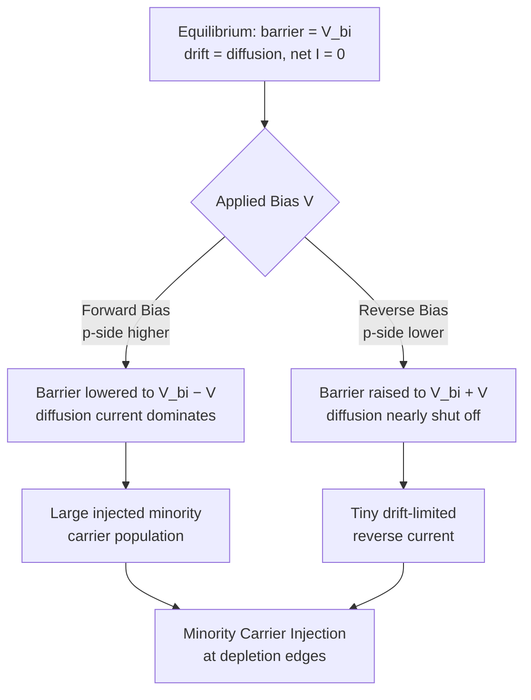
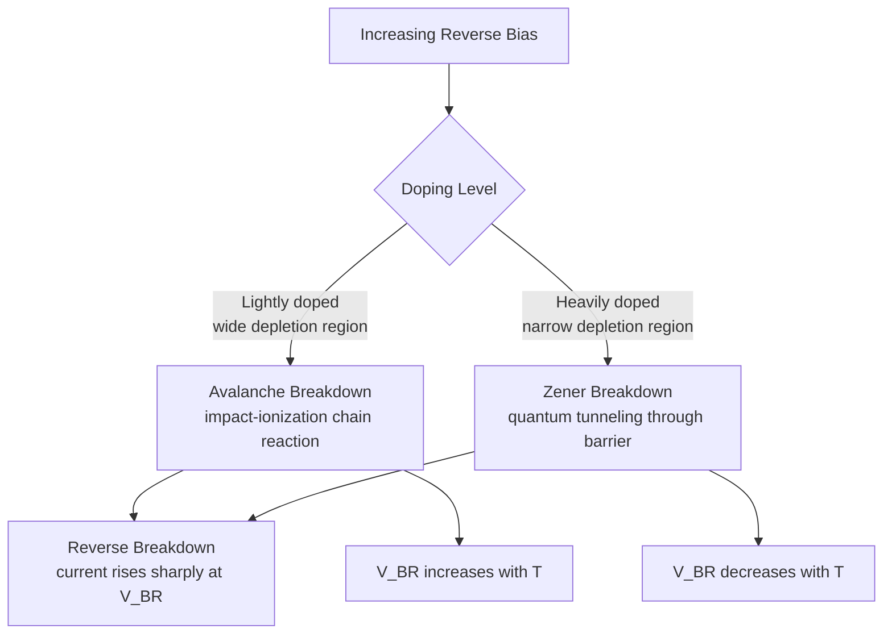

# Chapter 15: The P-N Junction Under Bias

<strong>Chapter Overview</strong> (click to expand)

Chapter 14 built the p-n junction at equilibrium — zero applied voltage, zero net current, drift exactly balancing diffusion. This chapter disturbs that equilibrium with an external voltage and derives, from first principles, the diode current-voltage relationship that makes the p-n junction the single most important circuit element in electronics. **Forward bias** lowers the junction's potential barrier and floods the neutral regions with injected minority carriers; **reverse bias** raises the barrier and nearly shuts diffusion off. The boundary condition connecting the applied voltage to the injected carrier concentration is **minority carrier injection**, and solving the continuity equation for those injected carriers — differently in the **short-base diode** and **long-base diode** limits — yields the **saturation current** and, from it, the **ideal diode equation**. At sufficiently large reverse bias, two distinct mechanisms — **avalanche breakdown** and **Zener breakdown** — cause **reverse breakdown**, completing the full **junction I-V characteristic** that governs every diode circuit application ahead.

**Key Takeaways:**

1. **Forward bias** lowers the junction's potential barrier from \(V_{bi}\) to \(V_{bi}-V\), sharply increasing diffusion; **reverse bias** raises it to \(V_{bi}+V\), suppressing diffusion to a tiny drift-driven current.
2. **Minority carrier injection** at the depletion edges is set by the law of the junction, \(p_n(x_n)=p_{n0}e^{V/V_T}\), directly linking the applied voltage to the injected minority carrier concentration.
3. Solving the continuity equation for the injected carriers gives two limiting solutions: the **long-base diode** (exponential decay, quasi-neutral region much longer than the diffusion length) and the **short-base diode** (linear profile, quasi-neutral region much shorter than the diffusion length).
4. The gradient of the injected carrier profile at the depletion edge sets the **saturation current** \(J_0\), which combines with the law of the junction to give the **ideal diode equation**, \(J=J_0(e^{V/V_T}-1)\).
5. At large reverse bias, **reverse breakdown** occurs via two distinct mechanisms: **avalanche breakdown** (impact-ionization chain reaction, dominant in lightly-doped junctions) and **Zener breakdown** (quantum tunneling across a thin barrier, dominant in heavily-doped junctions).
6. Combining the forward exponential rise, the small reverse saturation current, and the sharp reverse breakdown gives the complete **junction I-V characteristic** — the defining behavior of the diode used throughout the device chapters ahead.

## Learning Objectives

By the end of this chapter, you will be able to:

- Explain how forward and reverse bias modify the equilibrium band diagram, potential barrier, and depletion width
- State and apply the law of the junction to compute injected minority carrier concentration from applied voltage
- Distinguish the short-base and long-base diode approximations and identify which applies to a given device geometry
- Derive the saturation current from the injected minority carrier profile's gradient at the depletion edge
- State and apply the ideal diode equation to compute diode current at a given forward or reverse voltage
- Compare avalanche and Zener breakdown, and predict which mechanism dominates for a given doping level
- Sketch and interpret the complete junction I-V characteristic across forward bias, reverse bias, and breakdown
- Solve worked and practice problems combining these ideas, extending the equilibrium analysis of Chapter 14 to a working diode

## Introduction

Chapter 14 analyzed the p-n junction at thermal equilibrium: a fixed built-in potential, a static depletion region, and zero net current, with drift current from the built-in field exactly canceling diffusion current everywhere. That balance is delicate, and an external voltage applied across the junction upsets it immediately. Connect the p-side to a higher potential than the n-side — **forward bias** — and the applied voltage subtracts from the built-in potential, lowering the barrier that has been holding diffusion in check. Connect the p-side to a lower potential — **reverse bias** — and the applied voltage adds to the built-in potential, raising the barrier and suppressing diffusion almost entirely.

This chapter follows the consequences of that imbalance all the way to a working equation for diode current. Lowering the barrier under forward bias lets majority carriers cross the junction in large numbers, becoming injected minority carriers in the neutral region on the far side — a process quantified by the **law of the junction**, the boundary condition connecting applied voltage to injected carrier concentration. Once carriers are injected, the continuity equation machinery from Chapters 12-13 takes over, with two different limiting solutions depending on whether the neutral region is long compared to the minority carrier diffusion length (the **long-base diode**) or short compared to it (the **short-base diode**). Either solution's carrier gradient at the injection edge sets the **saturation current**, and combining the saturation current with the law of the junction gives the chapter's central result: the **ideal diode equation**.

The chapter closes by pushing reverse bias to its breaking point. Beyond a critical reverse voltage, current increases dramatically through one of two distinct mechanisms — **avalanche breakdown**, an impact-ionization chain reaction that dominates in lightly-doped junctions, or **Zener breakdown**, quantum-mechanical tunneling that dominates in heavily-doped junctions with very thin depletion regions. Combining forward conduction, reverse saturation current, and reverse breakdown produces the complete **junction I-V characteristic** — the defining electrical behavior of the diode, and the direct foundation for every transistor and device covered in the chapters that follow.

## Concepts Covered

This chapter covers the following 11 concepts from the learning graph:

1. Forward Bias
2. Reverse Bias
3. Minority Carrier Injection
4. Short-Base Diode
5. Long-Base Diode
6. Saturation Current
7. Ideal Diode Equation
8. Reverse Breakdown
9. Avalanche Breakdown
10. Zener Breakdown
11. Junction I-V Characteristic

## Prerequisites

This chapter builds on concepts from:

- [Chapter 2: Quantum Mechanics Foundations](../02-quantum-mechanics-foundations/index.md)
- [Chapter 8: Doping, Ionization, and Temperature Regimes](../08-doping-ionization-temperature/index.md)
- [Chapter 9: Carrier Concentration Statistics](../09-carrier-concentration-statistics/index.md)
- [Chapter 12: Diffusion and Advanced Transport Phenomena](../12-diffusion-transport-phenomena/index.md)
- [Chapter 13: Non-Equilibrium Carriers and Recombination](../13-non-equilibrium-carriers-recombination/index.md)
- [Chapter 14: The P-N Junction at Equilibrium](../14-pn-junction-equilibrium/index.md)

---

## Forward and Reverse Bias

### Disturbing the Equilibrium Barrier

Applying an external voltage \(V\) across a p-n junction — positive on the p-side relative to the n-side — is called **forward bias**. Because the applied voltage opposes the built-in potential, the net barrier height across the junction drops from \(V_{bi}\) to \(V_{bi}-V\). Reusing the depletion-width formula derived in Chapter 14 with this reduced barrier:

\[
W(V) = \sqrt{\frac{2\varepsilon (V_{bi}-V)}{q}\left(\frac{1}{N_A}+\frac{1}{N_D}\right)}
\]

A smaller barrier means a narrower depletion region and a weaker peak field — and, far more importantly, it means the energy barrier that was holding back the vast majority-carrier populations on each side is now small enough that a significant fraction of carriers have enough thermal energy to cross it. Diffusion current, suppressed almost completely at equilibrium, turns back on with a vengeance.

**Reverse bias** is the opposite polarity — negative on the p-side relative to the n-side — which adds to the built-in potential, raising the barrier to \(V_{bi}+V\) (using \(V\) as the magnitude of the reverse voltage) and *widening* the depletion region:

\[
W(V) = \sqrt{\frac{2\varepsilon (V_{bi}+V)}{q}\left(\frac{1}{N_A}+\frac{1}{N_D}\right)}
\]

A taller barrier makes diffusion current across the junction exponentially smaller still, leaving only a tiny drift-driven current — the small population of minority carriers generated within a diffusion length of the depletion edge, which the field sweeps across regardless of barrier height (drift current, unlike diffusion current, does not depend exponentially on barrier height, since it is limited by the *supply* of minority carriers, not by how many carriers have enough energy to climb the barrier).

#### Diagram: Forward and Reverse Bias Band Diagram Explorer

<iframe src="../../sims/forward-reverse-bias-band-diagram-explorer/main.html" width="100%" height="630px" scrolling="auto"></iframe>

!!! tip "How to use this MicroSim"
    **Instructions:** Drag the bias slider from reverse through zero into forward bias and watch the band diagram, barrier height, and depletion width all update together.

    **Learning objective:** Explain how forward and reverse bias modify the equilibrium band diagram, potential barrier, and depletion width.

    **What to observe:** Forward bias visibly flattens the band bending and shrinks \(W\); reverse bias steepens the bending and stretches \(W\) — the barrier height readout tracks \(V_{bi}-V\) exactly, becoming small (but never negative in this idealized model) as \(V\) approaches \(V_{bi}\).

[Full MicroSim documentation →](../../sims/forward-reverse-bias-band-diagram-explorer/index.md)

!!! question "Concept Check"
    A silicon junction has \(V_{bi}=0.75\ \text{V}\). Under a forward bias of \(V=0.6\ \text{V}\), what is the net barrier height, and is the depletion region wider or narrower than at equilibrium?

??? question "Concept Check — click to reveal answer"
    The net barrier drops to \(V_{bi}-V=0.75-0.6=0.15\ \text{V}\), and since \(W\propto\sqrt{V_{bi}-V}\), a smaller effective voltage means the depletion region is *narrower* than at equilibrium — consistent with forward bias pulling the bands back toward flat-band alignment.

## Minority Carrier Injection: The Law of the Junction

### Connecting Applied Voltage to Injected Carrier Concentration

Under forward bias, the reduced barrier lets far more majority carriers cross the junction than at equilibrium. A hole that crosses from the p-side into the n-side becomes, the instant it crosses, an injected minority carrier in a sea of majority electrons — precisely the excess-carrier scenario analyzed in Chapter 13, except now the "generation" is carriers crossing the junction rather than photon absorption. The concentration of these injected minority carriers right at the edge of the depletion region is set by the **law of the junction**:

\[
p_n(x_n) = p_{n0}\,e^{V/V_T}, \qquad n_p(-x_p) = n_{p0}\,e^{V/V_T}
\]

where:

- \(p_n(x_n)\) is the total hole concentration at the n-side edge of the depletion region (\(x=x_n\))
- \(p_{n0}=n_i^2/N_D\) is the equilibrium minority hole concentration deep in the neutral n-side (Chapter 9)
- \(n_p(-x_p)\) and \(n_{p0}=n_i^2/N_A\) are the corresponding quantities for injected electrons at the p-side edge
- \(V_T=kT/q\) is the thermal voltage, \(0.0259\ \text{V}\) at 300 K
- \(V\) is the applied bias (positive for forward, negative for reverse)

At \(V=0\), both expressions correctly reduce to their equilibrium values. Under forward bias, \(e^{V/V_T}\) grows enormously for even modest \(V\) (since \(V_T\) is only 25.9 mV), so the injected minority concentration at the edge can exceed its equilibrium value by many orders of magnitude — precisely the kind of high-level excess-carrier disturbance introduced in Chapter 13, just created here by carrier injection across a junction rather than by illumination. Under reverse bias, \(V\) is negative and \(e^{V/V_T}\to0\), so the boundary concentration is pulled *below* its equilibrium value — the depletion edge is nearly stripped of minority carriers, which is exactly why reverse current is so small.

The **excess** minority concentration injected at the edge, relative to equilibrium, is therefore:

\[
\Delta p_n(x_n) = p_{n0}\left(e^{V/V_T}-1\right)
\]

This excess concentration is the boundary condition that launches the continuity-equation solution in the next section.

!!! question "Concept Check"
    A forward-biased junction has \(V=0.3\ \text{V}\) at 300 K (\(V_T=0.0259\ \text{V}\)). Is the injected minority carrier concentration at the depletion edge larger or smaller than its equilibrium value, and by roughly what factor?

??? question "Concept Check — click to reveal answer"
    Larger, by a factor of \(e^{V/V_T}=e^{0.3/0.0259}=e^{11.58}\approx1.07\times10^5\) — the injected concentration is about 100,000 times its equilibrium value, illustrating how even a fraction of a volt of forward bias produces enormous minority carrier injection.

## Short-Base and Long-Base Diodes

### Solving the Continuity Equation for Injected Carriers

Once holes are injected at \(x_n\), they diffuse into the quasi-neutral n-side exactly as in Chapter 13's continuity-equation analysis, recombining with a characteristic minority carrier lifetime \(\tau_p\) and diffusion length \(L_p=\sqrt{D_p\tau_p}\). The solution depends critically on how the length of the quasi-neutral region, \(W'\) (the distance from the depletion edge to the ohmic contact), compares to \(L_p\):

- **Long-base diode**: \(W'\gg L_p\). The contact is effectively infinitely far away, so the solution is the same decaying exponential derived in Chapter 13:

\[
\Delta p_n(x') = p_{n0}\left(e^{V/V_T}-1\right)e^{-x'/L_p}, \qquad x'=x-x_n
\]

- **Short-base diode**: \(W'\ll L_p\). The ohmic contact is so close that essentially no injected carriers recombine before reaching it; the contact instead forces \(\Delta p_n\to0\) there (an ohmic contact maintains equilibrium carrier concentration), giving a **linear** profile instead of an exponential one:

\[
\Delta p_n(x') = p_{n0}\left(e^{V/V_T}-1\right)\left(1-\frac{x'}{W'}\right)
\]

Both are limiting cases of the same general continuity-equation solution; real devices are engineered deliberately into one regime or the other. Short-base diodes are common in integrated circuits, where the quasi-neutral region is fabricated deliberately thin, while long-base behavior is typical of discrete diodes with thick substrates.

#### Diagram: Minority Carrier Injection Profile Explorer

<iframe src="../../sims/minority-carrier-injection-profile-explorer/main.html" width="100%" height="700px" scrolling="auto"></iframe>

!!! tip "How to use this MicroSim"
    **Instructions:** Toggle between long-base and short-base regimes and compare the resulting carrier profiles; vary the applied voltage and the base width \(W'\) relative to \(L_p\).

    **Learning objective:** Distinguish the short-base and long-base diode approximations, and identify which applies to a given ratio of base width to diffusion length.

    **What to observe:** The long-base profile always curves and flattens toward zero; the short-base profile is a straight line to zero at the contact. As \(W'\) is increased past several \(L_p\), the short-base line increasingly resembles the long-base exponential near the injection edge.

[Full MicroSim documentation →](../../sims/minority-carrier-injection-profile-explorer/index.md)

## Saturation Current

### From Carrier Gradient to Current Density

Diffusion current density is proportional to the concentration gradient (Fick's law, Chapter 12), so the hole current density at the injection edge is found by differentiating the appropriate profile from the previous section and evaluating at \(x'=0\). For the long-base diode:

\[
J_p = qD_p\left.\frac{d(\Delta p_n)}{dx'}\right|_{x'=0} = \frac{qD_pp_{n0}}{L_p}\left(e^{V/V_T}-1\right)
\]

For the short-base diode, the same differentiation of the linear profile gives a steeper gradient (since the same total concentration change happens over a much shorter distance \(W'\ll L_p\)):

\[
J_p = \frac{qD_pp_{n0}}{W'}\left(e^{V/V_T}-1\right)
\]

Both expressions have the same form, \(J_p=J_{0,p}(e^{V/V_T}-1)\), differing only in whether \(L_p\) or \(W'\) appears in the denominator of \(J_{0,p}\). Including the symmetric electron-injection current into the p-side (from \(n_p(-x_p)\)) gives the total **saturation current density**:

\[
J_0 = qn_i^2\left(\frac{D_p}{L_pN_D}+\frac{D_n}{L_nN_A}\right) \quad\text{(long-base)}
\]

with \(L_p\), \(L_n\) replaced by the appropriate base widths \(W'\) in the short-base limit. \(J_0\) is called the *saturation* current because, under reverse bias, \(e^{V/V_T}\to0\) and \(J\to-J_0\): the reverse current saturates at this small, fixed value rather than growing with reverse voltage (until breakdown, covered later in this chapter). Because \(J_0\propto n_i^2\), and \(n_i^2\) depends exponentially on temperature and band gap (Chapter 7), \(J_0\) — and hence the entire forward I-V curve — is extremely temperature-sensitive.

!!! example "Worked Example 1 — Saturation Current Density of a One-Sided Silicon Diode"
    A silicon diode has \(N_A=1\times10^{18}\ \text{cm}^{-3}\), \(N_D=1\times10^{16}\ \text{cm}^{-3}\), \(n_i=1.5\times10^{10}\ \text{cm}^{-3}\), \(D_p=12.4\ \text{cm}^2/\text{s}\), \(\tau_p=1\ \mu\text{s}\), \(D_n=35\ \text{cm}^2/\text{s}\), \(\tau_n=0.1\ \mu\text{s}\), and is long-base on both sides. Find \(J_0\).

    **Solution:** \(p_{n0}=n_i^2/N_D=(1.5\times10^{10})^2/(1\times10^{16})=2.25\times10^{4}\ \text{cm}^{-3}\). \(n_{p0}=n_i^2/N_A=2.25\times10^{2}\ \text{cm}^{-3}\). \(L_p=\sqrt{D_p\tau_p}=\sqrt{(12.4)(1\times10^{-6})}\approx3.52\times10^{-3}\ \text{cm}=35.2\ \mu\text{m}\). \(L_n=\sqrt{(35)(1\times10^{-7})}\approx1.87\times10^{-3}\ \text{cm}=18.7\ \mu\text{m}\).

    \[
    J_{0,p}=\frac{qD_pp_{n0}}{L_p}=\frac{(1.6\times10^{-19})(12.4)(2.25\times10^{4})}{3.52\times10^{-3}}\approx1.27\times10^{-11}\ \text{A/cm}^2
    \]

    \[
    J_{0,n}=\frac{qD_nn_{p0}}{L_n}=\frac{(1.6\times10^{-19})(35)(2.25\times10^{2})}{1.87\times10^{-3}}\approx6.74\times10^{-13}\ \text{A/cm}^2
    \]

    \(J_0=J_{0,p}+J_{0,n}\approx1.34\times10^{-11}\ \text{A/cm}^2\). Hole injection into the lightly-doped n-side supplies about 95% of the total, since \(N_A\) is 100 times larger than \(N_D\) even though the shorter electron diffusion length partially compensates.

## The Ideal Diode Equation

### The Chapter's Central Result

Combining the law of the junction with the saturation-current expression (both share the same \(e^{V/V_T}-1\) factor, since both trace back to the same injected boundary concentration) gives the **ideal diode equation**:

\[
J = J_0\left(e^{V/V_T}-1\right), \qquad I = I_0\left(e^{V/V_T}-1\right)
\]

where \(I_0=J_0A\) for a junction of area \(A\). This single equation captures the diode's entire equilibrium-to-bias story:

- At \(V=0\): \(J=0\), recovering the equilibrium result of Chapter 14 (zero net current).
- Under forward bias (\(V\gg V_T\)): \(J\approx J_0e^{V/V_T}\), current rises exponentially — a few tenths of a volt changes current by orders of magnitude.
- Under reverse bias (\(V\ll-V_T\), magnitude a few \(V_T\) or more): \(J\approx-J_0\), current saturates at the small, nearly voltage-independent value \(-J_0\).

!!! example "Worked Example 2 — Forward Current Density at Several Voltages"
    Using \(J_0=1.34\times10^{-11}\ \text{A/cm}^2\) from Worked Example 1 and \(V_T=0.0259\ \text{V}\), find \(J\) at \(V=0.4\), \(0.5\), \(0.6\), and \(0.7\ \text{V}\).

    **Solution:** \(J=J_0(e^{V/V_T}-1)\) gives \(J(0.4\ \text{V})\approx6.5\times10^{-5}\ \text{A/cm}^2\), \(J(0.5\ \text{V})\approx3.1\times10^{-3}\ \text{A/cm}^2\), \(J(0.6\ \text{V})\approx0.146\ \text{A/cm}^2\), and \(J(0.7\ \text{V})\approx6.94\ \text{A/cm}^2\). Each additional 0.1 V multiplies the current by roughly \(e^{0.1/0.0259}\approx47\times\) — the signature exponential steepness of diode conduction.

!!! example "Worked Example 3 — Short-Base Saturation Current and Total Forward Current"
    Suppose the n-side of the diode in Worked Example 1 is instead fabricated short-base, with quasi-neutral width \(W'=5\ \mu\text{m}\) (much less than \(L_p=35.2\ \mu\text{m}\)). Find the new \(J_{0,p}\), and the total forward current at \(V=0.55\ \text{V}\) for a junction area \(A=2\times10^{-3}\ \text{cm}^2\) (using the long-base \(J_0\) from Worked Example 1 for simplicity).

    **Solution:** \(J_{0,p}^{short}=\dfrac{qD_pp_{n0}}{W'}=\dfrac{(1.6\times10^{-19})(12.4)(2.25\times10^{4})}{5\times10^{-4}}\approx8.94\times10^{-11}\ \text{A/cm}^2\) — about \(L_p/W'\approx7.0\times\) larger than the long-base value, since the same concentration drop now occurs over a much shorter distance. Using the long-base \(J_0=1.34\times10^{-11}\ \text{A/cm}^2\) at \(V=0.55\ \text{V}\): \(J\approx J_0e^{V/V_T}=(1.34\times10^{-11})e^{0.55/0.0259}\approx2.23\times10^{-2}\ \text{A/cm}^2\), so \(I=JA\approx(2.23\times10^{-2})(2\times10^{-3})\approx4.46\times10^{-5}\ \text{A}\approx0.045\ \text{mA}\).

#### Diagram: Ideal Diode I-V Curve Explorer

<iframe src="../../sims/ideal-diode-iv-curve-explorer/main.html" width="100%" height="720px" scrolling="auto"></iframe>

!!! tip "How to use this MicroSim"
    **Instructions:** Vary \(J_0\) and temperature, and switch between linear and semi-log views of the I-V curve; drag the voltage marker across forward and reverse bias.

    **Learning objective:** Apply the ideal diode equation to compute current at a given voltage, and interpret the exponential forward rise and reverse saturation regions of the I-V curve.

    **What to observe:** On the semi-log view, the forward region becomes a straight line — a direct visual signature of the exponential ideal diode equation; the reverse region flattens to \(-J_0\) regardless of how negative \(V\) becomes (until breakdown, not yet shown in this sim).

[Full MicroSim documentation →](../../sims/ideal-diode-iv-curve-explorer/index.md)

## Reverse Breakdown: Avalanche and Zener Mechanisms

### When Reverse Bias Goes Too Far

The ideal diode equation predicts reverse current saturating at \(-J_0\) forever as reverse voltage increases — but real junctions cannot sustain arbitrarily large reverse voltage. Beyond a critical **breakdown voltage** \(V_{BR}\), reverse current increases dramatically through one of two distinct physical mechanisms, together called **reverse breakdown**.

**Avalanche breakdown** is an impact-ionization chain reaction. As reverse bias increases, the peak junction electric field (Chapter 14) grows, accelerating the small population of carriers that do cross the depletion region to increasingly high kinetic energy. Beyond a critical field \(E_{crit}\), an accelerated carrier can gain enough energy between collisions to knock a valence electron across the band gap on impact, generating a new electron-hole pair — which is itself accelerated and can generate further pairs, multiplying rapidly into a runaway current. Avalanche breakdown dominates in **lightly-doped** junctions, where the depletion region is wide enough for carriers to accelerate over a long distance before colliding.

**Zener breakdown** is a purely quantum-mechanical process: **quantum tunneling** (Chapter 2) of valence electrons directly through the thin depletion-region barrier into the conduction band on the other side, with no collision or energy exchange involved at all. Because tunneling probability depends critically on barrier *width*, Zener breakdown dominates in **heavily-doped** junctions, where the depletion region (Chapter 14) is narrow enough for direct tunneling to become significant — typically at doping levels above roughly \(10^{17}-10^{18}\ \text{cm}^{-3}\) in silicon.

The two mechanisms can be distinguished experimentally by their opposite temperature dependence: avalanche breakdown voltage *increases* with temperature (lattice vibrations increase scattering, so carriers need a higher field to reach the same energy between collisions), while Zener breakdown voltage *decreases* with temperature (the band gap itself narrows slightly with temperature, easing tunneling). Diodes designed to exploit breakdown deliberately (voltage-reference "Zener diodes," which may use either mechanism depending on their rated voltage) are chosen partly by which temperature coefficient a given application needs.

For a one-sided abrupt junction, avalanche breakdown voltage can be estimated by requiring the peak field (Chapter 14) to reach \(E_{crit}\) (about \(3\times10^5\ \text{V/cm}\) in silicon, though the true critical field itself rises somewhat with doping):

\[
V_{BR}\approx\frac{\varepsilon E_{crit}^2}{2qN_B}
\]

where \(N_B\) is the doping concentration of the lightly-doped side, which controls the depletion width and hence how quickly the field builds up.

#### Diagram: Reverse Breakdown Mechanism Explorer

<iframe src="../../sims/reverse-breakdown-mechanism-explorer/main.html" width="100%" height="960px" scrolling="auto"></iframe>

!!! tip "How to use this MicroSim"
    **Instructions:** Sweep the lightly-doped-side concentration slider and watch the estimated avalanche breakdown voltage fall; observe the crossover region where Zener tunneling would take over in a real device.

    **Learning objective:** Compare avalanche and Zener breakdown mechanisms and predict which one dominates for a given doping level.

    **What to observe:** Breakdown voltage falls steeply as doping increases (roughly \(V_{BR}\propto1/N_B\)); at the highest doping levels shown, the estimate drops to just a few volts, exactly the regime where real Zener tunneling — not modeled by the avalanche formula — takes over.

[Full MicroSim documentation →](../../sims/reverse-breakdown-mechanism-explorer/index.md)

!!! example "Worked Example 4 — Estimating Avalanche Breakdown Voltage"
    A silicon diode has a lightly-doped n-side with \(N_D=1\times10^{16}\ \text{cm}^{-3}\) and \(E_{crit}\approx3\times10^{5}\ \text{V/cm}\). Estimate the avalanche breakdown voltage.

    **Solution:**

    \[
    V_{BR}\approx\frac{(1.035\times10^{-12})(3\times10^{5})^2}{2(1.6\times10^{-19})(1\times10^{16})}\approx29.1\ \text{V}
    \]

    This is a typical breakdown voltage for a moderately-doped silicon diode. Raising \(N_D\) to \(1\times10^{17}\ \text{cm}^{-3}\) (ten times heavier doping) drops the estimate to about 2.9 V — deep into the regime where real devices break down via Zener tunneling instead, since the avalanche formula itself becomes unreliable at such narrow depletion widths.

!!! question "Concept Check"
    Two silicon diodes have breakdown voltages of about 200 V and about 4 V, respectively. Which one most likely breaks down primarily by avalanche, and which by Zener tunneling?

??? question "Concept Check — click to reveal answer"
    The 200 V diode is almost certainly avalanche (it must be lightly doped, since \(V_{BR}\propto1/N_B\), giving a wide depletion region well-suited to an impact-ionization chain reaction). The 4 V diode is almost certainly Zener (such a low breakdown voltage requires very heavy doping and a correspondingly thin depletion barrier for direct tunneling).

## The Complete Junction I-V Characteristic

### Putting Forward Conduction, Saturation, and Breakdown Together

Combining every result of this chapter into a single current-voltage relationship gives the complete **junction I-V characteristic**:

\[
I(V) \approx \begin{cases} I_0\left(e^{V/V_T}-1\right) & V>-V_{BR} \\ \text{rapid breakdown current increase} & V\le-V_{BR} \end{cases}
\]

Across most of the forward region, current rises exponentially — doubling roughly every \(V_T\ln2\approx18\ \text{mV}\) — so real diodes appear to conduct almost negligible current below roughly 0.5-0.6 V (for silicon) and then rise so steeply that the forward voltage across a conducting diode is nearly constant regardless of current, the basis of the familiar "0.7 V diode drop" approximation used throughout circuit analysis. Across the reverse region, current is pinned at the tiny, nearly voltage-independent \(-I_0\) until breakdown, at which point current increases so steeply that external circuitry (a series resistor, in most practical circuits) must limit it to protect the device. This single curve — exponential forward rise, flat reverse saturation, sharp reverse breakdown — is the defining electrical signature of the p-n junction diode, and every transistor covered in later chapters is built from one or more junctions obeying exactly this relationship.

#### Diagram: Complete Junction I-V Characteristic Explorer

<iframe src="../../sims/junction-iv-characteristic-explorer/main.html" width="100%" height="720px" scrolling="auto"></iframe>

!!! tip "How to use this MicroSim"
    **Instructions:** Set the lightly-doped-side concentration, then drag the voltage marker from deep reverse bias (past breakdown) through zero and into forward conduction, watching the I-V curve, the live junction diagram, and the operating-region readout update together.

    **Learning objective:** Sketch and interpret the complete junction I-V characteristic across forward bias, reverse bias, and breakdown, and connect each region to the physical state of the junction.

    **What to observe:** One doping choice sets both the estimated breakdown voltage \(V_{BR}\) and, through the mini junction diagram, which breakdown mechanism is more likely; the same voltage marker sweeps continuously through breakdown, reverse saturation, and forward conduction on one consistent semi-log current scale — the same three regions introduced separately by the band-diagram, ideal-diode, and breakdown MicroSims earlier in this chapter, now shown as one connected picture.

[Full MicroSim documentation →](../../sims/junction-iv-characteristic-explorer/index.md)

!!! question "Concept Check"
    Why does the forward voltage across a conducting silicon diode change so little (roughly 0.6-0.8 V) even as the current through it varies by several orders of magnitude?

??? question "Concept Check — click to reveal answer"
    Because current depends *exponentially* on voltage in the ideal diode equation, a huge change in current corresponds to only a small change in voltage: since \(V=V_T\ln(I/I_0+1)\), and \(\ln\) compresses large ratios into small differences, increasing current by a factor of 1000 only raises \(V\) by \(V_T\ln(1000)\approx0.18\ \text{V}\).

## Summary

This chapter disturbed the equilibrium p-n junction of Chapter 14 with an applied voltage and derived the diode's complete current-voltage behavior. **Forward bias** lowers the junction barrier to \(V_{bi}-V\), sharply increasing diffusion current; **reverse bias** raises it to \(V_{bi}+V\), nearly shutting diffusion off. The law of the junction sets **minority carrier injection** at the depletion edges, \(p_n(x_n)=p_{n0}e^{V/V_T}\), which launches a continuity-equation solution taking one of two limiting forms: the exponentially-decaying **long-base diode** profile, or the linear **short-base diode** profile, depending on the quasi-neutral region's length relative to the diffusion length. Either profile's gradient at the injection edge sets the **saturation current** \(J_0\), which combines with the law of the junction to give the chapter's central result, the **ideal diode equation**, \(J=J_0(e^{V/V_T}-1)\). At sufficiently large reverse bias, **reverse breakdown** occurs via **avalanche breakdown** (impact ionization, dominant in lightly-doped junctions) or **Zener breakdown** (quantum tunneling, dominant in heavily-doped junctions), completing the full **junction I-V characteristic** that defines diode behavior throughout the device chapters ahead.

## Key Equations

| Concept | Equation |
|---|---|
| Depletion width under bias | \(W(V) = \sqrt{\dfrac{2\varepsilon (V_{bi}\mp V)}{q}\left(\dfrac{1}{N_A}+\dfrac{1}{N_D}\right)}\) |
| Law of the junction | \(p_n(x_n) = p_{n0}\,e^{V/V_T}\) |
| Long-base excess carrier profile | \(\Delta p_n(x') = p_{n0}(e^{V/V_T}-1)e^{-x'/L_p}\) |
| Short-base excess carrier profile | \(\Delta p_n(x') = p_{n0}(e^{V/V_T}-1)(1-x'/W')\) |
| Saturation current density | \(J_0 = qn_i^2\left(\dfrac{D_p}{L_pN_D}+\dfrac{D_n}{L_nN_A}\right)\) |
| Ideal diode equation | \(I = I_0\left(e^{V/V_T}-1\right)\) |
| Avalanche breakdown voltage estimate | \(V_{BR}\approx\dfrac{\varepsilon E_{crit}^2}{2qN_B}\) |

## Glossary

See the [Chapter 15 Glossary](glossary.md) for full definitions of every term introduced in this chapter.

## Further Reading

- Sze and Ng, *Physics of Semiconductor Devices* — the standard reference on the ideal diode equation and breakdown mechanisms
- Neamen, *Semiconductor Physics and Devices* — clear derivation of the short-base and long-base diode limits
- Shockley, "The Theory of P-N Junctions in Semiconductors and P-N Junction Transistors," *Bell System Technical Journal* (1949) — the original derivation of the ideal diode equation
- Pierret, *Semiconductor Device Fundamentals* — detailed treatment of avalanche multiplication and Zener tunneling

## Worked Examples

!!! example "Worked Example 5 — Injected Minority Carrier Concentration"
    For the diode of Worked Example 1 (\(p_{n0}=2.25\times10^{4}\ \text{cm}^{-3}\)), find the excess hole concentration injected at the depletion edge under \(V=0.5\ \text{V}\) forward bias, and compare it to the equilibrium value.

    **Solution:** \(\Delta p_n(x_n)=p_{n0}(e^{V/V_T}-1)=(2.25\times10^{4})(e^{0.5/0.0259}-1)\approx5.45\times10^{12}\ \text{cm}^{-3}\). This is about \(2.4\times10^8\) times the equilibrium value \(p_{n0}=2.25\times10^{4}\ \text{cm}^{-3}\) — the injected concentration completely dominates, exactly the high-level-injection regime introduced in Chapter 13.

!!! example "Worked Example 6 — Breakdown Voltage vs. Doping"
    Estimate the avalanche breakdown voltage for silicon diodes with lightly-doped-side concentrations \(N_B=1\times10^{15}\ \text{cm}^{-3}\) and \(N_B=5\times10^{17}\ \text{cm}^{-3}\), using \(E_{crit}=3\times10^{5}\ \text{V/cm}\).

    **Solution:** At \(N_B=1\times10^{15}\ \text{cm}^{-3}\): \(V_{BR}\approx\dfrac{(1.035\times10^{-12})(3\times10^5)^2}{2(1.6\times10^{-19})(1\times10^{15})}\approx291\ \text{V}\). At \(N_B=5\times10^{17}\ \text{cm}^{-3}\): \(V_{BR}\approx0.58\ \text{V}\). The thousand-fold increase in doping drops the avalanche estimate by roughly the same thousand-fold factor (\(V_{BR}\propto1/N_B\)); at the higher doping, the formula has left the avalanche regime entirely, and any real device at that doping level would break down via Zener tunneling at a similarly small voltage.

!!! example "Worked Example 7 — Reverse Current Near Saturation"
    Using \(J_0=1.34\times10^{-11}\ \text{A/cm}^2\) from Worked Example 1, find \(J\) at \(V=-0.3\ \text{V}\) and at \(V=-1\ \text{V}\) reverse bias (well below breakdown), and comment on the result.

    **Solution:** At \(V=-0.3\ \text{V}\): \(J=J_0(e^{-0.3/0.0259}-1)\approx J_0(-0.99999)\approx-1.34\times10^{-11}\ \text{A/cm}^2\). At \(V=-1\ \text{V}\): \(J\approx-J_0=-1.34\times10^{-11}\ \text{A/cm}^2\) to extremely high precision. Both results are essentially identical to \(-J_0\), confirming that once reverse bias exceeds a few \(V_T\) (about 0.1 V), the exact reverse voltage barely matters — current has already saturated.

!!! example "Worked Example 8 — Forward Voltage for a Target Current"
    Using \(I_0=J_0A=(1.34\times10^{-11})(1\times10^{-2})\approx1.34\times10^{-13}\ \text{A}\) for a \(1\times10^{-2}\ \text{cm}^2\) diode, find the forward voltage needed to reach \(I=10\ \text{mA}\).

    **Solution:** Solving the ideal diode equation for \(V\), and neglecting the \(-1\) (valid whenever \(I\gg I_0\)): \(V=V_T\ln(I/I_0)=(0.0259)\ln\!\left(\dfrac{1\times10^{-2}}{1.34\times10^{-13}}\right)=(0.0259)\ln(7.46\times10^{10})\approx(0.0259)(25.04)\approx0.649\ \text{V}\) — consistent with the familiar "0.6-0.7 V" forward drop used throughout circuit analysis.

## Interactive Chapter Walkthrough

Use the MicroSim below as a capstone review: a guided, step-through tour of this entire chapter's storyline in order — from applying forward and reverse bias, through minority carrier injection, the short-base and long-base limits, saturation current, the ideal diode equation, avalanche and Zener breakdown, and finally the complete junction I-V characteristic.

#### Diagram: P-N Junction Under Bias Interactive Walkthrough

<iframe src="../../sims/pn-junction-under-bias-interactive-walkthrough/main.html" width="100%" height="700px" scrolling="auto"></iframe>

!!! tip "How to use this MicroSim"
    **Instructions:** Click "Next ▶" through all steps in order, then use the step dots to jump back to any concept before the chapter quiz.

    **Learning objective:** Recall and summarize the full chain of concepts connecting applied bias to the complete junction I-V characteristic.

    **What to observe:** Each step's small illustration mirrors a MicroSim used earlier in the chapter, tying the whole narrative together in one place.

[Full MicroSim documentation →](../../sims/pn-junction-under-bias-interactive-walkthrough/index.md)

