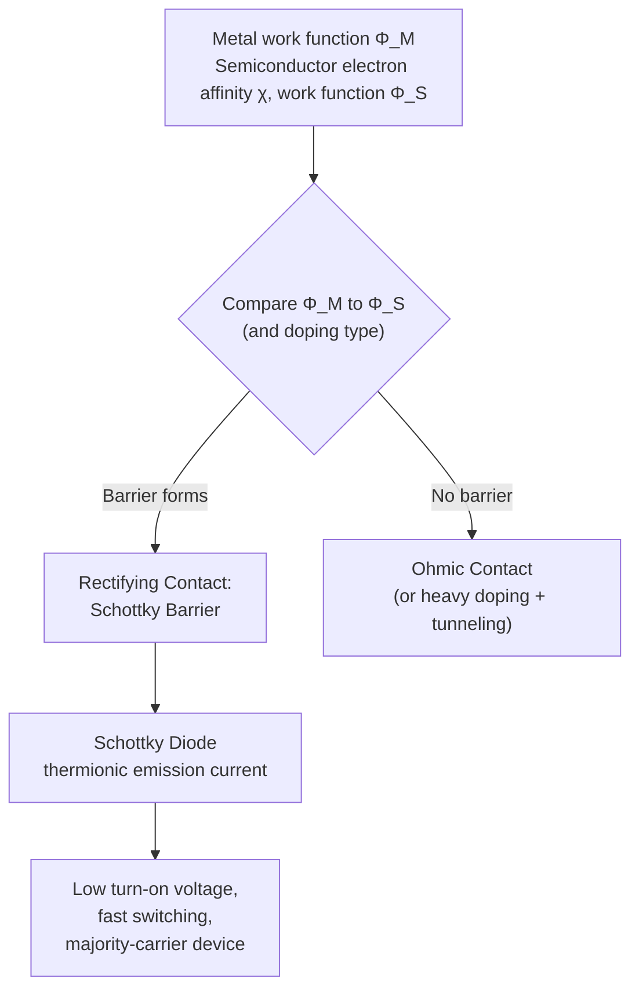
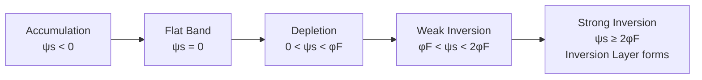

# Chapter 16: Metal-Semiconductor and MOS Junctions

<strong>Chapter Overview</strong> (click to expand)

Chapter 15 completed the story of the p-n junction. This chapter extends junction physics to two more structures that appear in nearly every integrated circuit: the **metal-semiconductor junction**, formed wherever a metal contact touches a semiconductor, and the **MOS capacitor**, the layered structure at the heart of every MOSFET. Metal-semiconductor junctions turn out to come in two flavors — the rectifying **Schottky barrier**, whose height is set by the metal's **work function** and the semiconductor's **electron affinity**, and the non-rectifying **ohmic contact**, engineered to have essentially no barrier at all. The second half of the chapter builds the **MOS capacitor** from a gate, a **gate oxide**, and a semiconductor, and traces what happens to the semiconductor surface as gate voltage sweeps from the **flat-band voltage** through **accumulation**, **depletion**, **weak inversion**, and finally **strong inversion** — the condition that creates the conducting **inversion layer** channel of a MOSFET, at the **threshold voltage** that switches the transistor on.

**Key Takeaways:**

1. A metal's **work function** and a semiconductor's **electron affinity** (plus its doping-dependent Fermi level position) together determine the **barrier height** that forms when the two are joined at a **metal-semiconductor junction**.
2. When the barrier height is large enough, the result is a rectifying **Schottky barrier**, the basis of the fast-switching **Schottky diode**; when doping or work function alignment eliminates the barrier, the result is a low-resistance **ohmic contact** rather than a **rectifying contact**.
3. A **MOS capacitor** stacks a gate, an insulating **gate oxide**, and a semiconductor; the gate voltage at which the semiconductor surface shows no band bending at all is the **flat-band voltage**.
4. Sweeping gate voltage away from flat-band moves the **semiconductor surface** through **accumulation** (majority carriers pile up), **depletion mode** (majority carriers pushed away, exposing fixed charge), and eventually **inversion** — first **weak inversion**, then **strong inversion**, when the **inversion layer** of minority carriers becomes the dominant surface charge.
5. The **surface potential** required to reach strong inversion sets the **threshold voltage** \(V_T\), the gate voltage marking a MOSFET's on/off switching point, computed using the **oxide capacitance** that converts stored charge into voltage across the gate oxide.

## Learning Objectives

By the end of this chapter, you will be able to:

- Compute barrier height from a metal's work function and a semiconductor's electron affinity, and explain how a Schottky barrier forms
- Distinguish ohmic from rectifying metal-semiconductor contacts for a given metal and doping type
- Compare the Schottky diode's thermionic-emission current mechanism to the p-n junction's diffusion-based ideal diode equation
- Describe the MOS capacitor structure and compute oxide capacitance from oxide thickness
- Explain how gate voltage moves the semiconductor surface through flat-band, accumulation, depletion, weak inversion, and strong inversion
- Derive and apply the threshold voltage equation from flat-band voltage, bulk potential, and maximum depletion charge
- Solve worked and practice problems combining these ideas, in preparation for the semiconductor device applications ahead

!!! note "How to read this chapter"
    This chapter's 20 concepts split cleanly into two parts. Part 1 (work function through Schottky diode) analyzes a metal touching a semiconductor directly. Part 2 (MOS capacitor through threshold voltage) inserts an insulating oxide layer between the metal and semiconductor, and asks what happens to the semiconductor surface as gate voltage changes. Part 2 reuses several ideas from Part 1 — especially work function and barrier physics — so reading in order pays off.

## Introduction

Chapters 14-15 analyzed the p-n junction: two doped regions of the *same* semiconductor crystal joined at a common interface. Real circuits also need to connect semiconductors to the outside world, and every such connection is a **metal-semiconductor junction** — a metal wire or contact pad touching a semiconductor surface. Depending on the metal and the semiconductor's doping, that junction behaves in one of two very different ways: it can form a **Schottky barrier**, a rectifying junction similar in spirit to a p-n junction but built from entirely different materials and physics, or it can form a low-resistance **ohmic contact**, engineered specifically to *avoid* rectification so that current can flow freely in and out of a device without distorting circuit behavior.

The second half of this chapter builds toward the single most important structure in modern electronics: the **MOS capacitor** (Metal-Oxide-Semiconductor capacitor), formed by inserting a thin insulating **gate oxide** between a metal (or heavily-doped polysilicon) gate and a semiconductor substrate. Unlike a metal-semiconductor junction, no current flows through the oxide at equilibrium — instead, the gate voltage electrostatically controls the charge and carrier populations at the semiconductor surface underneath it, exactly the way a parallel-plate capacitor's voltage controls the charge on its plates. Sweeping that gate voltage moves the semiconductor surface through a sequence of distinct regimes — **accumulation**, **depletion**, **weak inversion**, and **strong inversion** — and the gate voltage at which strong inversion begins, the **threshold voltage**, is the single number that determines when a MOSFET switches on. Every transistor in Chapter 18 is built around exactly this physics.

## Concepts Covered

This chapter covers the following 20 concepts from the learning graph:

1. Metal-Semiconductor Junction
2. Work Function
3. Electron Affinity
4. Barrier Height
5. Schottky Barrier
6. Schottky Diode
7. Ohmic Contact
8. Rectifying Contact
9. MOS Capacitor
10. Gate Oxide
11. Flat-Band Voltage
12. Accumulation Region
13. Depletion Mode
14. Inversion Layer
15. Threshold Voltage
16. Surface Potential
17. Oxide Capacitance
18. Strong Inversion
19. Weak Inversion
20. Semiconductor Surface

## Prerequisites

This chapter builds on concepts from:

- [Chapter 6: Band Structure and the Fermi Level](../06-band-structure-fermi-level/index.md)
- [Chapter 7: Intrinsic and Extrinsic Semiconductors](../07-intrinsic-extrinsic-semiconductors/index.md)
- [Chapter 8: Doping, Ionization, and Temperature Regimes](../08-doping-ionization-temperature/index.md)
- [Chapter 9: Carrier Concentration Statistics](../09-carrier-concentration-statistics/index.md)
- [Chapter 14: The P-N Junction at Equilibrium](../14-pn-junction-equilibrium/index.md)
- [Chapter 15: The P-N Junction Under Bias](../15-pn-junction-under-bias/index.md)

---

## Part 1: Metal-Semiconductor Junctions

### Work Function, Electron Affinity, and the Metal-Semiconductor Junction

#### Two Material Constants That Set the Barrier

A **metal-semiconductor junction** forms wherever a metal is brought into intimate contact with a semiconductor — every bond pad, gate electrode, and wire contact in a real device. What happens electrically at that junction is governed by two material-specific energy quantities.

The **work function** \(q\Phi_M\) of a metal is the energy required to remove an electron from the metal's Fermi level all the way to the vacuum level just outside the surface — a measure of how tightly the metal's electron sea holds onto its electrons. Different metals have very different work functions: aluminum's is about 4.1 eV, gold's about 5.1 eV, platinum's about 5.65 eV.

The **electron affinity** \(q\chi\) of a semiconductor is the energy from the vacuum level down to the conduction band edge \(E_C\) — a fixed material property, independent of doping (silicon's is about 4.05 eV). A semiconductor's *own* work function, unlike a metal's, depends on doping, because doping moves the Fermi level relative to the bands:

\[
q\Phi_S = q\chi + (E_C - E_F)
\]

where \(E_C-E_F\) is computed exactly as in Chapter 9-10, using \(N_C\) and the doping concentration. Heavier n-type doping pulls \(E_F\) closer to \(E_C\), shrinking \(\Phi_S\); heavier p-type doping pushes \(E_F\) toward \(E_V\), growing \(\Phi_S\).

!!! question "Concept Check"
    Two n-type silicon samples have different doping concentrations. Which one has the larger semiconductor work function \(\Phi_S\) — the more lightly doped one, or the more heavily doped one?

??? question "Concept Check — click to reveal answer"
    The more lightly doped one. Heavier n-type doping raises \(E_F\) closer to \(E_C\), shrinking \(E_C-E_F\) and therefore \(\Phi_S=\chi+(E_C-E_F)/q\). Lighter doping leaves \(E_F\) farther below \(E_C\), giving a larger \(\Phi_S\).

### Barrier Height and the Schottky Barrier

#### Bringing Metal and Semiconductor Together

Just as with the p-n junction, joining two materials with different work functions at equilibrium forces a single, flat Fermi level across the whole structure, and the bands must bend to accommodate it. For a metal on an n-type semiconductor, the ideal (Schottky-Mott) **barrier height** seen by electrons trying to cross from the metal into the semiconductor is:

\[
q\Phi_B = q(\Phi_M - \chi)
\]

and the semiconductor-side band bending — exactly analogous to the p-n junction's built-in potential — is:

\[
qV_{bi} = q(\Phi_M-\Phi_S)
\]

When \(\Phi_M>\Phi_S\) for an n-type semiconductor, electrons flow from the semiconductor into the metal at contact (the semiconductor's Fermi level starts higher) until equilibrium, leaving a depletion region of exposed ionized donors on the semiconductor side — a **Schottky barrier**, with a depletion width and peak field given by exactly the same one-sided-junction formulas derived in Chapter 14, treating the metal as an infinitely-doped "other side":

\[
W = \sqrt{\frac{2\varepsilon_sV_{bi}}{qN_D}}
\]

!!! tip "A caveat on the ideal picture"
    The Schottky-Mott rule above is an idealization. Real metal-semiconductor interfaces almost always have a high density of surface/interface states that "pin" the Fermi level near a fixed position within the gap, largely independent of the metal's work function. Measured barrier heights on real silicon surfaces are therefore often closer to a metal-independent value (roughly 0.7-0.8 eV for many metals on n-Si) than the idealized Schottky-Mott prediction — a good example of how a clean first-principles model captures the right physics qualitatively while requiring empirical correction for quantitative device design.

#### Diagram: Work Function and Barrier Height Explorer

<iframe src="../../sims/work-function-barrier-height-explorer/main.html" width="100%" height="620px" scrolling="auto"></iframe>

!!! tip "How to use this MicroSim"
    **Instructions:** Choose a metal and adjust the semiconductor doping; watch the pre-contact and post-contact band diagrams and the computed barrier height and built-in potential.

    **Learning objective:** Compute barrier height from a metal's work function and a semiconductor's electron affinity, and explain how contact forces band bending.

    **What to observe:** Raising the metal's work function increases the barrier height on n-type material; the semiconductor's own work function shifts as doping changes, changing \(V_{bi}\) even though the barrier height itself (measured from the metal side) stays fixed for a given metal.

[Full MicroSim documentation →](../../sims/work-function-barrier-height-explorer/index.md)

!!! example "Worked Example 1 — Barrier Height and Built-In Potential for Au on n-Si"
    Gold (\(\Phi_M=5.1\ \text{V}\)) is deposited on n-type silicon with \(N_D=1\times10^{16}\ \text{cm}^{-3}\) (\(\chi=4.05\ \text{V}\), \(N_C=2.8\times10^{19}\ \text{cm}^{-3}\)). Find the barrier height and built-in potential.

    **Solution:** \(E_C-E_F=kT\ln(N_C/N_D)=0.0259\ln(2.8\times10^{19}/1\times10^{16})\approx0.206\ \text{eV}\), so \(\Phi_S=\chi+(E_C-E_F)/q\approx4.05+0.206=4.256\ \text{V}\).

    \[
    \Phi_B=\Phi_M-\chi=5.1-4.05=1.05\ \text{V} \qquad V_{bi}=\Phi_M-\Phi_S=5.1-4.256\approx0.844\ \text{V}
    \]

### Ohmic and Rectifying Contacts; The Schottky Diode

#### When Contact Is Rectifying — and When It Isn't

A metal-semiconductor junction is a **rectifying contact** (a Schottky barrier that impedes current flow in one direction, just like a diode) or an **ohmic contact** (a low-resistance connection with essentially symmetric, linear current-voltage behavior) depending on how the metal and semiconductor work functions compare, *and* on the doping type:

| Semiconductor type | \(\Phi_M>\Phi_S\) | \(\Phi_M<\Phi_S\) |
|---|---|---|
| n-type | Rectifying (Schottky barrier forms) | Ohmic (no barrier; accumulation of electrons at surface) |
| p-type | Ohmic (no barrier; accumulation of holes at surface) | Rectifying (Schottky barrier forms) |

In practice, ohmic contacts are more often engineered a second way: doping the semiconductor extremely heavily right at the contact (\(N>10^{19}\ \text{cm}^{-3}\)) makes the Schottky barrier's depletion width so thin that carriers can *tunnel* straight through it regardless of the nominal barrier height — a heavily-doped contact behaves ohmically almost independent of which metal is used, which is why real integrated circuits use a heavily-doped implant under every metal contact.

When a genuine rectifying Schottky barrier is used deliberately as a two-terminal device, the result is a **Schottky diode**. Current flow is dominated by **thermionic emission** — majority carriers in the semiconductor with enough thermal energy simply going *over* the barrier — rather than the minority-carrier diffusion mechanism of Chapter 15's p-n junction:

\[
J = A^*T^2e^{-q\Phi_B/kT}\left(e^{V/V_T}-1\right) = J_0\left(e^{V/V_T}-1\right)
\]

where \(A^*\) is the (material-dependent) effective Richardson constant. Because thermionic emission over a barrier is a much more efficient process than minority-carrier diffusion across a wide quasi-neutral region, Schottky diodes typically have a saturation current \(J_0\) many orders of magnitude larger than an equivalent p-n diode's — which means a Schottky diode turns on at a much *lower* forward voltage (typically 0.2-0.3 V, versus 0.6-0.7 V for silicon p-n diodes). Schottky diodes are also purely majority-carrier devices: there is no minority carrier injection or storage to remove when switching off, making them dramatically faster than p-n diodes — the reason Schottky diodes are the standard choice in high-frequency rectification and as clamps in fast digital logic.

!!! example "Worked Example 2 — Schottky Diode vs. P-N Diode Saturation Current"
    A Schottky diode has effective Richardson constant \(A^*=110\ \text{A/(cm}^2\text{K}^2)\) and measured barrier height \(\Phi_B=0.8\ \text{V}\) at 300 K. Find \(J_0\), and compare the forward current density at \(V=0.3\ \text{V}\) to a p-n diode with \(J_0=1.34\times10^{-11}\ \text{A/cm}^2\) (from Chapter 15).

    **Solution:**

    \[
    J_0=A^*T^2e^{-\Phi_B/V_T}=(110)(300)^2e^{-0.8/0.0259}\approx3.81\times10^{-7}\ \text{A/cm}^2
    \]

    At \(V=0.3\ \text{V}\): \(J_{Schottky}=J_0(e^{0.3/0.0259}-1)\approx4.09\times10^{-2}\ \text{A/cm}^2\), while the p-n diode gives \(J_{pn}\approx1.44\times10^{-6}\ \text{A/cm}^2\) — the Schottky diode carries roughly 30,000 times more current at the same modest forward voltage, exactly the "lower turn-on voltage" behavior that makes Schottky diodes useful as low-loss rectifiers.

#### Diagram: Metal-Semiconductor Contact Classifier

<iframe src="../../sims/metal-semiconductor-contact-classifier/main.html" width="100%" height="620px" scrolling="auto"></iframe>

!!! tip "How to use this MicroSim"
    **Instructions:** Pick a metal, a doping type (n or p), and a doping level; the sim classifies the resulting contact as ohmic or rectifying and shows the band diagram.

    **Learning objective:** Distinguish ohmic from rectifying metal-semiconductor contacts for a given metal and doping type.

    **What to observe:** The same metal can form a rectifying contact on one doping type and an ohmic contact on the other — the classification flips depending on whether \(\Phi_M\) is above or below \(\Phi_S\), and the rule itself flips between n-type and p-type.

[Full MicroSim documentation →](../../sims/metal-semiconductor-contact-classifier/index.md)

!!! question "Concept Check"
    Aluminum (\(\Phi_M=4.1\ \text{V}\)) is deposited on n-type silicon with \(\Phi_S=4.26\ \text{V}\) (from Worked Example 1's doping level). Does this form an ohmic or rectifying contact?

??? question "Concept Check — click to reveal answer"
    Ohmic. Since \(\Phi_M<\Phi_S\) on n-type material, no barrier forms — electrons instead accumulate at the semiconductor surface, giving a low-resistance contact. (This is a real, widely-used combination: aluminum forms a good ohmic contact to moderately-doped n-Si.)

---

## Part 2: The MOS Capacitor

### The MOS Capacitor and Gate Oxide

#### A New Structure: No Current, Only Electrostatics

A **MOS capacitor** (Metal-Oxide-Semiconductor capacitor) stacks three layers: a conductive gate (historically a metal, today usually heavily-doped polysilicon), an insulating **gate oxide** (silicon dioxide, \(\text{SiO}_2\)), and a semiconductor substrate. Because the oxide is an excellent insulator, essentially no DC current flows from gate to substrate — the gate voltage instead controls the electrostatic state of the **semiconductor surface** directly beneath the oxide, exactly the way a capacitor's plate voltage controls the charge stored on it.

The oxide layer behaves as a simple parallel-plate capacitor, with **oxide capacitance** per unit area:

\[
C_{ox} = \frac{\varepsilon_{ox}}{t_{ox}}
\]

where \(\varepsilon_{ox}\approx3.9\varepsilon_0\) for \(\text{SiO}_2\) and \(t_{ox}\) is the oxide thickness — thinner oxides give larger \(C_{ox}\), which (as later sections show) makes the transistor more sensitive to gate voltage, a key driver of decades of transistor scaling.

### Flat-Band Voltage and Surface Potential

#### The Reference Point for Everything That Follows

Exactly as with the metal-semiconductor junction, the gate and semiconductor generally have different work functions, so even at zero applied gate voltage the semiconductor surface is not perfectly flat — the bands bend near the surface to accommodate the work-function difference. The **flat-band voltage** \(V_{FB}\) is the *gate* voltage that must be applied to exactly cancel this built-in bending, leaving the semiconductor bands flat all the way to the surface:

\[
V_{FB} = \Phi_M - \Phi_S
\]

(In real devices, \(V_{FB}\) also includes a small correction for fixed charge trapped in the oxide, omitted here for the ideal MOS capacitor treated in this chapter.)

Once a gate voltage other than \(V_{FB}\) is applied, the semiconductor bands bend near the surface, exactly as in Chapter 14's depletion region — except here there is no opposing doped region, only the insulating oxide and the gate charge on the other side. The **surface potential** \(\psi_s\) quantifies this bending: it is the difference between the intrinsic Fermi level deep in the bulk semiconductor and at the surface, in volts. By convention, \(\psi_s=0\) at flat-band, and \(\psi_s\) grows (for a p-type substrate) as gate voltage is swept positive.

#### Diagram: MOS Capacitor Band Bending Explorer

<iframe src="../../sims/mos-capacitor-band-bending-explorer/main.html" width="100%" height="620px" scrolling="auto"></iframe>

!!! tip "How to use this MicroSim"
    **Instructions:** Adjust the gate voltage slider and watch the gate-oxide-semiconductor band diagram bend at the surface, with the flat-band condition marked.

    **Learning objective:** Describe the MOS capacitor structure and explain how gate voltage produces band bending at the semiconductor surface.

    **What to observe:** At \(V_G=V_{FB}\), the semiconductor bands are perfectly flat all the way to the oxide interface; moving away from \(V_{FB}\) in either direction bends the bands up or down at the surface, exactly mirroring the depletion-region band bending from Chapter 14.

[Full MicroSim documentation →](../../sims/mos-capacitor-band-bending-explorer/index.md)

### Accumulation, Depletion, and Inversion

#### Four Regimes of the Semiconductor Surface

Sweeping gate voltage away from \(V_{FB}\) moves a p-type semiconductor surface through a well-defined sequence of regimes, most easily described using the bulk potential \(\phi_F=(kT/q)\ln(N_A/n_i)\) — the amount by which the bulk Fermi level sits below the intrinsic level:

- **Accumulation region** (\(\psi_s<0\), i.e., \(V_G<V_{FB}\)): a negative gate voltage attracts additional majority carriers (holes, for a p-type substrate) to the surface, *accumulating* them there — the surface becomes even more strongly p-type than the bulk.
- **Depletion mode** (\(0<\psi_s<\phi_F\)): a positive gate voltage repels majority carriers from the surface, exposing a region of fixed ionized acceptor charge — directly analogous to one side of a p-n junction's depletion region (Chapter 14), with depletion charge and width given by the same functional form:

\[
Q_{dep}(\psi_s) = \sqrt{2\varepsilon_sqN_A\psi_s}, \qquad W_{dep}(\psi_s)=\sqrt{\frac{2\varepsilon_s\psi_s}{qN_A}}
\]

- **Weak inversion** (\(\phi_F<\psi_s<2\phi_F\)): the surface potential is now large enough that the *minority* carrier (electron) concentration at the surface starts growing rapidly, though it remains below the bulk majority concentration — a transition regime responsible for subthreshold MOSFET conduction.
- **Strong inversion** (\(\psi_s\geq2\phi_F\)): once \(\psi_s\) reaches \(2\phi_F\), the surface electron concentration equals the bulk hole concentration \(N_A\) — the surface has effectively become n-type, forming a thin **inversion layer** of mobile electrons right at the oxide-semiconductor interface. This layer is the conducting channel of an n-channel MOSFET, and \(\psi_s=2\phi_F\) is, by definition, the condition that sets the threshold voltage.

#### Diagram: MOS Surface Regime Explorer

<iframe src="../../sims/mos-surface-regime-explorer/main.html" width="100%" height="660px" scrolling="auto"></iframe>

!!! tip "How to use this MicroSim"
    **Instructions:** Sweep the gate voltage slider and watch the surface potential rise, with color-coded bands marking accumulation, depletion, weak inversion, and strong inversion.

    **Learning objective:** Explain how gate voltage moves the semiconductor surface through flat-band, accumulation, depletion, weak inversion, and strong inversion.

    **What to observe:** The transition from depletion to inversion is not instantaneous — weak inversion is a genuine intermediate regime spanning roughly \(\phi_F\) to \(2\phi_F\) in surface potential, well before the inversion layer becomes the dominant surface charge at strong inversion.

[Full MicroSim documentation →](../../sims/mos-surface-regime-explorer/index.md)

!!! question "Concept Check"
    A p-type MOS capacitor has \(\phi_F=0.35\ \text{V}\). At \(\psi_s=0.5\ \text{V}\), which regime is the surface in?

??? question "Concept Check — click to reveal answer"
    Weak inversion. Since \(\phi_F=0.35\ \text{V}<\psi_s=0.5\ \text{V}<2\phi_F=0.70\ \text{V}\), the surface potential falls in the weak inversion range — past depletion, but not yet at the strong-inversion threshold condition \(\psi_s=2\phi_F\).

### Threshold Voltage and Oxide Capacitance

#### The Gate Voltage That Switches On the Channel

At the threshold condition \(\psi_s=2\phi_F\), the depletion region has grown to its maximum extent — once strong inversion sets in, the inversion layer itself screens the semiconductor from further depletion, so the depletion charge saturates at:

\[
Q_{dep,max} = \sqrt{4\varepsilon_sqN_A\phi_F}
\]

The gate voltage needed to reach this condition must supply three things: the flat-band correction \(V_{FB}\), the surface potential itself \(2\phi_F\), and enough additional voltage across the oxide to support the maximum depletion charge, \(Q_{dep,max}/C_{ox}\) (by the same \(Q=CV\) logic as any capacitor). This gives the **threshold voltage**:

\[
V_T = V_{FB} + 2\phi_F + \frac{Q_{dep,max}}{C_{ox}} = V_{FB}+2\phi_F+\frac{\sqrt{4\varepsilon_sqN_A\phi_F}}{C_{ox}}
\]

Every term is controllable by device design: \(V_{FB}\) by gate material choice, \(\phi_F\) by substrate doping, and \(Q_{dep,max}/C_{ox}\) by both substrate doping and oxide thickness — which is why real fabrication processes tune all three deliberately (including, in practice, a dedicated shallow "threshold-adjustment" ion implant not captured in this ideal formula) to land \(V_T\) at a specific target value, typically a few tenths of a volt in modern technology.

#### Diagram: Threshold Voltage Calculator

<iframe src="../../sims/threshold-voltage-calculator/main.html" width="100%" height="640px" scrolling="auto"></iframe>

!!! tip "How to use this MicroSim"
    **Instructions:** Adjust substrate doping, oxide thickness, and gate material; watch \(V_{FB}\), \(2\phi_F\), \(Q_{dep,max}/C_{ox}\), and the total \(V_T\) update, stacked as a labeled bar.

    **Learning objective:** Derive and apply the threshold voltage equation from flat-band voltage, bulk potential, and maximum depletion charge.

    **What to observe:** Making the oxide thinner increases \(C_{ox}\), which shrinks the \(Q_{dep,max}/C_{ox}\) term — thinner oxides make \(V_T\) less sensitive to depletion charge, one of the key benefits of oxide scaling in transistor technology.

[Full MicroSim documentation →](../../sims/threshold-voltage-calculator/index.md)

!!! example "Worked Example 3 — Threshold Voltage of a P-Substrate MOS Capacitor"
    A MOS capacitor has an aluminum gate (\(\Phi_M=4.1\ \text{V}\)), p-type substrate with \(N_A=1\times10^{16}\ \text{cm}^{-3}\), and oxide thickness \(t_{ox}=20\ \text{nm}\). Using \(\chi=4.05\ \text{V}\), \(N_V=1.04\times10^{19}\ \text{cm}^{-3}\), \(E_g=1.12\ \text{eV}\), find \(V_T\).

    **Solution:** \(E_F-E_V=kT\ln(N_V/N_A)=0.0259\ln(1.04\times10^{19}/1\times10^{16})\approx0.180\ \text{eV}\), so \(\Phi_S=\chi+(E_g-(E_F-E_V))/q\approx4.05+0.940=4.990\ \text{V}\), giving \(V_{FB}=\Phi_M-\Phi_S\approx-0.890\ \text{V}\).

    \(\phi_F=kT\ln(N_A/n_i)=0.0259\ln(1\times10^{16}/1.5\times10^{10})\approx0.347\ \text{V}\), so \(2\phi_F\approx0.695\ \text{V}\).

    \(C_{ox}=\varepsilon_{ox}/t_{ox}=(3.9)(8.85\times10^{-14})/(2\times10^{-6})\approx1.73\times10^{-7}\ \text{F/cm}^2\). \(Q_{dep,max}=\sqrt{4\varepsilon_sqN_A\phi_F}\approx4.80\times10^{-8}\ \text{C/cm}^2\), so \(Q_{dep,max}/C_{ox}\approx0.278\ \text{V}\).

    \[
    V_T \approx -0.890+0.695+0.278 \approx 0.083\ \text{V}
    \]

    This low value is realistic for an aluminum-gate process with this doping — historically, aluminum-gate NMOS processes often gave low or even marginal threshold voltages for exactly this reason, one of the practical motivations for the industry's shift to polysilicon gates and dedicated threshold-adjustment implants, which add an extra controlled charge term not included in this ideal formula.

!!! question "Concept Check"
    Two otherwise-identical MOS capacitors differ only in oxide thickness: one has \(t_{ox}=20\ \text{nm}\), the other \(t_{ox}=5\ \text{nm}\). Which has the smaller \(Q_{dep,max}/C_{ox}\) term in its threshold voltage?

??? question "Concept Check — click to reveal answer"
    The thinner-oxide capacitor (5 nm). Thinner oxide gives a larger \(C_{ox}=\varepsilon_{ox}/t_{ox}\), and since \(Q_{dep,max}\) does not depend on oxide thickness at all, a larger \(C_{ox}\) directly shrinks the ratio \(Q_{dep,max}/C_{ox}\).

## Summary

This chapter extended junction physics beyond the p-n junction in two directions. A **metal-semiconductor junction**'s behavior is set by comparing the metal's **work function** to the semiconductor's **electron affinity**-derived work function: a large enough mismatch (in the right direction for the doping type) produces a rectifying **Schottky barrier** with a computable **barrier height**, the basis of the fast, low-turn-on-voltage **Schottky diode**; the opposite alignment, or sufficiently heavy doping, produces a low-resistance **ohmic contact** instead of a **rectifying contact**. The **MOS capacitor** then layered an insulating **gate oxide** between a gate and a semiconductor, with **oxide capacitance** \(C_{ox}=\varepsilon_{ox}/t_{ox}\) linking stored charge to voltage. Starting from the **flat-band voltage**, sweeping gate voltage moves the **semiconductor surface** through **accumulation**, **depletion mode**, **weak inversion**, and finally **strong inversion**, when the surface **surface potential** reaches \(2\phi_F\) and an **inversion layer** of minority carriers forms — the condition defining the **threshold voltage** \(V_T\) that switches a MOSFET on, the direct foundation for the device chapter ahead.

## Key Equations

| Concept | Equation |
|---|---|
| Semiconductor work function | \(q\Phi_S = q\chi + (E_C-E_F)\) |
| Schottky barrier height (n-type) | \(q\Phi_B = q(\Phi_M-\chi)\) |
| Schottky built-in potential | \(qV_{bi} = q(\Phi_M-\Phi_S)\) |
| Schottky diode current | \(J = A^*T^2e^{-q\Phi_B/kT}\left(e^{V/V_T}-1\right)\) |
| Oxide capacitance | \(C_{ox} = \varepsilon_{ox}/t_{ox}\) |
| Flat-band voltage | \(V_{FB} = \Phi_M-\Phi_S\) |
| Maximum depletion charge (threshold) | \(Q_{dep,max} = \sqrt{4\varepsilon_sqN_A\phi_F}\) |
| Threshold voltage | \(V_T = V_{FB}+2\phi_F+Q_{dep,max}/C_{ox}\) |

## Glossary

See the [Chapter 16 Glossary](glossary.md) for full definitions of every term introduced in this chapter.

## Further Reading

- Sze and Ng, *Physics of Semiconductor Devices* — the standard reference on Schottky barriers and MOS capacitor electrostatics
- Neamen, *Semiconductor Physics and Devices* — clear derivation of threshold voltage from surface potential
- Schottky, "Halbleitertheorie der Sperrschicht," *Naturwissenschaften* (1938) — the original theoretical treatment of the metal-semiconductor barrier
- Pierret, *Field Effect Devices* — detailed treatment of MOS electrostatics and the accumulation/depletion/inversion sequence

## Worked Examples

!!! example "Worked Example 4 — Ohmic vs. Rectifying on P-Type Silicon"
    Aluminum (\(\Phi_M=4.1\ \text{V}\)) is deposited on p-type silicon with \(N_A=1\times10^{16}\ \text{cm}^{-3}\) (\(\Phi_S\approx4.99\ \text{V}\), from Worked Example 3). Classify the contact.

    **Solution:** For p-type material, a rectifying contact forms when \(\Phi_M<\Phi_S\). Here \(4.1<4.99\), so this is a rectifying (Schottky) contact — the same aluminum that forms an ohmic contact on n-Si (Concept Check, Part 1) forms a rectifying contact on p-Si, since the classification rule itself flips with doping type.

!!! example "Worked Example 5 — Depletion Charge and Width Before Threshold"
    For the MOS capacitor of Worked Example 3 (\(N_A=1\times10^{16}\ \text{cm}^{-3}\)), find the depletion charge and depletion width at \(\psi_s=0.4\ \text{V}\) (in the weak-inversion range, since \(\phi_F=0.347\ \text{V}<0.4<2\phi_F=0.695\ \text{V}\)).

    **Solution:**

    \[
    Q_{dep}=\sqrt{2\varepsilon_sqN_A\psi_s}=\sqrt{2(1.035\times10^{-12})(1.6\times10^{-19})(1\times10^{16})(0.4)}\approx3.63\times10^{-8}\ \text{C/cm}^2
    \]

    \[
    W_{dep}=\frac{Q_{dep}}{qN_A}=\frac{3.63\times10^{-8}}{(1.6\times10^{-19})(1\times10^{16})}\approx2.27\times10^{-5}\ \text{cm}=227\ \text{nm}
    \]

!!! example "Worked Example 6 — Threshold Voltage with a Thinner Oxide"
    Repeat Worked Example 3's threshold voltage calculation, but with \(t_{ox}=8\ \text{nm}\) instead of 20 nm (all other parameters unchanged).

    **Solution:** \(V_{FB}\) and \(2\phi_F\) are unchanged (\(-0.890\ \text{V}\) and \(0.695\ \text{V}\)), since neither depends on oxide thickness. Only \(C_{ox}\) changes: \(C_{ox}=(3.9)(8.85\times10^{-14})/(8\times10^{-7})\approx4.32\times10^{-7}\ \text{F/cm}^2\), giving \(Q_{dep,max}/C_{ox}\approx(4.80\times10^{-8})/(4.32\times10^{-7})\approx0.111\ \text{V}\).

    \[
    V_T\approx-0.890+0.695+0.111\approx-0.084\ \text{V}
    \]

    The thinner oxide pulled \(V_T\) even lower (now slightly negative) — reinforcing why real processes cannot rely on oxide thickness and doping alone and require a dedicated threshold-adjustment implant to reach a usable, positive \(V_T\).

## Interactive Chapter Walkthrough

Use the MicroSim below as a capstone review: a guided, step-through tour of this entire chapter's storyline in order — from work function and electron affinity, through barrier height, Schottky barriers, ohmic and rectifying contacts, and the Schottky diode, into the MOS capacitor, flat-band voltage, the accumulation/depletion/inversion sequence, and finally threshold voltage.

#### Diagram: Metal-Semiconductor and MOS Junctions Interactive Walkthrough

<iframe src="../../sims/metal-semiconductor-mos-interactive-walkthrough/main.html" width="100%" height="670px" scrolling="auto"></iframe>

!!! tip "How to use this MicroSim"
    **Instructions:** Click "Next ▶" through all steps in order, then use the step dots to jump back to any concept before the chapter quiz.

    **Learning objective:** Recall and summarize the full chain of concepts connecting work function to MOSFET threshold voltage.

    **What to observe:** Each step's small illustration mirrors a MicroSim used earlier in the chapter, tying the whole two-part narrative together in one place.

[Full MicroSim documentation →](../../sims/metal-semiconductor-mos-interactive-walkthrough/index.md)

