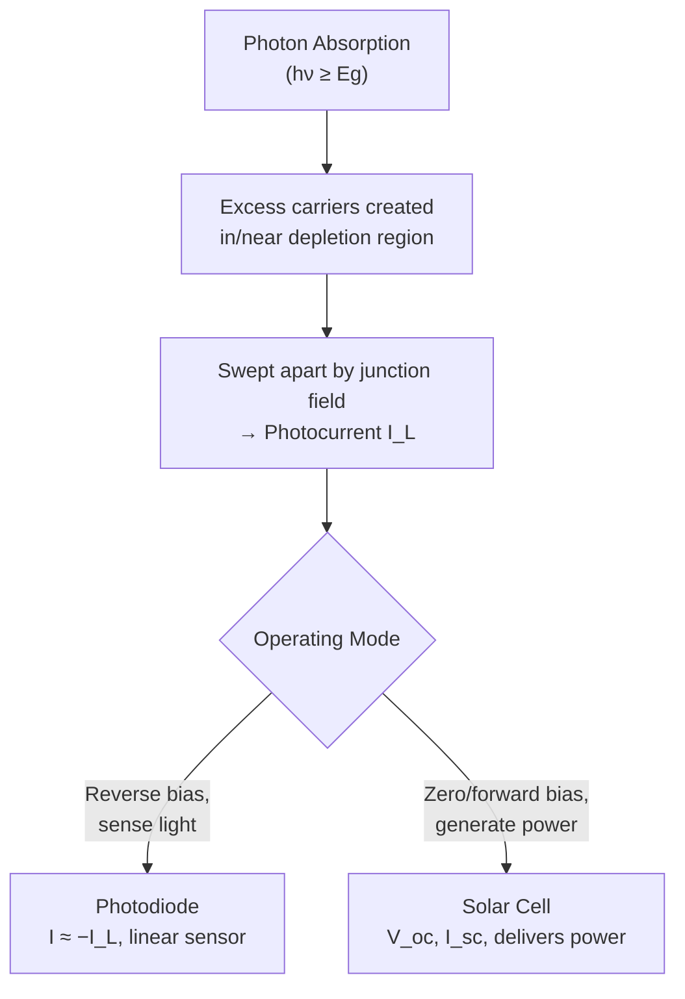

# Chapter 17: Optical and Thermal Properties of Semiconductors

<strong>Chapter Overview</strong> (click to expand)

Every chapter so far has treated light only as a source of **carrier generation** (Chapter 13) or heat only as a background variable setting \(kT\). This chapter makes both first-class subjects. **Optical absorption** describes how a semiconductor absorbs light macroscopically, governed by the **absorption coefficient**, which in turn traces back to the microscopic process of **photon absorption** introduced in Chapter 13. Absorbed photons create excess carriers that either raise the material's conductivity (**photoconductivity**) or, inside a p-n junction, get swept apart by the built-in field to produce a photocurrent — the operating principle of the **photodiode** and, run in reverse polarity for power generation, the **solar cell**. Running the same physics backward, forward-biased direct-gap junctions convert electrical current into light through **radiative recombination**, the basis of the **light-emitting diode**. The chapter closes with two thermal properties that round out a complete physical picture of a semiconductor: **thermal conductivity**, which governs how a device sheds waste heat, and **thermal generation rate**, which quantifies exactly how many carriers thermal fluctuations alone create per second — the same process first named back in Chapter 13, now made quantitative.

**Key Takeaways:**

1. **Photon absorption** — a photon with \(h\nu\geq E_g\) exciting an electron across the gap — is the microscopic event; **optical absorption**, governed by the **absorption coefficient** \(\alpha\), is the macroscopic Beer-Lambert decay of light intensity, \(I(x)=I_0e^{-\alpha x}\), that results from many such events.
2. Absorbed photons create excess carriers that raise conductivity — **photoconductivity**, \(\Delta\sigma=q(\Delta n\mu_n+\Delta p\mu_p)\) — turning an illuminated semiconductor into a light sensor.
3. A **photodiode** is a p-n junction that converts absorbed photons into a photocurrent; operated without an external bias to deliver power instead of sensing light, the same structure becomes a **solar cell**, characterized by open-circuit voltage and short-circuit current.
4. Running the p-n junction the other direction — forward bias driving **radiative recombination** in a direct-gap material — emits light instead of absorbing it, the operating principle of the **light-emitting diode**.
5. **Thermal conductivity** governs how efficiently a semiconductor device conducts away waste heat, while **thermal generation rate** quantifies the rate at which thermal fluctuations alone create electron-hole pairs — a process that, inside a depletion region, adds a real leakage current beyond the ideal diffusion current derived in Chapter 15.

## Learning Objectives

By the end of this chapter, you will be able to:

- Apply the Beer-Lambert law to compute light intensity as a function of depth from the absorption coefficient
- Distinguish photon absorption (a microscopic event) from optical absorption (the resulting macroscopic intensity decay)
- Compute the photoconductivity increase of an illuminated semiconductor from excess carrier concentration and mobility
- Explain how a photodiode converts absorbed light into a photocurrent, and how a solar cell uses the same structure to generate power
- Explain how radiative recombination in a forward-biased, direct-gap junction produces the light emitted by an LED
- Compute LED emission wavelength from band gap, and compare it to a photodiode's or solar cell's spectral response
- Explain the role of thermal conductivity in device heat dissipation and compute thermal generation rate and its contribution to diode leakage current
- Solve worked and practice problems combining these ideas, connecting the entire course's carrier and junction physics to real optoelectronic and thermal device behavior

## Introduction

Chapter 13 introduced optical generation only briefly, as one of two ways (alongside thermal generation) to create excess carriers, and Chapters 14-16 built junction after junction without ever asking what happens when light actually strikes one. This chapter closes that gap, developing the physics of how semiconductors interact with light in both directions — absorbing it and emitting it — and closes the course's physical picture by adding thermal transport alongside thermal generation.

Light absorption begins microscopically with **photon absorption**: a single photon, if its energy exceeds the band gap, excites one electron across the gap, creating one electron-hole pair. Multiply this single event by the enormous photon flux in a real light beam, and the macroscopic result is **optical absorption** — the beam's intensity decaying exponentially with depth into the material, governed by the **absorption coefficient** \(\alpha\), a number that depends on wavelength and, crucially, on whether the material has a direct or indirect band gap (Chapter 6). The carriers this absorption creates can be put to use two ways: raising the material's own conductivity (**photoconductivity**, the basis of simple light sensors), or, if absorption happens inside or near a p-n junction's depletion region, being swept apart by the built-in field to produce a photocurrent — the **photodiode**, and, run without external bias to harvest power instead of sense light, the **solar cell**.

The same p-n junction machinery runs in reverse to emit light rather than detect it. Forward-biasing a direct-gap junction (Chapter 15's minority carrier injection) floods the junction with excess carriers, and in a direct-gap material, **radiative recombination** — the same direct recombination mechanism from Chapter 13, but now viewed as useful rather than merely a loss channel — converts a large fraction of that recombination into emitted photons: the **light-emitting diode**. The chapter closes with two thermal properties needed to complete a device engineer's picture of a semiconductor: **thermal conductivity**, governing how well a device sheds the heat it generates, and **thermal generation rate**, quantifying exactly how many electron-hole pairs thermal fluctuations alone create per second — a process that, inside a real diode's depletion region, adds a leakage current on top of the ideal diffusion current derived in Chapter 15.

## Concepts Covered

This chapter covers the following 10 concepts from the learning graph:

1. Optical Absorption
2. Absorption Coefficient
3. Photon Absorption
4. Photoconductivity
5. Photodiode
6. Solar Cell
7. Light-Emitting Diode
8. Radiative Recombination
9. Thermal Conductivity
10. Thermal Generation Rate

## Prerequisites

This chapter builds on concepts from:

- [Chapter 1: Physics and Math Foundations](../01-physics-math-foundations/index.md)
- [Chapter 3: Crystal Lattices and Structures](../03-crystal-lattices-structures/index.md)
- [Chapter 5: Quantum Mechanics of Periodic Crystals](../05-quantum-mechanics-periodic-crystals/index.md)
- [Chapter 7: Intrinsic and Extrinsic Semiconductors](../07-intrinsic-extrinsic-semiconductors/index.md)
- [Chapter 9: Carrier Concentration Statistics](../09-carrier-concentration-statistics/index.md)
- [Chapter 11: Drift Current and Carrier Mobility](../11-drift-current-mobility/index.md)
- [Chapter 13: Non-Equilibrium Carriers and Recombination](../13-non-equilibrium-carriers-recombination/index.md)
- [Chapter 15: The P-N Junction Under Bias](../15-pn-junction-under-bias/index.md)

---

## Photon Absorption, Optical Absorption, and the Absorption Coefficient

### From a Single Photon to a Decaying Beam

**Photon absorption** is the microscopic event first introduced in Chapter 13: a photon with energy \(h\nu\geq E_g\) is absorbed, exciting an electron from the valence band to the conduction band and leaving a hole behind. A real light beam contains an enormous flux of photons, and as the beam travels into a semiconductor, each depth interval absorbs a fraction of the photons still remaining — exactly the same mathematical structure as radioactive decay or the diffusing minority carrier profiles of Chapter 13. The macroscopic result, **optical absorption**, is the Beer-Lambert law:

\[
I(x) = I_0e^{-\alpha x}
\]

where:

- \(I(x)\) is the light intensity remaining at depth \(x\)
- \(I_0\) is the intensity entering the surface
- \(\alpha\) is the **absorption coefficient**, in \(\text{cm}^{-1}\), a material- and wavelength-dependent property

The reciprocal \(1/\alpha\), the **penetration depth**, is the characteristic depth over which the beam falls to \(1/e\) of its original intensity. The absorption coefficient depends critically on band structure (Chapter 6): direct-gap materials like GaAs have a large, sharply-rising \(\alpha\) right at the band edge, since no phonon assist is needed for the transition, while indirect-gap materials like silicon have a much smaller \(\alpha\) near the edge (requiring a phonon, exactly as in Chapter 13's indirect recombination) that only grows large well above the gap energy.

#### Diagram: Optical Absorption and Beer-Lambert Explorer

<iframe src="../../sims/optical-absorption-explorer/main.html" width="100%" height="620px" scrolling="auto"></iframe>

!!! tip "How to use this MicroSim"
    **Instructions:** Adjust the absorption coefficient and material (direct vs. indirect gap) and watch the intensity-vs-depth curve and penetration depth marker update.

    **Learning objective:** Apply the Beer-Lambert law to compute light intensity as a function of depth from the absorption coefficient.

    **What to observe:** A direct-gap material's much larger \(\alpha\) gives a penetration depth of only a few micrometers, while an indirect-gap material near its band edge can require hundreds of micrometers to absorb the same fraction of light.

[Full MicroSim documentation →](../../sims/optical-absorption-explorer/index.md)

!!! example "Worked Example 1 — Penetration Depth and Absorbed Fraction in GaAs"
    GaAs (a direct-gap material) has \(\alpha=1\times10^{4}\ \text{cm}^{-1}\) for light just above its band gap. Find the penetration depth, and the fraction of light absorbed within \(2\ \mu\text{m}\).

    **Solution:** Penetration depth \(1/\alpha=1\times10^{-4}\ \text{cm}=1\ \mu\text{m}\). At \(x=2\ \mu\text{m}=2\times10^{-4}\ \text{cm}\): \(I(x)/I_0=e^{-\alpha x}=e^{-(1\times10^4)(2\times10^{-4})}=e^{-2}\approx0.135\), so about \(1-0.135=86.5\%\) of the light is absorbed within just \(2\ \mu\text{m}\) — why GaAs solar cell absorber layers can be made so thin.

!!! question "Concept Check"
    Two semiconductors are illuminated with light just above each material's band gap: one direct-gap, one indirect-gap. Which one absorbs the light in a thinner layer?

??? question "Concept Check — click to reveal answer"
    The direct-gap material. Its absorption coefficient near the band edge is much larger (no phonon assist needed for the transition), giving a much smaller penetration depth \(1/\alpha\) — light is absorbed in a thinner layer.

## Photoconductivity

### Turning Absorbed Light into a Conductivity Change

Once photon absorption creates excess carriers \(\Delta n\) and \(\Delta p\) (governed, at steady state under continuous illumination, by exactly the generation-recombination balance derived in Chapter 13, \(\Delta n=\Delta p=G\tau\)), the semiconductor's conductivity rises above its dark value. This **photoconductivity** effect is:

\[
\Delta\sigma = q\left(\Delta n\,\mu_n + \Delta p\,\mu_p\right)
\]

directly reusing the conductivity formula from Chapter 11, but with excess rather than equilibrium carrier concentrations. A **photoconductor** — simply a slab of semiconductor with two ohmic contacts — uses this effect directly as a light sensor: measure the resistance change under illumination, and the light intensity (via \(G\)) can be inferred.

!!! example "Worked Example 2 — Photoconductivity Under Steady Illumination"
    A silicon sample is illuminated with generation rate \(G=1\times10^{19}\ \text{cm}^{-3}\text{s}^{-1}\) and has minority carrier lifetime \(\tau=1\ \mu\text{s}\), \(\mu_n=1350\ \text{cm}^2/\text{V}\cdot\text{s}\), \(\mu_p=480\ \text{cm}^2/\text{V}\cdot\text{s}\). Find the photoconductivity increase.

    **Solution:** \(\Delta n=\Delta p=G\tau=(1\times10^{19})(1\times10^{-6})=1\times10^{13}\ \text{cm}^{-3}\).

    \[
    \Delta\sigma = (1.6\times10^{-19})(1\times10^{13})(1350+480) \approx 2.93\times10^{-3}\ \text{S/cm}
    \]

#### Diagram: Photoconductivity Explorer

<iframe src="../../sims/photoconductivity-explorer/main.html" width="100%" height="620px" scrolling="auto"></iframe>

!!! tip "How to use this MicroSim"
    **Instructions:** Vary illumination intensity (generation rate) and minority carrier lifetime, and watch excess carrier concentration and the resulting conductivity change.

    **Learning objective:** Compute photoconductivity from excess carrier concentration and mobility.

    **What to observe:** Doubling either the generation rate or the lifetime doubles \(\Delta n\) and therefore \(\Delta\sigma\) proportionally, since both enter only through the product \(G\tau\).

[Full MicroSim documentation →](../../sims/photoconductivity-explorer/index.md)

## Photodiodes and Solar Cells

### Collecting Photogenerated Carriers with a Junction Field

A **photodiode** is simply a p-n junction (Chapter 14) used deliberately as a light sensor: photons absorbed in or near the depletion region create electron-hole pairs, and the built-in (or reverse-bias-enhanced) field immediately sweeps them apart before they can recombine, adding a **photocurrent** \(I_L\) to the diode's normal behavior. Combining this photocurrent with the ideal diode equation (Chapter 15) gives the total photodiode current:

\[
I = I_0\left(e^{V/V_T}-1\right) - I_L
\]

Operated in reverse bias, a photodiode's current is dominated by \(-I_L\), nearly independent of voltage — a highly linear light sensor. Operated at \(V=0\) or under forward bias generated by the cell itself (no external source), the same equation describes a **solar cell**: the negative photocurrent term means the junction can deliver net *power* to an external circuit rather than consuming it, up to a maximum around the point where the product of current and voltage is largest. Two figures of merit summarize a solar cell's performance: the **short-circuit current** \(I_{sc}=I_L\) (current when \(V=0\)) and the **open-circuit voltage** \(V_{oc}\) (voltage when \(I=0\)):

\[
V_{oc} = V_T\ln\!\left(\frac{I_L}{I_0}+1\right)
\]

!!! example "Worked Example 3 — Solar Cell Open-Circuit Voltage"
    A silicon solar cell has dark saturation current \(I_0=1\times10^{-12}\ \text{A}\) and photocurrent \(I_L=20\ \text{mA}\) under illumination. Find the open-circuit voltage.

    **Solution:**

    \[
    V_{oc}=0.0259\ln\!\left(\frac{0.02}{1\times10^{-12}}+1\right)\approx0.0259\ln(2\times10^{10})\approx0.614\ \text{V}
    \]

    a realistic open-circuit voltage for a silicon solar cell.

#### Diagram: Photodiode and Solar Cell I-V Explorer

<iframe src="../../sims/photodiode-solar-cell-iv-explorer/main.html" width="100%" height="640px" scrolling="auto"></iframe>

!!! tip "How to use this MicroSim"
    **Instructions:** Adjust photocurrent and dark saturation current, and observe the I-V curve shift downward into the power-generating fourth quadrant, with \(V_{oc}\) and \(I_{sc}\) marked.

    **Learning objective:** Explain how a photodiode converts absorbed light into a photocurrent, and how a solar cell uses the same structure to generate power.

    **What to observe:** The I-V curve is just the ordinary diode curve shifted down by \(I_L\); the portion of the curve in the fourth quadrant (positive \(V\), negative \(I\)) is where the solar cell delivers power to an external circuit rather than consuming it.

[Full MicroSim documentation →](../../sims/photodiode-solar-cell-iv-explorer/index.md)

!!! question "Concept Check"
    Why does a photodiode intended purely as a light sensor typically operate under reverse bias rather than at zero bias?

??? question "Concept Check — click to reveal answer"
    Reverse bias widens the depletion region (Chapter 14), collecting photogenerated carriers from a larger volume and improving response speed and linearity, while keeping the photocurrent \(I_L\) essentially independent of the exact bias voltage — ideal sensor behavior. A solar cell, by contrast, must operate near zero-to-forward bias to actually deliver power rather than consume it.

## Radiative Recombination and the Light-Emitting Diode

### Running the Junction Backward: Turning Current into Light

Chapter 13 introduced **direct recombination** as an efficient recombination channel in direct-gap materials, where an electron can drop straight from the conduction band to the valence band without a momentum-conserving assist. Viewed as a light-emission mechanism rather than a loss channel, this same process is called **radiative recombination**: the energy released by recombination is emitted as a photon rather than heat.

A **light-emitting diode (LED)** exploits this directly. Forward-biasing a p-n junction made from a direct-gap material (Chapter 15's minority carrier injection) floods the junction with excess electrons and holes; in a direct-gap material, a large fraction of these recombine radiatively, emitting photons with energy close to the band gap. The emitted wavelength follows directly from the photon-energy relation used throughout this chapter:

\[
\lambda = \frac{hc}{E_g} \approx \frac{1240\ \text{nm}\cdot\text{eV}}{E_g\ (\text{eV})}
\]

Because silicon and germanium are indirect-gap materials, they make extremely poor LEDs (exactly the conclusion reached in Chapter 13) — practical LEDs use direct-gap compound semiconductors (GaAs, GaN, and their alloys, Chapter 7) chosen specifically so \(E_g\) lands the emission wavelength in the desired color.

!!! example "Worked Example 4 — LED Emission Wavelength"
    A direct-gap LED material has \(E_g=1.9\ \text{eV}\). Find the emitted wavelength, and identify the approximate visible color.

    **Solution:**

    \[
    \lambda = \frac{1240}{1.9} \approx 653\ \text{nm}
    \]

    approximately 653 nm, in the red portion of the visible spectrum.

#### Diagram: LED Emission Wavelength Explorer

<iframe src="../../sims/led-emission-explorer/main.html" width="100%" height="600px" scrolling="auto"></iframe>

!!! tip "How to use this MicroSim"
    **Instructions:** Adjust the band gap slider and watch the computed emission wavelength move across the visible spectrum, with a swatch showing the approximate perceived color.

    **Learning objective:** Compute LED emission wavelength from band gap, and compare it to a photodiode's or solar cell's spectral response.

    **What to observe:** Only a fairly narrow band-gap range (roughly 1.8-3.1 eV) produces wavelengths inside the visible spectrum at all — band gaps below about 1.8 eV emit in the infrared, invisible to the human eye, exactly like the silicon and GaAs band-edge wavelengths computed earlier in this chapter.

[Full MicroSim documentation →](../../sims/led-emission-explorer/index.md)

!!! question "Concept Check"
    Why are silicon LEDs not practical, even though silicon forward-biased p-n junctions certainly exist and inject minority carriers just as well as GaAs junctions do?

??? question "Concept Check — click to reveal answer"
    Silicon is an indirect-gap material, so radiative recombination requires a phonon-assisted transition and is inherently inefficient (Chapter 13); nearly all injected carriers instead recombine non-radiatively (trap-assisted/SRH), releasing heat rather than light.

## Thermal Conductivity and Thermal Generation Rate

### Completing the Physical Picture: Heat In, Heat Out

Every device in this course dissipates some power as heat, and **thermal conductivity** \(\kappa\) governs how efficiently that heat is conducted away — a critical, often limiting, factor in real device packaging and reliability. In semiconductors, heat is carried predominantly by **phonons** (quantized lattice vibrations, Chapter 3) rather than by free carriers, unlike in metals; silicon's thermal conductivity, about \(150\ \text{W/(m·K)}\) at room temperature, is high enough to make it a reasonably good heat spreader, though power devices still require careful thermal design.

\[
\Delta T = \frac{P\,t}{\kappa A}
\]

relates the steady-state temperature rise \(\Delta T\) across a slab of thickness \(t\) and area \(A\) dissipating power \(P\) — the same one-dimensional heat-flow relation used throughout thermal engineering, directly analogous to Ohm's law with thermal resistance \(t/(\kappa A)\) playing the role of electrical resistance.

**Thermal generation rate** \(G_{th}\) makes Chapter 13's "thermal generation" concept quantitative: it is the rate per unit volume at which thermal fluctuations alone create electron-hole pairs, related to the intrinsic carrier concentration and a characteristic generation lifetime \(\tau_0\) by:

\[
G_{th} = \frac{n_i}{\tau_0}
\]

This matters most inside a depletion region, where there are essentially no free carriers to recombine with (Chapter 14) — any electron-hole pair thermally generated there is immediately swept apart by the junction field, contributing directly to reverse current. This **generation current**,

\[
I_{gen} = qG_{th}WA = \frac{qn_iWA}{\tau_0}
\]

is a real, physically distinct leakage mechanism *in addition to* the ideal diffusion-based saturation current \(I_0\) derived in Chapter 15, and in practice often dominates it near room temperature in silicon devices.

#### Diagram: Thermal Conductivity and Generation Rate Explorer

<iframe src="../../sims/thermal-properties-explorer/main.html" width="100%" height="640px" scrolling="auto"></iframe>

!!! tip "How to use this MicroSim"
    **Instructions:** Adjust power dissipation, slab geometry, and thermal conductivity to see temperature rise; separately adjust generation lifetime and depletion width to see generation current compared against a reference diffusion current.

    **Learning objective:** Explain the role of thermal conductivity in device heat dissipation, and compute thermal generation rate and its contribution to diode leakage current.

    **What to observe:** Generation current, unlike diffusion current, scales linearly with depletion width \(W\) — widening the depletion region under reverse bias (Chapter 15) increases generation current even as it has no such direct effect on the diffusion-based term.

[Full MicroSim documentation →](../../sims/thermal-properties-explorer/index.md)

!!! example "Worked Example 5 — Generation Current vs. Diffusion Current"
    A silicon diode has \(n_i=1.5\times10^{10}\ \text{cm}^{-3}\), generation lifetime \(\tau_0=1\ \mu\text{s}\), depletion width \(W=1\ \mu\text{m}\), and area \(A=1\times10^{-2}\ \text{cm}^2\). Find \(I_{gen}\), and compare it to a diffusion-based \(I_0=1.34\times10^{-13}\ \text{A}\) (from a Chapter 15 example scaled to the same area).

    **Solution:** \(G_{th}=n_i/\tau_0=(1.5\times10^{10})/(1\times10^{-6})=1.5\times10^{16}\ \text{cm}^{-3}\text{s}^{-1}\).

    \[
    I_{gen}=qG_{th}WA=(1.6\times10^{-19})(1.5\times10^{16})(1\times10^{-4})(1\times10^{-2})\approx2.40\times10^{-9}\ \text{A}
    \]

    Comparing to \(I_0=1.34\times10^{-13}\ \text{A}\): \(I_{gen}\) is roughly 18,000 times larger — a striking, realistic illustration that generation current, not ideal diffusion current, often dominates real silicon diode leakage near room temperature.

!!! question "Concept Check"
    Does widening a diode's depletion region (for example, by increasing reverse bias) increase, decrease, or leave unchanged the generation current \(I_{gen}\)?

??? question "Concept Check — click to reveal answer"
    It increases \(I_{gen}\), since \(I_{gen}=qn_iWA/\tau_0\) is directly proportional to the depletion width \(W\), and reverse bias widens \(W\) (Chapter 15) — a real reverse-current mechanism not captured by the ideal diode equation's diffusion-only \(I_0\).

## Summary

This chapter developed how semiconductors interact with light in both directions and closed the course's physical picture with thermal transport. **Photon absorption** is the microscopic \(h\nu\geq E_g\) event; **optical absorption**, governed by the **absorption coefficient** \(\alpha\) through the Beer-Lambert law \(I(x)=I_0e^{-\alpha x}\), is its macroscopic consequence. Absorbed carriers raise conductivity (**photoconductivity**) or, inside a junction, produce a photocurrent — the basis of the **photodiode** and, run without bias to generate power, the **solar cell**. Running the same junction physics backward, forward bias driving **radiative recombination** in a direct-gap material emits light instead of absorbing it: the **light-emitting diode**. Finally, **thermal conductivity** governs how a device sheds heat, and **thermal generation rate** quantifies thermally-generated carriers, contributing a real generation-current leakage mechanism inside depletion regions beyond the ideal diffusion current of Chapter 15. Chapter 18 now assembles all of this course's physics — junctions, bias, MOS electrostatics, and optoelectronics — into complete semiconductor devices.

## Key Equations

| Concept | Equation |
|---|---|
| Beer-Lambert law (optical absorption) | \(I(x) = I_0e^{-\alpha x}\) |
| Penetration depth | \(\delta = 1/\alpha\) |
| Photoconductivity | \(\Delta\sigma = q(\Delta n\mu_n+\Delta p\mu_p)\) |
| Photodiode/solar cell current | \(I = I_0(e^{V/V_T}-1) - I_L\) |
| Open-circuit voltage | \(V_{oc} = V_T\ln(I_L/I_0+1)\) |
| LED emission wavelength | \(\lambda = hc/E_g \approx 1240/E_g(\text{eV})\ \text{nm}\) |
| Steady-state temperature rise | \(\Delta T = Pt/(\kappa A)\) |
| Thermal generation rate & current | \(G_{th}=n_i/\tau_0\), \(I_{gen}=qG_{th}WA\) |

## Glossary

See the [Chapter 17 Glossary](glossary.md) for full definitions of every term introduced in this chapter.

## Further Reading

- Sze and Ng, *Physics of Semiconductor Devices* — the standard reference on photodiodes, solar cells, and LEDs
- Neamen, *Semiconductor Physics and Devices* — clear derivation of the Beer-Lambert law and photoconductivity
- Nelson, *The Physics of Solar Cells* — detailed treatment of solar cell I-V characteristics and efficiency
- Schubert, *Light-Emitting Diodes* — comprehensive treatment of radiative recombination and LED design

## Worked Examples

!!! example "Worked Example 6 — Photon Energy and Wavelength for Common Materials"
    Find the photon wavelength corresponding to the band gap of silicon (\(E_g=1.12\ \text{eV}\)) and GaAs (\(E_g=1.42\ \text{eV}\)), and state which part of the spectrum each falls in.

    **Solution:** Silicon: \(\lambda=1240/1.12\approx1107\ \text{nm}\) (near-infrared, just past the visible red end — consistent with silicon photodiodes being sensitive well into the near-IR). GaAs: \(\lambda=1240/1.42\approx873\ \text{nm}\) (also near-infrared, but at somewhat shorter wavelength, consistent with GaAs's larger band gap).

!!! example "Worked Example 7 — Short-Circuit Current and Maximum Power Region"
    A solar cell has \(I_L=20\ \text{mA}\) and \(V_{oc}=0.614\ \text{V}\) (from Worked Example 3). State \(I_{sc}\), and explain qualitatively why the maximum power point lies at neither \(V=0\) nor \(V=V_{oc}\).

    **Solution:** \(I_{sc}=I_L=20\ \text{mA}\) (current when \(V=0\), by definition). At \(V=0\), power \(P=IV=0\); at \(V=V_{oc}\), \(I=0\) so again \(P=0\). The maximum power point must therefore lie strictly between these two extremes, at some intermediate voltage where the product \(|I|\cdot V\) is largest — the operating point real solar cell circuits are designed to track.

!!! example "Worked Example 8 — Temperature Rise in a Packaged Device"
    A silicon die dissipates \(P=2\ \text{W}\) through a substrate of thickness \(t=500\ \mu\text{m}\) and area \(A=4\ \text{mm}^2\), with \(\kappa=150\ \text{W/(m·K)}\). Find the steady-state temperature rise across the substrate.

    **Solution:** Converting to SI units, \(t=5\times10^{-4}\ \text{m}\), \(A=4\times10^{-6}\ \text{m}^2\):

    \[
    \Delta T = \frac{Pt}{\kappa A} = \frac{(2)(5\times10^{-4})}{(150)(4\times10^{-6})} \approx 1.67\ \text{K}
    \]

    a modest rise for this geometry, though real packages must account for additional thermal resistances (die attach, package, heat sink) not captured by this single-slab estimate.

## Interactive Chapter Walkthrough

Use the MicroSim below as a capstone review: a guided, step-through tour of this entire chapter's storyline in order — from photon absorption and optical absorption, through photoconductivity, the photodiode and solar cell, radiative recombination and the LED, and finally thermal conductivity and thermal generation rate.

#### Diagram: Optical and Thermal Properties Interactive Walkthrough

<iframe src="../../sims/optical-thermal-properties-interactive-walkthrough/main.html" width="100%" height="670px" scrolling="auto"></iframe>

!!! tip "How to use this MicroSim"
    **Instructions:** Click "Next ▶" through all steps in order, then use the step dots to jump back to any concept before the chapter quiz.

    **Learning objective:** Recall and summarize the full chain of concepts connecting photon absorption to thermal generation rate.

    **What to observe:** Each step's small illustration mirrors a MicroSim used earlier in the chapter, tying the whole narrative together in one place.

[Full MicroSim documentation →](../../sims/optical-thermal-properties-interactive-walkthrough/index.md)

