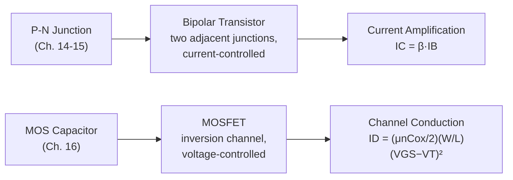

# Chapter 18: Semiconductor Devices and Applications

<strong>Chapter Overview</strong> (click to expand)

This capstone chapter connects every physical idea developed across the course to the real devices built from it. A **power diode** is nothing more than the p-n junction of Chapters 14-15, engineered specifically to block high voltage and conduct high current, and a **rectifier circuit** puts that diode to work converting AC power to DC. A **varactor diode** revisits Chapter 14's junction capacitance as a deliberately-exploited, voltage-tunable component. **Bipolar transistor basics** and **MOSFET basics** show how two junctions (Chapter 15) or a MOS capacitor's inversion channel (Chapter 16) become current-amplifying and voltage-controlled switching devices — the two workhorses of modern electronics. The chapter then steps back to the engineering process itself: **semiconductor device modeling** and the **device simulation concept** describe how the analytic equations derived throughout this course relate to the compact and numerical models used in real industrial design, **band diagram construction** consolidates the single most useful visualization skill from the entire course, and **device design trade-offs** shows how real engineering decisions balance competing physical requirements. The course closes with a worked **capstone device project** that deliberately reuses formulas from Chapters 11, 14, 15, and 17 together to design a complete, realistic power device from first principles.

**Key Takeaways:**

1. A **power diode** is a p-n junction engineered for high blocking voltage and current, typically using a lightly-doped drift region; a **rectifier circuit** arranges one or more power diodes to convert AC to DC.
2. A **varactor diode** deliberately exploits the voltage-dependent junction capacitance derived in Chapter 14, used as a tunable component in RF circuits such as voltage-controlled oscillators.
3. **Bipolar transistor basics** (current amplification via two adjacent junctions) and **MOSFET basics** (voltage-controlled channel conduction via the MOS capacitor of Chapter 16) are the two foundational three-terminal devices built directly from this course's junction and MOS physics.
4. **Semiconductor device modeling** and the **device simulation concept** place the analytic, closed-form equations of this course within a larger hierarchy that includes compact circuit-simulator models and full numerical device simulation.
5. **Band diagram construction** consolidates the single most-used visualization tool of the entire course, while **device design trade-offs** — such as breakdown voltage against on-resistance — show how real devices are engineered by balancing competing physical constraints, culminating in a **capstone device project** that synthesizes physics from across the whole course into one complete device design.

## Learning Objectives

By the end of this chapter, you will be able to:

- Explain how a power diode's structure differs from an ordinary p-n junction, and compute basic rectifier circuit output from diode forward drop
- Explain how a varactor diode exploits junction capacitance as a tunable circuit element
- Describe the basic operation of a bipolar transistor and compute current gain from base, collector, and emitter currents
- Describe the basic operation of a MOSFET and compute drain current from the square-law model
- Explain the relationship between analytic equations, compact models, and numerical device simulation
- Construct a complete equilibrium band diagram for a p-n junction, Schottky junction, or MOS capacitor from first principles
- Analyze a device design trade-off (such as breakdown voltage versus on-resistance) using equations derived across multiple chapters
- Synthesize physics from at least three earlier chapters to model a complete, realistic semiconductor device

## Introduction

Every chapter of this course has derived the physics of an idealized structure: a uniformly-doped bulk semiconductor, a single p-n junction, a single metal-semiconductor contact, a single MOS capacitor. Real devices are built from these building blocks, often several at once, engineered deliberately around specific performance targets. This chapter closes the course by making those connections explicit.

The first half surveys five real devices built directly from this course's physics. A **power diode** takes the ordinary p-n junction of Chapters 14-15 and adds a lightly-doped drift region specifically to survive high reverse voltage, exactly the avalanche breakdown physics derived in Chapter 15; a **rectifier circuit** arranges such diodes to convert alternating current into direct current. A **varactor diode** takes Chapter 14's junction capacitance — originally derived simply as a consequence of the depletion region's geometry — and uses it deliberately as a voltage-tunable capacitor. **Bipolar transistor basics** and **MOSFET basics** introduce the two three-terminal devices at the heart of essentially all modern electronics: a bipolar transistor amplifies current using two adjacent junctions and Chapter 15's minority carrier injection, while a MOSFET uses Chapter 16's MOS capacitor and inversion layer as a voltage-controlled switch.

The second half of the chapter turns from physics to engineering practice. **Semiconductor device modeling** and the **device simulation concept** place this course's closed-form equations within the larger toolkit real engineers use, from hand calculations through circuit-simulator compact models to full numerical device simulation. **Band diagram construction** consolidates the single most-repeated visualization skill of the entire course into an explicit, general procedure. **Device design trade-offs** shows how real devices are the result of balancing competing physical requirements — more of one desirable property almost always costs another. The chapter, and the course, close with a worked **capstone device project** that deliberately reuses equations from Chapters 11, 14, 15, and 17 together, modeling a complete, realistic power diode from doping choice through thermal budget — exactly the kind of synthesis the course description's capstone learning outcome calls for.

## Concepts Covered

This chapter covers the following 10 concepts from the learning graph:

1. Power Diode
2. Rectifier Circuit
3. Varactor Diode
4. Bipolar Transistor Basics
5. MOSFET Basics
6. Semiconductor Device Modeling
7. Device Simulation Concept
8. Band Diagram Construction
9. Device Design Trade-Offs
10. Capstone Device Project

## Prerequisites

This chapter builds on concepts from:

- [Chapter 6: Band Structure and the Fermi Level](../06-band-structure-fermi-level/index.md)
- [Chapter 7: Intrinsic and Extrinsic Semiconductors](../07-intrinsic-extrinsic-semiconductors/index.md)
- [Chapter 11: Drift Current and Carrier Mobility](../11-drift-current-mobility/index.md)
- [Chapter 14: The P-N Junction at Equilibrium](../14-pn-junction-equilibrium/index.md)
- [Chapter 15: The P-N Junction Under Bias](../15-pn-junction-under-bias/index.md)
- [Chapter 16: Metal-Semiconductor and MOS Junctions](../16-metal-semiconductor-mos-junctions/index.md)
- [Chapter 17: Optical and Thermal Properties of Semiconductors](../17-optical-thermal-properties/index.md)

---

## Power Diodes and Rectifier Circuits

### Engineering a Junction to Block High Voltage

A **power diode** is an ordinary p-n junction (Chapter 14) engineered specifically to handle large reverse blocking voltage and large forward current. The key design choice is doping the lightly-doped side (the **drift region**) light enough that avalanche breakdown (Chapter 15) does not occur below the device's rated voltage:

\[
N_D \approx \frac{\varepsilon_sE_{crit}^2}{2qV_{BR}}, \qquad W \approx \frac{2V_{BR}}{E_{crit}}
\]

Lighter doping supports higher breakdown voltage but also makes the drift region more resistive when the diode is conducting forward current — the central trade-off explored later in this chapter. A **rectifier circuit** arranges one or more diodes to convert alternating current into direct current: a half-wave rectifier passes only one polarity of the AC waveform, while a full-wave bridge rectifier (four diodes) conducts on both half-cycles, giving a higher average output voltage for the same peak input:

\[
V_{DC,full} \approx \frac{2(V_{peak}-2V_F)}{\pi}
\]

where \(V_F\) is each diode's forward voltage drop (Chapter 15) and the factor of 2 accounts for two diode drops in series through a bridge rectifier at any instant.

#### Diagram: Rectifier Circuit Explorer

<iframe src="../../sims/rectifier-circuit-explorer/main.html" width="100%" height="640px" scrolling="auto"></iframe>

!!! tip "How to use this MicroSim"
    **Instructions:** Toggle between half-wave and full-wave rectification and watch the output waveform and computed \(V_{DC}\) update.

    **Learning objective:** Explain how a power diode's structure differs from an ordinary p-n junction, and compute basic rectifier circuit output from diode forward drop.

    **What to observe:** Full-wave rectification fills in the "missing" negative half-cycles that half-wave rectification simply discards, nearly doubling the average DC output for the same input amplitude.

[Full MicroSim documentation →](../../sims/rectifier-circuit-explorer/index.md)

!!! example "Worked Example 1 — Full-Wave Bridge Rectifier Output"
    A full-wave bridge rectifier is driven by a 120 V\(_{rms}\) AC source (\(V_{peak}=120\sqrt{2}\approx169.7\ \text{V}\)), using diodes with \(V_F=0.7\ \text{V}\) each. Find the average DC output voltage.

    **Solution:**

    \[
    V_{DC} = \frac{2(169.7-2(0.7))}{\pi} = \frac{2(168.3)}{\pi} \approx 107.2\ \text{V}
    \]

!!! question "Concept Check"
    Why does a power diode use a lightly-doped drift region instead of the moderately-doped one-sided junctions used in earlier chapters' examples?

??? question "Concept Check — click to reveal answer"
    Because avalanche breakdown voltage is inversely proportional to doping (Chapter 15), a power diode rated for hundreds of volts requires much lighter doping on the blocking side than a typical low-voltage signal diode, trading away some forward-conduction efficiency for the ability to block high reverse voltage.

## The Varactor Diode

### Junction Capacitance as a Deliberate Circuit Element

Chapter 14 derived junction capacitance, \(C_j=\varepsilon A/W\), purely as a consequence of the depletion region's geometry. A **varactor diode** is a p-n junction deliberately operated under reverse bias specifically *for* this voltage-tunable capacitance, used as the tuning element in voltage-controlled oscillators and RF filters. Combined with a fixed inductor \(L\) in a resonant tank, the tunable capacitance directly tunes resonant frequency:

\[
f = \frac{1}{2\pi\sqrt{LC_j}}
\]

!!! example "Worked Example 2 — Varactor Tuning Range"
    A varactor-tuned LC tank has \(L=10\ \mu\text{H}\), and the varactor's capacitance ranges from \(5\ \text{pF}\) (large reverse bias) to \(20\ \text{pF}\) (small reverse bias). Find the resulting tuning range.

    **Solution:** At \(C=5\ \text{pF}\): \(f=1/(2\pi\sqrt{(10\times10^{-6})(5\times10^{-12})})\approx22.5\ \text{MHz}\). At \(C=20\ \text{pF}\): \(f\approx11.3\ \text{MHz}\) — a roughly 2:1 tuning range from a 4:1 capacitance range, since \(f\propto1/\sqrt{C}\).

## Bipolar Transistor and MOSFET Basics

### The Two Foundational Three-Terminal Devices

A **bipolar junction transistor (BJT)** stacks two back-to-back junctions (emitter-base and base-collector) sharing a thin common region. Forward-biasing the emitter-base junction injects minority carriers (Chapter 15) into the thin base; most of them survive the trip across the base without recombining and are collected by the reverse-biased base-collector junction, giving current *amplification*: a small base current controls a much larger collector current, characterized by the common-emitter current gain \(\beta\):

\[
I_C = \beta I_B, \qquad I_E = I_C + I_B = (\beta+1)I_B
\]

A **MOSFET**, by contrast, is a voltage-controlled device built directly from Chapter 16's MOS capacitor. Once gate voltage exceeds the threshold voltage \(V_T\), an inversion layer connects source and drain, and current flows through this channel; in the simplest square-law model (valid in saturation, \(V_{GS}-V_T<V_{DS}\)):

\[
I_D = \frac{\mu_nC_{ox}}{2}\frac{W}{L}(V_{GS}-V_T)^2
\]

reusing the oxide capacitance \(C_{ox}\) derived in Chapter 16 directly. Unlike a BJT, a MOSFET draws essentially no steady-state gate current — it is controlled by voltage, not current, and dissipates far less static power in its control terminal, a major reason MOSFETs dominate modern digital logic.

#### Diagram: Bipolar Transistor and MOSFET Comparison Explorer

<iframe src="../../sims/bjt-mosfet-comparison-explorer/main.html" width="100%" height="640px" scrolling="auto"></iframe>

!!! tip "How to use this MicroSim"
    **Instructions:** Adjust base current to see BJT collector current and gain, and adjust gate overdrive voltage to see MOSFET drain current, side by side.

    **Learning objective:** Describe the basic operation of a bipolar transistor and a MOSFET, and compute their respective output currents.

    **What to observe:** BJT collector current scales linearly with base current (fixed \(\beta\)), while MOSFET drain current scales with the *square* of gate overdrive — two fundamentally different control relationships.

[Full MicroSim documentation →](../../sims/bjt-mosfet-comparison-explorer/index.md)

!!! example "Worked Example 3 — BJT Current Gain"
    A BJT has \(\beta=100\) and \(I_B=10\ \mu\text{A}\). Find \(I_C\), \(I_E\), and the common-base current gain \(\alpha=I_C/I_E\).

    **Solution:** \(I_C=\beta I_B=(100)(10\ \mu\text{A})=1\ \text{mA}\). \(I_E=I_C+I_B=1.01\ \text{mA}\). \(\alpha=1/1.01\approx0.9901\) — always slightly less than 1, since some base current is always required.

!!! example "Worked Example 4 — MOSFET Drain Current"
    A MOSFET has \(C_{ox}=1.73\times10^{-7}\ \text{F/cm}^2\) (from a Chapter 16 example), inversion-layer mobility \(\mu_n=600\ \text{cm}^2/\text{V}\cdot\text{s}\) (lower than the bulk drift mobility used elsewhere, due to additional surface scattering at the oxide interface), \(W/L=10\), and overdrive voltage \(V_{GS}-V_T=0.5\ \text{V}\). Find \(I_D\).

    **Solution:**

    \[
    I_D = \frac{(600)(1.73\times10^{-7})}{2}(10)(0.5)^2 \approx 1.30\times10^{-4}\ \text{A} = 0.130\ \text{mA}
    \]

!!! question "Concept Check"
    Why does a MOSFET draw essentially no steady-state gate current, while a BJT requires a continuous base current to sustain collector current?

??? question "Concept Check — click to reveal answer"
    The MOSFET's gate is separated from the channel by an insulating oxide (Chapter 16), which blocks DC current entirely — the gate only needs to *charge* to a voltage, not sustain a current. The BJT's base-emitter junction is a directly forward-biased p-n junction (Chapter 15), which by definition conducts current continuously as long as it stays forward-biased.

## Semiconductor Device Modeling and the Device Simulation Concept

### From Closed-Form Equations to Numerical Simulation

Every equation derived in this course is an example of **semiconductor device modeling**: a simplified, closed-form mathematical description of device behavior, built from physical first principles under a specific set of idealizing assumptions (the depletion approximation, the long-base or short-base limit, the square-law MOSFET model, and so on). Real engineering uses this course's analytic models constantly, particularly for quick hand calculations and initial design intuition — exactly the role every worked example in this course has played.

For situations where the idealizing assumptions break down, or where multiple effects interact in ways too complex for a closed-form solution, engineers turn to the **device simulation concept**: numerically solving the same underlying physical equations (Poisson's equation, the continuity equations, and the drift-diffusion current relations from Chapters 12-15) on a discretized mesh representing the device's actual geometry and doping profile, without the simplifying assumptions this course relied on throughout. Between these two extremes sit **compact models** — semi-empirical equations (more detailed than this course's idealized formulas, but still closed-form) fitted to match real measured or simulated device behavior, used directly inside circuit simulators like SPICE.

| Modeling Level | Basis | Typical Use |
|---|---|---|
| Analytic (this course) | Closed-form physics, idealized assumptions | Hand calculation, design intuition |
| Compact model | Semi-empirical equations fit to data | Circuit simulation (SPICE) |
| Numerical device simulation | Discretized Poisson + continuity equations | Detailed design verification, non-ideal geometries |

#### Diagram: Device Modeling and Simulation Hierarchy Explorer

<iframe src="../../sims/device-modeling-simulation-explorer/main.html" width="100%" height="600px" scrolling="auto"></iframe>

!!! tip "How to use this MicroSim"
    **Instructions:** Select a modeling level and see its typical accuracy, computational cost, and example use case compared side by side.

    **Learning objective:** Explain the relationship between analytic equations, compact models, and numerical device simulation.

    **What to observe:** Accuracy and computational cost both increase together moving from analytic models toward full numerical simulation — there is no free lunch, which is why engineers use the simplest model adequate for a given design question rather than always reaching for full simulation.

[Full MicroSim documentation →](../../sims/device-modeling-simulation-explorer/index.md)

## Band Diagram Construction

### Consolidating the Course's Most-Used Skill

Nearly every chapter of this course has relied on a band diagram — a plot of \(E_C\), \(E_V\), and \(E_F\) (or the quasi-Fermi levels, under bias) versus position — to visualize what is happening inside a device. **Band diagram construction** is the general procedure underlying all of them:

1. Identify each material region (p-type, n-type, metal, oxide) and its equilibrium Fermi level position relative to \(E_C\) and \(E_V\) (Chapters 9-10), or its work function (Chapter 16) for a metal.
2. Away from any junction, draw each region's bands flat, at the correct relative height set by that region's work function or electron affinity.
3. At each junction, require a single, continuous, flat Fermi level (at equilibrium) or well-defined quasi-Fermi levels (under bias, Chapter 15), and bend the bands smoothly to connect the flat regions on either side, consistent with the depletion approximation (Chapter 14).
4. Add any applied bias by shifting one side's Fermi level relative to the other by \(qV\) (Chapter 15), and re-bend accordingly.

This single procedure, applied consistently, produces every band diagram used throughout the course: the p-n junction (Chapters 14-15), the Schottky barrier (Chapter 16), and the MOS capacitor (Chapter 16).

#### Diagram: Band Diagram Builder

<iframe src="../../sims/band-diagram-builder/main.html" width="100%" height="620px" scrolling="auto"></iframe>

!!! tip "How to use this MicroSim"
    **Instructions:** Select a device type (p-n junction, Schottky junction, or MOS capacitor) and bias condition, and watch the band diagram construct itself step by step.

    **Learning objective:** Construct a complete equilibrium band diagram for a p-n junction, Schottky junction, or MOS capacitor from first principles.

    **What to observe:** Despite looking different at first glance, all three device types follow the exact same four-step construction procedure — only the material work functions and the presence or absence of an insulating oxide layer differ.

[Full MicroSim documentation →](../../sims/band-diagram-builder/index.md)

## Device Design Trade-Offs

### Engineering Is Balancing Competing Requirements

Real device design is rarely about maximizing a single quantity — it is about navigating **device design trade-offs**, where improving one performance metric costs another. The clearest example, combining results from Chapters 11, 14, and 15, is the trade-off between a power diode's breakdown voltage and its on-state resistance. Combining the breakdown voltage formula with the drift-region resistance (Chapter 11, \(R=W/(qN_D\mu_nA)\)) gives the specific on-resistance (resistance times area, a figure of merit independent of device size):

\[
R_{on,sp} \approx \frac{4V_{BR}^2}{\mu_n\varepsilon_sE_{crit}^3}
\]

Because \(R_{on,sp}\propto V_{BR}^2\), a diode designed to block twice the voltage needs roughly four times the specific on-resistance — real power devices cannot simultaneously have arbitrarily high breakdown voltage and arbitrarily low forward resistance, and every practical power device design lives somewhere on this trade-off curve. (This simplified derivation, holding \(E_{crit}\) constant, captures the essential physics; the true "silicon limit" curve is slightly steeper, since \(E_{crit}\) itself rises somewhat with doping, an effect beyond this course's idealized models.)

!!! example "Worked Example 5 — Specific On-Resistance at Two Breakdown Voltages"
    Estimate \(R_{on,sp}\) for silicon power diodes rated at \(V_{BR}=500\ \text{V}\) and \(V_{BR}=1000\ \text{V}\) (using \(\mu_n=1350\ \text{cm}^2/\text{V}\cdot\text{s}\), \(E_{crit}=3\times10^5\ \text{V/cm}\)).

    **Solution:** At \(500\ \text{V}\): \(R_{on,sp}\approx\dfrac{4(500)^2}{(1350)(1.035\times10^{-12})(3\times10^5)^3}\approx0.0265\ \Omega\cdot\text{cm}^2\). At \(1000\ \text{V}\): \(R_{on,sp}\approx0.106\ \Omega\cdot\text{cm}^2\) — exactly four times larger, confirming the \(V_{BR}^2\) scaling.

#### Diagram: Device Design Trade-Off Explorer

<iframe src="../../sims/device-design-tradeoff-explorer/main.html" width="100%" height="620px" scrolling="auto"></iframe>

!!! tip "How to use this MicroSim"
    **Instructions:** Sweep target breakdown voltage and watch specific on-resistance rise along the trade-off curve, with the required drift doping and width shown alongside.

    **Learning objective:** Analyze a device design trade-off using equations derived across multiple chapters.

    **What to observe:** The curve rises steeply — doubling breakdown voltage roughly quadruples specific on-resistance — which is why high-voltage power devices are inherently larger or lossier than low-voltage ones for the same current rating.

[Full MicroSim documentation →](../../sims/device-design-tradeoff-explorer/index.md)

!!! question "Concept Check"
    A designer needs a power diode with lower forward voltage drop than their current design, but cannot reduce the rated breakdown voltage. According to the trade-off derived above, what is the most direct way to achieve this without changing doping?

??? question "Concept Check — click to reveal answer"
    Increase the device's area \(A\). Since \(R_{on}=R_{on,sp}/A\), a larger die area directly reduces resistance (and forward drop) for the same specific on-resistance, at the cost of a larger, more expensive die — itself a trade-off between forward drop and device cost/size.

## Capstone Device Project

### Synthesizing the Course: Designing a Power Rectifier Diode

This closing section works through a complete **capstone device project**, deliberately combining equations from Chapters 11, 14, 15, and 17 into a single realistic design exercise — exactly the kind of synthesis the course's capstone learning outcome calls for.

!!! example "Worked Example 6 — Complete Power Rectifier Diode Design"
    Design a silicon power rectifier diode to block \(V_{BR}=500\ \text{V}\) and conduct \(I=5\ \text{A}\) forward current, with die area \(A=0.1\ \text{cm}^2\) and thickness \(t=200\ \mu\text{m}\). Use \(\mu_n=1350\ \text{cm}^2/\text{V}\cdot\text{s}\), \(E_{crit}=3\times10^5\ \text{V/cm}\), \(\varepsilon_s=1.035\times10^{-12}\ \text{F/cm}\), \(\kappa=150\ \text{W/(m·K)}\), and an assumed junction forward drop of \(0.8\ \text{V}\) at rated current. Find the required drift doping and width (Chapters 14-15), the specific on-resistance and total forward voltage drop (Chapter 11), and the resulting power dissipation and temperature rise through the die (Chapter 17).

    **Solution:**

    **Drift region (Chapters 14-15):**

    \[
    N_D \approx \frac{\varepsilon_sE_{crit}^2}{2qV_{BR}} = \frac{(1.035\times10^{-12})(3\times10^5)^2}{2(1.6\times10^{-19})(500)} \approx 5.82\times10^{14}\ \text{cm}^{-3}
    \]

    \[
    W \approx \frac{2V_{BR}}{E_{crit}} = \frac{2(500)}{3\times10^5} \approx 3.33\times10^{-3}\ \text{cm} = 33.3\ \mu\text{m}
    \]

    **On-resistance and forward drop (Chapter 11):**

    \[
    R_{on,sp} \approx \frac{4(500)^2}{(1350)(1.035\times10^{-12})(3\times10^5)^3} \approx 0.0265\ \Omega\cdot\text{cm}^2, \qquad R_{on} = \frac{R_{on,sp}}{A} \approx 0.265\ \Omega
    \]

    \[
    V_{drift} = IR_{on} = (5)(0.265) \approx 1.33\ \text{V}, \qquad V_F = V_{F,junction}+V_{drift} \approx 0.8+1.33 = 2.13\ \text{V}
    \]

    **Power dissipation and temperature rise (Chapter 17):**

    \[
    P = IV_F = (5)(2.13) \approx 10.6\ \text{W}
    \]

    \[
    \Delta T = \frac{Pt}{\kappa A} = \frac{(10.6)(2\times10^{-4}\ \text{m})}{(150)(1\times10^{-5}\ \text{m}^2)} \approx 1.4\ \text{K}
    \]

    This \(\Delta T\) reflects only the temperature drop across the silicon die itself; a complete thermal design would also add the thermal resistance of the die-attach, package, and heat sink, each contributing further temperature rise not captured by this simplified single-slab model — a reminder that even a synthesis this broad still simplifies the full engineering picture.

#### Diagram: Capstone Device Project Walkthrough

<iframe src="../../sims/capstone-device-project-walkthrough/main.html" width="100%" height="670px" scrolling="auto"></iframe>

!!! tip "How to use this MicroSim"
    **Instructions:** Adjust the target breakdown voltage, current rating, and die area, and watch every downstream quantity — doping, width, resistance, forward drop, power, and temperature rise — recompute together.

    **Learning objective:** Synthesize physics from at least three earlier chapters to model a complete, realistic semiconductor device.

    **What to observe:** Every design choice ripples forward: raising the breakdown voltage target increases drift width and resistance, which raises forward drop and power dissipation, which raises temperature rise — a single connected chain from a single design requirement.

[Full MicroSim documentation →](../../sims/capstone-device-project-walkthrough/index.md)

## Summary

This capstone chapter connected the course's physics to real devices and to engineering practice. A **power diode** engineers the p-n junction of Chapters 14-15 with a lightly-doped drift region to block high voltage, put to work in a **rectifier circuit**; a **varactor diode** exploits Chapter 14's junction capacitance deliberately as a tunable component. **Bipolar transistor basics** and **MOSFET basics** showed how two junctions or a MOS capacitor's inversion channel become current-amplifying or voltage-controlled three-terminal devices. **Semiconductor device modeling** and the **device simulation concept** placed this course's analytic equations within the larger hierarchy of compact and numerical models used in real design, **band diagram construction** consolidated the course's most-repeated visualization skill into one general procedure, and **device design trade-offs** showed how breakdown voltage and on-resistance cannot both be optimized simultaneously. The **capstone device project** closed the course by combining equations from four separate chapters into a single, complete power diode design — the physical reasoning developed across this entire course, applied together.

## Key Equations

| Concept | Equation |
|---|---|
| Power diode drift doping and width | \(N_D\approx\varepsilon_sE_{crit}^2/(2qV_{BR})\), \(W\approx2V_{BR}/E_{crit}\) |
| Full-wave rectifier DC output | \(V_{DC}\approx2(V_{peak}-2V_F)/\pi\) |
| LC tank resonant frequency | \(f=1/(2\pi\sqrt{LC_j})\) |
| BJT current gain | \(I_C=\beta I_B\), \(I_E=(\beta+1)I_B\) |
| MOSFET drain current (saturation) | \(I_D=(\mu_nC_{ox}/2)(W/L)(V_{GS}-V_T)^2\) |
| Specific on-resistance (silicon limit, simplified) | \(R_{on,sp}\approx4V_{BR}^2/(\mu_n\varepsilon_sE_{crit}^3)\) |
| Device temperature rise | \(\Delta T=Pt/(\kappa A)\) |

## Glossary

See the [Chapter 18 Glossary](glossary.md) for full definitions of every term introduced in this chapter.

## Further Reading

- Sze and Ng, *Physics of Semiconductor Devices* — the standard comprehensive reference on power devices, BJTs, and MOSFETs
- Neamen, *Semiconductor Physics and Devices* — clear introductory treatment of bipolar and MOSFET device physics
- Baliga, *Fundamentals of Power Semiconductor Devices* — the definitive reference on power device design trade-offs and the silicon limit
- Pierret, *Semiconductor Device Fundamentals* — accessible treatment connecting analytic device physics to compact modeling

## Worked Examples

!!! example "Worked Example 7 — Half-Wave vs. Full-Wave Rectifier Comparison"
    Compare the average DC output of a half-wave rectifier (\(V_{DC}\approx(V_{peak}-V_F)/\pi\)) to the full-wave bridge result of Worked Example 1, using the same \(120\ \text{V}_{rms}\) source and \(V_F=0.7\ \text{V}\).

    **Solution:** Half-wave: \(V_{DC}=(169.7-0.7)/\pi\approx53.8\ \text{V}\). Full-wave (from Worked Example 1): \(\approx107.2\ \text{V}\) — almost exactly double, since full-wave rectification uses both half-cycles of the input instead of discarding one.

!!! example "Worked Example 8 — MOSFET vs. BJT Current Scaling"
    Compare how output current scales if the MOSFET of Worked Example 4 has its overdrive voltage doubled (to \(1.0\ \text{V}\)), versus how the BJT of Worked Example 3 scales if its base current is doubled (to \(20\ \mu\text{A}\)).

    **Solution:** MOSFET: since \(I_D\propto(V_{GS}-V_T)^2\), doubling overdrive quadruples \(I_D\), to about \(0.519\ \text{mA}\). BJT: since \(I_C=\beta I_B\) is linear, doubling \(I_B\) exactly doubles \(I_C\), to \(2\ \text{mA}\) — a direct illustration of the square-law versus linear control relationships noted in this chapter's concept check.

!!! example "Worked Example 9 — Trade-Off Sensitivity"
    Using the specific on-resistance formula, find the breakdown voltage at which \(R_{on,sp}\) reaches exactly \(0.01\ \Omega\cdot\text{cm}^2\) for the same silicon parameters used throughout this chapter.

    **Solution:** Solving \(R_{on,sp}=4V_{BR}^2/(\mu_n\varepsilon_sE_{crit}^3)\) for \(V_{BR}\): \(V_{BR}=\sqrt{R_{on,sp}\mu_n\varepsilon_sE_{crit}^3/4}=\sqrt{(0.01)(1350)(1.035\times10^{-12})(3\times10^5)^3/4}\approx307\ \text{V}\) — a device targeting \(R_{on,sp}=0.01\ \Omega\cdot\text{cm}^2\) can support roughly 307 V of blocking voltage with this simplified model, a useful sanity check when comparing a proposed design against the fundamental trade-off curve.

## Interactive Chapter Walkthrough

Use the MicroSim below as a capstone review: a guided, step-through tour of this entire chapter's storyline in order — from the power diode and rectifier circuit, through the varactor diode, bipolar transistor and MOSFET basics, device modeling and simulation, band diagram construction, device design trade-offs, and finally the capstone device project that closes the course.

#### Diagram: Semiconductor Devices and Applications Interactive Walkthrough

<iframe src="../../sims/semiconductor-devices-applications-interactive-walkthrough/main.html" width="100%" height="670px" scrolling="auto"></iframe>

!!! tip "How to use this MicroSim"
    **Instructions:** Click "Next ▶" through all steps in order, then use the step dots to jump back to any concept before the chapter quiz.

    **Learning objective:** Recall and summarize the full chain of concepts connecting real devices to the physics developed across this entire course.

    **What to observe:** Each step's small illustration mirrors a MicroSim used earlier in the chapter, tying the whole course's narrative together in one final review.

[Full MicroSim documentation →](../../sims/semiconductor-devices-applications-interactive-walkthrough/index.md)

