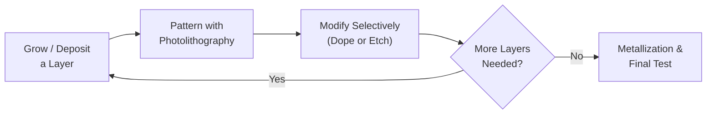
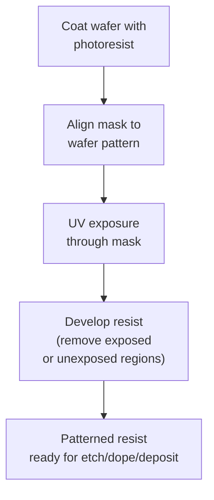
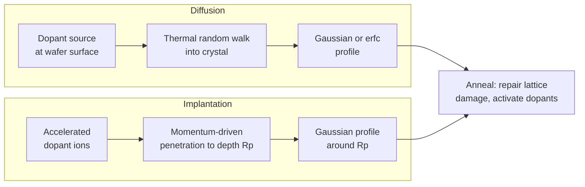
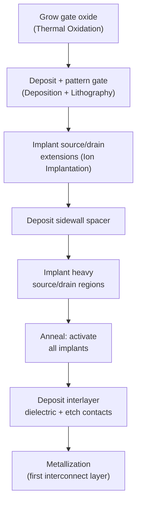

# Chapter 19: Semiconductor Device Fabrication

<strong>Chapter Overview</strong> (click to expand)

Every device physics equation in this course — the built-in potential of Chapter 14, the threshold voltage of Chapter 16, the power diode of Chapter 18 — assumes a doped, patterned, contacted piece of silicon already exists. This chapter opens that black box and walks through how it is actually made. A **semiconductor manufacturing overview** frames fabrication as a sequence of repeated pattern-transfer cycles applied to a starting **wafer**, itself sliced and polished from a single crystal grown by the **Czochralski** or **float-zone** method. **Thermal oxidation** grows the insulating and masking layer that makes silicon uniquely manufacturable. **Photolithography** — using a **photoresist**, **UV exposure**, and precise **mask alignment** — transfers a circuit pattern onto the wafer. **Thin-film deposition** (CVD, PVD, and ALD) adds the materials the pattern will define. **Diffusion** and **ion implantation**, followed by **annealing**, place and activate dopant atoms exactly where Chapters 7 and 8 assumed they simply "were." **Wet**, **dry**, and **plasma etching** remove material selectively, and **metallization** wires the finished devices together. A full CMOS transistor requires dozens of these cycles in a specific order — **CMOS process integration** — and no real fabrication run is perfect, so the chapter closes with **manufacturing defects** and **yield and reliability**, the statistics that determine how many of those transistors actually work.

**Key Takeaways:**

1. Fabrication is a repeated cycle of **deposit or grow a layer → pattern it with photolithography → modify or remove material through that pattern (doping or etching) → repeat**, applied dozens of times to build a complete device.
2. **Czochralski crystal growth** produces the large, moderately pure single-crystal ingots used for most ICs; **float-zone refining** produces smaller, extremely pure ingots for power and detector devices. Both are sliced and polished into the wafers used throughout this chapter.
3. **Thermal oxidation** and **photolithography** work together: oxidation grows a layer that photolithography (via a light-sensitive **photoresist**, precise **UV exposure**, and **mask alignment**) patterns into a mask for the next process step.
4. **Diffusion doping** and **ion implantation** are two different physical mechanisms — thermal random-walk motion versus directed high-energy bombardment — for placing dopant atoms (Chapters 7-8) at controlled depths and concentrations, both requiring a subsequent **annealing** step.
5. **Wet**, **dry**, and **plasma etching** trade off selectivity against directionality; **CMOS process integration** sequences oxidation, lithography, doping, deposition, etching, and **metallization** into a complete transistor, and **manufacturing defects** translate directly into **yield and reliability** — the economic bottom line of every fabrication process.

## Learning Objectives

By the end of this chapter, you will be able to:

- Explain the complete semiconductor fabrication process as a repeated cycle of layer formation, patterning, and selective modification
- Describe how silicon wafers are prepared, from Czochralski or float-zone crystal growth through slicing and polishing
- Compute oxide thickness from the thermal oxidation (Deal-Grove) growth law in the linear and parabolic regimes
- Explain photolithography and mask alignment, and compute minimum resolvable feature size from the Rayleigh criterion
- Compare chemical vapor deposition, physical vapor deposition, and atomic layer deposition as thin-film deposition techniques
- Distinguish diffusion doping from ion implantation and compute a resulting dopant concentration profile for each
- Explain wet, dry, and plasma etching, and compute etch selectivity and anisotropy factor
- Describe the role of metallization and interconnects in completing a fabricated device
- Sequence the major steps of CMOS process integration into a complete transistor fabrication flow
- Compute manufacturing yield from defect density and die area, and relate yield to device reliability

## Introduction

Chapters 1 through 18 treated a doped semiconductor crystal, a patterned junction, and a metal contact as givens — inputs to a physics problem. This chapter supplies those inputs. **Semiconductor device fabrication** is the sequence of physical and chemical processes that converts a bare silicon crystal into a working integrated circuit, and while it is a separate discipline from device physics, every one of its steps exists to create a physical structure this course has already analyzed: a doping profile (Chapters 7-8), a gate oxide (Chapter 16), a metal contact (Chapter 16).

The chapter follows the fabrication process in the order a wafer actually experiences it. It begins with **crystal growth** — pulling (**Czochralski**) or zone-refining (**float-zone**) a single silicon crystal — and **wafer slicing and polishing**, which turn that crystal into the flat, mirror-smooth substrate every later step is built on. **Thermal oxidation** grows silicon's native oxide, a layer used both as an electrical insulator (Chapter 16's gate oxide) and as a mask for later processing. **Photolithography**, using a **photoresist** exposed through a patterned mask under precise **UV exposure** and **mask alignment**, transfers a two-dimensional pattern onto that oxide — the central "printing" step repeated at every layer of a modern chip. **Thin-film deposition** (CVD, PVD, and ALD) adds new material layers, which **diffusion** or **ion implantation**, followed by **annealing**, and **wet**, **dry**, or **plasma etching** then selectively modify or remove according to the lithographic pattern. **Metallization** wires the finished transistors together, and **CMOS process integration** shows how dozens of these steps combine, in a specific sequence, into a complete CMOS transistor. The chapter closes with the practical reality of manufacturing: **manufacturing defects** are inevitable at atomic-scale dimensions, and **yield and reliability** quantify how that inevitability shapes real semiconductor economics and engineering decisions.

## Concepts Covered

This chapter covers the following 20 concepts from the learning graph:

1. Semiconductor Manufacturing Overview
2. Czochralski Crystal Growth
3. Float-Zone Refining
4. Wafer Slicing and Polishing
5. Thermal Oxidation
6. Photolithography
7. Photoresist
8. UV Exposure and Resolution
9. Mask Alignment
10. Thin-Film Deposition
11. Diffusion Doping
12. Ion Implantation
13. Annealing
14. Wet Etching
15. Dry Etching
16. Plasma Etching
17. Metallization and Interconnects
18. CMOS Process Integration
19. Manufacturing Defects
20. Yield and Reliability

## Prerequisites

This chapter builds on concepts from:

- [Chapter 1: Physics and Math Foundations](../01-physics-math-foundations/index.md)
- [Chapter 3: Crystal Lattices and Structures](../03-crystal-lattices-structures/index.md)
- [Chapter 7: Intrinsic and Extrinsic Semiconductors](../07-intrinsic-extrinsic-semiconductors/index.md)
- [Chapter 8: Doping, Ionization, and Temperature Regimes](../08-doping-ionization-temperature/index.md)
- [Chapter 16: Metal-Semiconductor and MOS Junctions](../16-metal-semiconductor-mos-junctions/index.md)
- [Chapter 18: Semiconductor Devices and Applications](../18-semiconductor-devices-applications/index.md)

---

## Semiconductor Manufacturing Overview

### Fabrication as a Repeated Cycle

A **semiconductor manufacturing overview** frames the entire fabrication process as one repeating cycle applied dozens of times to a single wafer: grow or deposit a layer, pattern that layer with photolithography, selectively modify or remove material through the pattern (by doping or etching), and repeat with the next layer. A modern CMOS chip requires several hundred individual process steps, but nearly all of them are instances of this same four-part cycle at a different layer, with a different material, and a different pattern.

This cycle is why the chapter is organized the way it is: crystal growth and wafer preparation happen once, at the very start, and then oxidation, lithography, deposition, doping, and etching repeat — in varying order and with varying materials — to build up a complete device.

!!! question "Concept Check"
    Why does it make sense that photolithography appears at nearly every layer of a fabrication process, rather than only once at the start?

??? question "Concept Check — click to reveal answer"
    Every layer of a modern device (each doped region, each metal interconnect level, each contact) needs its own two-dimensional pattern. Since photolithography is the process that transfers a two-dimensional pattern onto the wafer, it must be repeated once for every distinct pattern needed — which is why a chip with more metal layers or more doping steps requires more lithography steps, directly increasing fabrication cost and time.

## Crystal Growth and Wafer Preparation

### From Molten Silicon to Polished Wafer

Real devices are not built on an idealized infinite crystal (Chapter 3) — they are built on a **wafer**, a thin, flat disc sliced from a large single crystal. The dominant method for producing that crystal is **Czochralski crystal growth**: a small seed crystal is dipped into a crucible of molten silicon and slowly withdrawn while rotating, and the melt solidifies onto the seed with the same crystal orientation (Chapter 3's Miller indices define which face is grown), producing a large cylindrical ingot up to 300 mm in diameter. **Float-zone refining** instead passes a narrow molten zone along a rod of polycrystalline silicon without any crucible contact; because the melt never touches a container wall, float-zone silicon reaches much higher purity than Czochralski silicon, at the cost of smaller achievable diameters — it is reserved for power devices and radiation detectors where purity is critical.

Either ingot then undergoes **wafer slicing and polishing**: a diamond wire saw slices the cylindrical ingot into wafers a few hundred micrometers thick, after which lapping and chemical-mechanical polishing (CMP) remove saw damage and produce the atomically flat, mirror-finish surface that every subsequent process step — especially photolithography's tight focus tolerances — requires.

#### Diagram: Czochralski Crystal Growth Explorer

<iframe src="../../sims/czochralski-crystal-growth-explorer/main.html" width="100%" height="620px" scrolling="auto"></iframe>

!!! tip "How to use this MicroSim"
    **Instructions:** Adjust pull rate and rotation rate and watch the growing ingot diameter and crystal quality indicator respond.

    **Learning objective:** Describe how silicon wafers are prepared, from Czochralski or float-zone crystal growth through slicing and polishing.

    **What to observe:** Pulling too fast narrows the ingot and increases defect density, while pulling too slowly wastes furnace time — real crystal growth operates in a narrow process window balancing throughput against crystal quality.

[Full MicroSim documentation →](../../sims/czochralski-crystal-growth-explorer/index.md)

#### Diagram: Wafer Fabrication Explorer

<iframe src="../../sims/wafer-fabrication-explorer/main.html" width="100%" height="600px" scrolling="auto"></iframe>

!!! tip "How to use this MicroSim"
    **Instructions:** Step through ingot growth, slicing, lapping, and polishing to see how a cylindrical ingot becomes a stack of finished wafers.

    **Learning objective:** Describe how silicon wafers are prepared, from Czochralski or float-zone crystal growth through slicing and polishing.

    **What to observe:** Each wafer sliced from the ingot loses material to the saw's kerf width, and each wafer loses further thickness to lapping and polishing — a real ingot yields significantly fewer usable wafers than its length divided by final wafer thickness would suggest.

[Full MicroSim documentation →](../../sims/wafer-fabrication-explorer/index.md)

!!! example "Worked Example 1 — Wafers per Ingot"
    A Czochralski ingot is 1.5 m long and 300 mm in diameter. Each finished wafer is 775 μm thick, and the wire saw kerf (material lost per cut) is 150 μm. Estimate how many wafers can be sliced from the ingot.

    **Solution:** Each wafer "consumes" its own thickness plus one kerf width of ingot length: \(775+150=925\ \mu\text{m}=0.925\ \text{mm}\) per wafer. Number of wafers \(\approx 1500\ \text{mm}/0.925\ \text{mm}\approx1622\) wafers — though in practice the usable cylindrical body of the ingot (excluding the tapered seed and tail ends) is shorter than 1.5 m, reducing this somewhat.

!!! question "Concept Check"
    Why is float-zone silicon reserved for specialty devices instead of being used for all integrated circuits, given that it achieves higher purity than Czochralski silicon?

??? question "Concept Check — click to reveal answer"
    Float-zone growth cannot easily produce the very large diameters (200-300 mm) that modern high-volume CMOS fabrication needs, and its extreme purity is unnecessary for most digital logic, which is comparatively tolerant of trace contamination. Czochralski growth's crucible contact introduces slightly more impurity but supports the large, cost-effective wafer sizes mass production requires.

## Thermal Oxidation

### Growing Silicon's Native Oxide

**Thermal oxidation** exposes a heated silicon wafer (typically 900-1200°C) to oxygen or water vapor, growing a layer of silicon dioxide directly from the silicon itself: \(\text{Si}+\text{O}_2\rightarrow\text{SiO}_2\) (dry oxidation) or \(\text{Si}+2\text{H}_2\text{O}\rightarrow\text{SiO}_2+2\text{H}_2\) (wet oxidation, faster but lower quality). This grown oxide is the gate oxide of Chapter 16's MOS capacitor, and it also serves as a mask that blocks dopant diffusion and ion implantation in later steps.

Oxide growth follows the Deal-Grove model, which links growth rate to how oxidizing species must diffuse through the oxide already present:

\[
x_{ox}^2 + Ax_{ox} = B(t+\tau)
\]

where \(x_{ox}\) is oxide thickness, \(A\) and \(B\) are temperature-dependent rate constants, and \(\tau\) accounts for any oxide present before timing began. Two limits simplify this considerably: for thin oxide (early growth), the linear regime dominates, \(x_{ox}\approx (B/A)t\), since growth is limited by the surface reaction rate; for thick oxide (late growth), the parabolic regime dominates, \(x_{ox}\approx\sqrt{Bt}\), since growth becomes limited by how slowly oxidant diffuses through the oxide already grown.

#### Diagram: Thermal Oxidation Simulator

<iframe src="../../sims/thermal-oxidation-simulator/main.html" width="100%" height="600px" scrolling="auto"></iframe>

!!! tip "How to use this MicroSim"
    **Instructions:** Adjust oxidation temperature and time and watch the oxide thickness curve transition from its early linear regime to its later parabolic regime.

    **Learning objective:** Compute oxide thickness from the thermal oxidation (Deal-Grove) growth law in the linear and parabolic regimes.

    **What to observe:** Growth rate (the curve's slope) is fastest at the very start and continuously slows as oxide thickens, since the oxidizing species must diffuse through more and more existing oxide to reach the silicon surface.

[Full MicroSim documentation →](../../sims/thermal-oxidation-simulator/index.md)

!!! example "Worked Example 2 — Oxide Thickness in the Parabolic Regime"
    A wafer is oxidized at a temperature where \(B=0.045\ \mu\text{m}^2/\text{hr}\), for a long enough time that growth is in the parabolic regime. Find the oxide thickness after 4 hours.

    **Solution:**

    \[
    x_{ox}\approx\sqrt{Bt}=\sqrt{(0.045)(4)}=\sqrt{0.18}\approx0.424\ \mu\text{m}
    \]

!!! question "Concept Check"
    Doubling the oxidation time in the parabolic regime does not double the oxide thickness. Why not, and what does?

??? question "Concept Check — click to reveal answer"
    Because \(x_{ox}\approx\sqrt{Bt}\), thickness scales with the *square root* of time, so doubling time increases thickness by only a factor of \(\sqrt{2}\approx1.41\). Doubling the oxide thickness itself instead requires quadrupling the oxidation time — a direct consequence of the diffusion-limited parabolic growth law.

## Photolithography, Photoresist, and Mask Alignment

### Printing the Pattern

**Photolithography** transfers a two-dimensional geometric pattern from a mask onto the wafer, and is repeated at nearly every layer of a fabrication process (as the manufacturing overview above emphasized). The wafer is first coated with a **photoresist**, a light-sensitive polymer film that chemically changes where it absorbs light, becoming either more soluble (positive resist) or less soluble (negative resist) in a developer solution. A patterned mask is then placed over the resist, and **UV exposure** through the mask's transparent regions locally exposes the resist in the shape of the desired pattern; developing washes away the exposed (or unexposed) resist, leaving a patterned resist layer that acts as a stencil for the next process step.

The smallest feature this process can reliably print is set by the Rayleigh resolution criterion, directly analogous to the diffraction-limited resolution of any optical system:

\[
CD = k_1\frac{\lambda}{NA}
\]

where \(CD\) is the minimum critical dimension, \(\lambda\) is the exposure wavelength, \(NA\) is the lens numerical aperture, and \(k_1\) is a process-dependent constant (typically \(0.25\)-\(0.4\) for advanced processes). Shrinking \(CD\) — the entire driving force behind decades of semiconductor scaling — therefore requires shorter wavelength, larger numerical aperture, or a smaller (harder to achieve) \(k_1\). A closely related quantity, depth of focus, falls off even faster as \(NA\) increases: \(DOF=k_2\lambda/NA^2\), which is why finer patterning also demands increasingly precise **mask alignment** and wafer flatness — the tighter the depth of focus, the less tolerance there is for any part of the wafer to sit outside the plane of best focus.

#### Diagram: Photolithography Process Explorer

<iframe src="../../sims/photolithography-process-explorer/main.html" width="100%" height="620px" scrolling="auto"></iframe>

!!! tip "How to use this MicroSim"
    **Instructions:** Step through coating, alignment, exposure, and development, and adjust wavelength and numerical aperture to see the minimum resolvable feature size change.

    **Learning objective:** Explain photolithography and mask alignment, and compute minimum resolvable feature size from the Rayleigh criterion.

    **What to observe:** Shorter exposure wavelength and larger numerical aperture both shrink the minimum resolvable feature — the two knobs the semiconductor industry has turned hardest over 50 years of scaling.

[Full MicroSim documentation →](../../sims/photolithography-process-explorer/index.md)

#### Diagram: Photoresist Exposure Simulator

<iframe src="../../sims/photoresist-exposure-simulator/main.html" width="100%" height="600px" scrolling="auto"></iframe>

!!! tip "How to use this MicroSim"
    **Instructions:** Adjust UV dose and resist type (positive or negative) and watch which regions of the resist remain after development.

    **Learning objective:** Explain photolithography and mask alignment, and compute minimum resolvable feature size from the Rayleigh criterion.

    **What to observe:** Positive and negative resist produce exactly inverted patterns from the identical mask, since positive resist dissolves where exposed while negative resist dissolves where *unexposed*.

[Full MicroSim documentation →](../../sims/photoresist-exposure-simulator/index.md)

!!! example "Worked Example 3 — Minimum Resolvable Feature Size"
    An ArF immersion lithography system uses \(\lambda=193\ \text{nm}\), \(NA=1.35\), and a process constant \(k_1=0.3\). Find the minimum resolvable critical dimension.

    **Solution:**

    \[
    CD = k_1\frac{\lambda}{NA} = (0.3)\frac{193\ \text{nm}}{1.35} \approx 42.9\ \text{nm}
    \]

!!! question "Concept Check"
    A lithography engineer wants to print smaller features without changing the exposure wavelength or lens. According to the Rayleigh criterion, is this possible?

??? question "Concept Check — click to reveal answer"
    Yes, by reducing \(k_1\) through process improvements such as optical proximity correction, phase-shift masks, or multiple-patterning techniques that split one dense pattern across two or more lithography-and-etch cycles. This is exactly how the industry continued shrinking features long after \(\lambda\) and practical \(NA\) values stopped improving significantly.

## Thin-Film Deposition

### Adding Material Layers

**Thin-film deposition** adds new material — insulators, semiconductors, or metals — onto the wafer surface, and comes in three major families. Chemical vapor deposition (CVD) flows reactive gases over the heated wafer, where they chemically react and deposit a solid film; it produces good step coverage over uneven topography and is widely used for insulating and polysilicon layers. Physical vapor deposition (PVD) — sputtering or evaporation — physically ejects atoms from a solid source material and lets them condense on the wafer; it is simpler and commonly used for metal layers but gives poorer coverage on tall, narrow features. Atomic layer deposition (ALD) deposits material one atomic layer at a time through sequential, self-limiting surface reactions, giving the most precise thickness control and the best conformality of the three, at the cost of much slower deposition rates — it is reserved for the thinnest, most critical layers in advanced processes.

| Method | Mechanism | Conformality | Typical Use |
|---|---|---|---|
| CVD | Chemical reaction of gas-phase precursors | Good | Insulators, polysilicon |
| PVD | Physical ejection (sputtering/evaporation) | Poor on tall features | Metal layers |
| ALD | Sequential self-limiting surface reactions | Excellent | Ultra-thin critical layers |

#### Diagram: Thin-Film Deposition Explorer

<iframe src="../../sims/thin-film-deposition-explorer/main.html" width="100%" height="600px" scrolling="auto"></iframe>

!!! tip "How to use this MicroSim"
    **Instructions:** Select CVD, PVD, or ALD and watch how each method fills in a trench feature differently, layer by layer.

    **Learning objective:** Compare chemical vapor deposition, physical vapor deposition, and atomic layer deposition as thin-film deposition techniques.

    **What to observe:** PVD leaves a visible gap or thin spot on the trench sidewall, while ALD coats every exposed surface — including the sidewall and bottom — with equal, atomically-controlled thickness.

[Full MicroSim documentation →](../../sims/thin-film-deposition-explorer/index.md)

!!! question "Concept Check"
    A process engineer needs to deposit a 2 nm insulating layer with extremely precise, uniform thickness inside a deep, narrow trench. Which deposition method is the natural choice, and why?

??? question "Concept Check — click to reveal answer"
    Atomic layer deposition. Its self-limiting, one-atomic-layer-at-a-time growth mechanism gives both the sub-nanometer thickness control and the excellent sidewall conformality that a deep, narrow trench requires — exactly the regime where CVD's step coverage and PVD's line-of-sight deposition both fall short.

## Doping: Diffusion, Ion Implantation, and Annealing

### Placing Dopant Atoms Precisely

Chapters 7 and 8 derived how donor and acceptor doping controls carrier concentration, but never addressed how dopant atoms actually get into the crystal at a controlled depth and concentration. **Diffusion doping** places dopants thermally: the wafer is exposed to a dopant source at high temperature, and the dopant atoms random-walk into the crystal (the same thermal transport physics underlying Chapter 12's Einstein relation), producing a concentration profile governed by the diffusion equation. For a fixed total dose \(Q\) diffused for time \(t\) with diffusion coefficient \(D\) (a limited-source or "drive-in" profile), the resulting profile is Gaussian:

\[
N(x,t) = \frac{Q}{\sqrt{\pi Dt}}\exp\left(-\frac{x^2}{4Dt}\right)
\]

while holding the surface at a fixed concentration \(N_0\) (a constant-source or "predeposition" profile) instead gives a complementary error function profile, \(N(x,t)=N_0\,\text{erfc}\!\left(x/2\sqrt{Dt}\right)\). Either way, the diffusion coefficient itself is thermally activated, \(D=D_0\exp(-E_a/k_BT)\) — directly analogous to the Arrhenius-type temperature dependence seen elsewhere in this course — so diffusion depth is controlled primarily through furnace temperature and time.

**Ion implantation** instead places dopants by direct, momentum-driven bombardment: dopant ions are accelerated through tens to hundreds of kilovolts and fired directly into the wafer, where they come to rest at a depth set by their energy rather than by thermal diffusion. The resulting as-implanted profile is approximately Gaussian around a projected range \(R_p\) with straggle \(\Delta R_p\):

\[
N(x) = \frac{\text{Dose}}{\sqrt{2\pi}\,\Delta R_p}\exp\left(-\frac{(x-R_p)^2}{2\Delta R_p^2}\right)
\]

Because \(R_p\) is set by ion energy rather than by a thermal process, implantation gives far more precise, independently controllable depth and dose than diffusion — the reason it displaced diffusion as the dominant doping technique in modern CMOS. However, high-energy ion bombardment also physically damages the crystal lattice (Chapter 3), knocking silicon atoms out of their lattice sites; **annealing** — a subsequent high-temperature heat treatment — repairs this lattice damage and simultaneously moves the implanted (or diffused) dopant atoms onto substitutional lattice sites where they can actually ionize (Chapter 8) and contribute free carriers.

#### Diagram: Diffusion vs Ion Implantation Explorer

<iframe src="../../sims/diffusion-vs-ion-implantation-explorer/main.html" width="100%" height="620px" scrolling="auto"></iframe>

!!! tip "How to use this MicroSim"
    **Instructions:** Toggle between diffusion and implantation and adjust their respective parameters (dose/time/temperature, or energy/dose) to compare the resulting depth profiles.

    **Learning objective:** Distinguish diffusion doping from ion implantation and compute a resulting dopant concentration profile for each.

    **What to observe:** The diffusion profile always peaks at the surface (\(x=0\)) and decays monotonically, while the implantation profile peaks at a depth set by ion energy and can be placed well below the surface — a fundamentally different shape enabled by the different physical placement mechanism.

[Full MicroSim documentation →](../../sims/diffusion-vs-ion-implantation-explorer/index.md)

!!! example "Worked Example 4 — Diffusion Junction Depth"
    A limited-source (Gaussian) boron diffusion has total dose \(Q=1\times10^{14}\ \text{cm}^{-2}\) and \(Dt=2\times10^{-9}\ \text{cm}^2\). The background n-type doping is \(N_B=1\times10^{16}\ \text{cm}^{-3}\). Find the junction depth \(x_j\), where the diffused profile crosses the background concentration.

    **Solution:** Surface concentration: \(N(0)=Q/\sqrt{\pi Dt}=(1\times10^{14})/\sqrt{\pi(2\times10^{-9})}\approx1.26\times10^{18}\ \text{cm}^{-3}\). Setting \(N(x_j)=N_B\):

    \[
    N_B = N(0)\exp\left(-\frac{x_j^2}{4Dt}\right) \implies x_j = \sqrt{4Dt\ln\left(\frac{N(0)}{N_B}\right)}
    \]

    \[
    x_j = \sqrt{4(2\times10^{-9})\ln(126)} = \sqrt{(8\times10^{-9})(4.84)} \approx 1.97\times10^{-4}\ \text{cm} \approx 1.97\ \mu\text{m}
    \]

!!! example "Worked Example 5 — Implantation Projected Range"
    A phosphorus implant has projected range \(R_p=0.15\ \mu\text{m}\) and straggle \(\Delta R_p=0.05\ \mu\text{m}\), with dose \(1\times10^{13}\ \text{cm}^{-2}\). Find the peak concentration and the concentration at the surface (\(x=0\)).

    **Solution:** Peak (at \(x=R_p\)): \(N_{peak}=\text{Dose}/(\sqrt{2\pi}\Delta R_p)=(1\times10^{13})/[(2.507)(0.05\times10^{-4}\ \text{cm})]\approx8.0\times10^{17}\ \text{cm}^{-3}\). At the surface, \((x-R_p)=-R_p=-0.15\ \mu\text{m}\), three standard deviations from the peak: \(N(0)=N_{peak}\exp(-R_p^2/2\Delta R_p^2)=N_{peak}\exp(-4.5)\approx8.9\times10^{-3}N_{peak}\approx7.1\times10^{15}\ \text{cm}^{-3}\) — the profile has fallen by more than two orders of magnitude at the surface, confirming the implant is buried well below it.

!!! question "Concept Check"
    Why must every ion implantation step be followed by an annealing step, while a diffusion doping step technically does not require one?

??? question "Concept Check — click to reveal answer"
    Ion implantation's high-energy bombardment physically knocks silicon atoms out of their lattice positions, and until annealing repairs this lattice damage and moves the dopant atoms onto substitutional sites, the implanted region is both electrically inactive and crystallographically damaged. Diffusion doping already occurs at high temperature with dopant atoms incorporating substitutionally as they diffuse, so — while an anneal is still typically used for other reasons — it is not strictly required to activate the dopants the way it is after implantation.

## Etching: Wet, Dry, and Plasma

### Removing Material Selectively

Once a pattern is defined by photolithography, etching removes the material the pattern exposes. **Wet etching** uses liquid chemical reagents (such as buffered hydrofluoric acid for silicon dioxide) that react with and dissolve the target material; because the reagent attacks the material roughly equally in all directions, wet etching is inherently **isotropic** — it etches sideways under the resist mask nearly as fast as it etches downward, limiting the smallest feature it can accurately reproduce. **Dry etching** instead uses a reactive gas or plasma, and can be engineered to be strongly **anisotropic** — etching almost exclusively downward, with minimal sideways attack — by using directional ion bombardment to assist the chemical reaction only on horizontal surfaces. **Plasma etching** is the dominant dry-etch technique in modern fabrication: an electric field ionizes a process gas into a plasma of reactive ions and radicals, which are then accelerated toward the wafer, combining chemical reactivity with the directionality needed to reproduce today's nanometer-scale lithographic patterns faithfully.

Two figures of merit quantify any etch process. Selectivity compares how fast the etch removes the target film versus the masking material (or an underlying stop layer):

\[
S = \frac{R_{film}}{R_{mask}}
\]

High selectivity means the etch stops cleanly at the intended layer without damaging what lies beneath or beside it. Anisotropy compares vertical to lateral etch rate:

\[
A_f = 1-\frac{R_{lateral}}{R_{vertical}}
\]

with \(A_f=1\) representing perfectly vertical (fully anisotropic) etching and \(A_f=0\) representing fully isotropic etching where lateral and vertical rates are equal.

#### Diagram: Etching Process Explorer

<iframe src="../../sims/etching-process-explorer/main.html" width="100%" height="620px" scrolling="auto"></iframe>

!!! tip "How to use this MicroSim"
    **Instructions:** Select wet, dry, or plasma etching and watch the resulting feature cross-section, including how far the etch undercuts the resist mask.

    **Learning objective:** Explain wet, dry, and plasma etching, and compute etch selectivity and anisotropy factor.

    **What to observe:** Wet etching's rounded, undercut profile widens the etched feature well beyond the mask opening, while plasma etching's near-vertical sidewalls reproduce the mask opening almost exactly — the reason plasma etching, not wet etching, defines today's smallest features.

[Full MicroSim documentation →](../../sims/etching-process-explorer/index.md)

!!! example "Worked Example 6 — Etch Anisotropy Factor"
    A plasma etch process removes a film at \(R_{vertical}=200\ \text{nm/min}\) and undercuts the mask laterally at \(R_{lateral}=10\ \text{nm/min}\). Find the anisotropy factor.

    **Solution:**

    \[
    A_f = 1-\frac{10}{200} = 1-0.05 = 0.95
    \]

    An anisotropy factor of 0.95 indicates a highly directional, near-vertical etch, consistent with plasma etching's ion-assisted directionality.

!!! question "Concept Check"
    Why can a lithographically-defined feature be printed at exactly the desired size, yet still come out too wide after processing?

??? question "Concept Check — click to reveal answer"
    If the subsequent etch step is not sufficiently anisotropic (for example, if wet etching is used instead of plasma etching), lateral undercutting beneath the resist mask widens the etched feature beyond the mask opening's actual dimension — the etch process itself, not the lithography, is responsible for the final feature width in this case.

## Metallization and Interconnects

### Wiring the Finished Devices Together

Once transistors are doped and their gate structures defined, **metallization and interconnects** connect them into a functioning circuit. A thin-film metal (historically aluminum, now predominantly copper in advanced processes) is deposited over the wafer, patterned by lithography and etching exactly like every other layer in this chapter, and forms both the direct **ohmic contacts** (Chapter 16) to source, drain, and gate regions and the multiple stacked layers of wiring that route signals across the chip. Modern high-performance chips use ten or more stacked metal interconnect layers, separated by insulating dielectric layers and connected vertically by metal-filled vias — effectively repeating the deposit-pattern-etch cycle of the manufacturing overview many additional times purely to complete the wiring.

!!! question "Concept Check"
    An ohmic contact (Chapter 16) requires very heavily doped semiconductor beneath the metal. Why does this now make sense as a fabrication requirement, not just a device-physics requirement?

??? question "Concept Check — click to reveal answer"
    Heavy doping beneath a metal contact narrows the depletion region enough that carriers can tunnel through the barrier rather than needing to be thermally excited over it (Chapter 16), giving a low-resistance, non-rectifying contact. Achieving this in fabrication requires a dedicated, deliberately heavy implantation or diffusion step specifically beneath every contact location — it does not happen automatically simply by depositing a metal on top of ordinarily-doped silicon.

## CMOS Process Integration

### Sequencing the Complete Flow

**CMOS process integration** combines every process in this chapter — oxidation, lithography, deposition, doping, etching, and metallization — into the specific, carefully ordered sequence needed to build a complete complementary MOS transistor pair (recall Chapter 16's MOS capacitor and Chapter 18's MOSFET basics). A simplified CMOS flow proceeds roughly as follows: grow a thin gate oxide by thermal oxidation; deposit and pattern a polysilicon (or metal) gate; implant lightly-doped source/drain extensions self-aligned to the gate edge; deposit an insulating sidewall spacer; implant the heavily-doped source/drain regions; anneal to activate all implants simultaneously; deposit an interlayer dielectric; etch contact holes down to source, drain, and gate; and finally deposit and pattern the first metallization layer. Each of these individual steps is exactly one instance of a process already introduced earlier in this chapter, now sequenced to produce a working transistor.

#### Diagram: CMOS Process Flow Explorer

<iframe src="../../sims/cmos-process-flow-explorer/main.html" width="100%" height="640px" scrolling="auto"></iframe>

!!! tip "How to use this MicroSim"
    **Instructions:** Step forward through each stage of the simplified CMOS flow and watch the transistor cross-section build up one process step at a time.

    **Learning objective:** Sequence the major steps of CMOS process integration into a complete transistor fabrication flow.

    **What to observe:** The gate is patterned *before* the source/drain implants, so the gate itself acts as an implantation mask — automatically self-aligning the source and drain edges to the gate with no separate alignment step needed.

[Full MicroSim documentation →](../../sims/cmos-process-flow-explorer/index.md)

!!! question "Concept Check"
    Why is the gate deposited and patterned before the source/drain implantation step, rather than after?

??? question "Concept Check — click to reveal answer"
    Patterning the gate first lets the gate itself physically block the source/drain implant directly beneath it, so the source and drain regions are automatically self-aligned to the gate edges with no separate, error-prone alignment step. This self-aligned gate process is one of the key innovations that made modern high-density CMOS manufacturing practical.

## Manufacturing Defects and Yield

### From Atomic-Scale Imperfections to Economic Reality

At the nanometer feature sizes modern lithography and etching achieve, **manufacturing defects** — a stray particle, a lithography misalignment, a crystal dislocation, an incompletely etched contact — are statistically inevitable rather than occasional accidents. **Yield and reliability** quantify the consequence: the fraction of manufactured chips that function correctly, and how long the functioning ones continue to work. A simple Poisson yield model relates yield directly to defect density \(D_0\) (defects per unit area) and die area \(A\):

\[
Y = e^{-D_0A}
\]

Because yield falls off *exponentially* with die area, larger chips are disproportionately more expensive to manufacture at high yield than smaller ones — a single fixed defect density produces a much lower yield on a large die than on a small one, which is why maximizing yield (through defect reduction, redundancy, or simply favoring smaller die area) is a central economic driver of fabrication process development, not merely a quality-control afterthought.

!!! example "Worked Example 7 — Manufacturing Yield"
    A fabrication process has a defect density \(D_0=0.5\ \text{defects/cm}^2\). Find the yield for a small die of area \(0.5\ \text{cm}^2\) and a large die of area \(2\ \text{cm}^2\), and compare.

    **Solution:** Small die: \(Y=e^{-(0.5)(0.5)}=e^{-0.25}\approx0.779\), or 77.9%. Large die: \(Y=e^{-(0.5)(2)}=e^{-1}\approx0.368\), or 36.8%. Quadrupling the die area more than halves the yield — a direct illustration of the exponential area dependence, and a major reason chip designers work hard to minimize die area.

!!! question "Concept Check"
    Two fabrication processes have the same defect density, but one is used to manufacture large server processors and the other to manufacture small microcontroller chips. Which process needs the more aggressive defect-reduction effort to reach the same yield target, and why?

??? question "Concept Check — click to reveal answer"
    The large server processor process, because yield falls off exponentially with die area (\(Y=e^{-D_0A}\)) — for the same defect density \(D_0\), a larger die area \(A\) always produces lower yield, so reaching a comparable yield target on the larger die requires driving \(D_0\) proportionally lower through more aggressive defect reduction.

## Summary

This chapter opened the fabrication "black box" behind every device this course has analyzed. **Crystal growth** (Czochralski or float-zone) and **wafer slicing and polishing** produce the starting substrate. **Thermal oxidation** grows silicon's native oxide, which **photolithography** — via a **photoresist**, **UV exposure**, and **mask alignment** — patterns using the Rayleigh-criterion-limited resolution that has driven decades of scaling. **Thin-film deposition** (CVD, PVD, ALD) adds new material layers, which **diffusion doping** or **ion implantation**, each followed by **annealing**, and **wet**, **dry**, or **plasma etching** then selectively modify or remove. **Metallization and interconnects** wire finished transistors together, and **CMOS process integration** sequences all of these steps — using the gate itself as a self-aligning implant mask — into a complete transistor. Finally, **manufacturing defects** are unavoidable at modern feature sizes, and **yield and reliability**, governed by the exponential relationship \(Y=e^{-D_0A}\), translate those defects directly into the cost and dependability of every chip this course's physics ultimately describes.

## Key Equations

| Concept | Equation |
|---|---|
| Thermal oxidation (Deal-Grove, general) | \(x_{ox}^2+Ax_{ox}=B(t+\tau)\) |
| Oxidation, linear regime (thin oxide) | \(x_{ox}\approx(B/A)t\) |
| Oxidation, parabolic regime (thick oxide) | \(x_{ox}\approx\sqrt{Bt}\) |
| Photolithography resolution (Rayleigh criterion) | \(CD=k_1\lambda/NA\) |
| Depth of focus | \(DOF=k_2\lambda/NA^2\) |
| Diffusion profile (limited source, Gaussian) | \(N(x,t)=(Q/\sqrt{\pi Dt})\exp(-x^2/4Dt)\) |
| Diffusion profile (constant source, erfc) | \(N(x,t)=N_0\,\text{erfc}(x/2\sqrt{Dt})\) |
| Ion implantation profile (Gaussian) | \(N(x)=(\text{Dose}/\sqrt{2\pi}\Delta R_p)\exp(-(x-R_p)^2/2\Delta R_p^2)\) |
| Etch selectivity | \(S=R_{film}/R_{mask}\) |
| Etch anisotropy factor | \(A_f=1-R_{lateral}/R_{vertical}\) |
| Manufacturing yield (Poisson model) | \(Y=e^{-D_0A}\) |

## Glossary

See the [Chapter 19 Glossary](glossary.md) for full definitions of every term introduced in this chapter.

## Further Reading

- Plummer, Deal, and Griffin, *Silicon VLSI Technology: Fundamentals, Practice, and Modeling* — the standard comprehensive reference on semiconductor fabrication processes
- Campbell, *The Science and Engineering of Microelectronic Fabrication* — accessible treatment of each individual process step covered in this chapter
- Sze, *VLSI Technology* — classic reference on lithography, deposition, etching, and process integration
- Jaeger, *Introduction to Microelectronic Fabrication* — undergraduate-level treatment closely matching this chapter's scope and depth

## Worked Examples

!!! example "Worked Example 8 — Oxidation in the Linear Regime"
    Early in the same oxidation process as Worked Example 2, before much oxide has grown, \(A/B\) corresponds to a linear rate constant \(B/A=0.02\ \mu\text{m/hr}\). Estimate the oxide thickness after 15 minutes (0.25 hr), and compare to what the parabolic formula alone would have predicted.

    **Solution:** Linear regime: \(x_{ox}\approx(B/A)t=(0.02)(0.25)=0.005\ \mu\text{m}=5\ \text{nm}\). The parabolic formula \(x_{ox}\approx\sqrt{Bt}=\sqrt{(0.045)(0.25)}\approx0.106\ \mu\text{m}\) would over-predict this early thickness by more than a factor of 20, confirming that the linear regime — not the parabolic regime — governs growth at very short oxidation times.

!!! example "Worked Example 9 — Selectivity Requirement for a Contact Etch"
    A contact etch must remove 500 nm of interlayer dielectric while removing no more than 25 nm of the underlying silicide contact layer, in the same etch time. Find the minimum required selectivity.

    **Solution:** In equal time, \(R_{film}/R_{mask}=x_{film}/x_{mask,max}\) (since both scale with the same etch duration). Minimum selectivity:

    \[
    S_{min} = \frac{500\ \text{nm}}{25\ \text{nm}} = 20
    \]

    The etch process must remove the dielectric at least 20 times faster than it removes the contact layer beneath it.

!!! example "Worked Example 10 — Yield-Driven Die Size Decision"
    Using the same defect density as Worked Example 7 (\(D_0=0.5\ \text{defects/cm}^2\)), a chip designer is deciding between a single large die of area \(4\ \text{cm}^2\) or splitting the same function across four smaller dies of area \(1\ \text{cm}^2\) each (assume the four small dies must all be non-defective to form one working unit). Compare the two approaches' effective yields.

    **Solution:** Single large die: \(Y=e^{-(0.5)(4)}=e^{-2}\approx0.135\). Four small dies, all required good: \(Y_{single,1cm^2}=e^{-(0.5)(1)}=e^{-0.607}\approx0.607\); requiring all four independently: \(Y_{total}=(0.607)^4\approx0.136\). The two approaches give nearly identical effective yield here — illustrating that splitting a fixed total area into smaller dies mainly helps when the smaller dies can be used individually (so a defective one is simply discarded) rather than when all of them must work together.

## Interactive Chapter Walkthrough

Use the MicroSim below as a capstone review: a guided, step-through tour of this entire chapter's storyline in order — from crystal growth and wafer preparation, through oxidation, photolithography, deposition, doping, etching, metallization, CMOS process integration, and finally manufacturing yield.

#### Diagram: Fabrication Process Timeline Explorer

<iframe src="../../sims/fabrication-process-timeline-explorer/main.html" width="100%" height="670px" scrolling="auto"></iframe>

!!! tip "How to use this MicroSim"
    **Instructions:** Click "Next ▶" through all steps in order, then use the step dots to jump back to any process before the chapter quiz.

    **Learning objective:** Explain the complete semiconductor fabrication process as a repeated cycle of layer formation, patterning, and selective modification.

    **What to observe:** Each step's small illustration mirrors a MicroSim used earlier in the chapter, tying the whole fabrication sequence together into one connected timeline from bare silicon to a finished, wired transistor.

[Full MicroSim documentation →](../../sims/fabrication-process-timeline-explorer/index.md)

