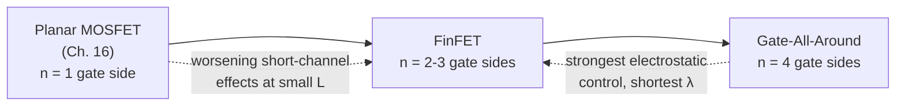
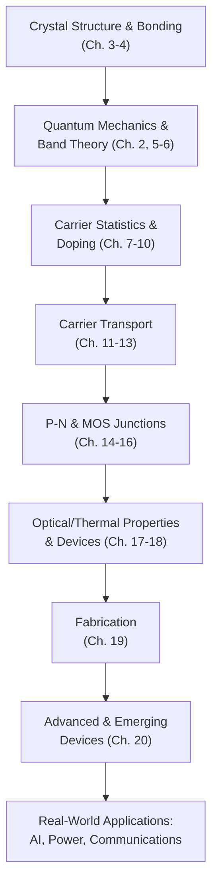

# Chapter 20: Advanced Semiconductor Devices and Emerging Technologies

<strong>Chapter Overview</strong> (click to expand)

This final chapter carries the course's physics to the frontier of modern semiconductor technology. **Technology scaling and Moore's Law** describe the decades-long shrinking of the MOSFET (Chapters 16, 18), which eventually runs into **short-channel effects** that the transistor's own electrostatics cannot avoid at small size. **FinFET technology** and **Gate-All-Around transistors** are the industry's structural answer — wrapping the gate around the channel from multiple sides to restore the control a planar MOSFET loses, while **silicon-on-insulator technology** attacks the same problem from underneath. A parallel story plays out in materials: **wide-bandgap semiconductors** such as **Silicon Carbide** and **Gallium Nitride** extend the power diode's breakdown-voltage trade-off (Chapters 15, 18) far beyond silicon's limits, while **compound semiconductor devices** built from **Indium Phosphide** and other III-V materials push carrier mobility and photon energy (Chapters 6, 17) into regimes silicon cannot reach. That materials story continues into **optoelectronic device integration** and the **laser diode**, which extends Chapter 17's LED physics with stimulated emission, and into **MEMS and NEMS**, which uses this chapter's fabrication techniques (Chapter 19) to build mechanical structures instead of electrical ones. **Quantum dots and quantum devices** revisit Chapter 2's particle-in-a-box confinement at the nanoscale, and the chapter closes by connecting all of this physics to **semiconductor applications in AI and computing** and in **power electronics and communications**, a survey of **future semiconductor technologies**, and finally a **capstone synthesis** that ties the entire twenty-chapter course together.

**Key Takeaways:**

1. **Technology scaling** has shrunk the MOSFET for decades, but **short-channel effects** — threshold voltage roll-off and drain-induced barrier lowering — set a physical limit that planar transistor electrostatics cannot avoid at small gate length.
2. **FinFET** and **Gate-All-Around transistors** restore electrostatic control by wrapping the gate around the channel from two, three, or four sides instead of one, directly suppressing short-channel effects; **SOI technology** helps by isolating the channel from the bulk substrate.
3. **Wide-bandgap semiconductors** (**SiC**, **GaN**) and **compound semiconductors** (**GaAs**, **InP**) extend this course's silicon-based physics to materials with higher critical field, higher mobility, or direct band gaps better suited to power, high-frequency, and optical applications.
4. **Optoelectronic device integration** connects Chapter 17's LED and photodiode physics to the **laser diode**'s stimulated emission, while **MEMS and NEMS** repurpose Chapter 19's fabrication toolkit to build micro- and nano-scale mechanical structures, and **quantum dots** apply Chapter 2's confined-particle quantum mechanics at the nanoscale.
5. Every device in this chapter underlies a real application area — **AI and computing**, **power electronics and communications** — and the chapter, and the course, close with a look at **future semiconductor technologies** and a **capstone synthesis** connecting crystal structure, quantum mechanics, carrier transport, junctions, fabrication, and advanced devices into one coherent physical picture.

## Learning Objectives

By the end of this chapter, you will be able to:

- Explain the evolution of modern semiconductor devices through technology scaling and its physical limits
- Compare planar MOSFETs, FinFETs, and Gate-All-Around transistors in terms of electrostatic gate control
- Explain the role of wide-bandgap semiconductors in power electronics
- Describe compound semiconductor materials and their applications
- Explain the fundamentals of optoelectronic semiconductor devices, including the laser diode
- Describe the basics of MEMS and NEMS and introductory quantum devices
- Recognize emerging semiconductor technologies and future trends
- Relate semiconductor device physics to applications in AI, computing, communications, and power electronics

## Introduction

Every chapter of this course has built toward a real, manufacturable device: the diode of Chapters 14-15, the MOSFET of Chapter 16, the power devices of Chapter 18, and the fabrication process of Chapter 19 that actually builds them. This closing chapter asks where that physics is heading. Two forces have driven semiconductor technology for over half a century: shrinking the MOSFET (**technology scaling**), and extending silicon's physics to new materials and new device geometries. Both eventually run into physical limits that this course's own equations can explain.

The first half of the chapter follows the scaling story. As gate length shrinks, **short-channel effects** — threshold voltage roll-off and drain-induced barrier lowering — appear because the gate's electric field no longer fully dominates the channel the way Chapter 16's idealized MOS capacitor assumed. **FinFET technology** and **Gate-All-Around transistors** solve this by wrapping the gate around the channel from multiple sides, while **silicon-on-insulator (SOI) technology** removes the bulk substrate's contribution to the problem entirely.

The second half turns from geometry to materials. **Wide-bandgap semiconductors** — **Silicon Carbide** and **Gallium Nitride** — extend the power-device breakdown trade-off of Chapters 15 and 18 to much higher voltages and frequencies. **Compound semiconductor devices**, built from **Indium Phosphide** and related III-V materials, push carrier mobility and optical properties beyond what silicon offers. **Optoelectronic device integration** extends Chapter 17's LED and photodiode physics with the **laser diode**'s stimulated emission, **MEMS and NEMS** apply Chapter 19's fabrication toolkit to mechanical microstructures, and **quantum dots and quantum devices** revisit Chapter 2's confined-particle quantum mechanics at the nanoscale. The chapter closes by connecting these devices to **semiconductor applications** across AI hardware, power electronics, and communications, surveying **future semiconductor technologies**, and finally offering a **capstone synthesis** of the entire course.

## Concepts Covered

This chapter covers the following 18 concepts from the learning graph:

1. Technology Scaling and Moore's Law
2. Short-Channel Effects
3. FinFET Technology
4. Gate-All-Around Transistors
5. Silicon-on-Insulator Technology
6. Wide-Bandgap Semiconductors
7. Silicon Carbide Devices
8. Gallium Nitride Devices
9. Compound Semiconductor Devices
10. Indium Phosphide
11. Optoelectronic Device Integration
12. Laser Diode
13. MEMS and NEMS
14. Quantum Dots and Quantum Devices
15. Semiconductor Applications in AI and Computing
16. Semiconductor Applications in Power Electronics and Communications
17. Future Semiconductor Technologies
18. Semiconductor Physics Capstone Synthesis

## Prerequisites

This chapter builds on concepts from:

- [Chapter 2: Quantum Mechanics Foundations](../02-quantum-mechanics-foundations/index.md)
- [Chapter 6: Band Structure and the Fermi Level](../06-band-structure-fermi-level/index.md)
- [Chapter 7: Intrinsic and Extrinsic Semiconductors](../07-intrinsic-extrinsic-semiconductors/index.md)
- [Chapter 15: The P-N Junction Under Bias](../15-pn-junction-under-bias/index.md)
- [Chapter 16: Metal-Semiconductor and MOS Junctions](../16-metal-semiconductor-mos-junctions/index.md)
- [Chapter 17: Optical and Thermal Properties of Semiconductors](../17-optical-thermal-properties/index.md)
- [Chapter 18: Semiconductor Devices and Applications](../18-semiconductor-devices-applications/index.md)
- [Chapter 19: Semiconductor Device Fabrication](../19-semiconductor-device-fabrication/index.md)

---

## Technology Scaling and Short-Channel Effects

### Shrinking the MOSFET, and Where Shrinking Breaks Down

**Technology scaling** is the decades-long industry practice of shrinking MOSFET gate length from one process generation to the next, informally summarized by **Moore's Law**: transistor count on a chip has historically doubled roughly every two years. Treating this as an exponential growth law,

\[
N(t) = N_0 \cdot 2^{(t-t_0)/T}
\]

with doubling period \(T\approx2\) years, has held remarkably well for decades — driven directly by shrinking the gate length, oxide thickness, and supply voltage of Chapter 16's MOS capacitor together.

Shrinking gate length eventually breaks the idealized one-dimensional electrostatics Chapter 16 assumed. **Short-channel effects** appear once channel length becomes comparable to the depletion widths at the source and drain: **threshold voltage roll-off** (threshold voltage drops as channel length shrinks, since the source/drain depletion regions now support a larger fraction of the gate's depletion charge) and **drain-induced barrier lowering (DIBL)** (drain voltage itself lowers the source-channel barrier, since the drain's field reaches further into a short channel). Both effects degrade the sharp on/off switching a MOSFET needs, and both are the direct motivation for the multi-gate structures introduced next.

#### Diagram: Technology Scaling Explorer

<iframe src="../../sims/technology-scaling-explorer/main.html" width="100%" height="620px" scrolling="auto"></iframe>

!!! tip "How to use this MicroSim"
    **Instructions:** Adjust process year and watch transistor count follow Moore's Law, alongside a shrinking gate length readout and a short-channel-effect severity indicator.

    **Learning objective:** Explain the evolution of modern semiconductor devices through technology scaling and its physical limits.

    **What to observe:** As gate length shrinks below roughly 20-30 nm, the short-channel-effect indicator rises sharply, motivating the multi-gate structures covered next.

[Full MicroSim documentation →](../../sims/technology-scaling-explorer/index.md)

!!! example "Worked Example 1 — Transistor Count from Moore's Law"
    A process introduced in 2010 has \(N_0=1\times10^9\) transistors per chip. Using a 2-year doubling period, estimate transistor count in 2026.

    **Solution:**

    \[
    N = (1\times10^9)\cdot2^{(2026-2010)/2} = (1\times10^9)\cdot2^{8} = 2.56\times10^{11}\ \text{transistors}
    \]

!!! question "Concept Check"
    Why does drain-induced barrier lowering (DIBL) get worse as channel length shrinks, even though the physical mechanism (the drain's electric field reaching into the channel) exists at any channel length?

??? question "Concept Check — click to reveal answer"
    In a long channel, the drain's electric field decays to negligible strength long before it reaches the source-channel barrier, so it has essentially no effect. In a short channel, the source and drain are close enough together that the drain's field directly reaches and lowers the barrier the gate is trying to control — the same physical field, but now close enough to matter.

## FinFET and Gate-All-Around Transistors

### Wrapping the Gate Around the Channel

**FinFET technology** restructures the MOSFET channel as a thin, vertical silicon "fin," with the gate wrapping around three of its four sides instead of contacting only the top surface as in a planar MOSFET. This multi-gate structure gives the gate far stronger electrostatic control over the channel, directly suppressing the short-channel effects described above. **Gate-All-Around (GAA) transistors** take this one step further, replacing the fin with one or more thin horizontal nanosheets, with the gate wrapping completely around all four sides — the strongest electrostatic control geometry available at this level of complexity.

A useful figure of merit, the electrostatic "natural length" \(\lambda\), estimates how well any gate geometry suppresses short-channel effects:

\[
\lambda \propto \sqrt{\frac{\varepsilon_{si}}{n\,\varepsilon_{ox}}\,t_{si}\,t_{ox}}
\]

where \(t_{si}\) is the channel body thickness, \(t_{ox}\) is the gate oxide thickness, and \(n\) is the number of gate sides controlling the channel (\(n=1\) planar, \(n=2\) double-gate FinFET-like, \(n=4\) GAA). A shorter \(\lambda\) relative to gate length means better-suppressed short-channel effects; since \(\lambda\propto1/\sqrt{n}\), more gate sides directly buy better electrostatic control for the same body and oxide thickness.

#### Diagram: Planar MOSFET vs FinFET vs GAA Explorer

<iframe src="../../sims/planar-finfet-gaa-explorer/main.html" width="100%" height="620px" scrolling="auto"></iframe>

!!! tip "How to use this MicroSim"
    **Instructions:** Switch between planar, FinFET, and GAA cross-sections and watch the number of gate-controlled sides and the resulting natural length change.

    **Learning objective:** Compare planar MOSFETs, FinFETs, and Gate-All-Around transistors in terms of electrostatic gate control.

    **What to observe:** Each additional gate side shortens the natural length for the same body and oxide thickness, directly suppressing short-channel effects without needing a thinner body.

[Full MicroSim documentation →](../../sims/planar-finfet-gaa-explorer/index.md)

!!! example "Worked Example 2 — Natural Length Comparison"
    Compare the natural length \(\lambda\) of a planar MOSFET (\(n=1\)) to a GAA transistor (\(n=4\)) with identical \(t_{si}\), \(t_{ox}\), and \(\varepsilon_{si}/\varepsilon_{ox}\).

    **Solution:** Since \(\lambda\propto1/\sqrt{n}\), the ratio is \(\lambda_{GAA}/\lambda_{planar}=\sqrt{1/4}=0.5\) — the GAA transistor's natural length is half the planar transistor's, meaning it can be scaled to roughly half the gate length before suffering the same severity of short-channel effects.

## Silicon-on-Insulator Technology

### Isolating the Channel from the Substrate

**Silicon-on-insulator (SOI) technology** builds the transistor's active silicon layer on top of a buried oxide layer (grown by the same thermal oxidation process of Chapter 19) rather than directly on the bulk substrate. This isolates the channel from the substrate below, reducing parasitic junction capacitance to the substrate and, in a sufficiently thin SOI layer, further limiting the volume of silicon the drain's field can reach — complementing FinFET and GAA structures rather than competing with them, since multi-gate transistors are frequently built on an SOI base.

!!! question "Concept Check"
    Why does building a transistor on a buried oxide layer help reduce parasitic capacitance, using ideas from Chapter 14?

??? question "Concept Check — click to reveal answer"
    In a bulk transistor, the source and drain form p-n junctions directly with the substrate, each contributing junction capacitance (Chapter 14) that must charge and discharge every switching cycle. An SOI substrate replaces the substrate junction beneath the active layer with a fixed oxide layer, which has no depletion region and therefore no associated junction capacitance to charge.

## Wide-Bandgap and Compound Semiconductors

### Extending Chapter 18's Power Trade-Off to New Materials

**Wide-bandgap semiconductors** have a substantially larger band gap (Chapter 6) than silicon's 1.12 eV, which raises their critical breakdown field \(E_{crit}\) (Chapter 15) and lets them support much higher blocking voltage in a much thinner drift region than silicon. **Silicon Carbide (SiC)** devices (\(E_g\approx3.3\ \text{eV}\)) and **Gallium Nitride (GaN)** devices (\(E_g\approx3.4\ \text{eV}\)) are the two dominant wide-bandgap materials in commercial power electronics today. Reusing Chapter 18's specific on-resistance formula directly,

\[
R_{on,sp} \approx \frac{4V_{BR}^2}{\mu_n\varepsilon_sE_{crit}^3}
\]

the strong \(E_{crit}^3\) dependence means a material with even a modestly higher critical field dramatically lowers specific on-resistance at a fixed breakdown voltage — exactly why SiC and GaN power devices can be smaller and more efficient than silicon devices rated for the same voltage.

| Material | Band Gap (eV) | Critical Field (MV/cm) | Typical Application |
|---|---|---|---|
| Silicon (Si) | 1.12 | 0.3 | General-purpose power devices |
| Silicon Carbide (SiC) | 3.3 | 2.5 | High-voltage power converters, EV drivetrains |
| Gallium Nitride (GaN) | 3.4 | 3.3 | High-frequency power converters, RF amplifiers |

#### Diagram: Wide-Bandgap Material Comparison Explorer

<iframe src="../../sims/wide-bandgap-material-comparison-explorer/main.html" width="100%" height="600px" scrolling="auto"></iframe>

!!! tip "How to use this MicroSim"
    **Instructions:** Select a material and see its band gap and critical field plotted alongside the resulting specific on-resistance at a chosen breakdown voltage.

    **Learning objective:** Explain the role of wide-bandgap semiconductors in power electronics.

    **What to observe:** Moving from silicon to SiC or GaN drops specific on-resistance by roughly two orders of magnitude at the same breakdown voltage, driven by the cubed critical-field term.

[Full MicroSim documentation →](../../sims/wide-bandgap-material-comparison-explorer/index.md)

#### Diagram: Si vs SiC vs GaN Device Explorer

<iframe src="../../sims/si-sic-gan-device-explorer/main.html" width="100%" height="600px" scrolling="auto"></iframe>

!!! tip "How to use this MicroSim"
    **Instructions:** Compare all three materials side by side across band gap, mobility, critical field, and typical switching frequency.

    **Learning objective:** Explain the role of wide-bandgap semiconductors in power electronics.

    **What to observe:** GaN's higher electron mobility supports faster switching frequencies than SiC, while SiC's higher thermal conductivity favors the highest-power applications — real material selection balances several properties at once, not just breakdown field.

[Full MicroSim documentation →](../../sims/si-sic-gan-device-explorer/index.md)

!!! example "Worked Example 3 — SiC vs. Silicon Specific On-Resistance"
    Compare specific on-resistance at \(V_{BR}=1200\ \text{V}\) for silicon (\(\mu_n=1350\ \text{cm}^2/\text{V}\cdot\text{s}\), \(E_{crit}=3\times10^5\ \text{V/cm}\), \(\varepsilon_s=1.035\times10^{-12}\ \text{F/cm}\)) versus SiC (\(\mu_n=900\ \text{cm}^2/\text{V}\cdot\text{s}\), \(E_{crit}=2.5\times10^6\ \text{V/cm}\), \(\varepsilon_s=0.917\times10^{-12}\ \text{F/cm}\)).

    **Solution:** Silicon: \(R_{on,sp}=4(1200)^2/[(1350)(1.035\times10^{-12})(3\times10^5)^3]\approx0.163\ \Omega\cdot\text{cm}^2\). SiC: \(R_{on,sp}=4(1200)^2/[(900)(0.917\times10^{-12})(2.5\times10^6)^3]\approx0.0004\ \Omega\cdot\text{cm}^2\). Despite SiC's lower mobility, its critical field is roughly 8 times higher, and since \(R_{on,sp}\propto1/E_{crit}^3\), SiC achieves roughly 400 times lower specific on-resistance at the same 1200 V rating.

!!! question "Concept Check"
    Why does a material's critical field matter so much more than its mobility in the specific on-resistance formula?

??? question "Concept Check — click to reveal answer"
    Because \(R_{on,sp}\propto1/(\mu_nE_{crit}^3)\) — mobility enters only linearly (in the denominator), while critical field enters cubed. A material with three times the critical field but half the mobility still wins by roughly a factor of \(3^3/0.5=54\), which is exactly why wide-bandgap materials dominate power electronics despite SiC and GaN not always having the highest carrier mobility of all semiconductors.

**Compound semiconductor devices** extend beyond wide-bandgap power materials to the broader family of compound semiconductors (Chapter 7) used for their electronic and optical properties: gallium arsenide (Chapter 7's GaAs) for high-frequency and optical devices, and **Indium Phosphide (InP)** for the highest-speed optical communication devices, where InP's very high electron mobility and directly-tunable band gap support the laser diodes and photodetectors used in fiber-optic networks.

#### Diagram: Compound Semiconductor Explorer

<iframe src="../../sims/compound-semiconductor-explorer/main.html" width="100%" height="600px" scrolling="auto"></iframe>

!!! tip "How to use this MicroSim"
    **Instructions:** Compare Si, GaAs, and InP across electron mobility, band gap type (direct vs. indirect), and typical application.

    **Learning objective:** Describe compound semiconductor materials and their applications.

    **What to observe:** GaAs and InP are both direct-gap materials with much higher electron mobility than silicon, making them the materials of choice for high-frequency electronics and for the optoelectronic devices covered next.

[Full MicroSim documentation →](../../sims/compound-semiconductor-explorer/index.md)

## Optoelectronic Device Integration and the Laser Diode

### From Spontaneous to Stimulated Emission

**Optoelectronic device integration** connects Chapter 17's LED and photodiode physics into complete optical systems: an LED or laser diode emits light at a wavelength set by the material's band gap (Chapter 17's \(\lambda=hc/E_g\)), which a photodiode elsewhere in the system detects. The **laser diode** extends the LED beyond spontaneous emission (Chapter 17's radiative recombination) to stimulated emission: above a threshold current, a population inversion of carriers builds up in the active region, and photons already present stimulate identical additional photons, producing coherent, narrow-linewidth light rather than the LED's broad, incoherent spontaneous emission. A photodetector, in the receiving half of the same system, is simply Chapter 17's photodiode operated to convert incoming optical power into photocurrent, characterized by its responsivity:

\[
\mathcal{R} = \frac{I_{ph}}{P_{opt}} \approx \frac{\eta q}{hf}
\]

where \(\eta\) is quantum efficiency (the fraction of incident photons producing a collected electron-hole pair).

#### Diagram: LED Bandgap and Color Explorer

<iframe src="../../sims/led-bandgap-color-explorer/main.html" width="100%" height="580px" scrolling="auto"></iframe>

!!! tip "How to use this MicroSim"
    **Instructions:** Adjust band gap and watch emission wavelength and visible color update together.

    **Learning objective:** Explain the fundamentals of optoelectronic semiconductor devices.

    **What to observe:** Band gap and emitted color are directly and predictably linked — a fact used deliberately to engineer LEDs of a specific color by choosing or alloying the semiconductor material.

[Full MicroSim documentation →](../../sims/led-bandgap-color-explorer/index.md)

#### Diagram: Laser Diode Operation Explorer

<iframe src="../../sims/laser-diode-operation-explorer/main.html" width="100%" height="600px" scrolling="auto"></iframe>

!!! tip "How to use this MicroSim"
    **Instructions:** Sweep injection current from zero upward and watch output power transition from weak spontaneous emission to a sharp rise at the lasing threshold.

    **Learning objective:** Explain the fundamentals of optoelectronic semiconductor devices, including the laser diode.

    **What to observe:** Below threshold, output power rises slowly (spontaneous emission, like an LED); above threshold, output power rises steeply and linearly, the signature of stimulated emission taking over.

[Full MicroSim documentation →](../../sims/laser-diode-operation-explorer/index.md)

#### Diagram: Photodetector Explorer

<iframe src="../../sims/photodetector-explorer/main.html" width="100%" height="580px" scrolling="auto"></iframe>

!!! tip "How to use this MicroSim"
    **Instructions:** Adjust incident optical power and quantum efficiency and watch photocurrent and responsivity update.

    **Learning objective:** Explain the fundamentals of optoelectronic semiconductor devices.

    **What to observe:** Responsivity rises with wavelength (at fixed quantum efficiency) since each photon carries less energy, so more photons — and more possible electron-hole pairs — arrive per watt of optical power.

[Full MicroSim documentation →](../../sims/photodetector-explorer/index.md)

!!! example "Worked Example 4 — Photodetector Responsivity"
    A photodetector has quantum efficiency \(\eta=0.8\) at a wavelength corresponding to photon energy \(hf=0.8\ \text{eV}\). Find its responsivity in A/W.

    **Solution:**

    \[
    \mathcal{R} = \frac{\eta q}{hf} = \frac{(0.8)(1.6\times10^{-19}\ \text{C})}{(0.8)(1.6\times10^{-19}\ \text{J})} = 1.0\ \text{A/W}
    \]

!!! question "Concept Check"
    Why does a laser diode require a population inversion, while an LED does not?

??? question "Concept Check — click to reveal answer"
    An LED relies on spontaneous emission, which occurs at some baseline rate simply from injected minority carriers recombining (Chapter 17), regardless of the carrier population's distribution. A laser diode instead needs *stimulated* emission to dominate over absorption, which only happens once more carriers occupy the higher-energy state than the lower one — a population inversion — so that an incoming photon is more likely to stimulate emission than to be absorbed.

## MEMS and NEMS

### Building Mechanical Structures with Semiconductor Fabrication

**MEMS (micro-electro-mechanical systems)** and **NEMS (nano-electro-mechanical systems)** apply Chapter 19's fabrication toolkit — photolithography, thin-film deposition, and especially plasma etching — not to build electrical junctions, but to sculpt free-standing mechanical structures such as cantilevers, membranes, and gears directly out of silicon or deposited films. A MEMS cantilever's resonant frequency follows simple mechanical harmonic-oscillator physics,

\[
f = \frac{1}{2\pi}\sqrt{\frac{k}{m}}
\]

where \(k\) is the structure's mechanical spring constant and \(m\) is its effective mass — both set entirely by the dimensions the fabrication process defines. MEMS accelerometers, gyroscopes, and microphones are already ubiquitous in smartphones and automobiles; NEMS pushes the same idea to nanometer dimensions for extremely sensitive mass and force sensing.

#### Diagram: MEMS Structure Explorer

<iframe src="../../sims/mems-structure-explorer/main.html" width="100%" height="600px" scrolling="auto"></iframe>

!!! tip "How to use this MicroSim"
    **Instructions:** Adjust cantilever length and thickness and watch the resulting spring constant, effective mass, and resonant frequency update.

    **Learning objective:** Describe the basics of MEMS and NEMS.

    **What to observe:** A shorter, thicker cantilever is stiffer and resonates at a much higher frequency than a longer, thinner one — the same fabrication dimensions that define an electrical device's behavior also define a MEMS device's mechanical behavior.

[Full MicroSim documentation →](../../sims/mems-structure-explorer/index.md)

!!! question "Concept Check"
    Which two Chapter 19 fabrication processes are most directly responsible for defining a MEMS cantilever's exact dimensions, and therefore its resonant frequency?

??? question "Concept Check — click to reveal answer"
    Photolithography defines the cantilever's lateral pattern (length and width), and plasma etching then removes material anisotropically to release the free-standing structure with well-controlled sidewalls — the same two processes responsible for defining a transistor's gate dimensions in Chapter 19.

## Quantum Dots and Quantum Devices

### Chapter 2's Particle in a Box, at the Nanoscale

A **quantum dot** is a semiconductor nanocrystal small enough, in all three dimensions, that it confines electrons the way Chapter 2's idealized particle-in-a-box confines a single particle. The same energy quantization equation applies directly:

\[
E_n = \frac{n^2h^2}{8mL^2}
\]

except now \(L\) is the physical size of the nanocrystal, not an abstract textbook well — and because \(E_n\propto1/L^2\), a quantum dot's effective band gap, and therefore its emission color, can be tuned continuously simply by growing dots of different sizes, independent of the material's bulk band gap. This size-tunable emission is already commercialized in quantum-dot display technology, and **quantum devices** more broadly explore other nanoscale quantum-confinement and quantum-tunneling (Chapter 2) effects for future computing and sensing applications.

!!! example "Worked Example 5 — Quantum Dot Confinement Energy"
    Estimate the ground-state (\(n=1\)) confinement energy added to the band gap of a quantum dot with effective diameter \(L=5\ \text{nm}\), using the electron effective mass \(m^*=0.067m_0\) (typical of a III-V material).

    **Solution:**

    \[
    E_1 = \frac{(1)^2(6.63\times10^{-34})^2}{8(0.067)(9.11\times10^{-31})(5\times10^{-9})^2} \approx 2.2\times10^{-19}\ \text{J} \approx 1.37\ \text{eV}
    \]

    This confinement energy adds directly to the bulk band gap, shifting emission to shorter wavelength (higher photon energy) than the same material's bulk LED — smaller dots shift emission even further, which is exactly how quantum dot displays tune color by nanocrystal size alone.

!!! question "Concept Check"
    Why does shrinking a quantum dot's size shift its emission color toward blue (higher photon energy) rather than red?

??? question "Concept Check — click to reveal answer"
    Since confinement energy \(E_n\propto1/L^2\), a smaller dot size \(L\) produces a larger confinement energy added on top of the bulk band gap, increasing the effective band gap and therefore the emitted photon energy \(hf=E_g+E_n\) — higher photon energy corresponds to shorter (bluer) wavelength.

## Semiconductor Applications and Future Technologies

### Where This Physics Lands in the Real World

Every device in this chapter underlies a specific application domain. **Semiconductor applications in AI and computing** rely directly on FinFET and GAA transistor scaling (this chapter) to pack the enormous transistor counts modern AI accelerators require into a fixed die area, while also depending on the interconnect and yield physics of Chapter 19 to make such large, dense chips manufacturable at all. **Semiconductor applications in power electronics and communications** draw on SiC and GaN power devices for electric vehicle drivetrains and renewable energy converters, and on GaN RF amplifiers and InP photonic devices for 5G/6G wireless and fiber-optic communication infrastructure.

Looking ahead, **future semiconductor technologies** will likely continue combining the two threads of this chapter: further multi-gate and 3D-stacked transistor geometries to keep scaling alive past the limits of any single planar generation, and continued adoption of wide-bandgap, compound, and quantum materials wherever silicon's physical properties fall short of an application's needs.

#### Diagram: AI Hardware Semiconductor Explorer

<iframe src="../../sims/ai-hardware-semiconductor-explorer/main.html" width="100%" height="600px" scrolling="auto"></iframe>

!!! tip "How to use this MicroSim"
    **Instructions:** Explore how transistor density, interconnect layers, and power dissipation trade off in a simplified AI accelerator die model.

    **Learning objective:** Relate semiconductor device physics to applications in AI, computing, communications, and power electronics.

    **What to observe:** Higher transistor density (enabled by FinFET/GAA scaling) increases raw compute capability but also raises power density, tying this chapter's device physics directly to the thermal and yield considerations of Chapters 17 and 19.

[Full MicroSim documentation →](../../sims/ai-hardware-semiconductor-explorer/index.md)

!!! question "Concept Check"
    Why do electric vehicle drivetrains specifically benefit from SiC power devices rather than silicon power devices, connecting this chapter to Chapter 18's power diode physics?

??? question "Concept Check — click to reveal answer"
    An EV drivetrain switches large currents at high voltage very rapidly; SiC's higher critical field gives much lower specific on-resistance (and therefore lower conduction loss) at the required blocking voltage, while its higher thermal conductivity better dissipates the switching losses that do occur — both factors directly improve drivetrain efficiency and range compared to an equivalent silicon power device.

## Semiconductor Physics Capstone Synthesis

### Connecting Twenty Chapters of Physics

This closing section connects the entire course's physics into one chain, from atomic structure to advanced devices:

Every advanced device in this chapter is, at its core, an application of physics from an earlier chapter: a FinFET is still Chapter 16's MOS capacitor, wrapped around the channel from more sides; a SiC power device is still Chapter 18's power diode, built from a material with a larger band gap; a laser diode is still Chapter 17's LED, operated above a stimulated-emission threshold; a quantum dot is still Chapter 2's particle in a box, grown as an actual nanocrystal. Nothing in this closing chapter required new physics — only the deliberate, engineered application of everything derived across the preceding nineteen chapters.

### Where to Go Next

Having completed this course, several directions extend the physics developed here:

- **Semiconductor device modeling and TCAD** — numerical device simulation beyond the analytic models used throughout this course (briefly introduced in Chapter 18's device simulation concept)
- **Integrated circuit design and VLSI** — how transistors like the ones in this chapter combine into digital logic, memory, and full systems-on-chip
- **Nanotechnology** — quantum dots, nanowires, and other nanoscale structures explored at greater depth than this chapter's introduction
- **Photonics** — a full treatment of laser physics, optical waveguides, and photonic integrated circuits building on this chapter's laser diode introduction
- **Quantum electronics and quantum computing** — quantum devices operated for computation rather than classical switching, extending this chapter's brief introduction to quantum dots
- **Semiconductor device fabrication and process engineering** — a deeper, hands-on treatment of Chapter 19's fabrication processes for those pursuing manufacturing or process-development careers

## Summary

This capstone chapter carried the course's physics to modern and emerging semiconductor technology. **Technology scaling** and **Moore's Law** drove decades of MOSFET shrinking until **short-channel effects** set a physical limit, answered structurally by **FinFET** and **Gate-All-Around transistors** wrapping the gate around the channel, and by **SOI technology** isolating the channel from the substrate. **Wide-bandgap semiconductors** (**SiC**, **GaN**) and **compound semiconductors** (**GaAs**, **InP**) extended this course's material physics to higher breakdown fields, higher mobility, and direct band gaps. **Optoelectronic device integration** and the **laser diode** extended Chapter 17's LED and photodiode physics with stimulated emission, **MEMS and NEMS** repurposed Chapter 19's fabrication toolkit for mechanical structures, and **quantum dots** applied Chapter 2's particle-in-a-box confinement at the nanoscale. Every device connected to real **applications in AI, computing, power electronics, and communications**, pointed toward **future semiconductor technologies**, and the chapter closed with a **capstone synthesis** showing that this entire chapter — and this entire course — is one connected chain of physical reasoning, from crystal structure to the devices that run the modern world.

## Key Equations

| Concept | Equation |
|---|---|
| Moore's Law transistor count | \(N(t)=N_0\cdot2^{(t-t_0)/T}\), \(T\approx2\) years |
| Electrostatic natural length (multi-gate scaling) | \(\lambda\propto\sqrt{(\varepsilon_{si}/n\varepsilon_{ox})\,t_{si}t_{ox}}\) |
| Specific on-resistance (reused from Ch. 18) | \(R_{on,sp}\approx4V_{BR}^2/(\mu_n\varepsilon_sE_{crit}^3)\) |
| Photodetector responsivity | \(\mathcal{R}=\eta q/hf\) |
| MEMS cantilever resonant frequency | \(f=(1/2\pi)\sqrt{k/m}\) |
| Quantum dot confinement energy | \(E_n=n^2h^2/(8mL^2)\) |
| LED/laser emission wavelength (reused from Ch. 17) | \(\lambda=hc/E_g\) |

## Glossary

See the [Chapter 20 Glossary](glossary.md) for full definitions of every term introduced in this chapter.

## Further Reading

- Sze and Ng, *Physics of Semiconductor Devices* — comprehensive coverage of advanced device structures including FinFETs and wide-bandgap devices
- Colinge, *FinFETs and Other Multi-Gate Transistors* — the standard reference on multi-gate device electrostatics
- Baliga, *Wide Bandgap Semiconductor Power Devices* — the definitive reference on SiC and GaN power device physics
- Coldren, Corzine, and Mašanović, *Diode Lasers and Photonic Integrated Circuits* — accessible treatment of laser diode physics building on this chapter's introduction

## Worked Examples

!!! example "Worked Example 6 — Scaling Timeline Sanity Check"
    A different process introduced in 2005 reaches \(N=1\times10^{10}\) transistors per chip in 2025. Using the Moore's Law form with \(T=2\) years, estimate its starting transistor count \(N_0\) in 2005.

    **Solution:** Solving \(N=N_0\cdot2^{(t-t_0)/T}\) for \(N_0\): \(N_0=N/2^{(2025-2005)/2}=N/2^{10}=(1\times10^{10})/1024\approx9.77\times10^6\) transistors — a reminder of just how large a factor a 20-year, 2-year-doubling scaling trend represents (roughly 1000×).

!!! example "Worked Example 7 — GaN vs. Silicon Power Density"
    Using Worked Example 3's result that SiC achieves roughly 400× lower \(R_{on,sp}\) than silicon at 1200 V, and noting GaN's critical field is roughly 30% higher still than SiC's, qualitatively estimate whether GaN would offer an even larger improvement over silicon at the same voltage rating.

    **Solution:** Since \(R_{on,sp}\propto1/E_{crit}^3\), a 30% higher critical field gives roughly \((1.3)^3\approx2.2\times\) further improvement beyond SiC, so GaN would be expected to offer noticeably (roughly double) the improvement over silicon that SiC already provides — consistent with GaN's use in the most aggressive high-frequency, high-efficiency power applications.

!!! example "Worked Example 8 — Quantum Dot Size for a Target Color Shift"
    Using the same effective mass as Worked Example 5, find the quantum dot diameter \(L\) needed to produce exactly half the confinement energy found there (\(E_1\approx0.685\ \text{eV}\)).

    **Solution:** Since \(E_n\propto1/L^2\), halving \(E_1\) requires \(L\) to increase by a factor of \(\sqrt{2}\): \(L=5\ \text{nm}\times\sqrt{2}\approx7.07\ \text{nm}\) — a modest 40% increase in dot diameter is enough to halve the confinement energy, illustrating just how sensitively quantum dot emission color depends on nanocrystal size.

## Interactive Chapter Walkthrough

Use the MicroSim below as a capstone review: a guided, step-through tour of this entire chapter's storyline in order — from technology scaling and short-channel effects, through FinFET and GAA transistors, wide-bandgap and compound semiconductors, optoelectronic devices, MEMS/NEMS, quantum devices, and finally real-world applications and future technologies, closing the entire twenty-chapter course.

#### Diagram: Future Technology Roadmap Explorer

<iframe src="../../sims/future-technology-roadmap-explorer/main.html" width="100%" height="670px" scrolling="auto"></iframe>

!!! tip "How to use this MicroSim"
    **Instructions:** Click "Next ▶" through all steps in order, then use the step dots to jump back to any concept before the chapter quiz.

    **Learning objective:** Recognize emerging semiconductor technologies and future trends, and recall the full chain of concepts connecting this chapter to the entire course.

    **What to observe:** Each step's small illustration mirrors a MicroSim used earlier in the chapter, tying this chapter's — and the whole textbook's — narrative together in one final review.

[Full MicroSim documentation →](../../sims/future-technology-roadmap-explorer/index.md)

