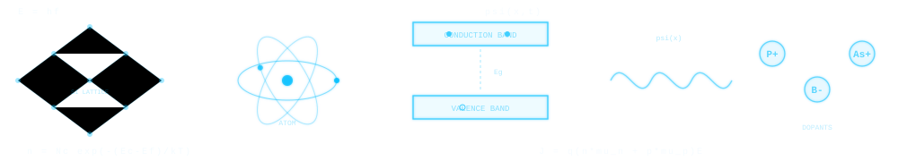
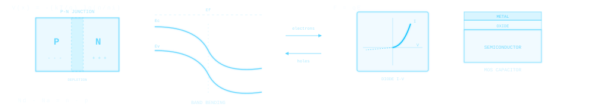

  

# Semiconductor Physics

## An Intelligent Interactive Textbook

**Quantum Foundations to Advanced Devices**

---

An AI-Assisted Interactive Textbook

An AI-assisted interactive textbook with 20 chapters, interactive MicroSims, and practice problems covering semiconductor physics from quantum foundations through devices, fabrication, and emerging technologies.

20

Chapters

114

MicroSims

414

Quiz Questions

266

Glossary Terms

[Enter Textbook :material-arrow-right:](home.md){ .md-button .md-button--primary }
[View MicroSims :material-play-box:](sims/index.md){ .md-button }
[Course Description :material-book-open-variant:](course-description.md){ .md-button }

  

